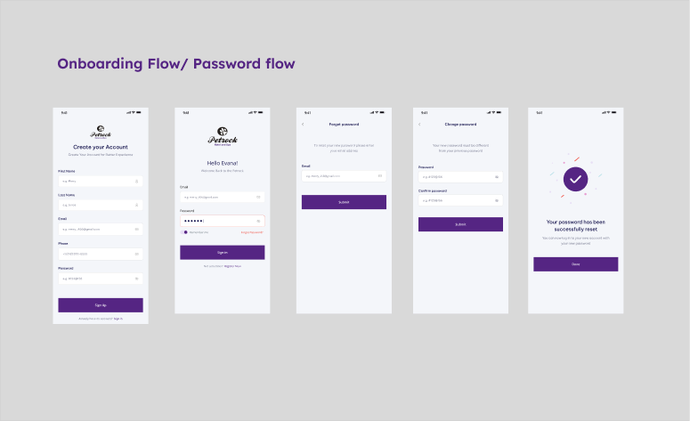
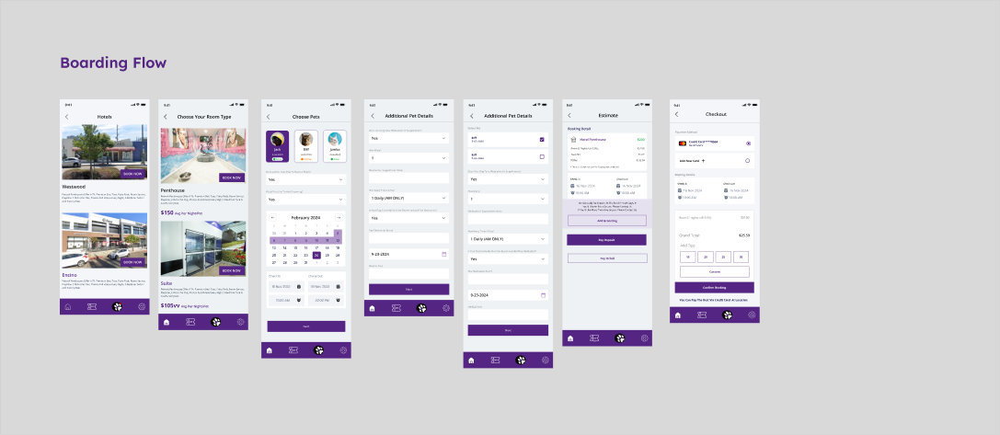
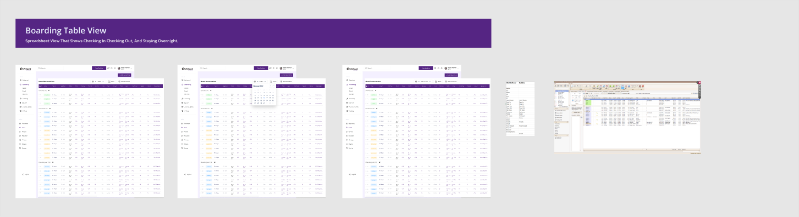

# Figma analysis: Petrock Main / page "new(justin + Mark)"

Analyzed 2026-09-17 via the Figma REST API (file key `3UXEOzU9ORGm5mInQqhiUW`, page id `404:14656`). This file carries the full inventory; `README.md` in this folder has the file/page keys.

## Summary

The page holds **253 frames across 25 sections** (9 top-level + 16 nested). It contains **two products**, each drawn two or three times over as the design evolved. Only the newest set of each should be built:

- **Customer mobile app** (390 wide, auth screens 428): the newest set is **Section 22** `1841:50551`, **48 screens in 9 flows**: Onboarding/Password, Home + Add pet, Boarding, Credit card, Chat/Notifications, Grooming, Spa, Settings & Profile, Daycare.
- **Front desk web** (1440 wide): the newest set is **Section 14** `1813:146926`: Boarding table view, Timeline view, Groom, Grooming agenda list, Message, the four Add forms (groom booking, board booking, pet, customer), and Control Panel draft screens 1-15.
- **Admin / owner**: thin. Two "Management" dashboards plus the Control Panel draft. The UX-plan sitemap (Region B) lists Control Panel (Content / Style / Pricing / Backups / Staff Settings), People & Pets (Pets / Customers / Staff / Vets) and Pin Code Auth, mostly without screens yet.
- **Not needed** as far as can be told: Section 5 "Before" (legacy screenshots), the older duplicate rows (Region A, Sections 1-4), stray dashboard widget groups, and the grey planning rectangles.

**Design system:** nothing is published to a Figma team library; the page uses 45 local components in 10 sets and 23 fill / 10 text styles with inconsistent names. Plan: consolidate into the code design system and treat Figma as visual truth for the mobile app.

### Renders

| | |
|---|---|
|  | Section 16 (in Section 22): Onboarding / Password flow, 5 mobile screens |
|  | Section 20 (in Section 22): Boarding flow, Hotels -> Choose Room -> Choose Pets -> details -> Estimate -> Checkout |
|  | Section 1 (intermediate pass): front desk Boarding Table view, 3 desktop variants plus legacy spreadsheet reference |

## Decisions needed from Justin

**Status 2026-09-17:** Justin answered these in prompt `docs/prompts/0002-scope-decisions.md`. Each item below keeps its original wording and carries the decision ID from `docs/decisions.md`. Items 9 and 10 were not put to Justin in that round and remain open.

1. Are **Section 22 + Section 14** the complete, approved scope? Are the Region A rows and Sections 1-5 superseded and safe to ignore?
   **Answered, D-001:** yes; mine the older sections for anything useful that is missing from 22/14.
2. Region B is labelled "Finish the UX Plan / Re-Build with New Design System / Clickable Prototype Approval": is the new design system done, or will existing screens be restyled? Which page holds the new design system (page "Design System" `58:118`?)
   **Answered, D-007:** no dedicated design-system page; rebuild the design system fresh from this page's icons, fonts and colors, with light/dark mode and easy new themes.
3. **Control Panel (Draft) screens 1-15**: which are in scope, and are they for front-desk staff or owner/admin only? Roles/permissions (Pin Code Authentication) exist only in the sitemap.
   **Answered, D-002:** owner / super-admin surfaces; role management can adjust access later.
4. Flows missing from Section 22: **In Home Flow**, **Hotel Reservation / Hotel Flow** (Region B), **Choose Vaccine** / **Pet Edit 3** (old row): dropped or pending?
   **Answered, D-003:** In Home not built (out of initial scope); day care not designed yet (verify); vaccines are a first-class flow throughout; hotel reservations must be clear across the board.
5. **Spa vs Grooming**: Section 19 "Spa Flow" reuses `grooming package` frames with "Conditions" stubs, and there is rule text about daycare duration vs spa. One service with conditions, or two flows?
   **Answered, D-004:** spa and grooming are the same thing; one flow, one name (proposal "Grooming & Spa").
6. Business rules ("If Dog is 55lb or greater Must be Suite", "Pricing Rules", daycare duration vs spa): documented anywhere else?
   **Answered, D-006:** not documented elsewhere yet; a business rules registry is required (page spec builder + Settings > Rules with per-rule status); Justin will supply more rules later.
7. Old single-screen rows (**Management, report, education, reviews, employees, walking, day care**) exist only in the old Region A column: in scope?
   **Answered, D-005:** grouped as "Extras"; reports/analytics in scope; employees required (user management); walking and management extendable later.
8. **Timeline view** (Section 11) frames are named `all reservation grooming`: is the timeline for boarding, grooming, or both?
   **Answered, D-008:** inspect the timeline frames; likely hotel only, check whether spa needs a timeline. Analysis pending.
9. Two mobile widths (**390 and 428**): target device?
   **Open:** not asked in prompt 0002.
10. Stray dashboard widgets (Group 2914xx, "Income Analysis"): part of a **reports** screen that should exist?
   **Partly answered, D-005:** reports/analytics are in scope, so a reports screen should exist; whether these widgets are its design is still open.

---

# Full inventory (as captured)

- File: **Petrock Main** (key `3UXEOzU9ORGm5mInQqhiUW`), lastModified 2026-09-17T18:06:39Z, version 2400269179494090052, role returned by API: editor
- Access: HTTP 200 on `/v1/files`, `/v1/files/.../nodes`, `/v1/images` (via proxy). 
- Linked node `404:14656` **is the page itself** (CANVAS "new(justin + Mark)"), i.e. Justin linked to the whole page, not a specific frame.
- Raw data: `figma-depth1.json`, `figma-mark-page.json` (page depth 2), `figma-nested-sections.json` (16 nested sections depth 1), `figma-banners.json` (banner/sample frames), `toplevel.tsv`.
- Renders (PNG): `overview-boarding-flow-section20.png` (mobile), `overview-boarding-table-view-section1.png` (desktop), `overview-onboarding-flow-section16.png`.

## Pages in the file

| id | name |
|---|---|
| `404:14656` | new(justin + Mark) |
| `0:1` | Wireframe |
| `203:1960` | Final UI  |
| `58:118` | Design System |
| `156:1853` | ui design |
| `157:4274` | front desk |
| `162:1853` | user flow |
| `6:2` | Moodboard |
| `175:3419` | Old Files |
| `536:5005` | Meow Paws - Pet UI Kit for Adobe XD [XD Import] (01-Jun-2024-3.15pm) |

Closest match to "new(justin = Mark)" is **`404:14656` "new(justin + Mark)"** (first page). Other pages (Wireframe, Final UI, Design System, ui design, front desk, user flow, Moodboard, Old Files, Meow Paws XD import) were not inventoried.

## Totals (page "new(justin + Mark)")

- Top-level children of the page: **240** -> FRAME 119, TEXT 47, RECTANGLE 44, GROUP 13, SECTION 9, VECTOR 5, INSTANCE 2, LINE 1
- Sections: **9 top-level** + **16 nested** (inside Section 14 and Section 22) = **25**
- FRAME nodes found at page root + inside sections (depth reached): **253**
  - Mobile screens (370-440 px wide): **107**
  - Desktop screens (1280-1920 px wide): **81** (+4 desktop `all reservation grooming` frames wrapped inside container `Frame 1171276470` in Section 11, not counted above)
  - Banner/label frames (`Frame 1171276xxx`, one TEXT child): **57**
  - Other sizes (reference-image frames in Section 5, form-spec frames in 'Form fields', sidebars in 'Nave menu', Amenities panel): **8**
- Mobile frame sizes: 390x844 dominant (iPhone 14/15 class); auth screens are 428 wide (iPhone Pro Max class). Desktop frames are 1440 (a few 1432) wide -> desktop web.
- Loose annotation nodes at page root: 47 TEXT labels, 44 RECTANGLE/5 VECTOR (grey placeholder boxes and pasted reference images), 13 GROUPs, 2 INSTANCEs, 1 LINE.

## Spatial regions (how the canvas is laid out)

Coordinates are Figma absolute px. The page has five distinct clusters, plus strays:

| Region | Approx. x range | Approx. y range | What it is | Newest? |
|---|---|---|---|---|
| A. Main working column | 600 .. 13,400 (+16,270 for 'Management') | 1,275 .. 53,700 | 25 banner-labelled rows: customer app flows on top (y<12k), then front-desk web rows (y 13k..53k). Older node ids (443..740). | older |
| B. UX-plan / sitemap area | -24,000 .. -7,000 | -1,970 .. 11,300 | Sticky-style grey rectangles + text labels forming a sitemap (Reservations, People & Pets, Control Panel, Home Screen, Settings...), plus mobile flow rows (Spa / DayCare / Hotel / In Home) with 'Pricing Rules' / 'Conditions' input stubs. Big note: "Finish the UX Plan / Re-Build with New Design System / Clickable Prototype Approval". Ids 1805..1810. | new (planning) |
| C. Top row | -3,800 .. 9,600 | -1,812 .. -150 | 4 desktop `front desk` frames (dashboard/home variants). | mixed |
| D. Section 22 (customer app, reorganized) | -28,452 .. -5,200 | 11,792 .. 27,400 | 9 nested sections, each a titled mobile flow (Onboarding, Home+Add pet, Boarding, Credit Card, Chat, Grooming, Spa, Setting & Profile, Daycare). Ids 1841..1955 = **newest**. | newest |
| E. Section 14 (front desk web, reorganized) | -55,296 .. -28,700 | 11,792 .. 39,700 | 7 nested sections: Boarding Table view, Timeline view, Groom, Grooming Agenda list, Message, Groom/Board/Customer/Pets Adds, Control Panel (Draft, 15 numbered screens). Ids 1813 = **newest** front-desk set. | newest |
| F. Sections 1-5, 'Nave menu', 'Form fields' | 481 .. 22,000 | 3,599 .. 86,770 | Earlier front-desk re-org pass (ids 1554..1740): Boarding Table view, Grooming Agenda list view, collapsible nav, grooming/all-reservation variants, booking-detail forms, form-field redlines, and Section 5 'Before' reference screenshots. | intermediate |
| G. Strays | -2,050 .. -1,270 | 41,821 .. 42,939 | 9 `Group 2914xx` dashboard widgets (charts, 'Income Analysis') with no frame; plus tiny groups/rectangles ('Spa 12.7', 'image 1', 'Group 1171275501'). | unclear |

## Grouping into likely user journeys

### 1. Customer mobile app (iOS/Android) - 390x844 / 428 wide

**Newest organized set: Section 22 `1841:50551` (use this as the canonical source):**

| Nested section | Flow title (TEXT) | Frames (in order, left to right) |
|---|---|---|
| Section 16 `1841:45135` | Onboarding Flow / Password flow | Create Account, sign in, forget password, change Password, Popup |
| Section 15 `1841:44669` | Home Screen + Add pet flow (note: 'If Dog is 55lb or greater Must be Suite') | Home Page x3 (states), Pet Edit, Pet Edit 5, Pet Edit 6, Pet Edit 7, Home Page, Checkout |
| Section 20 `1841:46264` | Boarding Flow | Hotels, Choose Your Room, Choose Pets, Booking Details Add Pets x2 (variant), Booking Detail (Estimate), Checkout |
| Section 22 `1955:43108` | Credit Card Detail Flow | Booking Details Final Customer Details (1 screen; + a duplicate `1841:46299` placed directly in the outer section) |
| Section 17 `1841:45340` | Chat Flow | notification, Message Support x2 |
| Section 18 `1841:45531` | Grooming Flow | grooming package x2, Grooming Add-On, Checkout, Payment, Checkout x2 (variants) |
| Section 19 `1841:46019` | Spa Flow | Spa Flow, grooming package x2, Grooming Add-On (+2 'Conditions' input stubs) |
| Section 21 `1841:46635` | Setting & Profile | profile, My pets (more than one pet), Pet Profile (Single Pet), edit profile, setting, language |
| Section 23 `1955:45330` | Daycare (rule note: 'If Daycare is less than x time, not enough time for spa?') | DayCare Flow, DayCare x3 (+ a loose Button instance) |

Section 22 total: **48 mobile frames** across 9 flows.

**Older copies of the same flows (Region A, y 1,275..12,600, ids 443..1217; and Region B, ids 1805..1807):**

- Row 'Hotel booking flow' (y 2053): Home Page x2, Pet Edit, Pet Edit 3, Choose Vaccine, Hotels, Choose Your Room, Choose Pets, Booking Details Add Pets, Booking Details Final Customer Details, Booking Detail, Payment, Checkout (+ `Bookings` component instance). TEXT 'THIS SCreen Is Getting Replaced' sits above Choose Vaccine / Pet Edit 3 area.
- Row 'Hotel + Calendar booking flow' (x 7,392+, y 2006): Home Page, Hotels, Choose Your Room, Choose Pets, Booking Details Add Pets, Booking Detail, grooming package, Grooming Add-On, Checkout, Payment, Checkout (+ Navbar instance).
- Row 'Grooming booking flow' (y 4229): grooming package x2, Grooming Add-On, Checkout, Payment, Checkout.
- Row 'Notification and Message flow' (y 6113): notification x2, Message Support.
- Row 'Option / Sign in / Signup / Forgot Password' (y 7962): Create Account, sign in, forget password, change Password, Popup.
- Row 'settings/profile' (y 9730): profile, My pets (more than one pet), Pet Profile (Single Pet), edit profile, setting, language.
- Row 'coming soon' (y 11750): Day care x2.
- Region B mobile rows: y 1254 'Pricing Rules' row: Choose Pets, Booking Details Add Pets, Booking Details Final Customer Details, Booking Detail, Payment, Checkout; y 3107 Spa: Spa Flow, grooming package x2, Grooming Add-On; y 4427 DayCare: DayCare Flow, DayCare; y 6502 Hotel: Hotel Reservation, Hotel Flow.

Not in Section 22 but present in older rows: **Choose Vaccine**, **Pet Edit 3**, **Day care (coming soon) x2**, **Hotel Reservation / Hotel Flow** (Region B), and an **'In Home Flow'** label with only a placeholder (no frames).

### 2. Front desk web app (desktop, 1440 wide)

**Newest organized set: Section 14 `1813:146926` (canonical):**

| Nested section | Title (banner TEXT) | Frames |
|---|---|---|
| Section 6 `1813:27179` | Boarding Table view - 'Spreadsheet view that shows checking in, checking out, and staying over' | front desk x3 (table, table+date picker, table variant) |
| Section 11 `1813:55855` | Timeline view (same subtitle) | container Frame 1171276470 holding all reservation grooming x4 (timeline variants) |
| Section 10 `1813:50468` | Groom | Grooming x1 |
| Section 7 `1813:28682` | Grooming system: Agenda list view | front desk x3 (+ 9 small pasted icon images) |
| Section 13 `1813:60246` | Message | message x1 |
| Section 12 `1813:60243` | Groom, Board, Customer, Pets Adds | Booking details x2 (Groom booking 1627h, Board booking 2297h), Frame x2 (Pet details 1694h, Customer details 1307h) - the four add/create forms |
| Section 8 `1813:128225` | Control Panel (Draft) | numbered frames 1..15 (1 = Settings sidebar page; 2..11 = 'All Booking' sidebar with content panels; 12..15 = 1432x1663 settings pages) |

Section 14 total: **31 desktop frames** (+4 nested in the timeline container).

**Intermediate pass (Sections 1-4, Nave menu, Form fields; Region F, ids 1554..1740):**
- Section 1 'Boarding Table view': front desk x3 + 2 reference images (`image 139`, `cloud1-Ericom-AccessNow-Client...` = screenshot of a legacy spreadsheet system).
- Section 2 'Grooming system: Agenda list view': front desk x3 + 9 icon images.
- 'Nave menu' - 'Nav Menu - Collapsible': sidebar x3 (243 / 84 / 84 wide: expanded vs collapsed states), label 'Encino, Los Angeles'.
- Section 3: Grooming x2, all reservation grooming x4, 'Note' text + reference image 140.
- Section 4: Grooming, all reservation grooming x4, Booking details x2, Frame x2.
- 'Form fields': Groom Booking, Board Booking, Pet Details, Customer Details (form spec frames, 1966-2532 wide) + 50 LINE redline annotations.

**Older front-desk rows (Region A, y 13,000..53,700, ids 443..740), banner -> frames:**
- booking , customer , pet form: Add New Booking - Light, add new customer, add new pet
- Groom: Grooming, all reservation grooming, Add New Booking - Light, Grooming
- Invoice: front desk (1400h)
- booking , customer , pet form (2nd copy): Add New Booking - Light, add new customer, add new pet
- Customer & Pets: Frame (1150h), Frame (1500h), Amenities (1141x1337 panel)
- All Reservations: front desk
- notification wording: front desk
- Message: message
- report: report
- settings: settings
- education: education
- reviews: reviews;  reviews (2nd banner): education (mislabelled?)
- employees: employees x2, add employees
- employees check list: employees
- walking: employees (mislabelled? banner says walking, frame named employees)
- day care: day care
- Top row (y -1812): front desk x4 (dashboard/home variants incl. one 1282h at x 8186)

### 3. Admin / owner web
- 'Management' banner at x 16,270 y 38,864 with **front desk x2** (`487:13977`, `487:14241`, 1432x1663). Likely owner/management dashboards.
- Section 8 'Control Panel (Draft)' 15 screens (listed above under front desk; sidebar components `sidebar/Settings`, `sidebar/Reports`, `sidebar/Education`, `sidebar/Reviews`, `sidebar/Employees`, `sidebar/Walking`, `sidebar/Day Care`, `sidebar/Tasks` suggest the front-desk app and admin area share one sidebar shell). Whether Control Panel is front-desk or owner-only is **ambiguous**.
- Region B sitemap lists 'Control Panel: Content / Style / Pricing / Backups / Staff Settings' and 'People & Pets: Pets / Customers / Staff / Vets' and 'Pin Code Authentication' -> planned admin scope, mostly without frames yet.

### 4. Shared / components / design system (as used on this page)
- Published team library: **none** (`/components`, `/component_sets`, `/styles` all return empty arrays -> nothing published).
- Local components referenced by this page: **45 components in 10 component sets** + standalone components. Sets: Button (Size 2xs/md/lg x Fill/Outline), Buttons (Variant2/3/4), Text Input (Default/Required/Date/required dropdown/State10), Input Field (xs Default Disable), Navbar (Default/Variant2/Variant4), Pets (Default/ADD pet), Pets Card, Room Cards, Hotel Cards, Toolbar (Light). Standalone: Bookings, Header, Services, top bar, sidebar/{Default, All Booking, Customer, Day Care, Education, Employees, Reports, Reviews, Settings, Tasks, Walking}, icons (Home_light, Setting_line_light, Expand_left, Ellipsis horizontal).
- Local styles referenced: 23 FILL (Bg, Black, White x3, Colors/BG-Icon-Border/{background, border-light, white}, Colors/Text colors/heading, Dark Secondary, Foundation/Blue/B0, Lazy Violet-300, Shy Black-100, Solid Dark, Table heading & subtext, Theme 1, Transparent/Black/50%, border, button, heading, Line x2), 10 TEXT (Body 1, Form Level, Form Text, Functional/Input/I2, Heading 3, Heading Page top, Inter/14/Regular, Inter/20/Semi Bold, body text, price text), 2 EFFECT (Shadow md, Shadow xl). Naming is inconsistent (duplicates 'White' x3, 'Line' x2) -> design system is not consolidated. The separate 'Design System' page `58:118` was not inventoried.

### 5. Unclear / possibly not needed
- **Section 5 `1740:73173` ('Before')**: 21 frames 414-1100 px wide that contain only pasted images (`image 141`, `image 144`, ...) + 3 loose images. Reference screenshots of the legacy system, not designs.
- **Reference images**: `cloud1-Ericom-AccessNow-Client...` (Section 1), `image 139/140`, `image 1` (487:15988 at x 15,758), `Spa 12.7 2/3` (two 530x574 images at x -921/-208, y 4154).
- **Group 2914xx x9** (x -2,050, y 41,821..42,939): dashboard widget fragments (charts, 'Income Analysis', 100/50 axis labels) not inside any frame - stray from a dashboard/report design.
- **Duplicated flows**: nearly every customer flow exists 2-3 times (Region A row, Region B row, Section 22). Nearly every front-desk screen exists 2-3 times (Region A row, Sections 1-4, Section 14). Only the newest set should be built.
- **Mislabelled rows**: banner 'reviews' (2nd) sits above a frame named `education`; banner 'walking' sits above `employees`.
- **Empty banners with placeholder only**: 'coming soon' (Day care) and Region B 'In Home Flow' (label + 'To learn more, go to Chat', no frames).
- **Empty top-level TEXT `517:13435`** (0 width) and 50 LINE redlines in 'Form fields' are annotation noise.
- Region B grey `Rectangle 161124xxx` boxes (44) are planning placeholders, not UI.

## Confident vs ambiguous

**Confident:**
- Two products: a customer mobile app (390x844) and a front-desk desktop web app (1440). Section 22 and Section 14 are the newest, organized versions of each and should be the build source.
- Customer app flows: Onboarding/Password, Home + Add pet, Boarding (hotel) booking, Credit card entry, Chat/Notifications, Grooming, Spa, Daycare, Settings & Profile.
- Front-desk flows: Boarding table view, Timeline view, Grooming agenda list, Message, Add forms (Groom booking / Board booking / Pet / Customer), collapsible nav, Control Panel/settings.
- Region B is a planning sitemap for the next iteration (Reservations: Hotel & Daycare Table/Timeline; Spa Table/Board; People & Pets: Pets/Customers/Staff/Vets; Control Panel: Content/Style/Pricing/Backups/Staff Settings; Home Screen: Chat/Activity/Alerts; Pin Code Auth; My Reservations: Upcoming/Previous; Settings: User/Payment Details).

**Ambiguous - needs designer input:**
1. Is Section 22 + Section 14 the complete, approved scope? Are Region A rows and Sections 1-5 superseded and safe to ignore?
2. Region B is labelled 'Finish the UX Plan / Re-Build with New Design System / Clickable Prototype Approval' - is the new design system done, or are existing screens going to be restyled? Which page holds the new design system (page 'Design System' `58:118`?)
3. Control Panel (Draft) 1..15: which are in scope, and is it front-desk staff or owner/admin only? Roles/permissions (Pin Code Authentication) are only in the sitemap.
4. 'In Home Flow' and 'Hotel Reservation / Hotel Flow' (Region B) and 'Choose Vaccine' / 'Pet Edit 3' (old row) have no counterpart in Section 22 - dropped or pending?
5. Spa vs Grooming: Section 19 'Spa Flow' reuses `grooming package` frames with 'Conditions' stubs; rule text about daycare duration vs spa. Are Spa and Grooming one service with conditions, or two flows?
6. Boarding rule 'If Dog is 55lb or greater Must be Suite' and 'Pricing Rules' - are these business rules documented anywhere else?
7. Front-desk 'Management', 'report', 'education', 'reviews', 'employees', 'walking', 'day care' rows exist only in the old Region A column (single screens each). In scope?
8. Section 11 'Timeline view' frames are named `all reservation grooming` - is the timeline for boarding, grooming, or both?
9. Two mobile widths (390 and 428) - target device?
10. Stray dashboard widgets (Group 2914xx, 'Income Analysis') - part of a reports screen that should exist?

## Appendix A - all top-level children of the page (sorted by y, x)

| type | name | id | x | y | w | h | direct children |
|---|---|---|---|---|---|---|---|
| VECTOR | Rectangle 161124621 | `1808:29088` | -23456 | -1970 | 2472 | 989 | 0 |
| TEXT | Text | `517:13435` | 1420 | -1840 | 0 | 16 | 0 |
| TEXT | Finish the UX Plan Re-Build with New Design System Clickable | `1808:29089` | -23258 | -1812 | 1969 | 586 | 0 |
| FRAME | front desk | `443:13228` | -3798 | -1812 | 1440 | 1621 | 4 |
| FRAME | front desk | `462:11197` | -2121 | -1812 | 1440 | 1587 | 6 |
| FRAME | front desk | `444:19287` | -567 | -1812 | 1440 | 1663 | 9 |
| FRAME | front desk | `462:12100` | 8186 | -1643 | 1440 | 1282 | 6 |
| GROUP | Group 1171275503 | `1805:27130` | -8238 | 594 | 113 | 148 | 2 |
| FRAME | Checkout | `1805:25402` | -2173 | 1246 | 390 | 942 | 8 |
| FRAME | Choose Pets | `1805:25475` | -4365 | 1254 | 390 | 1126 | 13 |
| FRAME | Booking Details Add Pets | `1805:25209` | -3918 | 1254 | 390 | 943 | 15 |
| FRAME | Booking Details Final Customer Details | `1805:25243` | -3471 | 1254 | 390 | 882 | 16 |
| FRAME | Booking Detail | `1805:25280` | -3056 | 1254 | 390 | 1074 | 9 |
| FRAME | Payment | `1805:25362` | -2589 | 1254 | 390 | 844 | 7 |
| FRAME | Frame 1171276263 | `549:7291` | 806 | 1275 | 6008 | 558 | 1 |
| FRAME | Frame 1171276286 | `1217:11659` | 7392 | 1275 | 6008 | 558 | 1 |
| RECTANGLE | Rectangle 161124620 | `1808:28768` | -13926 | 1363 | 3604 | 1283 | 0 |
| TEXT | In Home Flow | `1808:28769` | -13799 | 1462 | 753 | 272 | 0 |
| TEXT | To learn more, go to Chat | `1808:28772` | -13794 | 1850 | 1316 | 193 | 0 |
| RECTANGLE | image 1 | `487:15988` | 15758 | 1862 | 772 | 917 | 0 |
| TEXT | THIS SCreen Is Getting Replaced | `1805:24827` | 2591 | 1949 | 357 | 28 | 0 |
| FRAME | Booking Details Add Pets | `1217:11354` | 9325 | 2006 | 390 | 943 | 15 |
| FRAME | grooming package | `1217:13409` | 10312 | 2006 | 390 | 832 | 8 |
| FRAME | Home Page | `1217:11166` | 7462 | 2009 | 390 | 844 | 9 |
| FRAME | Hotels | `1217:11712` | 7980 | 2009 | 390 | 937 | 7 |
| FRAME | Choose Your Room | `1217:11425` | 8409 | 2009 | 390 | 1003 | 7 |
| FRAME | Choose Pets | `1217:11661` | 8856 | 2009 | 390 | 1126 | 13 |
| FRAME | Booking Detail | `1217:11453` | 9794 | 2009 | 390 | 1074 | 9 |
| FRAME | Checkout | `1217:13338` | 11250 | 2051 | 390 | 1069 | 10 |
| FRAME | Grooming Add-On | `1217:13544` | 10781 | 2052 | 390 | 757 | 7 |
| FRAME | Payment | `1217:13216` | 11719 | 2052 | 390 | 844 | 7 |
| FRAME | Checkout | `1217:14515` | 12202 | 2052 | 390 | 1209 | 12 |
| FRAME | Home Page | `443:17833` | 806 | 2053 | 390 | 844 | 8 |
| FRAME | Home Page | `1824:40206` | 1233 | 2053 | 390 | 844 | 12 |
| FRAME | Pet Edit | `443:17865` | 1754 | 2053 | 390 | 844 | 16 |
| FRAME | Pet Edit 3 | `443:17941` | 2201 | 2053 | 390 | 943 | 15 |
| FRAME | Choose Vaccine | `443:17908` | 2630 | 2053 | 390 | 844 | 13 |
| FRAME | Hotels | `716:55038` | 3077 | 2053 | 390 | 937 | 7 |
| FRAME | Choose Your Room | `443:18126` | 3506 | 2053 | 390 | 1003 | 7 |
| FRAME | Choose Pets | `621:8141` | 3953 | 2053 | 390 | 1126 | 13 |
| FRAME | Booking Details Add Pets | `443:17987` | 4400 | 2053 | 390 | 943 | 15 |
| FRAME | Booking Details Final Customer Details | `443:18020` | 4847 | 2053 | 390 | 882 | 16 |
| FRAME | Booking Detail | `531:14684` | 5262 | 2053 | 390 | 1074 | 9 |
| FRAME | Payment | `533:5293` | 5729 | 2053 | 390 | 844 | 7 |
| FRAME | Checkout | `538:13591` | 6145 | 2053 | 390 | 942 | 8 |
| INSTANCE | Bookings | `522:19275` | 806 | 2511 | 391 | 262 | 2 |
| RECTANGLE | Rectangle 161124604 | `1808:28491` | -13926 | 2794 | 3604 | 1283 | 0 |
| INSTANCE | Navbar | `1217:13408` | 11250 | 3049 | 390 | 71 | 4 |
| FRAME | Spa Flow | `1805:25012` | -13812 | 3107 | 390 | 937 | 7 |
| GROUP | Group 1171275504 | `1807:28469` | -13325 | 3107 | 113 | 39 | 2 |
| FRAME | grooming package | `1807:27700` | -13190 | 3107 | 390 | 832 | 8 |
| GROUP | Group 1171275505 | `1807:28479` | -12722 | 3107 | 113 | 69 | 2 |
| FRAME | grooming package | `1807:27777` | -12579 | 3107 | 390 | 832 | 9 |
| FRAME | Grooming Add-On | `1807:27835` | -12097 | 3107 | 390 | 757 | 7 |
| FRAME | Frame 1171276262 | `544:27619` | 774 | 3485 | 4825 | 558 | 1 |
| SECTION | Section 5 | `1740:73173` | 19444 | 3599 | 2408 | 19392 | 24 |
| RECTANGLE | Spa 12.7 3 | `656:9312` | -921 | 4154 | 530 | 574 | 0 |
| RECTANGLE | Rectangle 161124603 | `1808:28490` | -13951 | 4226 | 2145 | 1388 | 0 |
| FRAME | grooming package | `621:10262` | 857 | 4229 | 390 | 832 | 8 |
| FRAME | grooming package | `621:10611` | 1291 | 4229 | 390 | 832 | 9 |
| FRAME | Grooming Add-On | `544:27782` | 1725 | 4229 | 390 | 757 | 7 |
| FRAME | Checkout | `544:27625` | 2189 | 4229 | 390 | 883 | 7 |
| FRAME | Payment | `630:19087` | 2615 | 4229 | 390 | 844 | 7 |
| FRAME | Checkout | `630:19136` | 3041 | 4229 | 390 | 1032 | 10 |
| RECTANGLE | Rectangle 161124608 | `1808:28740` | -11523 | 4291 | 1255 | 466 | 0 |
| RECTANGLE | Rectangle 161124609 | `1808:28743` | -9883 | 4332 | 2145 | 425 | 0 |
| RECTANGLE | Spa 12.7 2 | `603:10994` | -208 | 4354 | 530 | 574 | 0 |
| TEXT | Option to Add Grooming | `1808:28739` | -11303 | 4374 | 839 | 152 | 0 |
| TEXT | Checkout with Grooming | `1808:28744` | -9230 | 4374 | 839 | 152 | 0 |
| TEXT | Rules: If Daycare is less than x time, then there’s not enou | `1808:28773` | -12679 | 4410 | 839 | 152 | 0 |
| FRAME | DayCare Flow | `1805:25103` | -13758 | 4427 | 390 | 937 | 7 |
| FRAME | DayCare | `1805:26334` | -13136 | 4427 | 390 | 1164 | 21 |
| GROUP | Group 1171275501 | `657:9337` | 432 | 4764 | 32 | 28 | 2 |
| RECTANGLE | Rectangle 161124610 | `1808:28745` | -9883 | 4896 | 2145 | 425 | 0 |
| TEXT | Checkout without Grooming | `1808:28746` | -9230 | 4938 | 839 | 152 | 0 |
| TEXT | Skip Grooming | `1808:28742` | -11315 | 5137 | 839 | 152 | 0 |
| FRAME | Frame 1171276264 | `549:7404` | 774 | 5487 | 4825 | 453 | 1 |
| RECTANGLE | Rectangle 161124605 | `1808:28492` | -13899 | 5899 | 3604 | 1782 | 0 |
| TEXT | Hotel Flow | `1808:28735` | -13799 | 5975 | 753 | 272 | 0 |
| RECTANGLE | Rectangle 161124613 | `1808:28749` | -10049 | 6100 | 1255 | 466 | 0 |
| FRAME | notification | `549:7669` | 774 | 6113 | 390 | 979 | 9 |
| FRAME | notification | `550:8483` | 2238 | 6113 | 390 | 979 | 9 |
| FRAME | Message Support | `613:22970` | 1253 | 6122 | 390 | 918 | 7 |
| RECTANGLE | Rectangle 161124611 | `1808:28747` | -8409 | 6141 | 2145 | 425 | 0 |
| TEXT | Option to Add Grooming | `1808:28750` | -9829 | 6183 | 839 | 152 | 0 |
| TEXT | Checkout with Grooming | `1808:28751` | -7756 | 6183 | 839 | 152 | 0 |
| FRAME | Hotel Reservation | `1807:27133` | -13191 | 6502 | 390 | 1126 | 13 |
| FRAME | Hotel Flow | `1805:24855` | -13813 | 6684 | 390 | 937 | 7 |
| TEXT | Reservations | `1810:29967` | -19943 | 6705 | 645 | 205 | 0 |
| RECTANGLE | Rectangle 161124612 | `1808:28748` | -8409 | 6705 | 2145 | 425 | 0 |
| TEXT | Checkout without Grooming | `1808:28752` | -7756 | 6747 | 839 | 152 | 0 |
| RECTANGLE | Rectangle 161124626 | `1808:29098` | -19956 | 6875 | 1248 | 353 | 0 |
| TEXT | Hotel & Daycare Reservations | `1808:29100` | -19943 | 6886 | 542 | 63 | 0 |
| TEXT | Skip Grooming | `1808:28753` | -9841 | 6946 | 839 | 152 | 0 |
| RECTANGLE | Rectangle 161124631 | `1810:29727` | -19906 | 6970 | 354 | 164 | 0 |
| RECTANGLE | Rectangle 161124632 | `1810:29729` | -19506 | 6970 | 479 | 164 | 0 |
| TEXT | Table View | `1810:29728` | -19834 | 6976 | 196 | 32 | 0 |
| TEXT | Timeline View | `1810:29730` | -19434 | 6976 | 322 | 32 | 0 |
| RECTANGLE | Rectangle 161124627 | `1808:29099` | -19956 | 7266 | 1248 | 353 | 0 |
| TEXT | Spa Reservations | `1808:29101` | -19943 | 7277 | 315 | 63 | 0 |
| FRAME | Frame 1171276265 | `557:15751` | 745 | 7300 | 4825 | 382 | 1 |
| RECTANGLE | Rectangle 161124633 | `1810:29731` | -19913 | 7343 | 357 | 221 | 0 |
| RECTANGLE | Rectangle 161124634 | `1810:29732` | -19509 | 7343 | 357 | 221 | 0 |
| TEXT | Table View | `1810:29733` | -19840 | 7351 | 197 | 44 | 0 |
| TEXT | Board View | `1810:29734` | -19437 | 7351 | 210 | 44 | 0 |
| RECTANGLE | Rectangle 161124628 | `1810:29102` | -19956 | 7668 | 1248 | 353 | 0 |
| TEXT | Spa Reservations | `1810:29103` | -19943 | 7679 | 315 | 63 | 0 |
| RECTANGLE | Rectangle 161124635 | `1810:29735` | -23888 | 7696 | 1847 | 1084 | 0 |
| TEXT | Pin Code Authentication | `1810:29736` | -23541 | 7696 | 1214 | 175 | 0 |
| VECTOR | Rectangle 161124625 | `1808:29096` | -21825 | 7713 | 1367 | 1067 | 0 |
| TEXT | Home Screen | `1808:29097` | -21760 | 7731 | 1142 | 175 | 0 |
| FRAME | Create Account | `557:15655` | 745 | 7962 | 390 | 926 | 2 |
| FRAME | sign in | `557:15577` | 1273 | 7962 | 428 | 926 | 4 |
| FRAME | forget password | `557:15550` | 1819 | 7962 | 428 | 926 | 3 |
| FRAME |  change Password | `557:15509` | 2343 | 7962 | 428 | 926 | 3 |
| FRAME | Popup | `557:15471` | 2860 | 7962 | 428 | 926 | 2 |
| TEXT | People & Pets | `1810:29971` | -19943 | 8153 | 645 | 205 | 0 |
| RECTANGLE | Rectangle 161124636 | `1810:29968` | -19956 | 8323 | 1673 | 353 | 0 |
| VECTOR | Rectangle 161124616 | `1808:28759` | -13799 | 8367 | 1367 | 1067 | 0 |
| VECTOR | Rectangle 161124615 | `1808:28757` | -12290 | 8367 | 1546 | 1469 | 0 |
| TEXT | My Reservations | `1808:28760` | -13734 | 8385 | 1142 | 175 | 0 |
| RECTANGLE | Rectangle 161124639 | `1810:29972` | -19906 | 8396 | 357 | 221 | 0 |
| RECTANGLE | Rectangle 161124640 | `1810:29973` | -19502 | 8396 | 357 | 221 | 0 |
| RECTANGLE | Rectangle 161124641 | `1810:29977` | -19098 | 8396 | 357 | 221 | 0 |
| RECTANGLE | Rectangle 161124642 | `1810:29979` | -18708 | 8396 | 357 | 221 | 0 |
| TEXT | Pets | `1810:29974` | -19833 | 8404 | 197 | 44 | 0 |
| TEXT | Customers | `1810:29975` | -19430 | 8404 | 210 | 44 | 0 |
| TEXT | Staff | `1810:29978` | -19026 | 8404 | 210 | 44 | 0 |
| TEXT | Vets | `1810:29980` | -18636 | 8404 | 210 | 44 | 0 |
| TEXT | Settings | `1808:28758` | -12049 | 8473 | 753 | 272 | 0 |
| RECTANGLE | Rectangle 161124617 | `1808:28761` | -13734 | 8598 | 1248 | 353 | 0 |
| TEXT | Upcoming Bookings | `1808:28764` | -13721 | 8609 | 363 | 63 | 0 |
| RECTANGLE | Rectangle 161124623 | `1808:29092` | -12185 | 8691 | 1248 | 353 | 0 |
| TEXT | User Details | `1808:29094` | -12172 | 8702 | 218 | 63 | 0 |
| RECTANGLE | Rectangle 161124637 | `1810:29969` | -19956 | 8714 | 1248 | 353 | 0 |
| RECTANGLE | Rectangle 161124648 | `1810:29992` | -21760 | 8890 | 422 | 353 | 0 |
| RECTANGLE | Rectangle 161124650 | `1810:29995` | -21289 | 8890 | 422 | 353 | 0 |
| RECTANGLE | Rectangle 161124652 | `1810:29998` | -20818 | 8890 | 422 | 353 | 0 |
| TEXT | Chat | `1810:29993` | -21747 | 8901 | 85 | 63 | 0 |
| TEXT | Activity | `1810:29996` | -21276 | 8901 | 138 | 63 | 0 |
| TEXT | Alerts | `1810:29999` | -20805 | 8901 | 106 | 63 | 0 |
| RECTANGLE | Rectangle 161124649 | `1810:29994` | -21747 | 8969 | 357 | 221 | 0 |
| RECTANGLE | Rectangle 161124651 | `1810:29997` | -21276 | 8969 | 357 | 221 | 0 |
| RECTANGLE | Rectangle 161124653 | `1810:30000` | -20805 | 8969 | 357 | 221 | 0 |
| RECTANGLE | Rectangle 161124618 | `1808:28762` | -13734 | 8989 | 1248 | 353 | 0 |
| TEXT | Previous Bookings | `1808:28765` | -13721 | 9000 | 333 | 63 | 0 |
| RECTANGLE | Rectangle 161124624 | `1808:29093` | -12185 | 9082 | 1248 | 353 | 0 |
| TEXT | Payment Details | `1808:29095` | -12172 | 9093 | 296 | 63 | 0 |
| TEXT | Control Panel | `1810:29985` | -19917 | 9113 | 281 | 55 | 0 |
| RECTANGLE | Rectangle 161124638 | `1810:29970` | -19956 | 9116 | 2034 | 353 | 0 |
| FRAME | Frame 1171276283 | `730:55854` | 774 | 9175 | 4825 | 382 | 1 |
| RECTANGLE | Rectangle 161124645 | `1810:29986` | -19917 | 9182 | 357 | 221 | 0 |
| RECTANGLE | Rectangle 161124643 | `1810:29981` | -19542 | 9182 | 357 | 221 | 0 |
| RECTANGLE | Rectangle 161124644 | `1810:29983` | -19153 | 9182 | 357 | 221 | 0 |
| RECTANGLE | Rectangle 161124646 | `1810:29988` | -19153 | 9182 | 357 | 221 | 0 |
| RECTANGLE | Rectangle 161124647 | `1810:29990` | -18783 | 9182 | 357 | 221 | 0 |
| RECTANGLE | Rectangle 161124654 | `1810:30001` | -18394 | 9182 | 357 | 221 | 0 |
| TEXT | Content | `1810:29987` | -19844 | 9190 | 197 | 44 | 0 |
| TEXT | Style | `1810:29982` | -19469 | 9190 | 197 | 44 | 0 |
| TEXT | Pricing | `1810:29984` | -19080 | 9190 | 197 | 44 | 0 |
| TEXT | Pricing | `1810:29989` | -19080 | 9190 | 197 | 44 | 0 |
| TEXT | Backups | `1810:29991` | -18710 | 9190 | 197 | 44 | 0 |
| TEXT | Staff Settings | `1810:30002` | -18321 | 9190 | 197 | 44 | 0 |
| FRAME | My pets (more than one pet) | `730:56556` | 1388 | 9730 | 390 | 930 | 6 |
| FRAME | Pet Profile (Single Pet) | `730:56451` | 1984 | 9730 | 390 | 1005 | 7 |
| FRAME | edit profile | `730:56387` | 2568 | 9730 | 390 | 951 | 7 |
| FRAME | profile | `730:56044` | 810 | 9736 | 390 | 1119 | 7 |
| FRAME | setting | `730:56324` | 3069 | 9743 | 390 | 926 | 4 |
| FRAME | language | `730:56264` | 3533 | 9755 | 390 | 926 | 6 |
| VECTOR | Rectangle 161124622 | `1808:29090` | -12290 | 10279 | 1367 | 1067 | 0 |
| TEXT | User Details Payment Details | `1808:29091` | -12049 | 10385 | 753 | 272 | 0 |
| FRAME | Frame 1171276284 | `736:11007` | 810 | 11142 | 4825 | 382 | 1 |
| FRAME | Day care | `736:11010` | 837 | 11750 | 390 | 844 | 7 |
| FRAME | Day care | `739:11121` | 1326 | 11750 | 390 | 844 | 7 |
| SECTION | Section 14 | `1813:146926` | -55296 | 11792 | 26560 | 27952 | 7 |
| SECTION | Section 22 | `1841:50551` | -28452 | 11792 | 23221 | 15594 | 12 |
| FRAME | Frame 1171276266 | `590:21564` | 640 | 13008 | 4825 | 453 | 1 |
| FRAME | Add New Booking - Light | `462:15090` | 640 | 13860 | 1440 | 1510 | 3 |
| FRAME | add new customer | `590:21566` | 2278 | 13860 | 1440 | 1510 | 3 |
| FRAME | add new pet | `590:25347` | 3767 | 13860 | 1440 | 1510 | 3 |
| FRAME | Frame 1171276267 | `592:5555` | 640 | 15719 | 4825 | 453 | 1 |
| FRAME | Grooming | `443:14162` | 640 | 16571 | 1440 | 1282 | 5 |
| FRAME | all reservation grooming | `443:13910` | 2255 | 16571 | 1440 | 1282 | 7 |
| FRAME | Add New Booking - Light | `598:22838` | 3938 | 16571 | 1440 | 1510 | 3 |
| FRAME | Grooming | `443:14366` | 2255 | 18050 | 1440 | 1282 | 5 |
| FRAME | Frame 1171276268 | `593:15937` | 663 | 19615 | 4825 | 453 | 1 |
| FRAME | front desk | `593:15939` | 663 | 20243 | 1440 | 1400 | 6 |
| FRAME | Frame 1171276269 | `594:16587` | 663 | 21872 | 4825 | 453 | 1 |
| FRAME | Add New Booking - Light | `594:16539` | 686 | 22565 | 1440 | 1510 | 3 |
| FRAME | add new customer | `598:21445` | 2332 | 22565 | 1440 | 1510 | 3 |
| FRAME | add new pet | `598:21497` | 3821 | 22565 | 1440 | 1510 | 3 |
| FRAME | Frame 1171276270 | `598:21053` | 686 | 24724 | 4825 | 453 | 1 |
| FRAME | Frame | `598:21062` | 701 | 25315 | 1440 | 1150 | 5 |
| FRAME | Frame | `601:24910` | 2252 | 25315 | 1440 | 1500 | 7 |
| FRAME | Amenities | `602:8690` | 3970 | 25478 | 1141 | 1337 | 10 |
| FRAME | Frame 1171276271 | `598:24214` | 686 | 27407 | 4825 | 353 | 1 |
| FRAME | front desk | `598:23506` | 686 | 27884 | 1440 | 1621 | 4 |
| FRAME | Frame 1171276272 | `636:9006` | 686 | 29773 | 4825 | 353 | 1 |
| FRAME | front desk | `636:9009` | 686 | 30460 | 1440 | 1621 | 3 |
| FRAME | Frame 1171276273 | `640:9931` | 617 | 32393 | 4825 | 353 | 1 |
| FRAME | message | `640:9218` | 649 | 32969 | 1440 | 1330 | 3 |
| FRAME | Frame 1171276274 | `646:9468` | 649 | 34787 | 4825 | 353 | 1 |
| FRAME | report | `660:20003` | 649 | 35458 | 1440 | 1282 | 2 |
| FRAME | Frame 1171276275 | `661:20409` | 649 | 36944 | 4825 | 353 | 1 |
| FRAME | settings | `661:20411` | 649 | 37501 | 1440 | 1282 | 2 |
| FRAME | Frame 1171276282 | `675:41272` | 16270 | 38864 | 4825 | 353 | 1 |
| FRAME | Frame 1171276276 | `661:21273` | 649 | 39068 | 4825 | 353 | 1 |
| FRAME | front desk | `487:13977` | 16270 | 39561 | 1432 | 1663 | 4 |
| FRAME | front desk | `487:14241` | 17786 | 39561 | 1432 | 1663 | 8 |
| FRAME | education | `661:21269` | 649 | 39625 | 1440 | 1282 | 2 |
| FRAME | Frame 1171276277 | `661:21620` | 603 | 41343 | 4825 | 286 | 1 |
| GROUP | Group 291407 | `676:29621` | -2050 | 41821 | 269 | 135 | 2 |
| GROUP | Group 291406 | `676:29585` | -1758 | 41821 | 269 | 135 | 2 |
| GROUP | Group 291399 | `676:29657` | -1464 | 41821 | 562 | 296 | 11 |
| FRAME | reviews | `661:21616` | 603 | 41833 | 1440 | 1282 | 3 |
| GROUP | Group 291409 | `676:29639` | -2050 | 41982 | 269 | 135 | 2 |
| GROUP | Group 291408 | `676:29603` | -1758 | 41982 | 269 | 135 | 2 |
| GROUP | Group 291426 | `676:29764` | -2051 | 42143 | 758 | 364 | 23 |
| GROUP | Group 291403 | `676:29566` | -1268 | 42143 | 366 | 364 | 3 |
| LINE | Line 76 | `676:29839` | -1988 | 42348 | 678 | 0 | 0 |
| GROUP | Group 291405 | `676:29530` | -2051 | 42533 | 366 | 406 | 4 |
| GROUP | Group 291404 | `676:29686` | -1660 | 42533 | 758 | 406 | 3 |
| FRAME | Frame 1171276278 | `661:21864` | 624 | 43309 | 4825 | 353 | 1 |
| FRAME | education | `661:21860` | 650 | 43856 | 1440 | 1282 | 2 |
| FRAME | Frame 1171276279 | `661:22108` | 627 | 45443 | 4825 | 353 | 1 |
| FRAME | employees | `661:22104` | 653 | 45990 | 1440 | 1282 | 3 |
| FRAME | employees | `682:10902` | 2400 | 45990 | 1440 | 1282 | 3 |
| FRAME | add employees | `685:10951` | 4047 | 45990 | 1440 | 1282 | 4 |
| FRAME | Frame 1171276285 | `740:11615` | 653 | 47809 | 4825 | 353 | 1 |
| FRAME | employees | `740:11023` | 653 | 48361 | 1440 | 1282 | 2 |
| FRAME | Frame 1171276280 | `661:22351` | 707 | 49842 | 4825 | 353 | 1 |
| FRAME | employees | `661:22347` | 707 | 50380 | 1440 | 1282 | 2 |
| FRAME | Frame 1171276281 | `661:22595` | 707 | 51897 | 4825 | 353 | 1 |
| FRAME | day care | `661:22591` | 707 | 52398 | 1440 | 1282 | 2 |
| SECTION | Section 1 | `1554:24464` | 707 | 54043 | 9685 | 2639 | 6 |
| SECTION | Section 2 | `1554:29265` | 707 | 57104 | 6448 | 2639 | 13 |
| SECTION | Nave menu | `1598:58488` | 7493 | 57104 | 2899 | 2639 | 5 |
| SECTION | Section 3 | `1592:46030` | 481 | 61682 | 12759 | 5534 | 8 |
| SECTION | Section 4 | `1663:18235` | 481 | 75454 | 12759 | 7661 | 9 |
| SECTION | Form fields | `1720:25797` | 481 | 83468 | 10809 | 3302 | 54 |

## Appendix B - all FRAME/GROUP/INSTANCE nodes inside sections (top-level and nested)

| container section | type | name | id | x | y | w | h | platform |
|---|---|---|---|---|---|---|---|---|
| Form fields | FRAME | Board Booking | `1698:21685` | 3163 | 84079 | 2170 | 2297 | other |
| Form fields | FRAME | Groom Booking  | `1698:21684` | 845 | 84121 | 2144 | 1627 | other |
| Form fields | FRAME | Pet Details  | `1698:21686` | 5673 | 84121 | 2532 | 1694 | other |
| Form fields | FRAME | Customer Details | `1698:21687` | 9069 | 84155 | 1966 | 1307 | other |
| Nave menu | FRAME | Frame 1171276289 | `1598:58489` | 7728 | 57383 | 2251 | 353 | banner/label |
| Nave menu | FRAME | sidebar | `1598:57148` | 8150 | 58152 | 243 | 1294 | other |
| Nave menu | FRAME | sidebar | `1598:57226` | 8466 | 58152 | 84 | 1294 | other |
| Nave menu | FRAME | sidebar | `1598:57306` | 8610 | 58152 | 84 | 1340 | other |
| Section 1 | FRAME | Frame 1171276287 | `1554:26669` | 895 | 54272 | 5768 | 353 | banner/label |
| Section 1 | FRAME | front desk | `1554:25447` | 895 | 54832 | 1440 | 1621 | DESKTOP |
| Section 1 | FRAME | front desk | `1554:24466` | 2858 | 54832 | 1440 | 1621 | DESKTOP |
| Section 1 | FRAME | front desk | `1554:24958` | 4856 | 54832 | 1440 | 1621 | DESKTOP |
| Section 10 (nested) | FRAME | Frame 1171276468 | `1813:52487` | -51241 | 19966 | 1440 | 453 | banner/label |
| Section 10 (nested) | FRAME | Grooming | `1813:52489` | -51241 | 20777 | 1440 | 1282 | DESKTOP |
| Section 11 (nested) | FRAME | Frame 1171276469 | `1813:57353` | -44722 | 16515 | 5768 | 353 | banner/label |
| Section 11 (nested) | FRAME | Frame 1171276470 | `1813:59996` | -44722 | 17370 | 6330 | 1282 | banner/label |
| Section 12 (nested) | FRAME | Frame 1171276471 | `1813:60244` | -51213 | 23394 | 6658 | 453 | banner/label |
| Section 12 (nested) | FRAME | Booking details  | `1813:32828` | -51213 | 24116 | 1440 | 1627 | DESKTOP |
| Section 12 (nested) | FRAME | Frame | `1813:32944` | -47710 | 24116 | 1440 | 1694 | DESKTOP |
| Section 12 (nested) | FRAME | Booking details  | `1813:32671` | -49498 | 24150 | 1440 | 2297 | DESKTOP |
| Section 12 (nested) | FRAME | Frame | `1813:33391` | -45995 | 24150 | 1440 | 1307 | DESKTOP |
| Section 13 (nested) | FRAME | Frame 1171276453 | `1813:26314` | -43090 | 19974 | 1440 | 262 | banner/label |
| Section 13 (nested) | FRAME | message | `1813:23525` | -43090 | 20619 | 1440 | 1330 | DESKTOP |
| Section 15 (nested) | FRAME | Home Page | `1841:44713` | -19836 | 18449 | 390 | 844 | MOBILE |
| Section 15 (nested) | FRAME | Home Page | `1841:44743` | -19390 | 18449 | 390 | 844 | MOBILE |
| Section 15 (nested) | FRAME | Home Page | `1841:44774` | -18944 | 18449 | 390 | 844 | MOBILE |
| Section 15 (nested) | FRAME | Pet Edit | `1841:44805` | -18483 | 18449 | 390 | 1082 | MOBILE |
| Section 15 (nested) | FRAME | Pet Edit 5 | `1841:44859` | -18037 | 18449 | 390 | 895 | MOBILE |
| Section 15 (nested) | FRAME | Pet Edit 6 | `1841:44925` | -17591 | 18449 | 390 | 895 | MOBILE |
| Section 15 (nested) | FRAME | Pet Edit 7 | `1841:44991` | -17145 | 18449 | 390 | 1091 | MOBILE |
| Section 15 (nested) | FRAME | Home Page | `1841:44670` | -16662 | 18449 | 390 | 844 | MOBILE |
| Section 15 (nested) | FRAME | Checkout | `1841:45108` | -16136 | 18449 | 390 | 791 | MOBILE |
| Section 16 (nested) | FRAME | Create Account | `1841:45293` | -23235 | 18469 | 428 | 972 | MOBILE |
| Section 16 (nested) | FRAME | sign in | `1841:45239` | -22688 | 18469 | 428 | 926 | MOBILE |
| Section 16 (nested) | FRAME | forget password | `1841:45213` | -22142 | 18469 | 428 | 926 | MOBILE |
| Section 16 (nested) | FRAME |  change Password | `1841:45173` | -21618 | 18469 | 428 | 926 | MOBILE |
| Section 16 (nested) | FRAME | Popup | `1841:45136` | -21101 | 18469 | 428 | 926 | MOBILE |
| Section 17 (nested) | FRAME | notification | `1841:45341` | -23247 | 20586 | 390 | 979 | MOBILE |
| Section 17 (nested) | FRAME | Message Support | `1841:45477` | -22768 | 20595 | 390 | 984 | MOBILE |
| Section 17 (nested) | FRAME | Message Support | `1955:44453` | -22289 | 20595 | 390 | 984 | MOBILE |
| Section 18 (nested) | FRAME | grooming package | `1841:45807` | -21321 | 20665 | 390 | 832 | MOBILE |
| Section 18 (nested) | FRAME | grooming package | `1841:45884` | -20887 | 20665 | 390 | 832 | MOBILE |
| Section 18 (nested) | FRAME | Grooming Add-On | `1841:45942` | -20453 | 20665 | 390 | 757 | MOBILE |
| Section 18 (nested) | FRAME | Checkout | `1841:45736` | -19989 | 20665 | 390 | 883 | MOBILE |
| Section 18 (nested) | FRAME | Payment | `1841:45532` | -19563 | 20665 | 390 | 844 | MOBILE |
| Section 18 (nested) | FRAME | Checkout | `1841:45572` | -19137 | 20665 | 390 | 1032 | MOBILE |
| Section 18 (nested) | FRAME | Checkout | `1955:44611` | -18691 | 20665 | 390 | 1032 | MOBILE |
| Section 19 (nested) | FRAME | Spa Flow | `1841:46020` | -17367 | 20669 | 390 | 937 | MOBILE |
| Section 19 (nested) | GROUP | Group 1171275506 | `1841:46046` | -16924 | 20669 | 113 | 39 |  |
| Section 19 (nested) | FRAME | grooming package | `1841:46052` | -16789 | 20669 | 390 | 832 | MOBILE |
| Section 19 (nested) | GROUP | Group 1171275507 | `1841:46049` | -16321 | 20669 | 113 | 69 |  |
| Section 19 (nested) | FRAME | grooming package | `1841:46129` | -16178 | 20669 | 390 | 832 | MOBILE |
| Section 19 (nested) | FRAME | Grooming Add-On | `1841:46187` | -15696 | 20669 | 390 | 757 | MOBILE |
| Section 2 | FRAME | Frame 1171276288 | `1554:30739` | 895 | 57333 | 5768 | 353 | banner/label |
| Section 2 | FRAME | front desk | `1554:31474` | 895 | 57839 | 1440 | 1621 | DESKTOP |
| Section 2 | FRAME | front desk | `1554:31727` | 2758 | 57839 | 1440 | 1621 | DESKTOP |
| Section 2 | FRAME | front desk | `1554:32724` | 4382 | 57839 | 1440 | 1621 | DESKTOP |
| Section 20 (nested) | FRAME | Hotels | `1841:46608` | -14589 | 18418 | 390 | 937 | MOBILE |
| Section 20 (nested) | FRAME | Choose Your Room | `1841:46336` | -14160 | 18418 | 390 | 1003 | MOBILE |
| Section 20 (nested) | FRAME | Choose Pets | `1841:46557` | -13713 | 18418 | 390 | 1126 | MOBILE |
| Section 20 (nested) | FRAME | Booking Details Add Pets | `1841:46265` | -13266 | 18418 | 390 | 943 | MOBILE |
| Section 20 (nested) | FRAME | Booking Details Add Pets | `1954:43198` | -12835 | 18418 | 390 | 1169 | MOBILE |
| Section 20 (nested) | FRAME | Booking Detail | `1841:46362` | -12404 | 18418 | 390 | 1074 | MOBILE |
| Section 20 (nested) | FRAME | Checkout | `1841:46484` | -11937 | 18419 | 390 | 972 | MOBILE |
| Section 21 (nested) | FRAME | profile | `1841:46636` | -14486 | 20679 | 390 | 1119 | MOBILE |
| Section 21 (nested) | FRAME | My pets (more than one pet) | `1841:47003` | -14033 | 20679 | 390 | 930 | MOBILE |
| Section 21 (nested) | FRAME | Pet Profile (Single Pet) | `1841:46905` | -13580 | 20679 | 390 | 1005 | MOBILE |
| Section 21 (nested) | FRAME | edit profile | `1841:46841` | -13127 | 20679 | 390 | 951 | MOBILE |
| Section 21 (nested) | FRAME | setting | `1841:46797` | -12674 | 20679 | 390 | 926 | MOBILE |
| Section 21 (nested) | FRAME | language | `1841:46738` | -12210 | 20679 | 390 | 926 | MOBILE |
| Section 22 | FRAME | Booking Details Final Customer Details | `1841:46299` | -10293 | 18555 | 390 | 882 | MOBILE |
| Section 22 (nested) | FRAME | Booking Details Final Customer Details | `1955:44322` | -9077 | 18418 | 390 | 882 | MOBILE |
| Section 23 (nested) | FRAME | DayCare Flow | `1855:45083` | -23305 | 22567 | 390 | 937 | MOBILE |
| Section 23 (nested) | FRAME | DayCare | `1855:45109` | -22822 | 22567 | 390 | 1164 | MOBILE |
| Section 23 (nested) | FRAME | DayCare | `1855:45463` | -22375 | 22567 | 390 | 1164 | MOBILE |
| Section 23 (nested) | FRAME | DayCare | `1855:45750` | -21909 | 22567 | 390 | 1164 | MOBILE |
| Section 23 (nested) | INSTANCE | Button | `1955:44916` | -22356 | 23149 | 346 | 48 |  |
| Section 3 | FRAME | Grooming | `1664:41632` | 686 | 62940 | 1440 | 1282 | DESKTOP |
| Section 3 | FRAME | Grooming | `1652:18099` | 2307 | 62940 | 1440 | 1282 | DESKTOP |
| Section 3 | FRAME | all reservation grooming | `1613:31225` | 686 | 64813 | 1440 | 1282 | DESKTOP |
| Section 3 | FRAME | all reservation grooming | `1652:18506` | 2307 | 64813 | 1440 | 1282 | DESKTOP |
| Section 3 | FRAME | all reservation grooming | `1652:18957` | 3955 | 64813 | 1440 | 1282 | DESKTOP |
| Section 3 | FRAME | all reservation grooming | `1653:19639` | 5576 | 64813 | 1440 | 1282 | DESKTOP |
| Section 4 | FRAME | Grooming | `1663:18364` | 686 | 76712 | 1440 | 1282 | DESKTOP |
| Section 4 | FRAME | all reservation grooming | `1663:18542` | 686 | 78585 | 1440 | 1282 | DESKTOP |
| Section 4 | FRAME | all reservation grooming | `1663:18749` | 2307 | 78585 | 1440 | 1282 | DESKTOP |
| Section 4 | FRAME | all reservation grooming | `1663:18999` | 3955 | 78585 | 1440 | 1282 | DESKTOP |
| Section 4 | FRAME | all reservation grooming | `1663:19257` | 5576 | 78585 | 1440 | 1282 | DESKTOP |
| Section 4 | FRAME | Booking details  | `1720:21486` | 686 | 80458 | 1440 | 1627 | DESKTOP |
| Section 4 | FRAME | Booking details  | `1720:22080` | 2284 | 80458 | 1440 | 2297 | DESKTOP |
| Section 4 | FRAME | Frame | `1720:25108` | 3882 | 80468 | 1440 | 1307 | DESKTOP |
| Section 4 | FRAME | Frame | `1720:24135` | 5476 | 80468 | 1440 | 1694 | DESKTOP |
| Section 5 | FRAME | Frame 1171276290 | `1670:43534` | 20177 | 4241 | 414 | 245 | banner/label |
| Section 5 | FRAME | Frame 1171276291 | `1670:43542` | 20692 | 4241 | 414 | 245 | banner/label |
| Section 5 | FRAME | Frame 1171276417 | `1694:19615` | 20177 | 4556 | 828 | 883 | banner/label |
| Section 5 | FRAME | Frame 1171276418 | `1694:19616` | 20177 | 5454 | 808 | 1010 | banner/label |
| Section 5 | FRAME | Frame 1171276419 | `1694:19617` | 20177 | 6475 | 1058 | 777 | banner/label |
| Section 5 | FRAME | Frame 1171276420 | `1694:19618` | 20155 | 7413 | 940 | 682 | banner/label |
| Section 5 | FRAME | Frame 1171276421 | `1694:19619` | 20140 | 8215 | 918 | 739 | banner/label |
| Section 5 | FRAME | Frame 1171276422 | `1694:19620` | 20136 | 9025 | 987 | 786 | banner/label |
| Section 5 | FRAME | Frame 1171276423 | `1694:19621` | 20090 | 9882 | 988 | 764 | banner/label |
| Section 5 | FRAME | Frame 1171276424 | `1694:19622` | 20238 | 10810 | 561 | 777 | banner/label |
| Section 5 | FRAME | Frame 1171276425 | `1694:19623` | 20226 | 11751 | 809 | 669 | banner/label |
| Section 5 | FRAME | Frame 1171276426 | `1694:19624` | 20226 | 12672 | 977 | 745 | banner/label |
| Section 5 | FRAME | Frame 1171276427 | `1694:19625` | 20299 | 13599 | 700 | 708 | banner/label |
| Section 5 | FRAME | Frame 1171276428 | `1694:19626` | 20339 | 14533 | 895 | 665 | banner/label |
| Section 5 | FRAME | Frame 1171276429 | `1694:19627` | 20294 | 15308 | 1037 | 609 | banner/label |
| Section 5 | FRAME | Frame 1171276430 | `1694:19628` | 20307 | 15992 | 674 | 718 | banner/label |
| Section 5 | FRAME | Frame 1171276431 | `1694:19629` | 20316 | 16800 | 673 | 769 | banner/label |
| Section 5 | FRAME | Frame 1171276432 | `1694:19630` | 20261 | 17569 | 905 | 781 | banner/label |
| Section 5 | FRAME | Frame 1171276433 | `1694:19631` | 20233 | 18439 | 1022 | 725 | banner/label |
| Section 5 | FRAME | Frame 1171276434 | `1694:19632` | 20211 | 19297 | 1100 | 779 | banner/label |
| Section 5 | FRAME | Frame 1171276435 | `1694:19633` | 20224 | 21701 | 995 | 788 | banner/label |
| Section 6 (nested) | FRAME | Frame 1171276465 | `1813:28677` | -51258 | 16515 | 5768 | 353 | banner/label |
| Section 6 (nested) | FRAME | front desk | `1813:28179` | -51258 | 17075 | 1440 | 1621 | DESKTOP |
| Section 6 (nested) | FRAME | front desk | `1813:27180` | -49295 | 17075 | 1440 | 1621 | DESKTOP |
| Section 6 (nested) | FRAME | front desk | `1813:27681` | -47297 | 17075 | 1440 | 1621 | DESKTOP |
| Section 7 (nested) | FRAME | Frame 1171276466 | `1813:28683` | -48704 | 20024 | 4927 | 353 | banner/label |
| Section 7 (nested) | FRAME | front desk | `1813:28685` | -48704 | 20530 | 1440 | 1621 | DESKTOP |
| Section 7 (nested) | FRAME | front desk | `1813:28757` | -46841 | 20530 | 1440 | 1621 | DESKTOP |
| Section 7 (nested) | FRAME | front desk | `1813:28832` | -45217 | 20530 | 1440 | 1621 | DESKTOP |
| Section 8 (nested) | FRAME | Frame 1171276472 | `1813:146924` | -50889 | 28309 | 17079 | 453 | banner/label |
| Section 8 (nested) | FRAME | 2 | `1813:129563` | -49328 | 29231 | 1440 | 1289 | DESKTOP |
| Section 8 (nested) | FRAME | 3 | `1813:129292` | -47759 | 29231 | 1440 | 1348 | DESKTOP |
| Section 8 (nested) | FRAME | 4 | `1813:131149` | -46229 | 29231 | 1440 | 1289 | DESKTOP |
| Section 8 (nested) | FRAME | 5 | `1813:130767` | -44660 | 29231 | 1440 | 804 | DESKTOP |
| Section 8 (nested) | FRAME | 6 | `1813:131616` | -43091 | 29231 | 1440 | 1699 | DESKTOP |
| Section 8 (nested) | FRAME | 7 | `1813:130139` | -41459 | 29231 | 1440 | 1289 | DESKTOP |
| Section 8 (nested) | FRAME | 9 | `1813:132807` | -38323 | 29234 | 1440 | 1289 | DESKTOP |
| Section 8 (nested) | FRAME | 10 | `1813:133462` | -36814 | 29234 | 1440 | 951 | DESKTOP |
| Section 8 (nested) | FRAME | 11 | `1813:134331` | -35250 | 29234 | 1440 | 1088 | DESKTOP |
| Section 8 (nested) | FRAME | 1 | `1813:128558` | -50889 | 29245 | 1432 | 1663 | DESKTOP |
| Section 8 (nested) | FRAME | 8 | `1813:129874` | -39827 | 29245 | 1440 | 1026 | DESKTOP |
| Section 8 (nested) | FRAME | 12 | `1813:128226` | -50889 | 31048 | 1432 | 1663 | DESKTOP |
| Section 8 (nested) | FRAME | 13 | `1813:128855` | -50889 | 33061 | 1432 | 1663 | DESKTOP |
| Section 8 (nested) | FRAME | 15 | `1813:132493` | -49398 | 34835 | 1440 | 1667 | DESKTOP |
| Section 8 (nested) | FRAME | 14 | `1813:129164` | -50889 | 34839 | 1432 | 1663 | DESKTOP |
