# Petrock screen catalog (Figma export drop 1)

**Source:** `docs/figma/exports/petrock-main/` = Justin's manual export `Petrock Main.zip` (Slack #petrock-hotel, 2026-09-17 19:29 UTC, prompt 0004; D-017). 238 files: 124 png, 60 jpg, 29 svg, 25 pdf; no `.fig`. Figma file Petrock Main (`3UXEOzU9ORGm5mInQqhiUW`), page new(justin + Mark).

**Scale:** mobile frames are 1x at 390 px wide (iPhone 14 frame, height varies with content); only `Message Support*.png` is 2x (780). Front desk frames are 1x at 1440 wide; `Grooming.png` and `front desk-14/20.jpg` are 2x (2880); `front desk-9/10/11/15/16/17.jpg` are a wider 1804 px 1x frame (date-picker overflow). PDFs are vector page exports measured in points (1440 pt = 1x frame). The `Frame 11712764xx.png` files are two-up composites: they were inventoried as "light + dark pairs" but every pair turned out to be **two light-theme variants** (design vs build, or two layout alternatives); **no dark-mode screen exists in this drop** even though a Dark mode toggle is designed (`setting.jpg`, D-007).

**How this catalog was made:** every file was viewed by a reader and described (title, description, layout, fields, actions, components, states, rules/notes). Near-duplicate exports are collapsed into one entry that lists the duplicate files; where a duplicate adds a variant (a different title, state or layout) the variant is described under the canonical entry. Screens the readers could not read fully are flagged **Second Figma pass** and listed at the end. Figma node ids are not yet mapped (API quota, D-012); that is the second-pass job on the kanban.

**This file is the source of truth for building screens.** Derived documents: `docs/data/entities-from-designs.md` (entities and fields), `docs/design/components-from-designs.md` (component inventory), `docs/rules/business-rules-from-designs.md` (rules, prices, copy; seed for D-006), `docs/figma/open-questions.md` (questions for Justin / the designer). Image links are relative to this file; PDFs and the two oversized canvases (`Section 4.png`, `Frame 1171276472.png`) are linked, not embedded.

**Counts:** Customer mobile app: 54 distinct screens from 89 files; Front desk web: 20 distinct screens from 75 files; Owner/admin web: 24 distinct screens from 34 files; Shared & reference: 11 distinct screens from 40 files; total 109 distinct entries from 238 files, 3 flagged for the second pass.

## Contents

1. [Customer mobile app](#1-customer-mobile-app) (54 distinct screens, 89 files)
2. [Front desk web](#2-front-desk-web) (20 distinct screens, 75 files)
3. [Owner/admin web](#3-owner-admin-web) (24 distinct screens, 34 files)
4. [Shared & reference](#4-shared-reference) (11 distinct screens, 40 files)
5. [Screens for the second Figma pass](#5-screens-for-the-second-figma-pass)
6. [File index](#6-file-index)

## 1. Customer mobile app

### 1.1 Onboarding & auth

#### 1.1.1 Onboarding entry - Create Account / Sign in (two-up)

- **File:** [`Frame 1171276420.png`](exports/petrock-main/Frame%201171276420.png) (png, 940x682px)

- **Description:** Two-up composite of two onboarding landing variants, both labelled 'index' in Figma. Left: Petrock 'Hotel and Spa' logo, headline 'Create your Account', subtitle 'Create Your Account for Better Experience' and 'Already have an account? Sign in' link, with no visible form or button (appears to be an incomplete header for a sign-up form). Right: logo, 'New To Petrock?' prompt, a purple 'Create Account' button, and 'Already have an account?' with a 'Sign in' link. Both are light mode; the second is NOT a dark-mode variant but an alternative layout of the entry screen.
- **Layout:** Left screen: logo > headline > subtitle > 'Already have an account? Sign in' (inline) > empty area. Right screen: logo > 'New To Petrock?' > full-width 'Create Account' button > 'Already have an account?' > 'Sign in' link (stacked).
- **Fields:**
  - Brand logo: Petrock Hotel and Spa (paw-print mark)
  - Headline 'Create your Account' (left)
  - Subtitle 'Create Your Account for Better Experience' (left)
  - Prompt 'New To Petrock?' (right)
- **Actions:**
  - Sign in (text link, both screens)
  - Create Account (primary button, right screen)
- **Components:** Brand logo; Headline/subtitle text block; Full-width primary button; Inline text link
- **States:** Light mode both; left appears to be an incomplete/partial sign-up screen (no inputs), right is a complete entry screen; Figma frame labels 'index' visible
- **Rules / notes:** Two competing entry layouts - designer must pick one. Brand name is 'Petrock Hotel and Spa'. Left screen has no form fields or CTA beyond 'Sign in'. Per D-018 auth flows may be improved beyond these screens.

#### 1.1.2 Sign Up (Create Account) - two-up

- **File:** [`Frame 1171276421.png`](exports/petrock-main/Frame%201171276421.png) (png, 918x739px)

- **Description:** Two side-by-side variants of the account creation form. Both show the 'Create your Account' heading with a purple 'New To Petrock?' subheading and four text inputs plus a full-width Sign Up button. Left variant has trailing icons inside the name fields (person icon) and a cropped Petrock 'Hotel and Spa' logo at top; right variant drops the person icons from the name fields. Neither side is a dark-mode variant - both are light theme with the same off-white background.
- **Layout:** Top: logo (cropped, left only) > heading + subheading > stacked labeled inputs (First Name, Last Name, Email, Password) > primary Sign Up button at bottom.
- **Fields:**
  - First Name (placeholder 'e.g. Merry', person icon on left variant)
  - Last Name (placeholder 'e.g. Jonas', person icon on left variant)
  - Email (placeholder 'e.g. merry_456@gmail.com', envelope icon)
  - Password (placeholder 'e.g. #123@156', eye-slash visibility toggle)
- **Actions:**
  - Sign Up (primary button)
  - Toggle password visibility (eye icon)
- **Components:** Text input with trailing icon; Primary button; Logo header; Page heading + subheading
- **States:** Empty form, placeholders shown, light theme in both panes (no dark variant)
- **Rules / notes:** Placeholder password example '#123@156' suggests special char + digits expected. Subheading 'New To Petrock?' used on sign-up screen.

#### 1.1.3 Sign In - two-up

- **File:** [`Frame 1171276422.png`](exports/petrock-main/Frame%201171276422.png) (png, 987x786px)

- **Description:** Two side-by-side variants of the sign-in screen. Both are (mis)labeled 'Create your Account' / 'New To Petrock?' although they contain the Sign in form with Email and Password. Left variant places 'Remember me' toggle and 'Forgot Password?' link in one row above the Sign in button, and has a footer 'Already have an account? Sign in'. Right variant puts the Sign in button first, then Remember me toggle and Forgot Password? link stacked below, and shows the full Petrock paw logo. Both light theme; second is not a dark-mode variant. Left pane shows a Figma 'Saved' status indicator at top (editor artifact).
- **Layout:** Logo > heading/subheading > Email input > Password input > Remember me toggle + Forgot Password link > Sign in button (order swapped on right) > footer link (left only).
- **Fields:**
  - Email (placeholder 'e.g. merry_456@gmail.com', envelope icon)
  - Password (placeholder 'e.g. #123@156', eye-slash icon)
  - Remember me (toggle switch, shown as Figma component placeholder)
- **Actions:**
  - Sign in (primary button)
  - Forgot Password? (red/orange text link)
  - Remember me (toggle)
  - Already have an account? Sign in (footer link, left only)
  - Toggle password visibility
- **Components:** Text input with trailing icon; Toggle switch; Primary button; Text link; Logo header
- **States:** Empty form, light theme, two layout alternatives
- **Rules / notes:** Copy bug: heading says 'Create your Account / New To Petrock?' on a sign-in form; footer 'Already have an account? Sign in' also inconsistent with a sign-in screen. Forgot Password link styled in red/orange (error-like color).

#### 1.1.4 Forgot Password - two-up

- **File:** [`Frame 1171276423.png`](exports/petrock-main/Frame%201171276423.png) (png, 988x764px)

- **Description:** Two variants of the forgot-password screen. Left keeps the 'Create your Account / New To Petrock?' header above a 'Forget password' title, helper text, Email input, purple Submit button and an outlined Back button. Right variant drops the account header, centers a card with 'Forget password', helper text, Email, Submit, and a plain-text Back link. Both light theme; the second is a layout alternative, not dark mode.
- **Layout:** (Left) heading/subheading > 'Forget password' title > helper text > Email input > Submit > Back (outlined). (Right) card: title > helper text > Email > Submit > Back text link.
- **Fields:**
  - Email (placeholder 'e.g. merry_456@gmail.com', envelope icon)
- **Actions:**
  - Submit (primary)
  - Back (secondary outlined button on left; text link on right)
- **Components:** Text input with trailing icon; Primary button; Secondary outlined button; Text link; Card container
- **States:** Empty, light theme
- **Rules / notes:** Copy: 'Forget password' (should be 'Forgot password'); helper text 'To reset your new password please enter your email address' is awkward. Left variant reuses sign-up header, likely by mistake.

### 1.2 Home

#### 1.2.1 Home tab (placeholder/data-bound template), design vs build **[Second Figma pass]**

- **File:** [`Frame 1171276424.png`](exports/petrock-main/Frame%201171276424.png) (png, 561x777px)

- **Description:** Two-up composite of the Home tab as a data-bound template (labelled 'Tab', with binding placeholders like 'Parent group's Pet's Pet Picture'). Left panel shows services in a 2x2 grid; right panel (tagged 'app') shows them in a single row of four. Both show pet cards, an 'Add a Pet' button, one upcoming Spa booking card and a 'View Past Bookings' button. Text is small; readable only when zoomed.
- **Layout:** Header (back chevron, 'Tab') > hero image (Petrock pool) > 'Services' label > service tiles (2x2 left / 1x4 right) > 'Pets' label > 2 pet cards > 'Add a Pet' button > 'Upcoming Bookings' label > booking card > 'View Past Bookings' button > bottom tab bar.
- **Fields:**
  - Service tiles: Hotel, Spa, Daycare, In Home
  - Pet card: image placeholder 'Parent group's Pet's Pet Picture', 'Pet Name', status 'Approved' (second card greyed)
  - Booking card: type icon placeholder 'Parent group's Booking Booking Type's...', title 'Spa', 'Pet', 'Status' (red), 'Check-in' with date '24/12/24' and time '8:00 pm'
- **Actions:**
  - Back
  - Service tile tap x4
  - Pet card tap
  - Add a Pet
  - Booking card tap
  - View Past Bookings
  - Tab bar: Home, Bookings, Pets (badge 1), Settings
- **Components:** hero image banner; service tile; pet card with status; booking card; primary button; bottom tab bar; section header
- **States:** Template/data-bound state with binding placeholder text; second pet card dimmed (inactive/pending). Right panel is a build variant, not dark mode.
- **Rules / notes:** Booking status shown in red text. Pet status 'Approved'. 'View Past Bookings' is a filled button here vs an underlined link 'View Past Reservations' in the Home Page designs. Date format dd/mm/yy in build vs '16 Nov 2024' in design.
- **Second Figma pass:** text too small or content not viewed; re-read from the API or the .fig and confirm the fields above.

#### 1.2.2 Home - pets + upcoming Hotel Suite and Spa Grooming bookings

- **File:** [`Home Page-1.png`](exports/petrock-main/Home%20Page-1.png) (png, 390x844px)
- **Also exported as:** [`Home Page-6.png`](exports/petrock-main/Home%20Page-6.png) (png, 390x844px) - Home - pets + Hotel Suite and 'Hotel Spa' bookings; [`Home Page.png`](exports/petrock-main/Home%20Page.png) (png, 390x844px) - Home - pets + two Hotel Suite bookings

- **Description:** Populated Home screen with hero banner, four service tiles, two pet cards (Boss approved/selected, Sparky pending) plus Add a Pet, and two upcoming booking cards: a Hotel Suite (Pending Verification, check-in/out) and a Spa Grooming appointment (Upcoming, location LA). Link to past reservations at bottom.
- **Layout:** Status bar > hero image with Petrock logo > 'Services' + 4 tiles > 'Pets' + horizontal pet cards + Add a Pet card > 'Upcoming Bookings' + 2 booking cards side by side > 'View Past Reservations' link > tab bar (Pets tab active).
- **Fields:**
  - Pet card: 'Boss' (selected, purple border)
  - Pet card: 'Sparky' with warning icon + 'Pending & Needs more Details'
  - Booking card 1: 'Hotel Suite', 'Pets: Sparky, Boss', status 'Pending Verification' (red), Check-in 16 Nov 2024 10:00 AM, Check-out 16 Nov 2024 02:00 PM
  - Booking card 2: 'Spa Grooming', 'Pets: Sparky, Boss', location pin 'LA', status 'Upcoming' (green), Appointment 16 Nov 2024 10:00 AM, small edit/badge icon top-left
- **Actions:**
  - Service tiles: Hotel, Spa, Daycare, In Home
  - Pet card tap (Boss, Sparky)
  - Add a Pet
  - Booking card tap x2
  - View Past Reservations
  - Tab bar: Home, Bookings, Pets, Settings
- **Components:** hero banner; service tile; pet card with selected state and warning status; booking card (stay variant with check-in/out; appointment variant with single date/time and location); text link; bottom tab bar
- **States:** Populated: 2 pets, 2 upcoming bookings, one pet pending
- **Rules / notes:** Pet status 'Pending & Needs more Details' with warning triangle. Booking statuses: 'Pending Verification' (red) and 'Upcoming' (green). Spa bookings are appointments (single date/time + location) whereas hotel bookings have check-in/check-out. Near-identical to Home Page-6.png except booking title (Spa Grooming vs Hotel Spa). Home Page.png (base design) shows two Hotel Suite stay cards instead, the second with a spa-bubbles icon (likely a placeholder); booking cards laid out two-up, possibly a horizontal carousel.
- **Variants among the duplicates:**
  - `Home Page-6.png` - Home - pets + Hotel Suite and 'Hotel Spa' bookings: Identical to Home Page-1 except the second booking card is titled 'Hotel Spa' instead of 'Spa Grooming'. Fields: Booking 2: 'Hotel Spa', Pets: Sparky, Boss, location 'LA', 'Upcoming', Appointment 16 Nov 2024 10:00 AM State: Populated, one pet pending Note: Only the spa booking label differs from Home Page-1.png ('Hotel Spa' vs 'Spa Grooming'); naming of spa booking types is inconsistent.
  - `Home Page.png` - Home - pets + two Hotel Suite bookings: Populated Home screen (base design) with two pets and two upcoming Hotel Suite bookings; the first is 'Pending Verification' and the second (with a spa-bubbles icon) is 'Upcoming'. Both cards show check-in and check-out. Fields: Booking 1: 'Hotel Suite' (house/paw icon), Pets: Sparky, Boss, 'Pending Verification' (red), Check-in 16 Nov 2024 10:00 AM, Check-out 16 Nov 2024 02:00 PM; Booking 2: 'Hotel Suite' (spa bubbles icon), Pets: Sparky, Boss, 'Upcoming' (green), Check-in 16 Nov 2024 10:00 AM, Check-out 16 Nov 2024 02:00 PM State: Populated; both bookings are stays Note: Second card mixes spa icon with 'Hotel Suite' title, likely a design placeholder.

#### 1.2.3 Home - empty state (no pets, no bookings section)

- **File:** [`Home Page-2.png`](exports/petrock-main/Home%20Page-2.png) (png, 390x844px)
- **Also exported as:** [`Home Page-3.png`](exports/petrock-main/Home%20Page-3.png) (png, 390x844px) - Home - empty state (no pets, empty Upcoming Bookings)

- **Description:** Home screen for a brand-new customer with no pets. Services row remains, the Pets section contains only a centered 'Add a Pet' button, and the Upcoming Bookings section is absent; 'View Past Reservations' link sits at the bottom. Home Page-3.png is the same empty state with the 'Upcoming Bookings' section header shown above an empty area.
- **Layout:** Hero image > Services + 4 tiles > 'Pets' label > empty grey area with centered 'Add a Pet' > large empty area > 'View Past Reservations' link > tab bar.
- **Fields:**
  - (none)
- **Actions:**
  - Service tiles: Hotel, Spa, Daycare, In Home
  - Add a Pet
  - View Past Reservations
  - Tab bar
- **Components:** hero banner; service tile; primary button; text link; bottom tab bar; section header (Home Page-3 only)
- **States:** Empty state: zero pets; Upcoming Bookings header hidden (Home Page-2) or shown over an empty area (Home Page-3)
- **Rules / notes:** No status bar rendered. The two variants differ only by the empty bookings header; designer should pick one.
- **Variants among the duplicates:**
  - `Home Page-3.png` - Home - empty state (no pets, empty Upcoming Bookings): Same empty Home as Home Page-2 but the 'Upcoming Bookings' section header is shown above an empty area. State: Empty state with section header visible Note: Variant of Home Page-2.png.

#### 1.2.4 Home - 'Add a pet first' modal

- **File:** [`Home Page-4.png`](exports/petrock-main/Home%20Page-4.png) (png, 390x844px)

- **Description:** Empty Home screen dimmed behind a centered dialog triggered when a customer with no pets taps a bookable service. Dialog says 'Hey! To Book An Appointment Please 1st Add A Pet' with Back and Add a Pet buttons.
- **Layout:** Dimmed Home (hero, services, empty Pets, Upcoming Bookings) > centered modal card: title, body text, two-button footer (Back secondary left, Add a Pet primary right) > tab bar.
- **Fields:**
  - Modal title 'Hey!'
  - Modal body 'To Book An Appointment Please 1st Add A Pet'
- **Actions:**
  - Back (dismiss)
  - Add a Pet (navigate to Add Pet flow)
- **Components:** modal dialog with split two-button footer; overlay scrim; hero banner; service tile; bottom tab bar
- **States:** Modal open over empty Home
- **Rules / notes:** Business rule: booking Hotel/Spa/Daycare requires at least one pet on the account.

#### 1.2.5 Home - 'In Home services via chat' modal

- **File:** [`Home Page-5.png`](exports/petrock-main/Home%20Page-5.png) (png, 390x844px)

- **Description:** Empty Home dimmed behind a dialog shown when the customer taps the 'In Home' service tile. It reads 'Hey! Go To Chat To Inquire About In Home Services' with Back and Chat Now buttons, meaning In Home is not bookable in-app.
- **Layout:** Dimmed Home > centered modal: title, body, two-button footer (Back / Chat Now) > tab bar.
- **Fields:**
  - Modal title 'Hey!'
  - Modal body 'Go To Chat To Inquire About In Home Services'
- **Actions:**
  - Back (dismiss)
  - Chat Now (open chat)
- **Components:** modal dialog with split two-button footer; overlay scrim; hero banner; service tile; bottom tab bar
- **States:** Modal open over empty Home
- **Rules / notes:** Business rule: In Home service is inquiry-only via chat, not booked through the booking flow. Implies a chat feature exists.

#### 1.2.6 Services tile row component

- **File:** [`Services.png`](exports/petrock-main/Services.png) (png, 390x126px)
- **Also exported as:** [`Services-1.png`](exports/petrock-main/Services-1.png) (png, 390x126px); [`Services-2.png`](exports/petrock-main/Services-2.png) (png, 390x126px); [`Services-3.png`](exports/petrock-main/Services-3.png) (png, 390x126px)

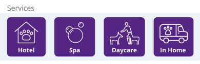
- **Description:** Base export of the Home 'Services' section component: label plus four purple tiles (Hotel, Spa, Daycare, In Home) with white outline icons.
- **Layout:** 'Services' label > row of 4 equal tiles.
- **Fields:**
  - Tile 'Hotel' (house with paw icon)
  - Tile 'Spa' (bubbles icon)
  - Tile 'Daycare' (person with two dogs icon)
  - Tile 'In Home' (van with paw icon)
- **Actions:**
  - Hotel
  - Spa
  - Daycare
  - In Home
- **Components:** service tile; section header
- **States:** Default
- **Rules / notes:** Four service lines: Hotel (boarding), Spa (grooming), Daycare, In Home (chat inquiry only per Home Page-5.png).

#### 1.2.7 In Home - Coming Soon

- **File:** [`Day care-1.png`](exports/petrock-main/Day%20care-1.png) (png, 390x844px)

- **Description:** Placeholder screen for the In Home service. Header 'In Home' with back arrow, a large purple tile with a van/truck icon bearing a paw and the label 'In Home', and the message 'In Home Service Coming Soon'. Bottom tab bar.
- **Layout:** Status bar > header > centered service tile > coming-soon message > tab bar.
- **Fields:**
  - Message 'In Home Service Coming Soon'
- **Actions:**
  - Back
  - Tab bar
- **Components:** Service tile (icon + label); Header with back arrow; Bottom tab bar
- **States:** Coming soon / unavailable state
- **Rules / notes:** In Home service not yet offered; shown as placeholder (consistent with D-003 and the chat-inquiry modal Home Page-5).

#### 1.2.8 Daycare - Coming Soon

- **File:** [`Day care.png`](exports/petrock-main/Day%20care.png) (png, 390x844px)

- **Description:** Placeholder screen for Daycare. Header 'Daycare' with back arrow, purple tile with icon of a person walking two dogs labeled 'Daycare', and the message 'Daycare Service Coming Soon'. Bottom tab bar.
- **Layout:** Status bar > header > centered service tile > coming-soon message > tab bar.
- **Fields:**
  - Message 'Daycare Service Coming Soon'
- **Actions:**
  - Back
  - Tab bar
- **Components:** Service tile (icon + label); Header with back arrow; Bottom tab bar
- **States:** Coming soon / unavailable state
- **Rules / notes:** Daycare shown as coming soon here, yet full Daycare Reservation screens exist (DayCare*.png) - conflicting scope (D-003 says daycare not designed yet; these screens partially contradict that).

### 1.3 Add pet & pet management

#### 1.3.1 Add Pet step 1 (empty vs filled, design vs build)

- **File:** [`Frame 1171276417.png`](exports/petrock-main/Frame%201171276417.png) (png, 828x883px)

- **Description:** Two-up composite of the Add Pet step-1 form. Left panel shows the empty form (no avatar image, blank inputs) cut off below Weight; right panel shows the same form filled with example data plus Date of Birth and a Next button. Both are light theme; the right is not a dark-mode variant but appears to be a built/implemented version (slightly different spacing, red badge '1' on the Pets tab).
- **Layout:** Header with back chevron + 'Add Pet' > 2-step stepper (step 1 active) > circular avatar with pencil edit badge > Name > Type | Breed (2 col) > Sex | Neutered/Spayed (2 col) > Color | Weight (2 col) > Date of Birth (right panel only) > Next button (right only) > bottom tab bar.
- **Fields:**
  - Pet photo (circular avatar, pencil edit badge; right panel shows a placeholder dog silhouette)
  - Name * (text) e.g. 'Boss'
  - Type * (dropdown) e.g. 'Dog'
  - Breed (dropdown) e.g. 'Pom'
  - Sex * (dropdown) e.g. 'Male'
  - Neutered/Spayed * (dropdown) e.g. 'Yes'
  - Color (dropdown) e.g. 'Brindle'
  - Weight (numeric with 'lbs' suffix) e.g. '9'
  - Date of Birth (date picker) e.g. '4/05/2025'
- **Actions:**
  - Back
  - Edit photo (pencil)
  - Next
  - Tab bar: Home, Bookings, Pets (badge 1), Settings
- **Components:** 2-step stepper/progress indicator; avatar uploader with edit badge; text input; dropdown select; input with unit suffix; date picker input; primary button; bottom tab bar; notification badge on tab
- **States:** Left: empty form (design). Right: filled form (built/implemented variant, same light theme). Second panel is NOT dark mode.
- **Rules / notes:** Required fields marked with red asterisk: Name, Type, Sex, Neutered/Spayed. Breed, Color, Weight, Date of Birth optional. Weight unit is lbs. Date format in the build shows 4/05/2025 vs 9-23-2024 in the Figma design (inconsistent).

#### 1.3.2 Add Pet step 2 - Pet Details (behaviour & feeding), design vs build

- **File:** [`Frame 1171276418.png`](exports/petrock-main/Frame%201171276418.png) (png, 808x1010px)

- **Description:** Two-up composite of the second Add Pet step covering socialisation, personality, food and feeding instructions. Left is the design with empty text areas; right is the built version with 'Write instructions here' placeholders and the tab bar. Both light theme; the right is an implementation variant, not dark mode.
- **Layout:** Socialized checkboxes > Personality dropdown > Own food dropdown > Meals per day dropdown > AM / Mid Day / PM feeding instruction text areas > Treats dropdown > Next button > (right only) bottom tab bar.
- **Fields:**
  - Is your dog socialized? Check all that apply: checkboxes 'Humans', 'Dogs'
  - What is your dog's personality? (dropdown) e.g. 'Shy'
  - Are you providing your own food? (dropdown) e.g. 'Yes'
  - How many meals per day does your dog eat? (dropdown) e.g. '1'
  - AM Feeding Instructions (textarea, placeholder 'Write instructions here')
  - Mid Day Feeding Instructions (textarea)
  - PM Feeding Instructions (textarea)
  - Can your dog have treats? (dropdown) e.g. 'Yes'
- **Actions:**
  - Next
  - Tab bar: Home, Bookings, Pets (badge 1), Settings
- **Components:** checkbox group; dropdown select; multiline textarea; primary button; bottom tab bar
- **States:** Left: empty design. Right: built variant with placeholders. Not dark mode.
- **Rules / notes:** Personality is a dropdown here but radio buttons (Shy/Calm/Hyper/Aggressive) in Pet Edit 3.png / Pet Edit-1.png. Meals per day is a numeric dropdown here ('1') but 'AM & PM' in Pet Edit 3.png. No header/stepper visible (cropped).

#### 1.3.3 My Pets grid (6 pets)

- **File:** [`My pets (more than one pet)-1.jpg`](exports/petrock-main/My%20pets%20%28more%20than%20one%20pet%29-1.jpg) (jpg, 390x930px)
- **Also exported as:** [`My pets (more than one pet).jpg`](exports/petrock-main/My%20pets%20%28more%20than%20one%20pet%29.jpg) (jpg, 390x930px)

- **Description:** Pet list screen showing a 2-column grid of six pet cards, each with a circular photo, name and breed. 'Add Pet' text link at top right. Sample data mixes dogs, cats, a rabbit and birds, suggesting multi-species support in this concept.
- **Layout:** Status bar > header (back chevron, 'My Pets') > right-aligned 'Add Pet' link > 2x3 grid of pet cards > tab bar (Pets active).
- **Fields:**
  - Mille - Breed: Bulldog
  - Brownie - Breed: Ragdoll
  - Cuddles - Breed: Hyplus (rabbit)
  - Jamaican - Breed: Leucistic (parrot)
  - Stuart - Breed: Stainrat (pug)
  - Spix - Breed: Macaw (budgie)
- **Actions:**
  - Back
  - Add Pet
  - Pet card tap x6
  - Tab bar
- **Components:** pet grid card (avatar, name, breed); text link; bottom tab bar
- **States:** Populated with 6 pets; no status chips
- **Rules / notes:** Different visual style (rounded grid cards, no approval status) from the Home pet cards; may be an earlier/alternative concept. Breed values look like placeholder data.

#### 1.3.4 Pet Details step 2 (behaviour & feeding)

- **File:** [`Pet Edit 3.png`](exports/petrock-main/Pet%20Edit%203.png) (png, 390x943px)

- **Description:** Second step of the add/edit pet wizard titled 'Pet Details' with the stepper on step 2. Captures socialisation, personality (radio), own food, meals per day, three feeding-instruction fields and treats, ending with Next.
- **Layout:** Status bar > header (back, 'Pet Details') > stepper (1 done, 2 active) > socialized checkboxes > personality radios > 4 dropdown/text fields > Next > tab bar (Pets active).
- **Fields:**
  - Is Your Dog Socialized? Check All That Apply: [x] Humans, [ ] Dogs
  - What Is Your Dog's Personality? radio: (o) Shy, Calm, Hyper, Aggressive
  - Are You Providing Your Own Food? dropdown 'Yes'
  - How Many Meals Per Day Does Your Dog Eat? dropdown 'AM & PM'
  - AM Feeding Instructions (text)
  - Mid Day Feeding Instructions (text)
  - PM Feeding Instructions (text)
  - Can Your Dog Have Treats? dropdown 'Yes'
- **Actions:**
  - Back
  - Next
  - Tab bar
- **Components:** stepper; checkbox group; radio group; dropdown select; text input; primary button; bottom tab bar
- **States:** Partially filled (Humans checked, Shy selected, Yes/AM & PM/Yes)
- **Rules / notes:** Meals-per-day options appear to be slot-based ('AM & PM') rather than a count; conflicts with Frame 1171276418 ('1'). Title 'Pet Details' vs 'Add Pet'/'Medical Details' for other steps of the same 2-step stepper, so the stepper seems to have more than 2 real screens.

#### 1.3.5 Add Pet step 1 - extended (basics + socialisation + personality + treats)

- **File:** [`Pet Edit-1.png`](exports/petrock-main/Pet%20Edit-1.png) (png, 390x1082px)

- **Description:** Filled Add Pet step 1 that additionally folds socialisation, personality and treats into the first page below Date Of Birth. Avatar shows a dog photo with a green camera badge. Ends with Next.
- **Layout:** Status bar > header (back, 'Add Pet') > stepper (1 active) > avatar with camera badge > Name > Type | Breed > Sex | Neutered/Spayed > Color | Weight > Date Of Birth > socialized checkboxes > personality radios > treats dropdown > Next > tab bar.
- **Fields:**
  - Photo (dog image, green camera badge)
  - Name * 'Boss'
  - Type * 'Dog'
  - Breed 'Pom'
  - Sex * 'Male'
  - Neutered/Spayed * 'Yes'
  - Color 'Brindle' (dropdown)
  - Weight '9 lbs' (dropdown)
  - Date Of Birth '9-23-2024' (date picker)
  - Is Your Dog Socialized? [x] Humans [ ] Dogs
  - What Is Your Dog's Personality? (o) Shy, Calm, Hyper, Aggressive
  - Can Your Dog Have Treats? 'Yes'
- **Actions:**
  - Back
  - Change photo
  - Next
  - Tab bar
- **Components:** stepper; avatar uploader; text input; dropdown; date picker; checkbox group; radio group; primary button; bottom tab bar
- **States:** Filled; longer variant of step 1
- **Rules / notes:** Weight rendered as a dropdown ('9 lbs') here vs numeric input with lbs suffix in Frame 1171276417. Duplicates socialisation/personality/treats questions that also appear on Pet Edit 3.png, so the split between steps is unresolved.

#### 1.3.6 Add Pet step 1 - basics (filled)

- **File:** [`Pet Edit.png`](exports/petrock-main/Pet%20Edit.png) (png, 390x844px)

- **Description:** Filled Add Pet step 1 with photo, name, type, breed, sex, neutered/spayed, color, weight and date of birth, then Next. Base version of Pet Edit-1 without the behaviour questions.
- **Layout:** Status bar > header 'Add Pet' > stepper (1 active) > avatar with camera badge > Name > Type | Breed > Sex | Neutered/Spayed > Color | Weight > Date Of Birth > Next > tab bar.
- **Fields:**
  - Photo (dog image, camera badge)
  - Name * 'Boss'
  - Type * 'Dog'
  - Breed 'Pom'
  - Sex * 'Male'
  - Neutered/Spayed * 'Yes'
  - Color 'Brindle'
  - Weight '9 lbs'
  - Date Of Birth '9-23-2024'
- **Actions:**
  - Back
  - Change photo
  - Next
  - Tab bar
- **Components:** stepper; avatar uploader; text input; dropdown; date picker; primary button; bottom tab bar
- **States:** Filled
- **Rules / notes:** Required: Name, Type, Sex, Neutered/Spayed. Date format M-DD-YYYY.

#### 1.3.7 Pet Profile (Brownie)

- **File:** [`Pet Profile (Single Pet)-1.jpg`](exports/petrock-main/Pet%20Profile%20%28Single%20Pet%29-1.jpg) (jpg, 390x1005px)
- **Also exported as:** [`Pet Profile (Single Pet).jpg`](exports/petrock-main/Pet%20Profile%20%28Single%20Pet%29.jpg) (jpg, 390x1005px)

- **Description:** Read-only pet profile with a large circular photo (dashed orange ring, edit pencil), name and breed, a stats row (Gender/Birthday/Weight), a Reminder card for an upcoming vet appointment, and a 'Notes for brownie' list with three dated note rows and an Add Note link.
- **Layout:** Status bar > header (back, 'Pet Profile') > avatar with edit badge > name + breed > 3-stat card > 'Reminder' section + card with dog image > 'Notes for brownie' header + 'Add Note' > 3 note rows with chevrons.
- **Fields:**
  - Name 'Brownie'
  - Breed: Ragdoll
  - Gender: Female
  - Birthday: June 20, 2022
  - Weight: 16 Kg
  - Reminder: 'Vet appointment', 'March 8, 2023 @ 10:00 AM', 'Dr. Smith Jonas'
  - Note: 'Grooming for brownie' - Last Do In January 15, 2023
  - Note: 'Training for brownie' - Last Do In January 30, 2023
  - Note: 'Lat vet injection' - Last Do In November 20, 2022
- **Actions:**
  - Back
  - Edit photo/profile (pencil)
  - Add Note
  - Note row tap x3
- **Components:** avatar with edit badge; stat row card; reminder card; list row with icon, title, subtitle, chevron; text link
- **States:** Populated single pet; no tab bar visible (cut off or absent)
- **Rules / notes:** Weight in Kg here vs lbs in Add Pet. Copy 'Last Do In' and 'Lat vet injection' look like typos ('Last done', 'Last vet injection'). Includes a vet reminder and notes concept not present elsewhere in this group. Different visual style from the purple design system; likely an earlier concept (UI kit).

#### 1.3.8 Pet Profile (edit)

- **File:** [`edit profile.jpg`](exports/petrock-main/edit%20profile.jpg) (jpg, 390x951px)
- **Also exported as:** [`edit profile-1.jpg`](exports/petrock-main/edit%20profile-1.jpg) (jpg, 390x951px) - Pet Profile (edit) - duplicate export

- **Description:** Form screen titled 'Pet Profile' for editing a pet's details. A circular pet photo with a dashed orange ring and a purple camera badge sits at the top, followed by four required text fields and a full-width 'Update Profile' button. Despite the 'Pet Profile' title, the fields mix pet data (name, breed) with owner contact data (e-mail, contact number).
- **Layout:** Status bar (9:41) > header with back chevron and centered title 'Pet Profile' > circular avatar with camera badge > stacked labelled inputs (First Name, Breed, E-mail, Contact Number) each with a trailing grey icon > full-width primary button 'Update Profile' at bottom; faint decorative curved lines in the background top-right.
- **Fields:**
  - First Name * (placeholder 'Brownie', trailing person icon)
  - Breed * (placeholder 'Ragdoll', trailing person icon)
  - E-mail * (placeholder 'jennywilson@demo.com', trailing envelope icon)
  - Contact Number * (placeholder '+123 456 789', trailing phone icon)
  - Pet photo (kitten image) with change-photo camera badge
- **Actions:**
  - Back (chevron)
  - Change photo (camera badge on avatar)
  - Update Profile (primary button)
- **Components:** Header with back chevron and centered title; Avatar with dashed ring and camera badge; Labelled text input with required asterisk and trailing icon; Full-width primary button
- **States:** Light mode; fields show placeholder text (unfilled/pre-fill state)
- **Rules / notes:** All four fields marked required with a red asterisk. Placeholder pet is a cat (Ragdoll) in a dog hotel app, and the 'First Name' label for a pet is odd; e-mail/phone appear to be owner fields on a pet form. Sample values appear to be template placeholders (jennywilson@demo.com). UI-kit style, likely an earlier concept.

### 1.4 Vaccines

#### 1.4.1 Choose Vaccine (multi-pet vaccine upload)

- **File:** [`Choose Vaccine.png`](exports/petrock-main/Choose%20Vaccine.png) (png, 390x844px)

- **Description:** Standalone vaccine upload screen where the customer first picks which pet the documents belong to, then uploads one file per required vaccine. Three pet cards are shown (Jack selected/highlighted in lilac), each with a date and a status chip. Below are three labelled upload rows and a Submit button. The whole screen is rendered faded/washed-out, suggesting a disabled or transitional state, or a low-opacity export.
- **Layout:** Status bar (9:41) > header with back chevron and title 'Choose Vaccine' > instruction text > horizontal row of 3 pet selector cards > 3 stacked upload fields (label + dashed file field + upload-arrow button) > Submit button > bottom tab bar (Home, Bookings/ticket, Pets/paw active, Settings/gear).
- **Fields:**
  - Pet card: name 'Jack', date '3-03-2024', status chip 'Active' (green dot), selected
  - Pet card: name 'Riff', date '3-03-2024', status chip 'Pending' (orange dot)
  - Pet card: name 'Jumba', date '3-03-2024', status chip 'Active' (green dot)
  - Distemper/Parvo: file upload, placeholder '.jpg, .png, .gif, .pdf'
  - Bordetella: file upload, placeholder '.jpg, .png, .gif, .pdf'
  - Rabies: file upload, placeholder '.jpg, .png, .gif, .pdf'
- **Actions:**
  - Back (chevron)
  - Select pet card (Jack / Riff / Jumba)
  - Upload (arrow icon) per vaccine row
  - Submit (with upload icon)
  - Tab bar: Home, Bookings, Pets (active), Settings
- **Components:** pet selector card with avatar + status chip; file upload field with dashed border and trailing upload button; primary button; bottom tab bar; status chip (Active/Pending)
- **States:** Faded/low-opacity rendering of the whole screen (possibly disabled or loading state); one pet selected (Jack); all upload fields empty
- **Rules / notes:** Copy: 'Please Choose Your Pet And Upload The Following Vaccine Information:'. Accepted file types: .jpg, .png, .gif, .pdf. Three required vaccines: Distemper/Parvo, Bordetella, Rabies. Pet cards carry a vaccine/approval status (Active vs Pending) and a date (3-03-2024, meaning unclear: vaccine date, expiry, or added date). Uses Pets tab, not a wizard stepper.

#### 1.4.2 Vaccine upload (required three), design vs build

- **File:** [`Frame 1171276419.png`](exports/petrock-main/Frame%201171276419.png) (png, 1058x777px)

- **Description:** Two-up composite of the vaccine document upload step with three dashed drop-zones (Distemper/Parvo, Bordetella, Rabies) and a Submit button. Left panel is the design (a purple button from the preceding content is cut off at top); right is the built version with more spacing. Both light theme; no dark variant.
- **Layout:** (Left: truncated purple button at top) > instruction text > 3 x (label + dashed upload zone) > Submit > bottom tab bar.
- **Fields:**
  - Distemper/Parvo: upload zone placeholder '.jpg, .png, .gif, .pdf'
  - Bordetella: upload zone placeholder '.jpg, .png, .gif, .pdf'
  - Rabies: upload zone placeholder '.jpg, .png, .gif, .pdf'
- **Actions:**
  - Upload file (tap dashed zone) x3
  - Submit
  - Tab bar: Home, Bookings, Pets (badge 1), Settings
- **Components:** dashed-border file drop zone; primary button; bottom tab bar
- **States:** Empty upload zones, both panels. Right panel is built/implemented variant, not dark mode.
- **Rules / notes:** Copy: 'Please choose your pet and upload the following vaccine information:' (says 'choose your pet' but no pet selector is present on this screen, unlike Choose Vaccine.png). Accepted: .jpg, .png, .gif, .pdf.

#### 1.4.3 Medical Details step 2 (conditions, allergies, vet, vaccines) - empty

- **File:** [`Pet Edit 5.png`](exports/petrock-main/Pet%20Edit%205.png) (png, 390x895px)
- **Also exported as:** [`Pet Edit 6.png`](exports/petrock-main/Pet%20Edit%206.png) (png, 390x895px) - Medical Details step 2 - empty (exact duplicate)

- **Description:** Medical step of the pet wizard: medical conditions, allergies, a vet picker, a 'Choose Vaccine' section listing required and recommended vaccines, and a multi-file upload for invoices/certificates. Submit and Skip at the bottom.
- **Layout:** Status bar > header (back, 'Medical Details') > stepper (step 2 active) > 2 text fields > vet dropdown > 'Choose Vaccine' heading with two columns (Required / Reccomended) > upload label + file field with upload button > 'Multiple Uploads' hint > Submit > Skip link > tab bar.
- **Fields:**
  - List Any Medical Conditions (text)
  - List Any Allergies (text)
  - Choose Your Vet (dropdown) placeholder 'See List of Vets or Add a Vet'
  - Required vaccines: Distemper/Parvo, Bordetella, Rabies
  - Recommended vaccines: Lepto, Influenza
  - Upload Vaccine Invoices Or Certificates: file field '.jpg, .png, .pdf' with upload button; hint 'Multiple Uploads'
- **Actions:**
  - Back
  - Choose vet / Add a Vet
  - Upload file
  - Submit
  - Skip
  - Tab bar
- **Components:** stepper; text input; dropdown select; two-column list; file upload field; primary button; text link (Skip); bottom tab bar
- **States:** Empty; no files uploaded
- **Rules / notes:** Required vaccines: Distemper/Parvo, Bordetella, Rabies. Recommended: Lepto, Influenza. Accepted here: .jpg, .png, .pdf (no .gif, unlike Choose Vaccine.png). Vet can be chosen from a list or added. Step is skippable. Typo 'Reccomended'.
- **Variants among the duplicates:**
  - `Pet Edit 6.png` - Medical Details step 2 - empty (exact duplicate): Pixel-identical export of Pet Edit 5.png. State: Empty Note: Exact duplicate (zero pixel difference) of Pet Edit 5.png.

#### 1.4.4 Medical Details step 2 - uploads in progress + pending warning

- **File:** [`Pet Edit 7.png`](exports/petrock-main/Pet%20Edit%207.png) (png, 390x1091px)

- **Description:** Same Medical Details screen with two upload progress cards: image.jpg completed (green check, 10 MB, 100%) and myresume.pdf uploading (65%, 2 MB, red cancel X). A bold warning banner above Submit reads 'Reservations Will Be Pending Until Vaccines...' (clipped at the edges).
- **Layout:** Header 'Medical Details' > stepper > conditions/allergies/vet > Choose Vaccine lists > upload field > 2 upload progress cards > warning text line > Submit > Skip > tab bar.
- **Fields:**
  - Upload card: 'image.jpg', progress 100%, size '10 MB', green success check
  - Upload card: 'myresume.pdf', progress 65%, size '2 MB', red cancel/remove icon
  - Warning: 'Reservations Will Be Pending Until Vaccine[s ...]' (text overflows screen)
- **Actions:**
  - Back
  - Upload
  - Cancel/remove upload (red X)
  - Submit
  - Skip
  - Tab bar
- **Components:** upload progress card (filename, progress bar, size, percent, status icon); warning text; stepper; file upload field; primary button; text link; bottom tab bar
- **States:** Uploads in progress state (one complete, one 65%); warning shown
- **Rules / notes:** Business rule: reservations remain in Pending status until vaccine documents are verified/uploaded. Warning text is clipped and needs wrapping. Progress cards show size and percent.

### 1.5 Hotel booking

#### 1.5.1 Estimate (booking summary & payment choice)

- **File:** [`Booking Detail.jpg`](exports/petrock-main/Booking%20Detail.jpg) (jpg, 390x1074px)
- **Also exported as:** [`Booking Detail-1.jpg`](exports/petrock-main/Booking%20Detail-1.jpg) (jpg, 390x1074px); [`Booking Detail-2.jpg`](exports/petrock-main/Booking%20Detail-2.jpg) (jpg, 390x1074px)

- **Description:** Pre-payment estimate screen shown after room selection. Summarises the selected room (Hotel Penthouse), line items, check-in/check-out dates and times, and a Payment Details card. A promotional band offers to add grooming, and the footer presents two payment paths: pay a deposit or pay in full (with a discount hint).
- **Layout:** Status bar; header with back chevron and centered title 'Estimate'; section label 'Booking Detail'; room summary card (icon, room name, price, line items, total); check-in/check-out card (two columns, date + time rows); section label 'Payment Details' with card (Hotel Rent, Tax, Total); light-purple grooming band with copy and outlined 'Add Grooming' button; primary 'Pay Deposit' button, green hint text, outlined 'Pay In Full' button; purple bottom tab bar (home, ticket, paw center FAB, settings).
- **Fields:**
  - Room name: 'Hotel Penthouse'
  - Room headline price (green): '$200'
  - Room (2 Nights X $15.50): '$31.00'
  - Tax (2%): '$1.09'
  - TOTAL: '$232.09'
  - Check-in date: '16 Nov 2024'
  - Check-in time: '10:00 AM'
  - Check-out date: '16 Nov 2024'
  - Check-out time: '10:00 AM'
  - Payment Details > Hotel Rent: '$200.00'
  - Payment Details > Tax: '$1.09'
  - Payment Details > Total: '$232.90'
- **Actions:**
  - Back (chevron)
  - Add Grooming (outlined button)
  - Pay Deposit (primary button)
  - Pay In Full (outlined button)
  - Tab bar: Home
  - Tab bar: Tickets/Bookings
  - Tab bar: Paw (center FAB)
  - Tab bar: Settings
- **Components:** App header with back button; Summary card with line items; Date/time pair card (calendar + clock icons); Key-value list card; Promo/info band with CTA; Primary button; Outlined/secondary button; Hint/caption text; Bottom tab bar with center FAB
- **States:** Filled / default light mode
- **Rules / notes:** Copy: 'We Generally Do Grooms At The End Of Hotel Stays. If You'd Like An Extra Groom, Please Contact Us. If You'd Like More Than One Groom, Please Contact Us.' Hint under Pay Deposit: '*pay full upfront to get discount.' Tax shown as 2%. Numbers are inconsistent: room line '2 Nights X $15.50 = $31.00' plus tax $1.09 gives TOTAL $232.09, while headline is $200 and Payment Details total is $232.90 (typo/mismatch). Check-in and check-out are the same date despite '2 Nights'.

#### 1.5.2 Estimate (variant with credit-card fee note, no Payment Details)

- **File:** [`Booking Detail-3.jpg`](exports/petrock-main/Booking%20Detail-3.jpg) (jpg, 390x1074px)

- **Description:** Variant of the Estimate screen. The room summary card gains a footnote about a non-cash fee for credit-card payment, the separate 'Payment Details' card is removed, and the grooming band sits directly below the check-in/out card. Pay Deposit and Pay In Full buttons remain but the 'pay full upfront to get discount' hint is gone, leaving empty space below.
- **Layout:** Status bar; header 'Estimate' with back; 'Booking Detail' label; room summary card with line items, total and fee footnote; check-in/check-out card; grooming promo band with 'Add Grooming'; 'Pay Deposit' primary; 'Pay In Full' outlined; empty area; bottom tab bar.
- **Fields:**
  - Room name: 'Hotel Penthouse'
  - Price: '$200'
  - Room (2 Nights X $15.50): '$31.00'
  - Tax (2%): '$1.09'
  - TOTAL: '$232.09'
  - Footnote: '* There is a [3.8]% non cash fee if paying with credit card'
  - Check-in: '16 Nov 2024', '10:00 AM'
  - Check-out: '16 Nov 2024', '10:00 AM'
- **Actions:**
  - Back
  - Add Grooming
  - Pay Deposit
  - Pay In Full
  - Bottom tab bar (Home, Tickets, Paw, Settings)
- **Components:** App header; Summary card with footnote; Date/time pair card; Promo band; Primary button; Outlined button; Bottom tab bar
- **States:** Filled / light mode; alternate layout without Payment Details card
- **Rules / notes:** Business rule: '[3.8]% non cash fee if paying with credit card' (bracketed value suggests a configurable placeholder). Grooming copy same as other Estimate variants. Deposit discount hint absent in this variant.

#### 1.5.3 Add Pet Details (medication & flea questionnaire)

- **File:** [`Booking Details Add Pets.png`](exports/petrock-main/Booking%20Details%20Add%20Pets.png) (png, 390x943px)
- **Also exported as:** [`Booking Details Add Pets-1.png`](exports/petrock-main/Booking%20Details%20Add%20Pets-1.png) (png, 390x943px) - Confirm Pet Details (medication & flea questionnaire); [`Booking Details Add Pets-2.png`](exports/petrock-main/Booking%20Details%20Add%20Pets-2.png) (png, 390x943px); [`Booking Details Add Pets-3.png`](exports/petrock-main/Booking%20Details%20Add%20Pets-3.png) (png, 390x943px) - Additional Pet Details (medication & flea questionnaire)

- **Description:** Form collecting medical information for the pet being boarded: medication/supplement usage, count, name, dosing frequency, flea-medication status and brand, a date (presumably last flea dose), and a free-text medical alert. Ends with a Next button to continue the booking flow. Title variants of the same form: 'Confirm Pet Details' (-1) and 'Additional Pet Details' (-3).
- **Layout:** Status bar; header 'Add Pet Details' with back chevron; vertical stack of labeled inputs (dropdowns and text fields); date field with calendar icon; 'Next' primary button; bottom tab bar.
- **Fields:**
  - Does Your Dog Take Medication Or Supplements? (dropdown): 'Yes'
  - How Many? (dropdown): '1'
  - Medication / Supplement Name (text): empty
  - How Many Times A Day? (dropdown): '1 Daily (AM ONLY)'
  - Is Your Dog Currently On A Vet Recommended Flea Medication? (dropdown): 'Yes'
  - Flea Medication Brand (text): empty
  - Date (unlabeled date picker): '9-23-2024'
  - Medical Alert (text): empty
- **Actions:**
  - Back
  - Next (primary)
  - Open date picker (calendar icon)
  - Bottom tab bar (Home, Tickets, Paw, Settings)
- **Components:** App header; Form label; Dropdown/select; Text input; Date input with calendar icon; Primary button; Bottom tab bar
- **States:** Partially filled / light mode
- **Rules / notes:** Dosing frequency options include '1 Daily (AM ONLY)'. The date field has no label (likely last flea medication date). Copy says 'Dog' even though pets shown elsewhere are cats.
- **Variants among the duplicates:**
  - `Booking Details Add Pets-1.png` - Confirm Pet Details (medication & flea questionnaire): Same medication/flea form titled 'Confirm Pet Details', implying a review step for a pet whose details already exist on file. State: Title variant 'Confirm' Note: Only the title differs; suggests returning customers confirm stored pet medical data rather than re-entering it.
  - `Booking Details Add Pets-3.png` - Additional Pet Details (medication & flea questionnaire): Same form titled 'Additional Pet Details'; only header text and slight input padding differ. State: Title variant 'Additional' Note: Three title variants exist for the same form (Add / Confirm / Additional); designer intent for when each is used is unclear.

#### 1.5.4 Additional Pet Details with Select Pet list

- **File:** [`Booking Details Add Pets-4.png`](exports/petrock-main/Booking%20Details%20Add%20Pets-4.png) (png, 390x1169px)

- **Description:** Extended variant of the Additional Pet Details form that starts with a 'Select Pet' section listing pets with checkboxes, so the medical questionnaire can be attributed to a specific pet. The rest of the form (medication, flea, date, medical alert) and Next button are unchanged.
- **Layout:** Status bar; header 'Additional Pet Details'; 'Select Pet' label; two pet rows (name, date, checkbox) as white cards; medication/flea form fields; date field; Medical Alert; Next button; bottom tab bar.
- **Fields:**
  - Select Pet row 1: 'Riff' / '3-03-2024' (checked)
  - Select Pet row 2: 'Riff' / '3-03-2024' (unchecked)
  - Medication / flea / date / Medical Alert fields as in Booking Details Add Pets.png
- **Actions:**
  - Back
  - Select pet (checkbox)
  - Next
  - Date picker
  - Bottom tab bar
- **Components:** App header; Selectable list row with checkbox; Dropdown; Text input; Date input; Primary button; Bottom tab bar
- **States:** One pet selected / light mode
- **Rules / notes:** Checkboxes imply multi-select of pets for the same medical details. Both rows use placeholder name 'Riff'; the date under the pet name (3-03-2024) is likely birth date or last vaccination date.

#### 1.5.5 Customer Details form

- **File:** [`Booking Details Final Customer Details.png`](exports/petrock-main/Booking%20Details%20Final%20Customer%20Details.png) (png, 390x882px)
- **Also exported as:** [`Booking Details Final Customer Details-1.png`](exports/petrock-main/Booking%20Details%20Final%20Customer%20Details-1.png) (png, 390x882px)

- **Description:** Contact and address form for the booking customer, with first/last name, phone and alternate phone, email, street address, apt/suite, city, state dropdown and zip. Submit button completes the step.
- **Layout:** Status bar; header 'Customer Details' with back chevron; two-column rows (First/Last Name; Phone/Alt Phone); full-width Email, Address, Apt / Suite, City; two-column State (dropdown) / Zip; 'Submit' primary button; bottom tab bar.
- **Fields:**
  - First Name
  - Last Name
  - Phone
  - Alt Phone
  - Email
  - Address
  - Apt / Suite
  - City
  - State (dropdown)
  - Zip
- **Actions:**
  - Back
  - Submit (primary)
  - Bottom tab bar (Home, Tickets, Paw, Settings)
- **Components:** App header; Form label; Text input; Dropdown (State); Two-column form row; Primary button; Bottom tab bar
- **States:** Empty / light mode
- **Rules / notes:** US-style address (State, Zip). Button says 'Submit' rather than 'Next', implying end of data entry.

#### 1.5.6 Billing Details form

- **File:** [`Booking Details Final Customer Details-2.png`](exports/petrock-main/Booking%20Details%20Final%20Customer%20Details-2.png) (png, 390x882px)
- **Also exported as:** [`Booking Details Final Customer Details-3.png`](exports/petrock-main/Booking%20Details%20Final%20Customer%20Details-3.png) (png, 390x882px)

- **Description:** Same layout as Customer Details but titled 'Billing Details' and with phone labels changed to 'Cell Phone' and 'Home Phone'. Collects billing name, phones, email and US address, then Submit.
- **Layout:** Same as Customer Details with header 'Billing Details'
- **Fields:**
  - First Name
  - Last Name
  - Cell Phone
  - Home Phone
  - Email
  - Address
  - Apt / Suite
  - City
  - State (dropdown)
  - Zip
- **Actions:**
  - Back
  - Submit
  - Bottom tab bar
- **Components:** App header; Text input; Dropdown; Two-column form row; Primary button; Bottom tab bar
- **States:** Empty / light mode; 'Billing' title variant
- **Rules / notes:** Label inconsistency vs Customer Details (Phone/Alt Phone vs Cell Phone/Home Phone). Unclear whether billing address is separate from customer address.

#### 1.5.7 Choose Pets (pet selection, room-share, grooming, dates)

- **File:** [`Choose Pets.png`](exports/petrock-main/Choose%20Pets.png) (png, 390x1126px)
- **Also exported as:** [`Choose Pets-1.png`](exports/petrock-main/Choose%20Pets-1.png) (png, 390x1126px); [`Choose Pets-2.png`](exports/petrock-main/Choose%20Pets-2.png) (png, 390x1126px) - Choose Pets with date range selected; [`Hotel Reservation.png`](exports/petrock-main/Hotel%20Reservation.png) (png, 390x1126px) - Hotel Reservation (select pet & dates)

- **Description:** First step of the hotel booking: horizontally arranged pet cards (avatar, name, date, status chip) with one selected, a question about pets sharing a room (shown as a text input with placeholder), a grooming add-on dropdown, a Check In / Check Out card with date and time pickers, and a month calendar. Next proceeds to room selection. Choose Pets-2.png shows the same screen with a highlighted stay range (Feb 5-12) on the calendar.
- **Layout:** Status bar; header 'Choose Pets' with back; row of 3 pet cards (selected card filled purple); label + text field 'Do You Want Your Pets To Share A Room?'; label + dropdown 'Would You Like To Add Grooming?'; Check In / Check Out card (date fields with calendar icon, time fields with clock icon); calendar card (prev/next arrows, 'February 2024', weekday header S M T W T F S, day grid, selected day 24); 'Next' primary button; bottom tab bar.
- **Fields:**
  - Pet card 1: 'Jack' / '3-03-2024' / status 'Active' (selected)
  - Pet card 2: 'Riff' / '3-03-2024' / status 'Pending'
  - Pet card 3: 'Jumba' / '3-03-2024' / status 'Active'
  - Do You Want Your Pets To Share A Room? (text input, placeholder 'A Complex Form Might...|')
  - Would You Like To Add Grooming? (dropdown): 'Yes'
  - Check In date: '16 Nov 2022'
  - Check In time: '10:00 AM'
  - Check Out date: '18 Nov 2022'
  - Check Out time: '02:00 PM'
  - Calendar month: 'February 2024', selected day '24'; range 5-12 Feb highlighted in Choose Pets-2
- **Actions:**
  - Back
  - Select pet card
  - Open date picker (calendar icon)
  - Open time picker (clock icon)
  - Calendar previous month (arrow)
  - Calendar next month (arrow)
  - Select calendar day / range
  - Next (primary)
  - Bottom tab bar (Home, Tickets, Paw, Settings)
- **Components:** App header; Pet card with avatar and status chip (Active green / Pending orange); Text input; Dropdown; Date/time pair card; Month calendar with range support; Primary button; Bottom tab bar
- **States:** One pet selected; no range (Choose Pets, -1) or range selected (Choose Pets-2) / light mode
- **Rules / notes:** Pet status chips: Active (green) and Pending (orange); Pending likely means vaccination/approval incomplete. Placeholder 'A Complex Form Might...' is designer note text, not final copy. Dates in Check In/Out card (Nov 2022) don't match calendar (Feb 2024). Calendar shows 31 days in February (grid error). Range highlight does not correspond to the Check In/Out field values.
- **Variants among the duplicates:**
  - `Choose Pets-2.png` - Choose Pets with date range selected: Same Choose Pets screen with the calendar showing a highlighted stay range (Feb 5 through Feb 12 shaded purple) plus the selected day 24. Fields: Calendar range highlighted: 5 Feb - 12 Feb 2024 State: Date range selected Note: Range highlight does not correspond to the Check In/Out field values (16-18 Nov 2022) or the selected day 24; mock data inconsistent.
  - `Hotel Reservation.png` - Hotel Reservation (select pet & dates): Alternate entry screen to the boarding flow titled 'Hotel Reservation'. Shows a 'Select Your Pet' heading over the three pet cards, the room-share question as a text input, a month calendar, and a Check In / Check Out card with date and time pickers. No grooming question. Next button at bottom with empty space above it. Fields: Pet cards: Jack (Active, selected), Riff (Pending), Jumba (Active), each '3-03-2024'; Do You Want Your Pets To Share A Room? (text input, placeholder 'A Complex Form Might...|'); Calendar: 'February 2024', selected '24'; Check In: '16 Nov 2022' / '10:00 AM'; Check Out: '18 Nov 2022' / '02:00 PM' State: One pet selected, no range / light mode Note: Functionally the same step as Choose Pets minus the grooming dropdown; screen title differs ('Hotel Reservation' vs 'Choose Pets'). Likely an earlier iteration.

#### 1.5.8 Choose Pets (dropdown room-share, calendar above dates)

- **File:** [`Choose Pets-3.png`](exports/petrock-main/Choose%20Pets-3.png) (png, 390x1126px)

- **Description:** Alternate layout of Choose Pets: the room-share question is a Yes/No dropdown instead of a text input, the calendar (with Feb 5-12 range highlighted) is placed above the Check In / Check Out card, and the grooming dropdown remains. Next button and tab bar unchanged.
- **Layout:** Status bar; header 'Choose Pets'; 3 pet cards; 'Do You Want Your Pets To Share A Room?' dropdown; 'Would You Like To Add Grooming?' dropdown; calendar card (range 5-12 highlighted, 24 selected); Check In / Check Out card; Next; bottom tab bar.
- **Fields:**
  - Pet cards: Jack (Active, selected), Riff (Pending), Jumba (Active), each '3-03-2024'
  - Do You Want Your Pets To Share A Room? (dropdown): 'Yes'
  - Would You Like To Add Grooming? (dropdown): 'Yes'
  - Calendar: 'February 2024', range 5-12, selected 24
  - Check In: '16 Nov 2022' / '10:00 AM'
  - Check Out: '18 Nov 2022' / '02:00 PM'
- **Actions:**
  - Back
  - Select pet card
  - Calendar prev/next
  - Select calendar day/range
  - Date picker
  - Time picker
  - Next
  - Bottom tab bar
- **Components:** App header; Pet card with status chip; Dropdown; Month calendar with range highlight; Date/time pair card; Primary button; Bottom tab bar
- **States:** Date range selected, dropdown variant / light mode
- **Rules / notes:** Resolves the placeholder text field of Choose Pets.png into a Yes/No dropdown; likely the intended final design.

#### 1.5.9 Choose Your Room Type

- **File:** [`Choose Your Room.png`](exports/petrock-main/Choose%20Your%20Room.png) (png, 390x1003px)
- **Also exported as:** [`Choose Your Room-1.png`](exports/petrock-main/Choose%20Your%20Room-1.png) (png, 390x1003px) - Choose Your Room Type (both rooms $115); [`Choose Your Room-2.png`](exports/petrock-main/Choose%20Your%20Room-2.png) (png, 390x1003px)

- **Description:** Vertical list of room-type cards, each with a large photo, a 'BOOK NOW' button overlaid on the image, the room name, a description paragraph and an average nightly price per pet. Two room types visible: Penthouse ($150) and Suite ($105, with a stray 'vv' typo). Choose Your Room-1.png shows both at $115.
- **Layout:** Status bar; header 'Choose Your Room Type' with back; room card 1 (photo with BOOK NOW, title 'Penthouse', description, price); room card 2 (photo with BOOK NOW, title 'Suite', description, price); bottom tab bar. Content appears scrollable.
- **Fields:**
  - Room type: 'Penthouse'
  - Penthouse description: 'Petrock Penthouses Offer A TV, Premium Bed, Toys, Potty Pads, Room Service, Playtime, 2 Walks Per Day, Photos And Videos Every Night, A Bedtime Tuck In And Tummy Rub.'
  - Penthouse price: '$150 Avg Per Night/Pet' ($115 in -1)
  - Room type: 'Suite'
  - Suite description: same text as Penthouse (placeholder)
  - Suite price: '$105vv Avg Per Night/Pet' ($115 in -1)
- **Actions:**
  - Back
  - BOOK NOW (Penthouse)
  - BOOK NOW (Suite)
  - Bottom tab bar (Home, Tickets, Paw, Settings)
- **Components:** App header; Room type card (hero image, overlay button, title, body, price); Primary overlay button; Bottom tab bar
- **States:** Default list / light mode
- **Rules / notes:** Pricing is 'Avg Per Night/Pet'. Penthouse inclusions: TV, premium bed, toys, potty pads, room service, playtime, 2 walks/day, nightly photos and videos, bedtime tuck-in and tummy rub. Suite description is copy-pasted from Penthouse and says 'Petrock Penthouses'. '$105vv' is a typo. Conflicting price data across variants ($150/$105 vs $115/$115) and against Settings ($120-$155 / $85-$110 per 24h).
- **Variants among the duplicates:**
  - `Choose Your Room-1.png` - Choose Your Room Type (both rooms $115): Same room-type list but both Penthouse and Suite show '$115 Avg Per Night/Pet'. Fields: Penthouse price: '$115 Avg Per Night/Pet'; Suite price: '$115 Avg Per Night/Pet' State: Alternate pricing Note: Conflicting price data across variants; actual rates need confirmation.

#### 1.5.10 Hotel Booking - Pet selection & dates - two-up (build)

- **File:** [`Frame 1171276425.png`](exports/petrock-main/Frame%201171276425.png) (png, 809x669px)

- **Description:** Two variants of the first hotel booking step. Top shows two pet cards (photo placeholder 'Parent group's Pet's Picture', Pet Name, Pet Breed), one selected (bold border) and one dimmed. Below are two dropdowns (share a room, add grooming), then Check In and Check Out rows each with a date input, Time dropdown and calendar icon, and a Next button. Left pane is empty; right pane has the dropdowns filled and pet cards with circular avatar crops and purple pet names. Both light theme; not a dark-mode pair.
- **Layout:** Pet card row > 'Do you want your pets to share a room?' dropdown > 'Would you like to add Grooming?' dropdown > Check In (date, time, calendar icon) > Check Out (date, time, calendar icon) > Next.
- **Fields:**
  - Pet card: Pet Picture, Pet Name, Pet Breed
  - Do you want your pets to share a room? (dropdown; right shows placeholder 'A complex form might...')
  - Would you like to add Grooming? (dropdown; right shows 'Yes')
  - Check In date (example '4/05/2025')
  - Check In Time (dropdown 'Time')
  - Check Out date (example '4/05/2025')
  - Check Out Time (dropdown 'Time')
- **Actions:**
  - Select pet card
  - Open calendar picker (calendar icon)
  - Next (primary)
- **Components:** Selectable pet card; Dropdown/select; Date input; Time select; Calendar icon button; Primary button
- **States:** Left: empty; right: filled example values; selected vs unselected pet card
- **Rules / notes:** Multi-pet booking: question whether pets share a room implies room-sharing pricing/rule. Grooming is an optional add-on chosen at booking. Right dropdown text 'A complex form might...' is lorem-style placeholder. Built counterpart of Choose Pets.png (no inline calendar).

#### 1.5.11 Hotel Booking - Medication & medical details - two-up (build)

- **File:** [`Frame 1171276426.png`](exports/petrock-main/Frame%201171276426.png) (png, 977x745px)

- **Description:** Two near-identical variants of the medication/medical details step. Fields: medication/supplements yes-no dropdown, How many, Medication/Supplement Name, How many times a day, flea medication dropdown, Medical Alert free text, and a Next button. Left pane has a Figma orange selection frame; right is the same content with slightly different spacing. Both light theme; not dark mode.
- **Layout:** Stacked labeled fields top to bottom > Next button.
- **Fields:**
  - Does your pet take medication or supplements? (dropdown)
  - How many? (text/number)
  - Medication / Supplement Name (text)
  - How many times a day? (text/number)
  - Is your dog currently on a vet recommended flea medication? (dropdown)
  - Medical Alert (text)
- **Actions:**
  - Next (primary)
- **Components:** Dropdown/select; Text input; Primary button
- **States:** Empty form, light theme; both panes effectively identical
- **Rules / notes:** Flea-medication question appears in both hotel and daycare flows; medication fields appear to be single-entry (one medication) despite 'How many?'. Build counterpart of Booking Details Add Pets.png (no Flea Brand / Date fields).

#### 1.5.12 Hotel Booking - Summary & Payment (no grooming) - two-up (build)

- **File:** [`Frame 1171276427.png`](exports/petrock-main/Frame%201171276427.png) (png, 700x708px)

- **Description:** Two near-identical variants of the booking summary/payment step. 'Booking Details' card shows room thumbnail, Room Type, $ Price, Days/Price, Pets, Tax (2%), TOTAL. Then Check-In/Check-Out card with dates (24/12/24) and times (8:00 pm / 9:00 pm). 'Payment details' card lists Hotel Rent, Pets, Tax, Total. A lavender info box about grooming with 'Add Grooming' outlined button, then payment options 'Credit card' and 'Pay with cash at location'. Right pane is the same layout, slightly taller. Both light; not dark mode.
- **Layout:** Booking Details card > Check-In/Check-Out card > Payment details card > Grooming info box + Add Grooming button > payment method rows.
- **Fields:**
  - Room Type (with thumbnail 'Parent group')
  - $ Price
  - Days / Price: Cost
  - Pets: Cost
  - Tax (2%): 2 Percent
  - TOTAL: Total Cost
  - Check-In: 24/12/24, 8:00 pm
  - Check-Out: 24/12/24, 9:00 pm
  - Hotel Rent: Rent
  - Pets: Rent
  - Tax: Tax
  - Total: Total
- **Actions:**
  - Add Grooming (outlined button)
  - Credit card (payment option row)
  - Pay with cash at location (payment option row)
- **Components:** Summary card; Date/time display with calendar & clock icons; Line-item list; Info callout box; Outlined button; Payment method row with icon
- **States:** Placeholder data, no grooming added, light theme
- **Rules / notes:** Tax 2%. Copy: 'We generally do grooms at the end of Hotel Stays. If you'd like an extra groom, please contact us. If you'd like more than one Groom, please contact us.' Pets line item implies per-pet charge. Payment: credit card or cash at location. Build counterpart of Booking Detail.jpg (Estimate) without deposit / pay-in-full split.

#### 1.5.13 Hotel Booking - Summary & Payment (with grooming) - two-up (build)

- **File:** [`Frame 1171276430.png`](exports/petrock-main/Frame%201171276430.png) (png, 674x718px)

- **Description:** Two identical variants of the booking summary when grooming has been added. Booking Details card (Room Type, $ Price, Days/Price, Pets, Tax 2%, TOTAL), Check-In/Check-Out card (24/12/24 8:00 pm / 9:00 pm), a second 'Booking Details' card showing 'Gold Groom' package ($50) and 'Grooming Add-On: Furminator, Medicated Shampoo' ($200), then 'Payment details' (Hotel Total, Grooming Total, Total) and payment method radio rows for Credit card and Pay with cash at location. Both light; not dark mode.
- **Layout:** Booking Details card > Check-In/Check-Out card > Grooming Booking Details card > Payment details card > payment method radios.
- **Fields:**
  - Room Type / $ Price / Days / Price / Pets / Tax (2%) / TOTAL
  - Check-In 24/12/24 8:00 pm
  - Check-Out 24/12/24 9:00 pm
  - Grooming package: Gold Groom, $50, description
  - Grooming Add-On: Furminator, Medicated Shampoo, $200
  - Hotel Total: Rent
  - Grooming Total: Total
  - Total: Total
- **Actions:**
  - Select Credit card (radio)
  - Select Pay with cash at location (radio)
- **Components:** Summary card; Date/time display; Package card; Line-item list; Payment method row with radio
- **States:** Grooming added, no payment method selected; light theme
- **Rules / notes:** Second card is mislabeled 'Booking Details' (should be Grooming Details). Example: Gold Groom $50, add-ons $200. Tax 2%.

### 1.6 Grooming booking

#### 1.6.1 Grooming checkout - Payment & booking summary (two-up)

- **File:** [`Frame 1171276435.png`](exports/petrock-main/Frame%201171276435.png) (png, 995x788px)

- **Description:** Two-up composite of the grooming checkout summary, both titled 'Choose Time' (likely an un-updated header). Each shows a Payment Method card (Mastercard logo, 'Credit card'), Booking Details with Check-In 'Friday 16 October, 2024', a 'Gold Groom' package line at $50 with placeholder description, a 'Grooming Add-On' line 'Furminator, Medicated Shampoo' at $200 (green), a totals card (Tax (2%) $64, Grooming $500, Grand Total $565) and a purple 'Payment Method' CTA above the tab bar. Left is a wider/cropped layout with the tab bar cut off; right is a tighter phone layout with the full tab bar (Paw badge '1'). Both light mode; the right is not a dark-mode variant.
- **Layout:** Header with back chevron and centered title 'Choose Time' > 'Payment Method' label + card (Mastercard icon, 'Credit card') > 'Booking Details' label > card (Check-In row; Gold Groom package tile with paw icon, description, price; Grooming Add-On row with add-ons and price) > totals card (Tax, Grooming, Grand Total) > full-width 'Payment Method' button > purple bottom tab bar (Home, Ticket, Paw badge 1, Settings).
- **Fields:**
  - Payment Method: Credit card (Mastercard)
  - Check-In: Friday 16 October, 2024
  - Package: Gold Groom - 'Parent group's Grooming package's Description' - $50 (orange)
  - Grooming Add-On: Furminator, Medicated Shampoo - $200 (green)
  - Tax (2%): $64
  - Grooming: $500
  - Grand Total: $565
- **Actions:**
  - Back
  - Select/change Payment Method (card, implied)
  - Payment Method (primary button - proceed to pay)
  - Bottom tabs: Home, Bookings/Tickets, Paw (badge 1), Settings
- **Components:** Header with back chevron; Selection card with brand icon (payment method); Booking summary card with package tile; Line item with price; Totals card; Full-width primary button; Bottom tab bar with badge
- **States:** Light mode both; populated summary; left is a wider cropped export, right is a standard phone frame
- **Rules / notes:** Numbers do not reconcile: package $50 + add-on $200 = $250 but 'Grooming' subtotal is $500; 2% tax on $500 would be $10, not $64; $500 + $64 = $564, not $565. Header says 'Choose Time' on a payment screen. Package description is template text ('Parent group's Grooming package's Description'), implying grooming packages belong to a parent group with inherited descriptions. Add-ons named: Furminator, Medicated Shampoo. Tax rate shown as 2%. Only credit card (Mastercard) shown as payment method.

#### 1.6.2 Grooming - Choose Pet & Package - two-up

- **File:** [`Frame 1171276428.png`](exports/petrock-main/Frame%201171276428.png) (png, 895x665px)

- **Description:** Two identical variants of the grooming package selection step. 'Choose Pet' row shows three pet cards named Jack with photo placeholders (first selected). 'Choose Package' lists three package cards each with paw icon, title 'Choose Time' (placeholder), description 'Parent group's Grooming package's Description', price $65.00 in red, and a check radio; first is selected, others dimmed. Next button at bottom. Both light theme; right pane not dark mode.
- **Layout:** Choose Pet card row > Choose Package list (3 cards) > Next.
- **Fields:**
  - Pet card: picture, name 'Jack'
  - Package: title 'Choose Time' (placeholder), description, price $65.00, selection check
- **Actions:**
  - Select pet
  - Select package (check circle)
  - Next (primary)
- **Components:** Selectable pet card; Package card with icon, price and radio-check; Primary button
- **States:** One pet and one package selected, others dimmed; light theme
- **Rules / notes:** Example package price $65.00. Package title placeholder 'Choose Time' looks like a copy error (should be package name). Grooming packages are defined by 'Parent group' (owner/admin).

#### 1.6.3 Grooming - Add-ons list - two-up

- **File:** [`Frame 1171276429.png`](exports/petrock-main/Frame%201171276429.png) (png, 1037x609px)

- **Description:** Two identical variants of a grooming add-on selection list. Five rows each show 'Name', price '$100' in green, a toggle switch, and label 'Yes'. First row active, rest dimmed. Bottom has 'Groom another pet' outlined button and 'Next' primary button side by side. Light theme in both; not dark mode.
- **Layout:** List of add-on rows (name, price, toggle, Yes) > button row (Groom another pet | Next).
- **Fields:**
  - Add-on Name
  - Price $100
  - Include toggle (Yes)
- **Actions:**
  - Toggle add-on on/off
  - Groom another pet (outlined)
  - Next (primary)
- **Components:** List row with toggle; Toggle switch; Outlined button; Primary button
- **States:** All toggles off, first row emphasized; light theme
- **Rules / notes:** Multi-pet grooming supported via 'Groom another pet'. Add-on example price $100.

#### 1.6.4 Your Past Spa/Grooming - two-up

- **File:** [`Frame 1171276434.png`](exports/petrock-main/Frame%201171276434.png) (png, 1100x779px)

- **Description:** Two variants of the grooming history screen. 'Create A New Spa' button top-right, heading 'Your Past Spa/Grooming', then a card with past order: Gold Groom ($50) with description, Grooming Add-On: Furminator, Medicated Shampoo ($200), totals (Tax 2%: $64, Grooming: $500, Grand Total: $565) and a 'Re-Create Spa' button. Right variant adds a header 'Choose Time' with back arrow (placeholder title). Both light; not dark mode.
- **Layout:** (Header) > Create A New Spa button > heading > past-order card (package, add-on, totals, Re-Create Spa) > bottom tab bar.
- **Fields:**
  - Package: Gold Groom, $50
  - Grooming Add-On: Furminator, Medicated Shampoo, $200
  - Tax (2%): $64
  - Grooming: $500
  - Grand Total: $565
- **Actions:**
  - Create A New Spa
  - Re-Create Spa
  - Back (right variant)
  - Tab bar
- **Components:** Primary button; Order history card; Package card; Line-item totals; Bottom tab bar with badge
- **States:** One past order shown; light theme
- **Rules / notes:** Numbers don't reconcile: Gold Groom $50 + add-ons $200 = $250 but Grooming line shows $500; 2% tax of $500 would be $10, not $64; Grand Total $565 = 500 + 65. Header 'Choose Time' is a placeholder. 'Re-Create Spa' implies re-booking a previous grooming configuration.

### 1.7 Daycare booking

#### 1.7.1 Daycare Reservation - Pet, pricing, day & time

- **File:** [`DayCare-1.png`](exports/petrock-main/DayCare-1.png) (png, 390x1164px)
- **Also exported as:** [`DayCare.png`](exports/petrock-main/DayCare.png) (png, 390x1164px) - Daycare Reservation - combined single-page form

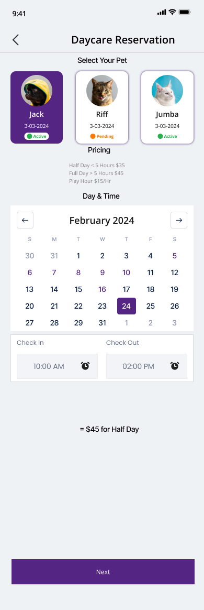
- **Description:** First step of daycare reservation. 'Select Your Pet' row with three pet cards (Jack - selected/purple, Active; Riff - Pending; Jumba - Active) each showing photo, name, date 3-03-2024 and status pill. 'Pricing' block lists Half Day, Full Day and Play Hour rates. 'Day & Time' calendar (February 2024, 24 selected) with Check In 10:00 AM and Check Out 02:00 PM time pickers, computed line '= $45 for Half Day', and Next button. DayCare.png is a taller single-page variant that appends the DayCare-2 flea/medical section.
- **Layout:** Header > Select Your Pet cards > Pricing text > Day & Time calendar > Check In / Check Out times > computed price > Next.
- **Fields:**
  - Pet card: photo, name (Jack/Riff/Jumba), date 3-03-2024, status (Active / Pending)
  - Pricing: Half Day < 5 Hours $35; Full Day > 5 Hours $45; Play Hour $15/Hr
  - Calendar month: February 2024, selected day 24
  - Check In time: 10:00 AM
  - Check Out time: 02:00 PM
  - Computed: = $45 for Half Day
- **Actions:**
  - Back
  - Select pet card
  - Previous/next month arrows
  - Select day
  - Set Check In time (alarm icon)
  - Set Check Out time (alarm icon)
  - Next
- **Components:** Pet card with status pill; Calendar month picker; Time picker input; Pricing info block; Primary button
- **States:** Jack selected, date 24 selected, times filled; light theme
- **Rules / notes:** Pricing rule: Half Day < 5 hours $35; Full Day > 5 hours $45; Play Hour $15/hr. Bug: 10:00 AM-2:00 PM is 4 hours (half day) but computed shows $45 (full-day price) labeled 'Half Day'. Threshold is 5 hours here vs 6 hours in Settings (front desk-7 / 13.pdf). Calendar shows Feb 2024 with 29-31 dates (invalid). Pet status Pending vs Active may gate booking.
- **Variants among the duplicates:**
  - `DayCare.png` - Daycare Reservation - combined single-page form: Tall single-screen version combining DayCare-1 and DayCare-2: pet selection cards, pricing text, February 2024 calendar with 24 selected, Check In 10:00 AM / Check Out 02:00 PM, '= $45 for Half Day', then Flea Medication section (Yes, Brand, Date 9-23-2024) and medical alerts field, ending with Next. Fields: Union of DayCare-1.png and DayCare-2.png fields State: Filled example; light theme; alternative one-page layout of the two-step flow Note: Same pricing rules and the same $45/Half Day mismatch as DayCare-1. 'Date' label misaligned above dropdown row (layout glitch).

#### 1.7.2 Daycare - Additional Pet Details

- **File:** [`DayCare-2.png`](exports/petrock-main/DayCare-2.png) (png, 390x1164px)

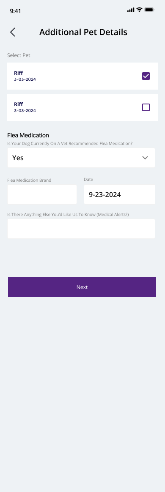
- **Description:** Second daycare step. 'Select Pet' checklist with two rows (both 'Riff 3-03-2024', first checked). 'Flea Medication' section with dropdown 'Is Your Dog Currently On A Vet Recommended Flea Medication?' = Yes, 'Flea Medication Brand' text input, 'Date' input 9-23-2024, and 'Is There Anything Else You'd Like Us To Know (Medical Alerts?)' text field. Next button.
- **Layout:** Header > Select Pet checklist > Flea Medication dropdown > Brand + Date row > medical alerts field > Next.
- **Fields:**
  - Select Pet: Riff 3-03-2024 (checkbox, checked)
  - Select Pet: Riff 3-03-2024 (checkbox, unchecked)
  - Is Your Dog Currently On A Vet Recommended Flea Medication? (dropdown: Yes)
  - Flea Medication Brand (text)
  - Date (9-23-2024)
  - Is There Anything Else You'd Like Us To Know (Medical Alerts?) (text)
- **Actions:**
  - Back
  - Toggle pet checkbox
  - Next
- **Components:** Checkbox list row; Dropdown; Text input; Date input; Primary button
- **States:** Flea medication = Yes reveals Brand and Date fields; light theme
- **Rules / notes:** Flea medication Brand/Date presumably conditional on Yes. Multi-pet selection via checkboxes (duplicate 'Riff' rows are placeholder data).

#### 1.7.3 Daycare - Checkout (empty)

- **File:** [`DayCare-3.png`](exports/petrock-main/DayCare-3.png) (png, 390x1164px)

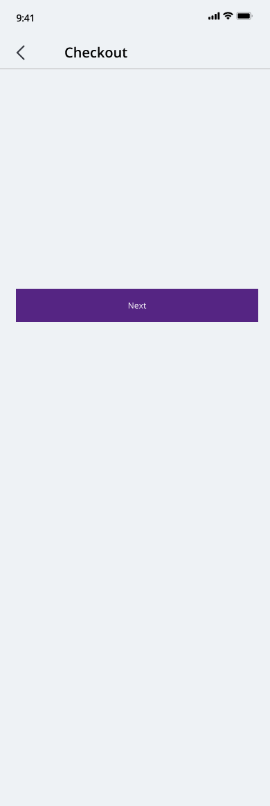
- **Description:** Unfinished checkout screen: header 'Checkout' with back arrow and only a Next button in the middle of an otherwise empty page. No summary or payment content yet.
- **Layout:** Status bar > header > empty body > Next.
- **Fields:**
  - (none)
- **Actions:**
  - Back
  - Next
- **Components:** Header with back arrow; Primary button
- **States:** Empty / placeholder (work in progress)
- **Rules / notes:** Daycare checkout content not designed.

### 1.8 Payment

#### 1.8.1 Choose Payment Method

- **File:** [`Payment-1.png`](exports/petrock-main/Payment-1.png) (png, 390x844px)
- **Also exported as:** [`Payment-2.png`](exports/petrock-main/Payment-2.png) (png, 390x844px); [`Payment-3.png`](exports/petrock-main/Payment-3.png) (png, 390x844px) - Choose Payment (variant title); [`Payment-4.png`](exports/petrock-main/Payment-4.png) (png, 390x844px); [`Payment.png`](exports/petrock-main/Payment.png) (png, 390x844px) - Choose Payment (variant title)

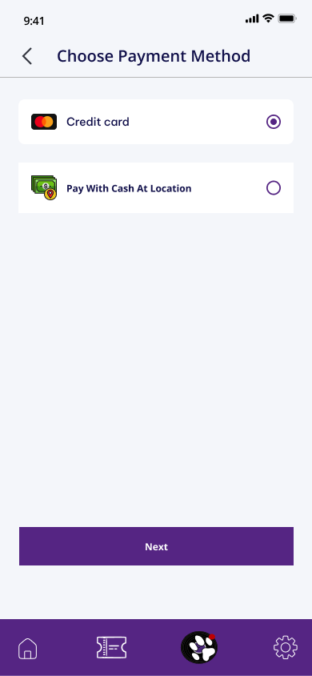
- **Description:** Single mobile screen with iOS status bar. Header 'Choose Payment Method' with back arrow. Two payment option cards: 'Credit card' (Mastercard icon, selected radio) and 'Pay With Cash At Location' (cash icon, unselected). Large empty space, then a full-width Next button and the bottom tab bar (paw tab with red dot). Payment.png and Payment-3.png title the header 'Choose Payment' and draw the selected radio in a lighter purple; Payment-2/-4 are identical to this file.
- **Layout:** Status bar > header > payment option cards > spacer > Next > bottom tab bar.
- **Fields:**
  - Payment method: Credit card (selected)
  - Payment method: Pay With Cash At Location
- **Actions:**
  - Back
  - Select Credit card
  - Select Pay With Cash At Location
  - Next
  - Tab bar
- **Components:** Header with back arrow; Radio option card with icon; Primary button; Bottom tab bar
- **States:** Credit card selected, light theme
- **Rules / notes:** Only two payment methods: credit card or cash at location. Title inconsistency: 'Choose Payment' vs 'Choose Payment Method'.
- **Variants among the duplicates:**
  - `Payment-3.png` - Choose Payment (variant title): Same screen; header reads 'Choose Payment' and the selected radio is a lighter purple. State: Lighter radio fill Note: Title inconsistency: 'Choose Payment' vs 'Choose Payment Method'.

### 1.9 Account & settings

#### 1.9.1 Edit Account (owner) - form with bottom tab bar

- **File:** [`image 175.png`](exports/petrock-main/image%20175.png) (png, 480x723px)
- **Also exported as:** [`image 177.png`](exports/petrock-main/image%20177.png) (png, 473x725px) - Edit Account (owner) - with Cancel/Confirm footer; [`Frame 1171276433.png`](exports/petrock-main/Frame%201171276433.png) (png, 1022x725px) - Edit Profile - two-up (build)

- **Description:** Cropped capture (no status bar) of the owner account edit form. It shows First Name, Last Name, Email and Password fields with placeholder labels describing the current user's values, plus purple text links 'Change Email' and 'Change Password' beneath the respective fields. A purple bottom tab bar with Home, Ticket, Paw (badge '1') and Settings icons is visible; the crop has an orange/blue outline suggesting a Figma frame selection. image 177.png is the same form with a Cancel/Confirm footer instead of the tab bar (and a Figma annotation 'Input Disabled Password').
- **Layout:** Form body (First Name, Last Name, Email + 'Change Email' link right-aligned, Password + 'Change Password' link right-aligned) > purple bottom tab bar with four icons (or Cancel/Confirm footer in image 177).
- **Fields:**
  - First Name (placeholder 'Current User's First Name')
  - Last Name (placeholder 'Current User's Last Name')
  - Email (placeholder 'Current User's email')
  - Password (masked '********', read-only/disabled)
- **Actions:**
  - Change Email (text link)
  - Change Password (text link)
  - Cancel / Confirm (image 177 variant)
  - Tab: Home
  - Tab: Bookings/Tickets
  - Tab: Paw/Pets (badge 1)
  - Tab: Settings
- **Components:** Labelled text input; Disabled input (component 'Input Disabled Password'); Inline text link; Bottom tab bar with notification badge; Sticky action footer with Cancel/Confirm
- **States:** Light mode, placeholder/prefilled-from-account state; password field disabled; cropped screenshot without header. image 177: edit-in-progress state with Confirm/Cancel footer.
- **Rules / notes:** Email and password are not edited inline; they go through separate 'Change Email' / 'Change Password' flows. Password is displayed masked and disabled. Paw tab carries a red badge with count 1. Confirm/Cancel footer replaces the tab bar while editing.
- **Variants among the duplicates:**
  - `image 177.png` - Edit Account (owner) - with Cancel/Confirm footer: Variant of the owner account edit form where the bottom tab bar is replaced by a purple footer with 'Cancel' (text) and 'Confirm' (white button). The password input is shown focused with a Figma annotation tag 'Input Disabled Password'. State: Edit-in-progress state Note: Annotation 'Input Disabled Password' is a Figma layer/component label, not user-facing copy.
  - `Frame 1171276433.png` - Edit Profile - two-up (build): Two variants of the edit profile form. Fields First Name, Last Name, Email with 'Change Email' link, and disabled Password field (********) with 'Change Password' link. Left variant ends in the standard bottom tab bar; right variant replaces it with a Cancel / Confirm action bar and has a Figma annotation 'Input Disabled Password' on the password field. Both light; not dark mode. Fields: First Name (Current User's First Name); Last Name (Current User's Last Name); Email (Current User's email); Password (disabled, ********) State: Prefilled, password disabled; light theme Note: Email and password are changed through separate flows, not inline. Same screens as image 175.png / image 177.png (crops).

#### 1.9.2 Language preference

- **File:** [`language.jpg`](exports/petrock-main/language.jpg) (jpg, 390x926px)
- **Also exported as:** [`language-1.jpg`](exports/petrock-main/language-1.jpg) (jpg, 390x926px) - Language preference (inset cards variant)

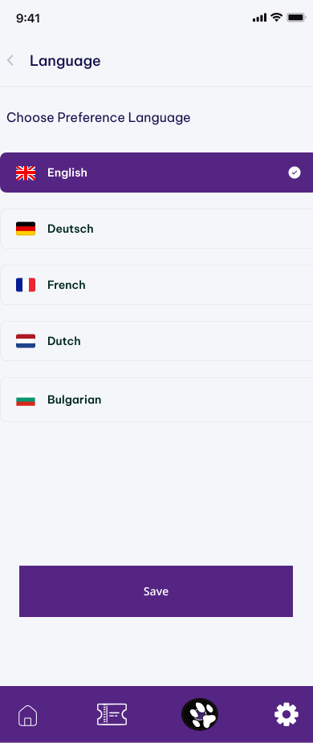
- **Description:** Screen for choosing the app's preferred language. A list of five language options with country flags is shown; English is selected (filled purple row with a checkmark). A full-width 'Save' button sits above the bottom tab bar. In this export the option rows bleed to the screen edges (no side margin); language-1.jpg insets the cards from the left but they still run off the right edge.
- **Layout:** Status bar > header with back chevron and left-aligned title 'Language' > section label 'Choose Preference Language' > vertical list of flag+label option cards > full-width 'Save' button > purple bottom tab bar (Home, Ticket, Paw, Settings).
- **Fields:**
  - Preferred language: English (UK flag, selected), Deutsch (German flag), French (French flag), Dutch (Netherlands flag), Bulgarian (Bulgarian flag)
- **Actions:**
  - Back
  - Select language option (single-select)
  - Save
  - Tab: Home
  - Tab: Bookings/Tickets
  - Tab: Paw/Pets
  - Tab: Settings
- **Components:** Header with back chevron; Selectable option card with flag icon and check indicator; Full-width primary button; Bottom tab bar
- **States:** Light mode; English selected; option cards edge-to-edge (language.jpg) or inset-left but clipped right (language-1.jpg)
- **Rules / notes:** Supported languages: English, German (labelled natively 'Deutsch' while others are English exonyms), French, Dutch, Bulgarian. Selection requires explicit Save. Inconsistent label language (Deutsch vs French/Dutch). Both exports appear to have card width overflow on the right.
- **Variants among the duplicates:**
  - `language-1.jpg` - Language preference (inset cards variant): Same Language screen with the option cards inset from the left margin (cards still run off the right edge). State: Layout-spacing variant Note: Trivial layout-spacing variant of language.jpg.

#### 1.9.3 Settings / Account menu

- **File:** [`profile.jpg`](exports/petrock-main/profile.jpg) (jpg, 390x1119px)
- **Also exported as:** [`profile-1.jpg`](exports/petrock-main/profile-1.jpg) (jpg, 390x1119px) - Settings / Account menu - duplicate export

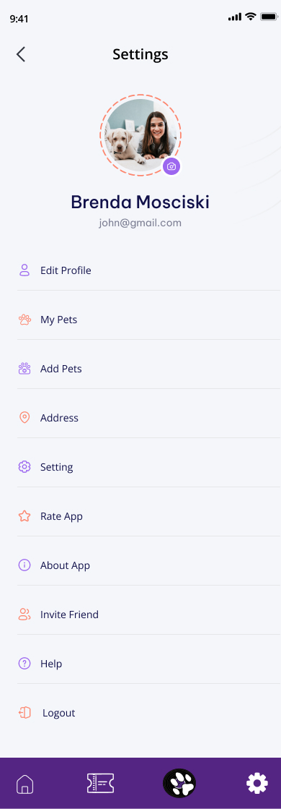
- **Description:** Profile hub titled 'Settings' showing the owner's avatar (woman with dog, dashed orange ring, purple camera badge), name 'Brenda Mosciski' and e-mail 'john@gmail.com', followed by a menu list of ten items with colored line icons: Edit Profile, My Pets, Add Pets, Address, Setting, Rate App, About App, Invite Friend, Help, Logout. A purple bottom tab bar is shown with the Settings gear highlighted.
- **Layout:** Status bar > header with back chevron and centered title 'Settings' > centered avatar with camera badge > name and email > vertical menu list with icons and dividers > purple bottom tab bar (Home, Ticket, Paw, Settings active).
- **Fields:**
  - Owner name: Brenda Mosciski
  - Owner email: john@gmail.com
  - Profile photo
- **Actions:**
  - Back
  - Change photo (camera badge)
  - Edit Profile
  - My Pets
  - Add Pets
  - Address
  - Setting
  - Rate App
  - About App
  - Invite Friend
  - Help
  - Logout
  - Tab: Home
  - Tab: Bookings/Tickets
  - Tab: Paw/Pets
  - Tab: Settings
- **Components:** Header with back chevron; Avatar with dashed ring and camera badge; Menu list item with icon and label; Bottom tab bar
- **States:** Light mode; logged-in state with populated profile; Settings tab active
- **Rules / notes:** Name and e-mail mismatch (Brenda Mosciski / john@gmail.com) - placeholder data. Two screens are titled 'Settings' (this hub and the sub-page setting.jpg), and the hub contains an item also called 'Setting'. Menu implies separate flows for My Pets, Add Pets, Address book, Rate App, About, Invite Friend (referral), Help, Logout. Compare the slimmer built variant in Frame 1171276432 (Edit profile, My pets, Address, Delete account, Logout).

#### 1.9.4 App settings (sub-page)

- **File:** [`setting.jpg`](exports/petrock-main/setting.jpg) (jpg, 390x926px)
- **Also exported as:** [`setting-1.jpg`](exports/petrock-main/setting-1.jpg) (jpg, 390x926px) - App settings (sub-page) - duplicate export

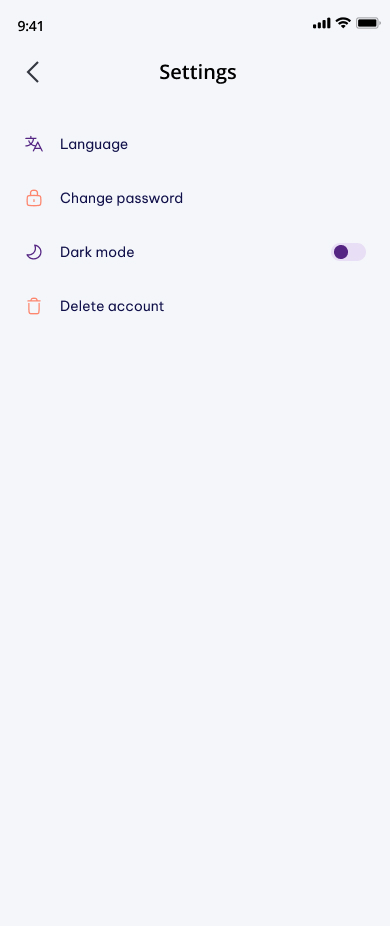
- **Description:** Secondary settings page titled 'Settings' with four rows: Language (translate icon), Change password (lock icon), Dark mode (moon icon with a toggle switch on the right, shown off), and Delete account (trash icon). Most of the screen is empty and there is no bottom tab bar.
- **Layout:** Status bar > header with back chevron and centered title 'Settings' > four settings rows (icon + label, Dark mode with trailing toggle) > empty space; no bottom tab bar.
- **Fields:**
  - Language (navigates)
  - Change password (navigates)
  - Dark mode toggle (off)
  - Delete account (destructive action)
- **Actions:**
  - Back
  - Language
  - Change password
  - Toggle Dark mode
  - Delete account
- **Components:** Header with back chevron; Settings row with icon; Toggle switch
- **States:** Light mode; Dark mode toggle off; no tab bar (unlike other screens in this group)
- **Rules / notes:** Dark mode is an in-app toggle, confirming a dark theme must exist for all screens (D-007). Delete account is exposed directly in settings (needs a confirmation flow). Change password reachable here as well as via 'Change Password' link on the Edit Account form.

#### 1.9.5 Personal Details form - two-up (build)

- **File:** [`Frame 1171276431.png`](exports/petrock-main/Frame%201171276431.png) (png, 673x769px)

- **Description:** Two identical variants of the Personal Details screen with back arrow header. Two-column rows for First/Last Name, Phone/Alt Phone, then Email, Address, Apt/Suite, City, State (dropdown)/Zip, and a Submit button above the purple bottom tab bar (home, ticket, paw with badge '1', settings). Both light theme; not dark mode.
- **Layout:** Header (back, title) > form grid > Submit > bottom tab bar.
- **Fields:**
  - First Name (Current User's First Name)
  - Last Name (Current User's Last Name)
  - Phone
  - Alt Phone
  - Email (Current User's email)
  - Address
  - Apt / Suite
  - City
  - State (dropdown)
  - Zip
- **Actions:**
  - Back
  - Submit
  - Tab bar: Home, Bookings/ticket, Pets (paw, badge 1), Settings
- **Components:** Header with back arrow; Two-column form row; Text input; Dropdown; Primary button; Bottom tab bar with badge
- **States:** Prefilled name/email, other fields empty; light theme
- **Rules / notes:** Paw tab shows red badge '1' (notification). Address collected as US-style (State, Zip). Same field set as Customer Details in the booking flow.

#### 1.9.6 Settings (settings_mobile) - two-up (build)

- **File:** [`Frame 1171276432.png`](exports/petrock-main/Frame%201171276432.png) (png, 905x781px)

- **Description:** Two variants of the settings screen titled "settings_mobile's view" (Figma placeholder title). Shows current user picture placeholder (circular crop on right variant), Name, and a secondary line (left: 'Name', right: 'Email'), then a menu list: Edit profile, My pets, Address, Delete account, Logout, each with an orange icon. Bottom tab bar with paw badge '1'. Both light; not dark mode.
- **Layout:** Header (back, title) > avatar > Name + subtitle > menu list > bottom tab bar.
- **Fields:**
  - Profile picture (Current User's Picture)
  - Name
  - Email (right variant) / Name (left variant)
- **Actions:**
  - Back
  - Edit profile
  - My pets
  - Address
  - Delete account
  - Logout
  - Tab bar: Home, Bookings, Pets (badge 1), Settings
- **Components:** Avatar; Menu list item with icon; Bottom tab bar with badge; Header with back arrow
- **States:** Light theme; right variant has circular avatar and email subtitle
- **Rules / notes:** Delete account exposed directly in settings menu (destructive action, no confirmation shown). Title 'settings_mobile's view' is a Figma naming artifact. Slimmer menu than profile.jpg (no Add Pets, Setting, Rate App, About, Invite Friend, Help).

### 1.10 Notifications & chat

#### 1.10.1 Notification list

- **File:** [`notification.png`](exports/petrock-main/notification.png) (png, 390x979px)
- **Also exported as:** [`notification-2.png`](exports/petrock-main/notification-2.png) (png, 390x979px) - Notification list - duplicate export

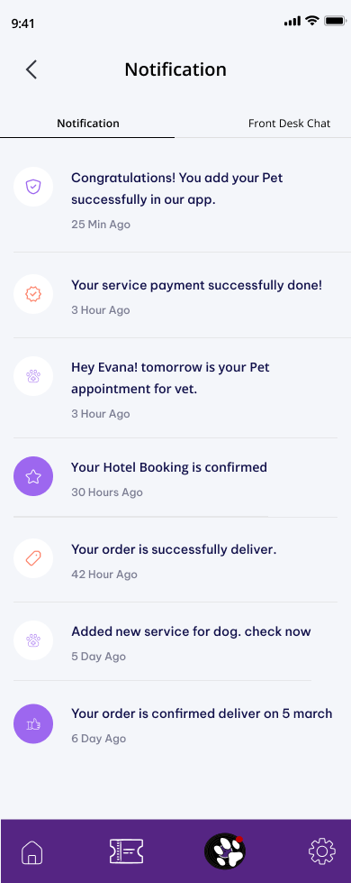
- **Description:** Notification center with two tabs: 'Notification' (active) and 'Front Desk Chat'. A vertical list of seven notification rows, each with a circular icon (some filled purple, most outlined), a message line and a relative timestamp. Notifications cover pet added, payment done, vet appointment reminder, hotel booking confirmed, order delivered, new service added, and order delivery confirmation.
- **Layout:** Status bar > header with back chevron and centered title 'Notification' > two-segment tab bar (Notification | Front Desk Chat) > scrollable notification list with icon, text, timestamp, divider > purple bottom tab bar (Home, Ticket, Paw with red dot, Settings).
- **Fields:**
  - 'Congratulations! You add your Pet successfully in our app.' - 25 Min Ago (shield-check icon)
  - 'Your service payment successfully done!' - 3 Hour Ago (badge-check icon, orange)
  - 'Hey Evana! tomorrow is your Pet appointment for vet.' - 3 Hour Ago (paw icon)
  - 'Your Hotel Booking is confirmed' - 30 Hours Ago (star icon, filled purple circle)
  - 'Your order is successfully deliver.' - 42 Hour Ago (tag icon, orange)
  - 'Added new service for dog. check now' - 5 Day Ago (paw icon)
  - 'Your order is confirmed deliver on 5 march' - 6 Day Ago (thumbs-up icon, filled purple circle)
- **Actions:**
  - Back
  - Tab: Notification
  - Tab: Front Desk Chat
  - Tap notification row (implied)
  - Bottom tab: Home
  - Bottom tab: Bookings/Tickets
  - Bottom tab: Paw/Pets (red dot)
  - Bottom tab: Settings
- **Components:** Header with back chevron; Segmented top tabs with underline indicator; Notification list item (icon circle + text + relative time); Bottom tab bar with unread dot
- **States:** Light mode; populated list; Notification tab active; filled purple icon circles possibly indicate unread/highlighted items
- **Rules / notes:** Relative timestamps use inconsistent grammar ('3 Hour Ago', '30 Hours Ago', '5 Day Ago'). Notification types implied: pet added, payment success, vet appointment reminder (day-before), hotel booking confirmed, order delivered, new service announcement, order delivery date confirmation. References 'orders' and a 'vet' appointment, implying a shop/e-commerce and vet-service domain (UI-kit leftovers). Copy contains grammar errors.

#### 1.10.2 Inbox (chat threads list)

- **File:** [`notification-1.png`](exports/petrock-main/notification-1.png) (png, 390x979px)

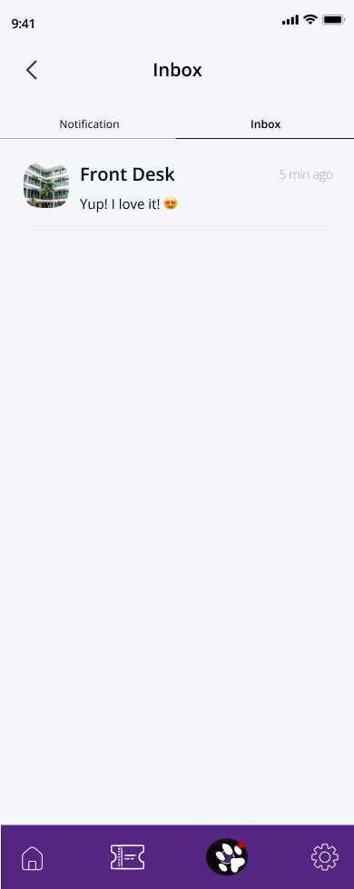
- **Description:** The second tab of the notification center, here titled 'Inbox' with tabs 'Notification' and 'Inbox' (active). It lists chat conversations; a single thread with 'Front Desk' is shown with the hotel building avatar, last message preview 'Yup! I love it! (heart-eyes emoji)' and '5 min ago'. The rest of the list is empty.
- **Layout:** Status bar > header with back chevron and centered title 'Inbox' > two-segment tabs (Notification | Inbox) > conversation list row (avatar, name, preview, relative time) > empty space > purple bottom tab bar (Home, Ticket, Paw with red dot, Settings).
- **Fields:**
  - Conversation: Front Desk (building avatar), preview 'Yup! I love it!', time '5 min ago'
- **Actions:**
  - Back
  - Tab: Notification
  - Tab: Inbox
  - Tap conversation row to open chat
  - Bottom tabs: Home, Bookings/Tickets, Paw/Pets, Settings
- **Components:** Header with back chevron; Segmented top tabs; Conversation list item (avatar, title, last message, timestamp); Bottom tab bar
- **States:** Light mode; one conversation; Inbox tab active
- **Rules / notes:** Tab naming inconsistency: this screen calls the second tab 'Inbox' and titles the page 'Inbox', while notification.png calls it 'Front Desk Chat' and titles the page 'Notification'. The preview shows the customer's own last message, so preview is last message regardless of sender. Only one chat partner (Front Desk) appears, suggesting a single support thread per customer.

#### 1.10.3 Front Desk chat - conversation

- **File:** [`Message Support.png`](exports/petrock-main/Message%20Support.png) (png, 780x1836px)
- **Also exported as:** [`Message Support-1.png`](exports/petrock-main/Message%20Support-1.png) (png, 780x1968px) - Front Desk chat - conversation (with tab bar); [`Message Support-2.png`](exports/petrock-main/Message%20Support-2.png) (png, 780x1968px) - Front Desk chat - with inline notification item

- **Description:** Chat thread with the hotel's Front Desk. A 'Session Start' pill marks the beginning; Front Desk messages appear right-aligned in dark navy bubbles with the hotel building avatar, and the customer's (Marian's) messages appear left-aligned in light grey bubbles with her avatar. The thread includes a text update about the dog John eating lunch, a photo of a dog in sunglasses sent by Front Desk, timestamps '14:06', and the customer's reply 'Yup! I love it!'. A reply composer with attach (+) and send icons is at the bottom. Variants: Message Support-1.png adds the purple bottom tab bar beneath the composer; Message Support-2.png replaces the final reply with a notification-style row ('Congratulations! You add your Pet successfully in our app.' 25 Min Ago) rendered inside the chat timeline.
- **Layout:** Status bar > header with back chevron and centered title 'Front Desk' > divider > 'Session Start' pill > message bubbles (Front Desk right/dark, customer left/light) with image attachment and centered timestamps > composer row (plus icon, 'Write a reply...' input, send icon) > home indicator (> bottom tab bar in -1/-2).
- **Fields:**
  - Message (Front Desk): 'Hi Marian. We're having a great day! John eat all of his lunch!'
  - Message (customer): 'Hi, That's great! (heart-eyes) Thanks so much for lettering me. can you share a picture of him.' - 14:06
  - Image attachment (dog in sunglasses) from Front Desk
  - Message (Front Desk): 'Here it is . he is enjoying.' - 14:06
  - Message (customer): 'Yup! I love it! (heart-eyes)'
  - Inline notification (-2 only): 'Congratulations! You add your Pet successfully in our app.' - 25 Min Ago
  - Composer placeholder 'Write a reply...'
- **Actions:**
  - Back
  - Attach (+ icon)
  - Type reply
  - Send (paper-plane icon)
  - Tab bar (Message Support-1/-2): Home, Bookings, Paw (red dot), Settings
- **Components:** Chat header; Session Start divider pill; Message bubble (incoming dark / outgoing light) with avatar; Image message bubble; Centered timestamp; Message composer with attach and send; Notification list item (reused inside chat, -2); Bottom tab bar with unread dot (-1/-2)
- **States:** Light mode; active conversation with text and image messages; full-screen (no tab bar), tabbed-shell (-1), and with a system notification injected in the timeline (-2)
- **Rules / notes:** Unusual alignment: the other party (Front Desk) is right-aligned/dark and the current user is left-aligned/light, the inverse of the common convention - confirm intent. Supports image attachments from staff. 'Session Start' implies chat sessions (possibly tied to a stay/booking). Copy has typos ('lettering me', 'John eat'). Customer name here is Marian, whereas profile shows Brenda Mosciski. Designer should decide whether chat is full-screen or lives within the tabbed shell, and whether system notifications surface in the chat stream. Exported at 2x (780 wide).
- **Variants among the duplicates:**
  - `Message Support-1.png` - Front Desk chat - conversation (with tab bar): Same thread with the purple bottom tab bar beneath the composer. State: Variant with tab bar visible
  - `Message Support-2.png` - Front Desk chat - with inline notification item: Same thread; the final customer reply is replaced by a notification-style row rendered inside the chat timeline. Fields: Inline notification: 'Congratulations! You add your Pet successfully in our app.' - 25 Min Ago State: System notification injected in the timeline Note: Suggests system notifications may be surfaced inside the Front Desk chat stream - needs confirmation.

## 2. Front desk web

### 2.1 Hotel reservations table

#### 2.1.1 Hotel Reservations table (v1, component only)

- **File:** [`Frame 1171276264.png`](exports/petrock-main/Frame%201171276264.png) (png, 1175x1458px)
- **Also exported as:** [`Frame 1171276264-1.png`](exports/petrock-main/Frame%201171276264-1.png) (png, 1175x1458px) - Hotel Reservations table (v1, bold title)

- **Description:** Standalone table component (no app shell) listing hotel reservations grouped into collapsible sections ARRIVING (34), DEPARTING (18) and Checking out (18). Every row uses a mint 'Completed' status chip and identical placeholder data. Columns are cut off after 'Total' with a horizontal scrollbar at the bottom. Header has 'Filters' and 'See All' buttons; the page title is regular weight (bold in Frame 1171276264-1.png).
- **Layout:** Top: title 'Hotel Reservations' left, 'Filters' and 'See All' buttons right. Purple table header row with select-all checkbox. Body: three collapsible group headers (label + count + caret) each followed by rows. Bottom: horizontal scrollbar.
- **Fields:**
  - Select-all checkbox
  - ID: #1
  - Status: Completed
  - Customer: Mr. Maegan
  - Hotel Room: 105 - Rock
  - Date In: Mar 21, 2024
  - Time In: 09:00
  - Date Out: Mar 21, 2024
  - Time Out: 09:00
  - Nbr Days: 02
  - Pet(S): Blue
  - Breed: Bulldog
  - Pet Count: 02
  - Mobile: 213-713-8073
  - Home: 213-713-8073
  - Total: $150 (column truncated at right edge)
  - Group headers: ARRIVING (34), DEPARTING (18), Checking out (18)
- **Actions:**
  - Filters button (sliders icon)
  - See All button
  - Select-all checkbox
  - Per-row checkbox
  - Collapse/expand caret per group
  - Horizontal scroll
- **Components:** data table with sticky purple header; status chip; collapsible group header with count; checkbox; icon button; horizontal scrollbar
- **States:** Default, all rows 'Completed', columns truncated (needs horizontal scroll). Regular-weight title variant (bold in -1).
- **Rules / notes:** Group counts (34/18/18) do not match rendered row counts (3/12/7) - placeholder data. Nbr Days = 02 while Date In equals Date Out. 'Checking out' header uses a different typeface/case than the uppercase ARRIVING/DEPARTING headers. Phone numbers wrap as '213-713-8 / 073'. Superseded by the v2 table (Frame 1171276264-10.png).
- **Variants among the duplicates:**
  - `Frame 1171276264-1.png` - Hotel Reservations table (v1, bold title): Same v1 table; only visible difference is the bold page title. State: Bold title variant

#### 2.1.2 Hotel Reservations table (v2, Today, full columns)

- **File:** [`Frame 1171276264-10.png`](exports/petrock-main/Frame%201171276264-10.png) (png, 1539x1459px)
- **Also exported as:** [`Frame 1171276264-4.png`](exports/petrock-main/Frame%201171276264-4.png) (png, 1539x1459px) - Hotel Reservations table (v2, Today) - duplicate; [`Frame 1171276264-2.png`](exports/petrock-main/Frame%201171276264-2.png) (png, 1539x1459px) - Hotel Reservations table (v2) with date picker open; [`Frame 1171276264-8.png`](exports/petrock-main/Frame%201171276264-8.png) (png, 1539x1459px) - Hotel Reservations table (v2) with date picker open - duplicate; [`Frame 1171276264-3.png`](exports/petrock-main/Frame%201171276264-3.png) (png, 1539x1459px) - Hotel Reservations table (v2, specific date selected); [`Frame 1171276264-9.png`](exports/petrock-main/Frame%201171276264-9.png) (png, 1539x1459px) - Hotel Reservations table (v2, Feb 22, 2024) - duplicate

- **Description:** Revised standalone table: header toolbar adds a date navigator (calendar icon, back arrow, 'Today', forward arrow) and replaces 'See All' with 'Timesheet View'. All columns fit: Total Charge, Deposits, Balance and Booking Notes are now visible. Status chips vary by group: Future (green) under ARRIVING, Checking In (blue) and Checked Out (yellow) under DEPARTING, Checking In under Checking out. States: Today (this file, -4), date picker open (-2, -8), specific date 'Feb 22, 2024' selected (-3, -9). In-shell versions: front desk-10/11/15/16/17/9.jpg.
- **Layout:** Title left; toolbar right with date navigator, Filters, Timesheet View. Purple header row. Groups ARRIVING (34) / DEPARTING (18) / Checking out (18). Horizontal scrollbar at bottom.
- **Fields:**
  - ID: #1
  - Status: Future | Checking In | Checked Out
  - Customer: Mr. Maegan
  - Hotel Room: 105 - Rock
  - Date In: Mar 21, 2024
  - Time In: 09:00
  - Date Out: Mar 21, 2024
  - Time Out: 09:00
  - Nbr Days: 02
  - Pet(S): Blue
  - Breed: Bulldog
  - Pet Count: 02
  - Mobile: 213-713-8073
  - Home: 213-713-8073
  - Total Charge: $150
  - Deposits: $0
  - Balance: $150
  - Booking Notes: 'Lafnfnj Nhagnfmk...' (truncated placeholder)
  - Date navigator value: Today | Feb 22, 2024
- **Actions:**
  - Previous day arrow
  - Today (date navigator label, opens picker)
  - Next day arrow
  - Filters
  - Timesheet View
  - Select-all checkbox
  - Row checkbox
  - Group collapse caret
- **Components:** date navigator (prev/label/next); data table; status chip (4 variants); collapsible group header; checkbox; icon button; horizontal scrollbar; date picker popover (in -2/-8)
- **States:** Default, date = Today, mixed statuses, no picker open (variants: picker open; specific date selected).
- **Rules / notes:** Balance = Total Charge - Deposits ($150 - $0 = $150). Status chip colors: Future green, Checking In blue, Checked Out yellow/amber, Completed mint. DEPARTING group mixes 'Checking In' and 'Checked Out' rows; 'Checking out' group shows only 'Checking In' chips - grouping logic unclear. Booking Notes column truncates with ellipsis. Date label format 'MMM D, YYYY'.
- **Variants among the duplicates:**
  - `Frame 1171276264-2.png` - Hotel Reservations table (v2) with date picker open: v2 table with the date navigator's calendar popover open beneath the 'Today' control. The popover shows 'February 2022' with month prev/next arrows, weekday initials S M T W T F S, and a day grid with the 16th highlighted in blue. The popover overlaps the table header and first rows. Fields: Month label: February 2022; Weekday headers: S M T W T F S; Day grid: 30 31 1 2 3 4 5 / 6-12 / 13-19 (16 highlighted) / 20-26 / 27 28 29 31 1 2 3 State: Date picker open; selected day 16; navigator still reads 'Today'. Note: Calendar grid is inconsistent: February 2022 has 28 days but grid shows 29 and 31 (30 missing). Selected day (16) does not match the navigator label 'Today' or the row dates (Mar 21, 2024). Adjacent-month days rendered in grey.
  - `Frame 1171276264-8.png` - Hotel Reservations table (v2) with date picker open - duplicate: Pixel-identical export of Frame 1171276264-2.png. State: Date picker open
  - `Frame 1171276264-3.png` - Hotel Reservations table (v2, specific date selected): v2 table after a date has been picked: the date navigator label reads 'Feb 22, 2024' instead of 'Today'. Fields: Date navigator value: Feb 22, 2024 State: Specific date selected (Feb 22, 2024). Note: Row data still shows Mar 21, 2024 despite the selected date - placeholder.

#### 2.1.3 Hotel Reservations page (v1 table in app shell, sidebar v1)

- **File:** [`front desk.jpg`](exports/petrock-main/front%20desk.jpg) (jpg, 1440x1621px)
- **Also exported as:** [`front desk-1.jpg`](exports/petrock-main/front%20desk-1.jpg) (jpg, 1440x1621px) - Hotel Reservations page (v1 table in app shell, sidebar v2)

- **Description:** Full front-desk page: Petrock Hotel and Spa logo, global search, 'New Booking' button, icon row (chat/calendar, help, notifications) and user menu 'Wade Warren / Admin' in the top bar. Left sidebar v1 (MAIN: Dashboard (active), All Reservations, Grooming, Day Care, Customer & Pets, Walking; Other: Employees, Tasks, Reviews, Education, Finance, Reports, Settings; purple 'Logout' button). Content area has a '+ Hotel Reservation' button above the v1 table (Filters, See All, all Completed, columns truncated). front desk-1.jpg is the same page with sidebar v2 ('All Booking' expanded with Groom / Broad / Day Care sub-items, 'Log Out' text link, 'Tasks' also highlighted).
- **Layout:** Top bar: logo, search, New Booking, icons, user menu. Left: sidebar nav. Main: light lavender band with '+ Hotel Reservation' button right-aligned; white card with the v1 reservations table.
- **Fields:**
  - Search placeholder: Search
  - User: Wade Warren, role Admin
  - Sidebar v1 MAIN: Dashboard, All Reservations, Grooming, Day Care, Customer & Pets, Walking
  - Sidebar v2 MAIN: Dashboard, All Booking (Groom, Broad, Day Care), Grooming, Day Care, Customer & Pets, Walking
  - Sidebar Other: Employees, Tasks, Reviews, Education, Finance, Reports, Settings
  - Logout (v1 purple button) / Log Out (v2 text link)
  - Table fields as in Frame 1171276264.png
- **Actions:**
  - Search
  - New Booking
  - Chat/calendar icon
  - Help icon
  - Notifications bell
  - User menu dropdown
  - Sidebar nav items
  - All Booking expand (v2)
  - Logout
  - + Hotel Reservation
  - Filters
  - See All
  - Checkboxes
  - Group carets
- **Components:** top app bar; search input; primary button; icon button; avatar with name/role dropdown; sidebar navigation (v1 flat / v2 with expandable group); data table; status chip; collapsible group header
- **States:** Default; Dashboard highlighted in sidebar v1 (v2: All Booking expanded and both 'All Booking' and 'Tasks' highlighted); v1 table (all Completed, truncated columns).
- **Rules / notes:** Sidebar highlights 'Dashboard' while showing the reservations page - inconsistency. Two entry points create bookings: 'New Booking' (global) and '+ Hotel Reservation' (page). 'Broad' sub-item is a typo for 'Board(ing)'. Sub-nav lacks a 'Hotel' item although the page shown is Hotel Reservations.
- **Variants among the duplicates:**
  - `front desk-1.jpg` - Hotel Reservations page (v1 table in app shell, sidebar v2): Same page with revised sidebar: 'All Booking' (active) with sub-items Groom, Broad, Day Care; 'Tasks' also highlighted; 'Log Out' text link; bold table title. State: All Booking expanded; two nav items highlighted Note: 'Broad' typo; two nav items highlighted simultaneously.

#### 2.1.4 Hotel Reservations page (v2 table, Feb 22, 2024)

- **File:** [`front desk-10.jpg`](exports/petrock-main/front%20desk-10.jpg) (jpg, 1804x1622px)
- **Also exported as:** [`front desk-16.jpg`](exports/petrock-main/front%20desk-16.jpg) (jpg, 1804x1622px) - Hotel Reservations page (v2 table, Feb 22, 2024) - duplicate; [`front desk-11.jpg`](exports/petrock-main/front%20desk-11.jpg) (jpg, 1804x1622px) - Hotel Reservations page (v2 table, Today); [`front desk-17.jpg`](exports/petrock-main/front%20desk-17.jpg) (jpg, 1804x1622px) - Hotel Reservations page (v2 table, Today) - duplicate; [`front desk-15.jpg`](exports/petrock-main/front%20desk-15.jpg) (jpg, 1804x1622px) - Hotel Reservations page (v2) with date picker open; [`front desk-9.jpg`](exports/petrock-main/front%20desk-9.jpg) (jpg, 1804x1622px) - Hotel Reservations page (v2) with date picker open - duplicate

- **Description:** Full page with sidebar v2 and the v2 reservations table: date navigator set to 'Feb 22, 2024', Filters and Timesheet View buttons, all columns visible (through Booking Notes), mixed Future / Checking In / Checked Out statuses. Variants: Today (front desk-11, -17), date picker open (front desk-15, -9), duplicate of this file (front desk-16). 1804px wide frame (date-picker overflow).
- **Layout:** Top bar; sidebar v2; '+ Hotel Reservation' band; table card with toolbar (date navigator, Filters, Timesheet View) and grouped rows.
- **Fields:**
  - Date navigator: Feb 22, 2024 | Today
  - Table fields as in Frame 1171276264-10.png
- **Actions:**
  - Prev/Next day
  - Date label
  - Filters
  - Timesheet View
  - + Hotel Reservation
  - New Booking
  - Sidebar nav
  - Log Out
  - Checkboxes
  - Group carets
- **Components:** top app bar; sidebar navigation; date navigator; data table; status chip; collapsible group header; date picker popover (in -15/-9)
- **States:** Specific date selected; mixed statuses (variants: Today; date picker open with Feb 2022 / day 16).
- **Rules / notes:** Same as Frame 1171276264-3/-10/-2 inside the shell; same February calendar inconsistency (29 and 31).
- **Variants among the duplicates:**
  - `front desk-11.jpg` - Hotel Reservations page (v2 table, Today): Full page with sidebar v2 and the v2 table; date navigator reads 'Today'. Fields: Date navigator: Today State: Default (Today).
  - `front desk-15.jpg` - Hotel Reservations page (v2) with date picker open: Full page with sidebar v2; the date navigator's calendar popover is open showing February 2022 with the 16th highlighted. Fields: Month: February 2022, day 16 selected State: Date picker open, day 16 selected. Note: Same calendar inconsistency (Feb shows 29 and 31).

### 2.2 Booking detail & invoice line items

#### 2.2.1 Booking detail (single service)

- **File:** [`front desk-5.jpg`](exports/petrock-main/front%20desk-5.jpg) (jpg, 1440x1282px)
- **Also exported as:** [`front desk-8.jpg`](exports/petrock-main/front%20desk-8.jpg) (jpg, 1440x1400px) - Booking detail (grooming + boarding)

- **Description:** Read-only booking detail page with an EDIT button. Shows customer card (avatar, name, email) with pet name/breed and booking status, an appointment info card (Date, Time, Groomer, Payment Status, Contact Number, Reason), an 'Additional information' note panel, and a 'Your appointment' invoice panel with one service line, five tax lines and a Total. front desk-8.jpg is the same page with two service lines ('GROOMING (GOLD)' and 'Boarding', each $250.89).
- **Layout:** Top bar; sidebar v1 (Dashboard active, All Reservations, ..., purple Logout). Main: header card 'Booking detail' + EDIT; customer card; two-row info card; bottom split: left 'Additional information', right 'Your appointment' with line item(s), tax rows, Total.
- **Fields:**
  - Customer name: Michael Davis
  - Email: michaeldavis@gmail.com
  - Pet name: Tutu (with pet avatar)
  - Pet breed: Bulldog
  - Booking status: Confirm (green)
  - Date: 06-29-2024
  - Time: At 10:00 AM
  - Groomer: Dr. Benjamin Parker
  - Payment Status: Pending (orange)
  - Contact Number: +144 1234 5678
  - Reason: Grooming
  - Additional information: 'Plz take care my Pet while you are cut it's nail.'
  - Service line: GROOMING (for regular checkup and Canine Distemper vaccination) $250.89
  - (front desk-8) Line 1: GROOMING (GOLD) $250.89; Line 2: Boarding $250.89
  - Sales tax: $04.60
  - Use tax: $10.00
  - Local tax: $03.45
  - Other taxes: $02.30
  - Service tax or gross receipts tax: $10.00
  - Total: $250.89
- **Actions:**
  - EDIT
  - New Booking
  - Search
  - Icon row
  - User menu
  - Sidebar nav
  - Logout
- **Components:** page header card with primary button; customer card with avatar; key-value info grid; note panel; invoice/line-item card with service icon; tax breakdown list; total row; sidebar navigation; top app bar
- **States:** Confirmed booking, payment Pending, single line item (front desk-8: two line items, grooming tier GOLD + boarding).
- **Rules / notes:** Total ($250.89) equals the service price - taxes listed ($30.35 combined) are not added, so either taxes are inclusive or the mock is inconsistent; with two $250.89 lines the total is still $250.89 (placeholder math). Currency shows leading zeros ('$04.60'). Screen is labelled a grooming appointment (Groomer, Reason: Grooming) even though it sits in the hotel reservations group. Date format MM-DD-YYYY differs from the table's 'Mar 21, 2024'. Introduces grooming tier label '(GOLD)' and a 'Boarding' service line type. This is the 'Invoice / booking detail' screen listed in D-010.
- **Variants among the duplicates:**
  - `front desk-8.jpg` - Booking detail (grooming + boarding): Same booking detail layout with two service lines: 'GROOMING (GOLD)' $250.89 and 'Boarding' $250.89, followed by the same five tax lines and a Total of $250.89. Fields: Line 1: GROOMING (GOLD) $250.89; Line 2: Boarding $250.89 State: Two line items Note: Total does not equal sum of lines plus taxes - placeholder math. Reason still says 'Grooming' despite boarding being included.

#### 2.2.2 Grooming service line item

- **File:** [`Products.png`](exports/petrock-main/Products.png) (png, 852x114px)

- **Description:** A single horizontal list-item component representing a purchased or bookable service. It shows a purple paw-with-medical-cross icon in a rounded tile, the service name 'GROOMING' with a grey descriptor in parentheses, and a right-aligned price. Used in the booking detail invoice panel (front desk-5.jpg).
- **Layout:** Rounded light-lavender row: left icon tile (paw with cross), middle text (uppercase service name + grey parenthetical description on two lines), right-aligned price.
- **Fields:**
  - Service name: GROOMING
  - Description: (for regular checkup and Canine Distemper vaccination)
  - Price: $250.89
- **Actions:**
  - Row click / select (implied, none visible)
- **Components:** list item / line item row; icon tile; price label
- **States:** Default, light mode, single item
- **Rules / notes:** Price example $250.89. Description copy mentions 'regular checkup and Canine Distemper vaccination' which is a veterinary, not grooming, service - copy/category mismatch (UI-kit leftover). Service name rendered uppercase.

### 2.3 Timeline / calendar views

#### 2.3.1 All Bookings Timeline (early variant with Today marker)

- **File:** [`all reservation grooming.jpg`](exports/petrock-main/all%20reservation%20grooming.jpg) (jpg, 1440x1282px)

- **Description:** Earlier-style Gantt/timeline of all reservations across room categories for a multi-week date range. Rows are room/slot groups (Daycare: Full Day / Half Day; Penthouses: PH(B) rooms) and colored bars span the booked days with customer/pet labels. A dashed vertical 'TODAY' marker sits on Sat June 7 and weekend/alternating day columns are shaded. Sidebar shows Groom as the active sub-item under All Booking.
- **Layout:** Top bar; sidebar; toolbar: date range dropdown '1 June 2024 - 18 June 2024', SORT, FILTER, New Booking. Grid: week headers (Sunday-Saturday), day columns SUN 1 .. WED 18 with TODAY badge on SAT 7; row 'All rooms'; collapsible groups Daycare (Full Day, Half Day) and Penthouses (PH(B) COUN, EDM, Mari, Petr, Regg, Rock, Clas, Disc, Hip), each row with an avatar circle.
- **Fields:**
  - Search (placeholder 'Search')
  - Date range picker: '1 June 2024 - 18 June 2024'
  - Week header: 'Sunday, June 01,2024 - Saturday, June 7, 2024' etc.
  - Day columns: SUN 1 .. WED 18 (weekend days in green, TODAY badge on SAT 7)
  - Group 'Daycare': rows 'Full Day', 'Half Day'
  - Group 'Penthouses': rows 'PH(B) COUN', 'PH(B) EDM', 'PH(B) Mari', 'PH(B) Petr', 'PH(B) Regg', 'PH(B) Rock', 'PH(B) Clas', 'PH(B) Disc', 'PH(B) Hip'
  - Booking bar labels: 'Philip Rawlins, Cooper;', 'Patrick John Lemon;FatF', 'Madelyn Post, Bogey;' (customer name, pet name), each with clock icon + red-cross vaccine icon + trailing status/clock icon
  - User: 'Wade Warren' / 'Admin'
- **Actions:**
  - Search
  - New Booking (header and page)
  - Notifications bell
  - Help (?)
  - Messages/chat icon
  - User menu
  - Date range dropdown
  - SORT
  - FILTER
  - Collapse/expand group (Daycare, Penthouses chevrons)
  - Click booking bar (implied)
  - Sidebar nav
- **Components:** left sidebar nav with sub-items; top app bar with search; Gantt/timeline grid; collapsible row group header; booking bar (colored, with icons); today marker (dashed vertical line + badge); date range dropdown; sort/filter toolbar; avatar circle
- **States:** Default, light mode, date range June 1-18 2024, several bookings, no popups. Older visual style (row avatars, SORT/FILTER text buttons, no page title) than the other timeline files.
- **Rules / notes:** Bookings span multiple days across week boundaries. Bar colors vary (blue, yellow, lavender, pink, green, cyan) - likely status or per-booking color. Weekend day labels green. Each bar shows a clock icon and red-cross icon (vaccine flag) and a trailing grey/black clock icon. No Suites group in this variant. Probably deprecated in favour of the Today/Filters/Agenda View header.

#### 2.3.2 Grooming / Boarding Timeline View (default)

- **File:** [`all reservation grooming.pdf`](exports/petrock-main/all%20reservation%20grooming.pdf) (pdf, 1440x1282pt)
- **Also exported as:** [`all reservation grooming-1.jpg`](exports/petrock-main/all%20reservation%20grooming-1.jpg) (jpg, 1440x1282px) - Boarding Timeline View (default); [`all reservation grooming-6.jpg`](exports/petrock-main/all%20reservation%20grooming-6.jpg) (jpg, 1440x1282px) - Boarding Timeline View (default) - duplicate
- **Description:** Redesigned multi-week timeline titled 'Grooming Timeline View' with a Today/prev/next date navigator, Filters and Agenda View toggle. Rows grouped under Daycare (Full Day, Half Day), Penthouses (PH(B) rooms) and Suites (empty); booking bars have a dark left edge, clock icon, red-cross vaccine icon, label and trailing status icon. Small truncated '...' bars appear in the Full Day row on Mon 2 / Tue 3 / Wed 4. The same template is exported as 'Boarding Timeline View' with 'Broad' active in the sidebar (all reservation grooming-1.jpg, -6.jpg); only title and sidebar selection differ.
- **Layout:** Title bar with toolbar (calendar icon, <-, 'Today', ->, Filters, Agenda View). Week headers 'Sunday, June 01,2024 - Saturday, June 7, 2024', 'June 08-14', 'June 15-'. Day columns SUN 1 .. WED 18. 'All rooms' > groups Daycare (Full Day, Half Day), Penthouses (PH(B) COUN, EDM, Mari, Petr, Regg, Rock, Clas, Disc, Hip), Suites (no rows).
- **Fields:**
  - Title 'Grooming Timeline View' | 'Boarding Timeline View'
  - Date navigator: calendar icon, <-, 'Today', ->
  - Groups: Daycare (Full Day, Half Day), Penthouses (9 PH(B) rooms), Suites (empty)
  - Bars: 'Philip Rawlins, Cooper;', 'Patrick John Lemon;FatF' (x5), 'Madelyn Post, Bogey;', three small '...' bars
  - User 'Wade Warren' / 'Admin'
- **Actions:**
  - Search
  - New Booking (header and page)
  - Today
  - Previous period (<-)
  - Next period (->)
  - Calendar/date picker icon
  - Filters
  - Agenda View (switch to list/agenda)
  - Collapse group chevrons (Daycare, Penthouses, Suites)
  - Click/right-click booking bar
  - Sidebar nav items
  - Log Out
- **Components:** page title bar with toolbar; date navigator; Filters button; view toggle button (Agenda View); timeline grid; collapsible group header; booking bar; truncated booking chip ('...')
- **States:** Default light mode, no popup or menu open; Groom (pdf) or Broad (jpg) active in sidebar.
- **Rules / notes:** Short bookings render as narrow '...' chips when the label does not fit. Bar left edge is dark purple (selection/priority indicator?). Week headers are Sunday to Saturday. Same view template reused for Boarding and Grooming with only title/sidebar changing (D-008: the timeline frames are relabelled skeletons; the real timeline is designed fresh around rooms and stays). Sidebar 'Broad' is a typo for Board.
- **Variants among the duplicates:**
  - `all reservation grooming-1.jpg` - Boarding Timeline View (default): Same multi-week timeline titled 'Boarding Timeline View' with 'Broad' active in the sidebar. Fields: Title 'Boarding Timeline View' State: Default; Broad active Note: Only title and sidebar selection differ from the Grooming version.

#### 2.3.3 Timeline - booking hover/detail popover

- **File:** [`all reservation grooming-2.jpg`](exports/petrock-main/all%20reservation%20grooming-2.jpg) (jpg, 1440x1282px)
- **Also exported as:** [`all reservation grooming-7.jpg`](exports/petrock-main/all%20reservation%20grooming-7.jpg) (jpg, 1440x1282px) - Timeline - booking detail popover - duplicate; [`all reservation grooming-1.pdf`](exports/petrock-main/all%20reservation%20grooming-1.pdf) (pdf, 1440x1282pt) - Grooming Timeline - booking detail popover

- **Description:** Boarding Timeline View with a detail popover anchored under the 'Patrick John Lemon;FatF' Half Day bar. The card summarizes the reservation: customer, invoice number, mobile, date range, time in/out, pets, expired-vaccine flag, breeds, sex/neuter status and a free-text note. Same popover on the Grooming-titled page: all reservation grooming-1.pdf; duplicate: -7.jpg.
- **Layout:** Timeline grid; popover card with icon+label rows (person, document, phone, calendar, clock), pets row, highlighted Exp Vaccine chip, breed, sex, italic note box.
- **Fields:**
  - Customer: Hasan Nouri
  - Invoice: 1453
  - Mobile: 310-883-8488
  - Date range: 2/14/2025 - 2/26/2025
  - Time In: 8:00AM
  - Time Out: 4:00PM
  - Pets: Apollo; Daisy
  - Exp Vaccine: Apollo; Daisy (red cross icon, highlighted chip)
  - Breed: German Shepperd ; Husky
  - Sex: Male - Entire; Female - Sprayed
  - Note: Lorem ipsum ... (italic placeholder)
- **Actions:**
  - Hover/click booking bar to open popover
  - All timeline actions (Today, <-, ->, Filters, Agenda View, New Booking)
- **Components:** booking detail popover/card; icon+label rows; expired-vaccine chip; note box; timeline grid
- **States:** Light mode, popover open over the grid.
- **Rules / notes:** Popover date range (2025) does not match the bar's June 2024 position - placeholder data. Multiple pets per booking separated by ';'. 'Sprayed' likely means 'Spayed'; 'Shepperd' typo. Expired vaccine is flagged both on the bar (red cross) and in the popover.
- **Variants among the duplicates:**
  - `all reservation grooming-1.pdf` - Grooming Timeline - booking detail popover: Same booking detail popover on the page titled 'Grooming Timeline View' with Groom active in the sidebar. State: Popover open; Groom active Note: Only title and sidebar selection differ from the Boarding version.

#### 2.3.4 Timeline - booking context menu with Set Status submenu

- **File:** [`all reservation grooming-3.jpg`](exports/petrock-main/all%20reservation%20grooming-3.jpg) (jpg, 1440x1282px)
- **Also exported as:** [`all reservation grooming-8.jpg`](exports/petrock-main/all%20reservation%20grooming-8.jpg) (jpg, 1440x1282px) - Timeline - context menu with status submenu - duplicate; [`all reservation grooming-5.jpg`](exports/petrock-main/all%20reservation%20grooming-5.jpg) (jpg, 1440x1282px) - Grooming Timeline - booking context menu with Set Status submenu

- **Description:** Boarding Timeline View with a context menu opened on the 'Patrick John Lemon;FatF' bar in the PH(B) Regg row. Menu offers Open, View/Edit, Set Status To (highlighted, with submenu), Create Invoice, Rebook, Delete. The status submenu lists five statuses with color swatches; 'Future' is checked. Sidebar shows Groom active despite Boarding title. Grooming-titled version: all reservation grooming-5.jpg; duplicate: -8.jpg.
- **Layout:** Timeline grid; context menu anchored on the bar; nested submenu to the right with color swatches and checkmark.
- **Fields:**
  - Context menu items: Open, View/Edit, Set Status To, Create Invoice, Rebook, Delete
  - Status options: Future (green, selected), Checked In (light pink), Checked out and Complete (yellow), Canceled (red), No Show (dark red)
- **Actions:**
  - Open
  - View/Edit
  - Set Status To
  - Create Invoice
  - Rebook
  - Delete
  - Select status: Future / Checked In / Checked out and Complete / Canceled / No Show
- **Components:** context menu; nested submenu with color swatches and checkmark; timeline grid; booking bar
- **States:** Light mode, context menu + submenu open, current status Future.
- **Rules / notes:** Booking status lifecycle: Future -> Checked In -> Checked out and Complete, plus Canceled and No Show. Each status has a color that likely drives bar color. Status changes may require manager PIN (see all reservation grooming-2.pdf).
- **Variants among the duplicates:**
  - `all reservation grooming-5.jpg` - Grooming Timeline - booking context menu with Set Status submenu: Same context menu and status submenu with the page titled 'Grooming Timeline View'. State: Context menu open, Future selected; Groom active. Note: Only the title differs from the Boarding version.

#### 2.3.5 Timeline - PIN Verification modal for status change

- **File:** [`all reservation grooming-2.pdf`](exports/petrock-main/all%20reservation%20grooming-2.pdf) (pdf, 1440x1282pt)
- **Also exported as:** [`all reservation grooming-4.jpg`](exports/petrock-main/all%20reservation%20grooming-4.jpg) (jpg, 1440x1282px) - PIN Verification modal over Grooming Timeline (status change); [`all reservation grooming-9.jpg`](exports/petrock-main/all%20reservation%20grooming-9.jpg) (jpg, 1440x1282px) - PIN Verification modal over Grooming Timeline (duplicate)
- **Description:** After choosing a status from the context menu (submenu still visible behind, with Future checked and Canceled row appearing highlighted), a purple 'PIN Verification' modal appears over a dimmed timeline. Copy explains the user will get a PIN code from a manager to change the status; a single PIN input with Cancel and Submit buttons. Same modal on the jpg exports all reservation grooming-4.jpg / -9.jpg (catalogued under Employees, reviews, shells, dashboard) and over the Dashboard in front desk-3.jpg.
- **Layout:** Dimmed timeline with context menu + submenu behind; centered purple modal: title 'PIN Verification', copy, label 'Enter pin number', lilac input, Cancel (orange text) / Submit (blue).
- **Fields:**
  - Modal title 'PIN Verification'
  - Copy: 'You Will Get A PIN CODE From Manager To Change The Status'
  - Label 'Enter pin number'
  - PIN input (empty, lilac field)
- **Actions:**
  - Cancel (orange text button)
  - Submit (blue button)
  - Enter PIN
- **Components:** modal dialog (purple); text input; primary/secondary buttons; dimmed overlay; context menu + submenu (behind)
- **States:** Light mode with dimmed backdrop; modal open, PIN input empty. This is a dim-overlay state, not a dark-mode variant.
- **Rules / notes:** Changing a booking status (at least to Canceled / possibly others) requires a manager-issued PIN code; front desk staff cannot change status unilaterally. Submit disabled state not shown. Maps to the manager PIN approval popup in the role / PIN system (kanban).
- **Variants among the duplicates:**
  - `all reservation grooming-4.jpg` - PIN Verification modal over Grooming Timeline (status change): A dark overlay dims the Grooming Timeline View. Behind the overlay a right-click context menu on a booking shows Open, View/Edit, Set Status To (submenu: Future (checked), Checked In, Checked out and Complete, Canceled, No Show), Create Invoice, Rebook, Delete. Foreground is a purple 'PIN Verification' modal asking for a manager PIN to change status. Same as all reservation grooming-2.pdf; duplicate -9.jpg. Fields: Enter pin number (masked input); Status options: Future, Checked In, Checked out and Complete, Canceled, No Show State: Modal open, empty PIN, context menu and Set Status To submenu open behind overlay, 'Future' currently selected Note: Copy: 'You Will Get A PIN CODE From Manager To Change The Status'. Business rule: changing a booking status requires a manager-issued PIN.

### 2.4 Grooming day view

#### 2.4.1 Grooming Day View - column context menu with Change Color submenu

- **File:** [`Grooming.png`](exports/petrock-main/Grooming.png) (png, 2880x2564px)
- **Also exported as:** [`Grooming-1.png`](exports/petrock-main/Grooming-1.png) (png, 2880x2564px) - Grooming Day View (default, no menu); [`Grooming.pdf`](exports/petrock-main/Grooming.pdf) (pdf, 1440x1282pt) - Grooming Timeline View (day grid) - column context menu; [`Grooming-1.pdf`](exports/petrock-main/Grooming-1.pdf) (pdf, 1440x1282pt) - Grooming Timeline View (day grid) - column context menu - duplicate; [`Section 10.png`](exports/petrock-main/Section%2010.png) (png, 2254x2639px) - Figma section cover 'Groom' + Grooming day grid thumbnail

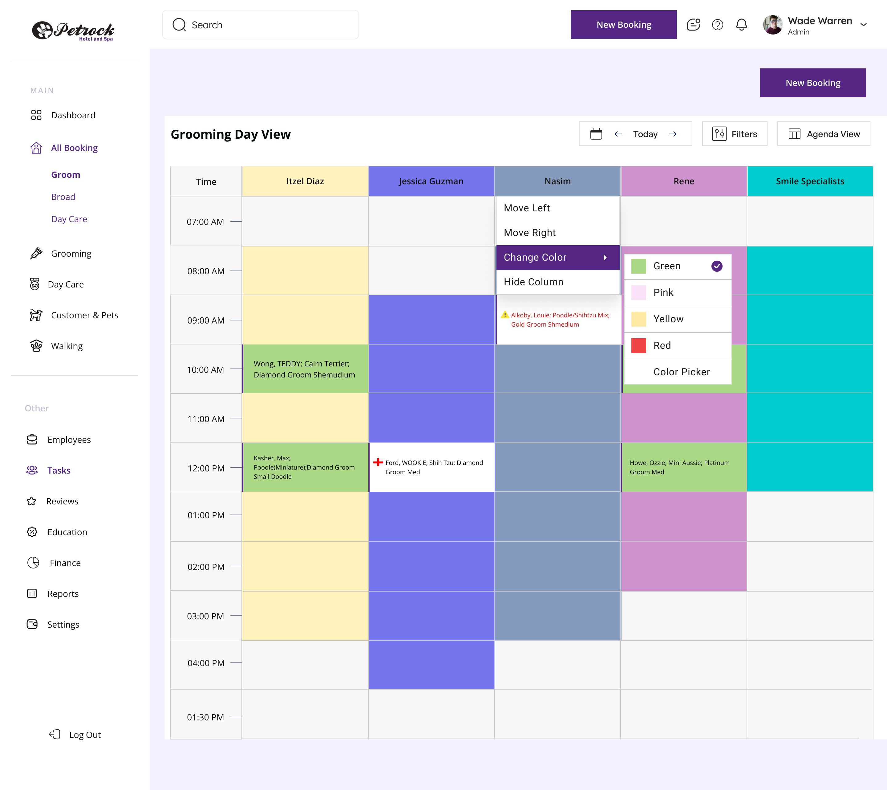
- **Description:** Single-day grooming schedule: hourly rows (07:00 AM to 04:00 PM, plus a stray 01:30 PM row) by groomer columns (Itzel Diaz, Jessica Guzman, Nasim, Rene, Smile Specialists), each column tinted with the groomer's color to show working hours. Appointment cards list pet owner, pet, breed and groom package. A context menu on the Nasim column offers Move Left, Move Right, Change Color (open, with Green/Pink/Yellow/Red/Color Picker) and Hide Column. Grooming-1.png is the same view without the menu (reveals 'Florin,Rex' at 10:00 in Rene's column); Grooming.pdf / Grooming-1.pdf title the same screen 'Grooming Timeline View'; Section 10.png is a Figma section cover 'Groom' plus this screen. Exported at 2x (2880 wide).
- **Layout:** Title 'Grooming Day View' + toolbar (Today, <-, ->, calendar, Filters, Agenda View). Grid: 'Time' column + one tinted column per groomer; hourly rows; appointment cards inside slots; context menu + color submenu on the Nasim header.
- **Fields:**
  - Column header 'Time'
  - Groomer columns: Itzel Diaz (yellow), Jessica Guzman (blue), Nasim (grey-blue), Rene (pink), Smile Specialists (cyan)
  - Time rows: 07:00 AM .. 04:00 PM, then 01:30 PM
  - Appointment: 'Wong, TEDDY; Cairn Terrier; Diamond Groom Shemudium' (Itzel 10:00, green)
  - Appointment: 'Florin,Rex; German Shepherd Dog; Platinum Groom Large' (Rene 10:00, visible in Grooming-1)
  - Appointment: 'Kasher. Max; Poodle(Miniature);Diamond Groom Small Doodle' (Itzel 12:00, green)
  - Appointment: 'Ford, WOOKIE; Shih Tzu; Diamond Groom Med' (Jessica 12:00, white with red cross)
  - Appointment: 'Alkoby, Louie; Poodle/Shihtzu Mix; Gold Groom Shmedium' (Nasim 09:00, red text with warning triangle)
  - Appointment: 'Howe, Ozzie; Mini Aussie; Platinum Groom Med' (Rene 12:00, green)
  - Context menu: Move Left, Move Right, Change Color, Hide Column
  - Color options: Green (checked), Pink, Yellow, Red, Color Picker
- **Actions:**
  - Move Left
  - Move Right
  - Change Color
  - Hide Column
  - Pick Green / Pink / Yellow / Red / Color Picker
  - Today
  - <- / -> day navigation
  - Calendar picker
  - Filters
  - Agenda View
  - New Booking
  - Search
  - Sidebar nav
  - Log Out
  - Click appointment (implied)
- **Components:** day grid / time-column schedule; groomer column header (colored); appointment card; context menu; color submenu with swatches and checkmark; date navigator; Filters button; view toggle
- **States:** Column context menu open with Change Color submenu (Green checked); Grooming-1.png: default with no overlays.
- **Rules / notes:** Groomer columns are reorderable, recolorable and hideable per user. Column tint indicates groomer availability window (e.g. Jessica 09:00-04:00 PM, Rene 08:00-02:00 PM, Smile Specialists 08:00-12:00 PM). Appointment card colors: green = confirmed/normal, white + red cross = vaccine issue, red text + warning triangle = alert/conflict. Groom packages: Diamond, Gold, Platinum Groom with size tiers (Small Doodle, Shmedium, Med, Large). Card format 'Owner Last, PET; Breed; Package Size'. 'Shemudium' vs 'Shmedium' spelling inconsistency. Time axis ends with 01:30 PM after 04:00 PM (design error). Title inconsistency 'Grooming Day View' (png) vs 'Grooming Timeline View' (pdf).
- **Variants among the duplicates:**
  - `Grooming-1.png` - Grooming Day View (default, no menu): Same Grooming Day View without the context menu, so all appointments are visible including 'Florin,Rex; German Shepherd Dog; Platinum Groom Large' at 10:00 AM in Rene's column. Fields: 'Florin,Rex; German Shepherd Dog; Platinum Groom Large' (10:00, Rene) State: Default light mode, no overlays. Note: Dark purple left border on cards.
  - `Grooming.pdf` - Grooming Timeline View (day grid) - column context menu: Same day-grid screen as Grooming.png but titled 'Grooming Timeline View'. The hidden PDF text layer also contains 'All Reservations' and 'Logout' labels from an earlier sidebar layer. Fields: Title 'Grooming Timeline View' State: Context menu + color submenu open. Note: Title inconsistency; hidden text layer reveals old nav label 'All Reservations' (now 'All Booking').
  - `Section 10.png` - Figma section cover 'Groom' + Grooming day grid thumbnail: Composite export of a Figma section: a large purple cover card labeled 'Groom' above a downscaled copy of the grooming day-grid screen titled 'Grooming Timeline View' with the Nasim column context menu open. Not a light/dark composite. Fields: Section cover text 'Groom' State: Light mode only; small text partially legible. Note: Confirms the section grouping name 'Groom' for these screens.

### 2.5 Grooming agenda list

#### 2.5.1 Agenda List card (component crop)

- **File:** [`Frame 1171276264-11.png`](exports/petrock-main/Frame%201171276264-11.png) (png, 1143x362px)
- **Also exported as:** [`Frame 1171276264-12.png`](exports/petrock-main/Frame%201171276264-12.png) (png, 1143x362px) - Agenda List card - date picker open; [`Frame 1171276264-13.png`](exports/petrock-main/Frame%201171276264-13.png) (png, 1143x362px) - Agenda List card - specific date selected; [`Frame 1171276264-5.png`](exports/petrock-main/Frame%201171276264-5.png) (png, 1143x362px) - Agenda List card - Today (duplicate); [`Frame 1171276264-6.png`](exports/petrock-main/Frame%201171276264-6.png) (png, 1143x362px) - Agenda List card - date picker open (duplicate); [`Frame 1171276264-7.png`](exports/petrock-main/Frame%201171276264-7.png) (png, 1143x362px) - Agenda List card - Feb 22, 2024 selected (duplicate)

- **Description:** Cropped export of the Agenda List card only (no app shell). A purple-header table lists agenda items for the currently selected day, with a date navigator defaulting to 'Today', a Filters button and an 'Agenda View' toggle. Each row shows a time slot, date, three status icons and an agenda title placeholder. States: Today (this file, -5), date picker open showing February 2022 with day 16 highlighted (-12, -6), specific date 'Feb 22, 2024' selected (-13, -7). In-shell versions: front desk-12/13/14/18/19/20.jpg.
- **Layout:** Card header: title 'Agenda List' left; right side: date navigator [calendar icon, left arrow, 'Today', right arrow], 'Filters' button, 'Agenda View' button. Below: table with purple header row (Time, Date, Status, Agenda) and 4 data rows separated by hairlines.
- **Fields:**
  - Time: 09:00-9:30 (all rows)
  - Date: Mar 21, 2024 (all rows)
  - Status: three icons per row - yellow warning triangle, yellow/red coins or money icon, red medical cross
  - Agenda: 'Agenda Tittles Goes Here' (placeholder, typo 'Tittles')
  - Date navigator: Today | Feb 22, 2024
  - Date picker (variant): February 2022, weekday headers S M T W T F S, days 30,31 (grey), 1-31, 1,2,3 (grey), day 16 highlighted
- **Actions:**
  - Calendar icon (opens date picker)
  - Previous day arrow
  - Today / selected-date label
  - Next day arrow
  - Filters
  - Agenda View
  - Row click (implied, title styled as purple link)
  - Month prev/next and day select (picker variant)
- **Components:** card; data table with colored header; date navigator / date picker trigger; month calendar popover; icon button group; status icon cluster; outlined button with leading icon
- **States:** Default (Today) / date picker open / specific date selected; light mode; placeholder data
- **Rules / notes:** Status column uses three icons (warning, payment/money, medical) which appear to be flags on the appointment (alert/note, payment due, medical/vaccination issue). Row date (Mar 21, 2024) does not match a 'Today' navigator; placeholder data. Time text and titles are purple, suggesting links. Calendar grid shows Feb 2022 with 31 days - static placeholder. Navigator label switches from 'Today' to 'MMM D, YYYY' when a non-today date is selected.
- **Variants among the duplicates:**
  - `Frame 1171276264-12.png` - Agenda List card - date picker open: Same card with the month calendar popover open (February 2022, day 16 highlighted). State: Date picker open Note: Picker year (2022) disagrees with row dates (2024).
  - `Frame 1171276264-13.png` - Agenda List card - specific date selected: Same card with 'Feb 22, 2024' in the date navigator. Fields: Selected date: Feb 22, 2024 State: Selected date shown

#### 2.5.2 Front desk - Agenda List page

- **File:** [`front desk-12.jpg`](exports/petrock-main/front%20desk-12.jpg) (jpg, 1440x1621px)
- **Also exported as:** [`front desk-13.jpg`](exports/petrock-main/front%20desk-13.jpg) (jpg, 1440x1621px) - Front desk - Agenda List page with date picker open; [`front desk-14.jpg`](exports/petrock-main/front%20desk-14.jpg) (jpg, 2880x3242px) - Front desk - Agenda List page with Feb 22, 2024 selected; [`front desk-18.jpg`](exports/petrock-main/front%20desk-18.jpg) (jpg, 1440x1621px) - Front desk - Agenda List page (Today) (duplicate); [`front desk-19.jpg`](exports/petrock-main/front%20desk-19.jpg) (jpg, 1440x1621px) - Front desk - Agenda List page with date picker open (duplicate); [`front desk-20.jpg`](exports/petrock-main/front%20desk-20.jpg) (jpg, 2880x3242px) - Front desk - Agenda List page with Feb 22, 2024 selected (duplicate)

- **Description:** Full front-desk page containing the Agenda List card inside the app shell. Left sidebar has MAIN navigation (Dashboard; All Booking with sub-items Groom, Broad, Day Care; Grooming; Day Care; Customer & Pets; Walking) and OTHER navigation (Employees, Tasks, Reviews, Education, Finance, Reports, Settings) plus Log Out. Top bar has global search, a purple 'New Booking' button, chat/help/notification icons and the logged-in user 'Wade Warren, Admin'. Above the card sits a purple '+ Hotel Reservation' button. States: Today (this file, -18), date picker open (-13, -19), 'Feb 22, 2024' selected (-14, -20; 2880px 2x export).
- **Layout:** Top bar: Petrock Hotel and Spa logo, Search input, New Booking button, chat icon, help (?) icon, bell icon, avatar + name/role with chevron. Left sidebar: MAIN section, divider, Other section, Log Out at bottom. Main content on lavender background: right-aligned '+ Hotel Reservation' button, then white Agenda List card.
- **Fields:**
  - Search (placeholder 'Search')
  - User: Wade Warren / Admin
  - Agenda List card fields as in Frame 1171276264-11.png
- **Actions:**
  - Search
  - New Booking
  - Chat/messages icon
  - Help icon
  - Notifications bell
  - User menu chevron
  - Sidebar: Dashboard, All Booking (Groom, Broad, Day Care), Grooming, Day Care, Customer & Pets, Walking, Employees, Tasks, Reviews, Education, Finance, Reports, Settings, Log Out
  - + Hotel Reservation
  - Prev day / Today / Next day
  - Calendar icon
  - Filters
  - Agenda View
  - Row click (implied)
- **Components:** app shell with sidebar navigation; top bar with search; primary button; icon button; avatar with name/role; card; data table with colored header; date navigator; status icon cluster; month calendar popover (variants)
- **States:** Default / Today (variants: picker open; Feb 22, 2024 selected); sidebar highlights 'All Booking' > 'Groom' and 'Tasks' as active
- **Rules / notes:** Sidebar sub-item 'Broad' is probably a typo for 'Board'. Both 'Groom' and 'Tasks' appear highlighted simultaneously, ambiguous active state. Grooming agenda accessed via All Booking > Groom. Placeholder agenda titles contain typo 'Tittles'. '+ Hotel Reservation' CTA on a grooming agenda page is inconsistent.
- **Variants among the duplicates:**
  - `front desk-13.jpg` - Front desk - Agenda List page with date picker open: Same page with the calendar popover open under the date navigator (February 2022, day 16). State: Date picker open Note: Same invalid February grid as the component crop.
  - `front desk-14.jpg` - Front desk - Agenda List page with Feb 22, 2024 selected: Same page (2880px 2x export) with the date navigator reading 'Feb 22, 2024'. Fields: Selected date: Feb 22, 2024 State: Specific date selected

### 2.6 Add forms (customer, pet, boarding, grooming)

#### 2.6.1 Add Customer form (with legacy reference)

- **File:** [`Customer Details.pdf`](exports/petrock-main/Customer%20Details.pdf) (pdf, 1966x1307pt)
- **Also exported as:** [`Frame.png`](exports/petrock-main/Frame.png) (png, 1440x1307px) - Add Customer form (full page); [`Frame-3.png`](exports/petrock-main/Frame-3.png) (png, 1440x1307px) - Add Customer form (full page); [`Frame-5.png`](exports/petrock-main/Frame-5.png) (png, 1440x1307px) - Add Customer form (full page); [`Amenities.png`](exports/petrock-main/Amenities.png) (png, 1090x1106px) - Add Customer form (modal component only); [`Amenities-3.png`](exports/petrock-main/Amenities-3.png) (png, 1090x1106px) - Add Customer form (modal component only); [`Amenities-5.png`](exports/petrock-main/Amenities-5.png) (png, 1090x1106px) - Add Customer form (modal component only)
- **Description:** Design reference sheet: on the left a screenshot of the legacy Windows 'Customer [NEW]' dialog (Name and Contact Details, Info, Notes, Documents sections) and on the right the redesigned Petrock 'Customer Details' modal overlaid on the Customer & Pets list page. The modal collects identity, address, phone/email contacts, preferences, a note and an attachment, then commits with 'Add Customer'. Sidebar and top bar of the front desk shell are visible behind the modal. Same modal appears as a full-page export (Frame.png, -3, -5) and as an isolated component export misnamed Amenities.png (-3, -5).
- **Layout:** Left: legacy screenshot. Right: front desk shell (sidebar + top bar) > dim overlay > modal: back arrow + title 'Customer Details'; form grid (4 columns) of identity, address, contact fields; Preferred Contact Method / Reference / Attributes row; Note textarea; Attachment dropzone; footer Cancel + Add Customer.
- **Fields:**
  - Title (text, placeholder 'Mr.')
  - First Name (placeholder 'Name')
  - Last Name (placeholder 'Name')
  - Status (dropdown, 'Active')
  - Address (placeholder 'Addreess' - typo)
  - Town/City* (dropdown, 'City Name', with + add button)
  - State* (dropdown, 'NY')
  - Zip (placeholder 'Zip')
  - Mobile* (placeholder 'Mobile Number')
  - Email* (placeholder 'Email Address')
  - Home Phone (empty)
  - Work Phone (placeholder 'Email Address' - wrong placeholder)
  - Alternative Phone (empty)
  - Alternative Contact (empty)
  - Preferred Contact Method (dropdown, 'Mobile Number')
  - Reference (text, with + button)
  - Attributes (text, with + button)
  - Note (textarea, counter 0/100)
  - Attachment (dropzone 'Click to replace or drag and drop')
  - Legacy dialog fields: Initials, Referred By, Newsletter, Customer Since, Send Reminders & Marketing Messages, Documents (Title/Type/Email Me/Delete)
- **Actions:**
  - Back arrow
  - Cancel
  - Add Customer
  - + add Town/City
  - + add Reference
  - + add Attributes
  - Attachment dropzone click/drag
  - Top bar: Search, New Booking, messages, help, notifications, user menu (Wade Warren / Admin)
  - Sidebar: Dashboard, All Booking (Groom, Broad, Day Care), Grooming, Day Care, Customer & Pets, Walking, Employees, Tasks, Reviews, Education, Finance, Reports, Settings, Log Out
- **Components:** modal; text input; dropdown/select; required-field asterisk; inline + add button; textarea with character counter; file dropzone; primary/secondary button pair; sidebar nav; top app bar; legacy screenshot annotation
- **States:** Empty/new form; modal open over Customer & Pets list; legacy reference screenshot included
- **Rules / notes:** Required fields: Town/City, State, Mobile, Email. Note limited to 100 characters. Legacy app had Newsletter opt-in, Send Reminders & Marketing Messages, Referred By, Customer Since and a Documents table which are not all carried over. Sidebar label 'Broad' is a typo for 'Board'. 'Addreess' typo in placeholder. Work Phone placeholder wrongly says 'Email Address'. Attachment dropzone says 'Click to replace' on a new record.
- **Variants among the duplicates:**
  - `Frame.png` - Add Customer form (full page): Front desk shell with the 'Customer Details' modal open over the Customer & Pets list. Same form as Customer Details.pdf without the legacy screenshot. State: Empty/new form, modal open; light mode
  - `Amenities.png` - Add Customer form (modal component only): The Customer Details modal exported as a standalone component (no app shell). File name 'Amenities' does not match content. State: Component isolated Note: Misnamed export.

#### 2.6.2 Add Pet form (with legacy reference)

- **File:** [`Pet Details .pdf`](exports/petrock-main/Pet%20Details%20.pdf) (pdf, 2532x1694pt)
- **Also exported as:** [`Frame-1.png`](exports/petrock-main/Frame-1.png) (png, 1440x1694px) - Add Pet form (full page); [`Frame-2.png`](exports/petrock-main/Frame-2.png) (png, 1440x1694px) - Add Pet form (full page); [`Frame-4.png`](exports/petrock-main/Frame-4.png) (png, 1440x1694px) - Add Pet form (full page); [`Amenities-1.png`](exports/petrock-main/Amenities-1.png) (png, 1141x1450px) - Add Pet form (modal component only); [`Amenities-2.png`](exports/petrock-main/Amenities-2.png) (png, 1141x1450px) - Add Pet form (modal component only); [`Amenities-4.png`](exports/petrock-main/Amenities-4.png) (png, 1141x1450px) - Add Pet form (modal component only)
- **Description:** Design reference sheet: left shows the legacy 'Pet [NEW]' dialog ('Pets of Abdallah, Eman' list, Pet fields, Notes, Photos, Vaccinations table); right shows the redesigned 'Pet Details' modal over the Customer & Pets page (an 'Add Customer' button is visible behind). The modal captures pet identity, physical traits, vet, IDs, a four-row vaccination table with certificate uploads, a note and an attachment. Same modal as full page (Frame-1/-2/-4.png) and isolated component (Amenities-1/-2/-4.png).
- **Layout:** Left: legacy screenshot. Right: shell > modal: title 'Pet Details'; row Id / Pet Name / Type / Status; row Breed (+) / Mixed / Size / Sex / Weight; row Color (+) / Temper / Date Of Birth / Approximate Age; row Vet (+) / Registration Number / Microchip Number / Attribute; Vaccination table; Note; Attachment; footer Cancel + Add Pet.
- **Fields:**
  - Id (read-only, '0012')
  - Pet Name ('Name')
  - Type ('Dog')
  - Status (dropdown 'Active')
  - Breed (dropdown 'Shepperd', + add)
  - Mixed (checkbox)
  - Size (dropdown 'Large')
  - Sex (dropdown)
  - Weight
  - Color (dropdown, + add)
  - Temper (dropdown)
  - Date Of Birth (date 'MM-DD-YYYY')
  - Approximate Age (checkbox)
  - Vet (dropdown 'VET', + add)
  - Registration Number (dropdown, placeholder 'Mobile Number' - wrong)
  - Microchip Number (dropdown, placeholder 'Email Address' - wrong)
  - Attribute (dropdown 'Reference')
  - Vaccination table columns: Select, Type, Vaccinated, Expires, Reference, Certificate
  - Vaccination rows: DHPP, Leptospirosis, Bordetella, Rabies
  - Note (0/100)
  - Attachment dropzone
  - Legacy fields: Show Non-Active, Registration #, Microchip #, Attributes checklist (Aggressive, Have dad put one of our..., Muzzle, Nasim only), Photos, Canine Influenza vaccine, Save / Save then New
- **Actions:**
  - Cancel
  - Add Pet
  - + Breed
  - + Color
  - + Vet
  - Upload Document (x4)
  - Select checkbox per vaccine
  - Date pickers
- **Components:** modal; read-only input; text input; dropdown; checkbox; date picker; table with inline inputs; upload button; textarea with counter; file dropzone; button pair; legacy screenshot annotation
- **States:** Empty/new form; legacy reference included
- **Rules / notes:** Id auto-generated (read-only). Default vaccine set: DHPP, Leptospirosis, Bordetella, Rabies (legacy also had Canine Influenza; customer app lists Distemper/Parvo, Bordetella, Rabies required + Lepto, Influenza recommended). Breed can be flagged Mixed. DOB can be marked approximate. Registration/Microchip placeholders are copy-paste errors. 'Shepperd' misspelling of Shepherd. No Owner/Customer field on the form - pet presumably attached to the customer context it's opened from.
- **Variants among the duplicates:**
  - `Frame-1.png` - Add Pet form (full page): Front desk shell with the 'Pet Details' modal open over the Customer & Pets page. Same content as Pet Details .pdf without the legacy screenshot. State: Empty/new form; light mode
  - `Amenities-1.png` - Add Pet form (modal component only): Standalone export of the Pet Details modal without the app shell. File name does not match content. State: Component isolated Note: Misnamed export.

#### 2.6.3 New Board Booking form (with legacy reference)

- **File:** [`Board Booking.pdf`](exports/petrock-main/Board%20Booking.pdf) (pdf, 2170x2297pt)
- **Also exported as:** [`Booking details -1.png`](exports/petrock-main/Booking%20details%20-1.png) (png, 1440x2297px) - New Board Booking form (full page); [`Booking details -2.png`](exports/petrock-main/Booking%20details%20-2.png) (png, 1440x2297px) - New Board Booking form (full page); [`Booking details -5.png`](exports/petrock-main/Booking%20details%20-5.png) (png, 1440x2297px) - New Board Booking form (full page); [`Frame 1171276342.png`](exports/petrock-main/Frame%201171276342.png) (png, 1154x2080px) - New Board Booking form (modal component only); [`Frame 1171276342-1.png`](exports/petrock-main/Frame%201171276342-1.png) (png, 1154x2080px) - New Board Booking form (modal component only); [`Frame 1171276342-2.png`](exports/petrock-main/Frame%201171276342-2.png) (png, 1154x2080px) - New Board Booking form (modal component only)
- **Description:** Design reference sheet: left is a screenshot of the legacy 'Boarding Booking' dialog (Booking Id 647, Runs, Discounts and Surcharges, Additional Services, Charge, Notes); right is the redesigned 'Board Bookings' modal inside the front desk shell. Sections: header dates/charges, Customer & Pet Details, Rooms, Discount Surcharge, Additional Services, Invoice, Note. Same modal as full page (Booking details -1/-2/-5.png) and isolated component (Frame 1171276342.png, -1, -2).
- **Layout:** Modal: title 'Board Bookings' + close X; row Id / Chargeable Days / First Day Charge / Last Day Charge; row Date In / Time In / Date Out / Time Out / Reminder; row Pickup Required At / Delivery Required At; 'Customer & Pet Details' (Customer dropdown + New Customer button, Handler); pet table; 'Rooms' (Choose Room button, table, Type, Book Out Whole Hotel Room, Boarding Total); 'Discount Surcharge' table + Sales Tax + Boarding Total; 'Additional Services' table; 'Invoice' block; Note + Include Notes On Invoice; footer Cancel + Submit.
- **Fields:**
  - Id (read-only '0012')
  - Chargeable Days (dropdown '10')
  - First Day Charge (dropdown '1.0')
  - Last Day Charge (dropdown '1.0')
  - Date In (06/29/2024)
  - Time In (07:45 PM)
  - Date Out (06/29/2024)
  - Time Out (07:45 PM)
  - Reminder (checkbox)
  - Pickup Required At (date)
  - Delivery Required At (date)
  - Customer (dropdown 'Name', + add)
  - Handler (dropdown 'All')
  - Pet table: Id, Name, Type, Breed, Size, Vaccination, Attributes, Status
  - Rooms table: Date In, Date Out, Room Name, Rate
  - Type (dropdown 'All')
  - Book Out Whole Hotel Room (checkbox)
  - Boarding Total
  - Discount Surcharge table: Used, Name, Type, +/-
  - Sales Tax (dropdown 'All')
  - Boarding Total (second)
  - Additional Services table: Type, Service, Applies To, Rate, Total, Occurs, M, A, E
  - Invoice: Discount ('0012' %), Sub Total ('1454'), Total ('45725'), Deposit ('0', + add), Balance (read-only '0012')
  - Note (0/100)
  - Include Notes On Invoice (checkbox)
  - Legacy: Runs table (Date In/Out, Run, Rate), Choose Run, Discount $65.00, Sub Total $745.00, Total $745.00, Deposits $0.00, Balance $745.00, services 'Veterinary Travel $55.00 Once', 'Vaccination Fee HST $40.00 Once on 2/20/2025', 'Added 2/19/2025 by Dana, Last Edited 2/19/2025 by Dana'
- **Actions:**
  - Close (X)
  - Cancel
  - Submit
  - New Customer
  - Choose Room
  - + add customer
  - + add pet row
  - + add service row
  - + add deposit
  - Reminder toggle
  - Book Out Whole Hotel Room toggle
  - Include Notes On Invoice toggle
- **Components:** modal; read-only input; dropdown; date picker; time picker; checkbox; data table with add row; primary button; secondary button; textarea with counter; sidebar nav; top app bar; legacy screenshot annotation
- **States:** Empty/new booking with placeholder values; legacy reference included
- **Rules / notes:** Chargeable Days and first/last day charge multipliers (1.0) drive boarding total; legacy had 'Book Out Whole Run' now 'Book Out Whole Hotel Room'. Additional services have Occurs (frequency) and M/A/E (Morning/Afternoon/Evening) flags. Discount is a percentage. Balance is read-only (Total minus Deposit). Rooms replace legacy 'Runs'. Legacy shows audit trail (added/edited by). 'Boarding Total' appears twice.
- **Variants among the duplicates:**
  - `Booking details -1.png` - New Board Booking form (full page): Front desk shell with the 'Board Bookings' modal open. Same content as Board Booking.pdf without the legacy screenshot. State: Empty/new booking; light mode
  - `Frame 1171276342.png` - New Board Booking form (modal component only): Standalone export of the Board Bookings modal without the app shell. State: Component isolated

#### 2.6.4 New Groom Booking form (with legacy reference)

- **File:** [`Groom Booking .pdf`](exports/petrock-main/Groom%20Booking%20.pdf) (pdf, 2144x1627pt)
- **Also exported as:** [`Booking details .png`](exports/petrock-main/Booking%20details%20.png) (png, 1440x1627px) - New Groom Booking form (full page); [`Booking details -3.png`](exports/petrock-main/Booking%20details%20-3.png) (png, 1440x1627px) - New Groom Booking form (full page); [`Booking details -4.png`](exports/petrock-main/Booking%20details%20-4.png) (png, 1440x1627px) - New Groom Booking form (full page)
- **Description:** Design reference sheet: left is the legacy 'Groom Booking [NEW]' dialog (Booking Id, Date 3/3/2025, Time 1:00 PM, Duration 1.00, Groomer Jad, Customer Adair Matthew, pet Wolfy Chihuahua, Recurrence, Services 'Brush Out Medium $25.00', Charge, Notes); right is the redesigned 'Groom Bookings' modal in the front desk shell with date/time/duration, customer and pet table, additional services, invoice and note. Same modal as full page (Booking details .png, -3, -4).
- **Layout:** Modal: title 'Groom Bookings' + X; row Id / Date In / Time In / Duration / Reminder; row Pickup Required At / Delivery Required At; Customer & Pet Details (Customer + New Customer, Groomer); pet table; Additional Services table with remove; Invoice block; Note + Include Notes On Invoice; footer Cancel + Submit.
- **Fields:**
  - Id (read-only '0012')
  - Date In (06/29/2024)
  - Time In (07:45 PM)
  - Duration (dropdown '1.0')
  - Reminder (checkbox)
  - Pickup Required At (date)
  - Delivery Required At (date)
  - Customer (dropdown 'Name')
  - Groomer (dropdown 'All')
  - Pet table: Id, Name, Groom Style, Type, Breed, Vaccination, Attributes, Status
  - Additional Services table: Service ('Brush Out' dropdown), Applies To ('All Pet'), Rate ('$145'), Duration ('1'), Time Taken ('0'), Total ('$145')
  - Invoice: Invoice Number (read-only '0012'), Discount ('0012' %), Sub Total ('0012'), Total ('0012')
  - Note (0/100)
  - Include Notes On Invoice (checkbox)
  - Legacy: Recurrence (Recurs every N weeks / the N of every N months), Invoice #, Discount 0.00 %, SUB TOTAL $25.00, TOTAL $25.00
- **Actions:**
  - Close (X)
  - Cancel
  - Submit
  - New Customer
  - + add pet row
  - Remove service row (red circle X)
  - Service dropdown
  - Reminder toggle
  - Include Notes On Invoice toggle
- **Components:** modal; read-only input; dropdown; date picker; time picker; checkbox; data table with selected row highlight; remove-row icon button; primary/secondary button pair; textarea with counter; sidebar nav; top app bar; legacy screenshot annotation
- **States:** New booking with one service row selected (highlighted purple); legacy reference included
- **Rules / notes:** Sample service 'Brush Out' applies to 'All Pet' at $145 with duration 1 and time taken 0; total = rate. Duration default 1.0 (hours). Legacy supports recurring groom bookings, which the redesign does not show. Pet table adds a 'Groom Style' column. Discount is percentage. Invoice Number auto-generated.
- **Variants among the duplicates:**
  - `Booking details .png` - New Groom Booking form (full page): Front desk shell with the 'Groom Bookings' modal open. Same content as Groom Booking .pdf without the legacy screenshot. State: New booking with one selected service row; light mode

#### 2.6.5 Form fields overview board (all four add forms) **[Second Figma pass]**

- **File:** [`Form fields.pdf`](exports/petrock-main/Form%20fields.pdf) (pdf, 10809x3302pt)
- **Description:** A single wide Figma board placing all four redesigned forms side by side, each paired with its legacy Windows dialog screenshot: Groom Bookings, Board Bookings, Pet Details and Customer Details. It is a composite of Groom Booking .pdf, Board Booking.pdf, Pet Details .pdf and Customer Details.pdf. Rendered thumbnails are tiny but the embedded text layer confirms identical fields to those individual files.
- **Layout:** Four form+legacy pairs in a row
- **Fields:**
  - Union of fields in Groom Booking .pdf, Board Booking.pdf, Pet Details .pdf and Customer Details.pdf
- **Actions:**
  - Union of actions in the four individual form files
- **Components:** modal; data table; dropdown; date picker; textarea; file dropzone; sidebar nav; legacy screenshot annotation
- **States:** Overview board; all four forms in empty/new state
- **Rules / notes:** Content identical to the four individual PDFs; serves as the field-mapping reference against the legacy system. Thumbnails too small to read; rely on the four individual PDFs.
- **Second Figma pass:** text too small or content not viewed; re-read from the API or the .fig and confirm the fields above.

### 2.7 Messaging

#### 2.7.1 Front desk - Message inbox with open conversation

- **File:** [`message-1.jpg`](exports/petrock-main/message-1.jpg) (jpg, 1440x1330px)
- **Also exported as:** [`message.jpg`](exports/petrock-main/message.jpg) (jpg, 1440x1330px)

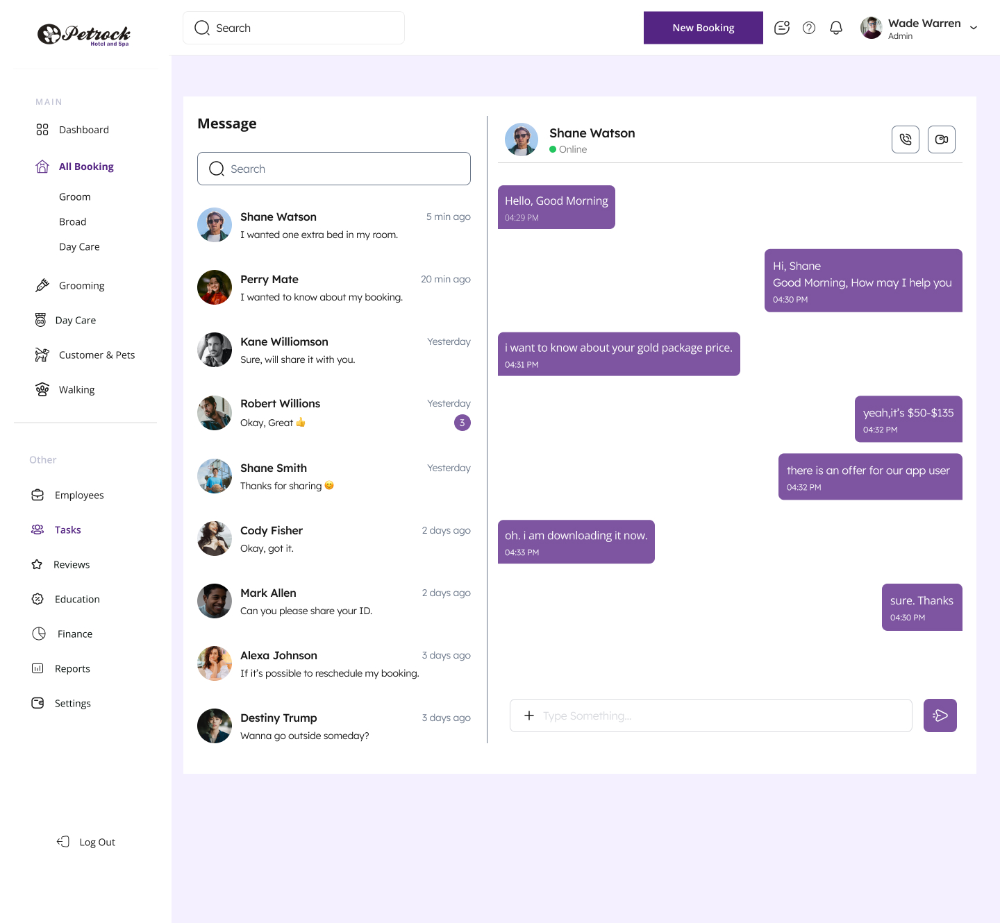
- **Description:** Two-pane messaging screen inside the front-desk shell. Left pane lists conversations with avatar, contact name, last message preview, relative timestamp and an unread-count badge. Right pane shows the selected conversation with Shane Watson (Online), a chat transcript with timestamped bubbles for the customer (left) and staff (right), and a composer with an attach (+) button and send button. Header of the conversation has voice-call and video-call icon buttons. message.jpg is pixel-identical.
- **Layout:** App shell (same sidebar and top bar as agenda pages). White card split vertically: left column 'Message' title, Search input, conversation list (10 items); right column: contact header (avatar, name, online status dot, call and video icon buttons), divider, message thread, bottom composer (input with + icon, purple send button).
- **Fields:**
  - Conversation search (placeholder 'Search')
  - Conversation: Shane Watson - 'I wanted one extra bed in my room.' - 5 min ago
  - Conversation: Perry Mate - 'I wanted to know about my booking.' - 20 min ago
  - Conversation: Kane Williomson - 'Sure, will share it with you.' - Yesterday
  - Conversation: Robert Willions - 'Okay, Great (thumbs up)' - Yesterday - unread badge 3
  - Conversation: Shane Smith - 'Thanks for sharing (smile)' - Yesterday
  - Conversation: Cody Fisher - 'Okay, got it.' - 2 days ago
  - Conversation: Mark Allen - 'Can you please share your ID.' - 2 days ago
  - Conversation: Alexa Johnson - 'If it's possible to reschedule my booking.' - 3 days ago
  - Conversation: Destiny Trump - 'Wanna go outside someday?' - 3 days ago
  - Active contact: Shane Watson, status Online
  - Incoming: 'Hello, Good Morning' 04:29 PM
  - Outgoing: 'Hi, Shane Good Morning, How may I help you' 04:30 PM
  - Incoming: 'i want to know about your gold package price.' 04:31 PM
  - Outgoing: 'yeah,it's $50-$135' 04:32 PM
  - Outgoing: 'there is an offer for our app user' 04:32 PM
  - Incoming: 'oh. i am downloading it now.' 04:33 PM
  - Outgoing: 'sure. Thanks' 04:30 PM
  - Composer placeholder: 'Type Something...'
- **Actions:**
  - Search conversations
  - Select conversation
  - Voice call icon button
  - Video call icon button
  - Attach (+)
  - Send
  - Shell: Search, New Booking, chat, help, notifications, user menu, all sidebar nav items, Log Out
- **Components:** app shell; two-pane split layout; conversation list item (avatar, name, preview, timestamp, unread badge); online status indicator; chat bubble (incoming/outgoing) with timestamp; message composer; icon button; search input
- **States:** Conversation selected (Shane Watson), contact Online, one conversation with unread badge (3), light mode
- **Rules / notes:** Copy states 'gold package' price is $50-$135 and that there is an offer for app users. Last outgoing message timestamp 04:30 PM is out of order (after 04:33 PM) - placeholder error. Timestamps in list use relative format. Both incoming and outgoing bubbles use the same purple fill, differentiated only by alignment. Sidebar shows 'All Booking' and 'Tasks' highlighted even though on Message screen. Per D-018 messaging may be improved beyond this design.

## 3. Owner/admin web

### 3.1 Dashboard

#### 3.1.1 PIN Verification modal over Dashboard **[Second Figma pass]**

- **File:** [`front desk-3.jpg`](exports/petrock-main/front%20desk-3.jpg) (jpg, 1440x1663px)

- **Description:** Same PIN Verification modal shown over a dimmed Dashboard (an older dashboard variant with 'Total Revenue $10,29,478', Message and Help buttons in the top bar, and chevron-expandable sidebar items). Demonstrates that the PIN gate is also triggered from the dashboard reservations table.
- **Layout:** Sidebar (variant: Dashboard active; All Reservations, Hotel, Grooming, Day Care, Customer & Pets, Walking with chevrons; Other: Employees, Tasks, Reviews, Education, Finance, Reports, Settings) | Top bar variant (Search, Message button, Help button, Wade Warren, bell) | Dimmed dashboard: 4 KPI cards, Revenue Statistics bar chart, Hotel Reservation Schedule calendar, Hotel Reservations table | Centered PIN modal
- **Fields:**
  - Enter pin number
  - KPI (dimmed): Total Revenue $10,29,478; Total Rooms 1,250; Available Rooms 600; New Bookings 600; Update: March 22, 2024
  - Chart tooltip Mar 23, 2024 $2000
  - Tabs All (45) ARRIVING (34) DEPARTING (18) STAYING (5) CHECKED OUT (2)
- **Actions:**
  - Cancel
  - Submit
  - + Hotel Reservation (dimmed)
  - Message
  - Help
- **Components:** modal dialog; masked PIN input; KPI stat card; bar chart; month calendar; tabbed data table; sidebar nav with chevrons; top app bar
- **States:** Dark overlay; modal open, empty PIN; background dashboard content mostly unreadable
- **Rules / notes:** Same copy as grooming PIN modal. Background KPI 'Total Revenue $10,29,478' uses Indian digit grouping and differs from front desk-4 ('Today's Hotel Revenue $3,600'). Sidebar includes a 'Hotel' item not present in other shells. Mark for the second Figma pass (background illegible).
- **Second Figma pass:** text too small or content not viewed; re-read from the API or the .fig and confirm the fields above.

#### 3.1.2 Dashboard (Hotel)

- **File:** [`front desk-4.jpg`](exports/petrock-main/front%20desk-4.jpg) (jpg, 1440x1587px)

- **Description:** Main dashboard: four KPI cards (Today's Hotel Revenue, Total Rooms, Available Rooms, New Bookings), a Revenue Statistics monthly bar chart with 'This Month' selector and hover tooltip, a Hotel Reservation Schedule month calendar with a selected date, and a Hotel Reservations table with count tabs, Filters and See All. A '+ Hotel Reservation' button sits top-right.
- **Layout:** Sidebar (Dashboard active) | Top bar | Main: + Hotel Reservation button | KPI row (4 cards) | Revenue Statistics chart (left, 2/3) + Hotel Reservation Schedule calendar (right, 1/3) | Hotel Reservations table card with tabs, Filters, See All
- **Fields:**
  - Today's Hotel Revenue: $3,600 (Update: March 22, 2024)
  - Total Rooms: 1,250
  - Available Rooms: 600
  - New Bookings: 600
  - Revenue Statistics period: This Month; y-axis $0-$5000; months Jan-Jun; tooltip Mar 23, 2024 $2000
  - Calendar: March, 2024; 13 selected
  - Table tabs: All (45), ARRIVING (34), DEPARTING (18), STAYING (5), CHECKED OUT (2)
  - Table columns: checkbox, ID, Status, Customer, Hotel Room, Date In, Time In, Date Out, Time Out, Nbr Days, Pet(S), Breed, Pet Count, Home, Mobile, Total Ch...(cut off)
  - Row: #1, Completed, Mr. Maegan, 105 - Rock, Mar 21 2024, 09:00, Mar 21 2024, 09:00, 02, Blue, Bulldog, 02, 213-713-8073, 213-713-8073, $150
- **Actions:**
  - + Hotel Reservation
  - This Month dropdown
  - Calendar prev / next month
  - Calendar icon button
  - Filters
  - See All
  - Tab switch All/Arriving/Departing/Staying/Checked Out
  - Row checkboxes
  - New Booking
  - Logout
- **Components:** KPI stat card with icon; bar chart with tooltip; dropdown select; month calendar with selected day; tabbed data table with counts; status pill (Completed); filter button; sidebar nav; top app bar
- **States:** Filled with sample data; Dashboard nav active; table rows identical placeholders; table overflows horizontally (rightmost column cut)
- **Rules / notes:** Reservation table statuses tabs: Arriving, Departing, Staying, Checked Out (tabbed variant of the grouped table). Room naming '105 - Rock'. Pet fields include name, breed and count. Tab counts do not sum to All (34+18+5+2=59 vs 45). This is the 'owner KPI dashboard' / 'home stats strip' of D-010.

### 3.2 Settings (front desk shell)

#### 3.2.1 Settings - Grooming Appointment Types and Add-Ons

- **File:** [`front desk-6.jpg`](exports/petrock-main/front%20desk-6.jpg) (jpg, 1432x1663px)
- **Also exported as:** [`12.pdf`](exports/petrock-main/12.pdf) (pdf, 1432x1663pt) - Control Panel - Spa Setup tab (grooming packages and add-ons)

- **Description:** Settings page section listing grooming packages as an 'Appointment Type' table with per-size Normal Prices (S/M/L/XL/Giant), per-size Time Required on Calendar, Description and Notes, plus a 'Grooming Add-On' table with price, added time for S-M and L sizes and employee type. Each card has search, Add and Edit. Same content as the Control Panel 'Spa Setup' tab (12.pdf).
- **Layout:** Sidebar (Settings active) | Top bar | Card 1 'Appointment Type': search, Add, Edit; table with grouped headers | Card 2 'Grooming Add-On': search, Add, Edit; table (scrollable)
- **Fields:**
  - Gold Groom: prices S $50, M $65, L $80, XL $95, Giant $135; time S 60, M 60, A 60, XL 90, Giant 90; Description: Bath, Blow-Dry, Brush Teeth, Four Paw Massage and Scented Spray
  - Platinum Groom: prices $50/$65/$80/$95/$135; time $50/$65/$80/$95/$135 (values appear copied from price row); Description: Gold Package + Nail Trim, Ear Cleanse and Gland Expression
  - Diamond Groom: prices $50/$65/$80/$95/$135; time same; Description: Platinum Package + Shave or Clip
  - Notes: 'Sanitary Trim (Add on): Trim under paws, private areas, between eyes $10-20'; 'Additional charge for dematting depending on coat condition'; Diamond: 'Specialty Breed Cuts & Asian fusion, Please Call'
  - Add-ons (On the side / Price / S-M Added Time / L Added Time / Employee Type): Furminator $25 / 0 / 0
  - Medicated Shampoo $20+
  - Flea Shampoo $20
  - Frontline Plus $30
  - Spa Facial $25
  - Nail Trim and File $16
  - Nail Polish $30+
  - Color/ Highlights $15
  - Express Anal Glands (External) $30
  - Express Anal Glands (Internal) $25 / special employee
  - Color/ Highlights $16 (second entry)
- **Actions:**
  - Search (Appointment Type)
  - Add (Appointment Type)
  - Edit (Appointment Type)
  - Search (Add-On)
  - Add (Add-On)
  - Edit (Add-On)
  - New Booking
  - Logout
- **Components:** settings card; data table with grouped column headers; package icon badge (paw, dog, diamond); search input; primary button; scrollbar; sidebar nav; top app bar
- **States:** Filled reference data; add-on table partially scrolled
- **Rules / notes:** Sizes S/M/L/XL/Giant; time header uses 'A' where 'L Time' expected. Platinum/Diamond time columns show $ values (data error). Prices identical across all three packages (placeholder; the Spa 12.7 price card gives Platinum S $65 / M $80 / L $95 / XL $115 / Giant $150). Add-on prices with '+' denote 'starting at'. Internal anal gland expression requires 'special employee'. Color/Highlights appears twice with different prices ($15, $16).
- **Variants among the duplicates:**
  - `12.pdf` - Control Panel - Spa Setup tab (grooming packages and add-ons): Settings tab 'Spa Setup' (tabs: Basic Details, Spa Setup, Hotel & Daycare Setup, Employee Schedule). Two cards: 'Appointment Type' listing grooming packages with size-based prices and calendar time, description and notes; and 'Grooming Add-On' listing add-on services with price, added time by size and employee type. Both have search, Add and Edit. Same data as front desk-6.jpg. Fields: Appointment Type table columns: Appointment Type, Grooming package (icon+name), Normal Prices S/M/L/XL/Giant, Time Required on Calendar S Time/M Time/A(L) Time/XL Time/Giant Time, Description, Notes; Row Gold Groom: prices $50/$65/$80/$95/$135; times $60/$60/$60/$90/$90 (placeholder values); Description 'Bath, Blow-Dry, Brush Teeth, Four Paw Massage and Scented Spray'; Notes '* Sanitary Trim (Add on): Trim under paws, private areas, between eyes $10-20 * Additional charge for demitting depending on coat condition'; Row Platinum Groom: prices $50/$65/$80/$95/$135; times $50/$65/$80/$95/$135; Description 'Gold Package + Nail Trim, Ear Cleanse and Gland Expression'; same notes; Row Diamond Groom: prices $50/$65/$80/$95/$135; times $50/$65/$80/$95/$135; Description 'Platinum Package + Shave or Clip'; Notes '* Specialty Breed Cuts & Asian fusion, Please Call * Additional charge for dematting depending on coat condition'; Grooming Add-On columns: On the side (name), Price, S-M Added Time, L Added Time, Employee Type; Add-on rows: Furminator $25; Medicated Shampoo $20+; Flea Shampoo $20; Frontline Plus $30; Spa Facial $25; Nail Trim and File $16; Nail Polish $30+; Color/Highlights $15; Express Anal Glands (External) $30; Express Anal Glands (Internal) $25 (Employee Type 'special employee'); all added times 0 State: Filled with real price data; Spa Setup tab active Note: Grooming packages priced by pet size S/M/L/XL/Giant ($50/$65/$80/$95/$135 for all three tiers in sample). Time-required cells contain dollar values (placeholder error). Sanitary trim add-on $10-20; dematting surcharge depends on coat condition; specialty breed cuts by phone. 'Express Anal Glands (Internal)' requires a special employee type. Some add-ons have '+' open-ended pricing. Confirms D-011: Spa is a package category within Grooming.

#### 3.2.2 Settings - Locations, Room Types, Capacity, Day Care Pricing, Discounts, Card Fees

- **File:** [`front desk-7.jpg`](exports/petrock-main/front%20desk-7.jpg) (jpg, 1432x1663px)
- **Also exported as:** [`13.pdf`](exports/petrock-main/13.pdf) (pdf, 1432x1663pt) - Control Panel - Hotel & Daycare Setup tab (capacity and pricing)

- **Description:** Settings page composed of six reference-data cards, each with Add and Edit: Location hours, Hotel Room Type nightly prices, Appointment Type max simultaneous bookings per location, Day Care items and prices, multi-dog and long-stay discount rules, and Credit Card Fees. Same content as the Control Panel 'Hotel & Daycare Setup' tab (13.pdf).
- **Layout:** Sidebar (Settings active) | Top bar | Row 1: Location card (left) + Hotel Room Type card (right) | Row 2: Appointment Type capacity card (full width) | Row 3: Appointment Type day care price card (full width) | Row 4: Appointment Type discount rules card (left) + Credit Card Fees card (right)
- **Fields:**
  - Location: Encino Mon-Fri 7am-7pm, Sat-Sun 9am-5:30pm
  - Location: Los Angeles Mon-Fri 7am-7pm, Sat-Sun 9am-5:30pm
  - Hotel Room Type Penthouses: Mon-Thurs (price per 24hr) $120, Fri-Sun $135, Mon-Thurs (Seasonal) $140, Fri-Sun (Seasonal) $155
  - Hotel Room Type Suite: 85, $95, $100, $110
  - Capacity Grooming Package: ENCINO 2, LOS ANGELES 2
  - Capacity Penthouses: 12, 20, 3; Note: Dogs over 30lbs can only fit in bottom 6 rooms
  - Capacity Suites: 42, 16, 2
  - Capacity Day Care: 20, 15, 15; Note: Question: Do we deduct hotel guests from day care capacity?
  - Day Care Full Day $45, More than 6 hours, each additional pet gets $5 off
  - Day Care Half Day $35, Less than 6 hours, each additional pet gets $5 off
  - Day Care Hourly $15, per 1 hour, each additional pet gets $5 off
  - Walk $12
  - Discount Penthouse: If 2 Dogs stay in penthouse -> $15 off each dog per night
  - Discount Penthouse: if 3 dogs stay in penthouse -> $20 off each dog per night
  - Discount Suite: If 2 dogs stay in suite -> $10 off each dog per night
  - Penthouse or Suite: 7 Days (not holiday) -> 5% off (if paid in full)
  - Penthouse or Suite: 14 Days (not holiday) -> 7.5% off (if paid in full)
  - Penthouse or Suite: 21 Days (not holiday) -> 10% off (if paid in full)
  - Credit Card Fees: Service Fee 3.89%, Rule: If Paying by credit card through app
- **Actions:**
  - Add / Edit (Location)
  - Add / Edit (Hotel Room Type)
  - Add / Edit (Appointment Type capacity)
  - Add / Edit (Appointment Type day care)
  - Add / Edit (Appointment Type discounts)
  - Add / Edit (Credit Card Fees)
  - New Booking
  - Logout
- **Components:** settings card; data table; location thumbnail avatar; primary button; sidebar nav; top app bar
- **States:** Filled reference data
- **Rules / notes:** Two locations (Encino, Los Angeles). Room pricing varies weekday vs weekend and seasonal. Capacity limits per location; third capacity column duplicates 'LOS ANGELES' header (probably a third location or typo). Dogs over 30 lbs restricted to bottom 6 penthouse rooms. Day care full day > 6 hours, half day < 6 hours (customer app says 5); multi-pet $5 off. Multi-dog room discounts and long-stay discounts (non-holiday, paid in full). 3.89% card fee on in-app payments (customer Estimate shows [3.8]%). Suite Mon-Thurs price '85' missing $ sign. Designer left an open question in the Day Care note. Richest single source of business rules in the drop.
- **Variants among the duplicates:**
  - `13.pdf` - Control Panel - Hotel & Daycare Setup tab (capacity and pricing): Settings tab 'Hotel & Daycare Setup' with cards for appointment-type capacities per location, hotel room pricing (seasonal and weekday/weekend), daycare pricing, hotel discounts & rules, and credit card fees. Each card has Add/Edit buttons. Same data as front desk-7.jpg. Fields: Appointment Types columns: Appointment Type, Max Number of Simultaneous Bookings ENCINO, Max ... LOS ANGELES, Max ... LOS ANGELES (third column, likely a placeholder/third location), Note; Grooming Package: 2 / 2 / -; Penthouses: 12 / 20 / 3; Note 'Dogs over 30lbs can only fit in bottom 6 rooms'; Suites: 42 / 16 / 2; Day Care: 20 / 15 / 15; Note 'Question: Do we deduct hotel guests from day care capacity?'; Hotel Room Pricing columns: Hotel Room Type, Mon-Thurs (price per 24hr), Fri-Sun, Mon-Thurs (Seasonal), Fri-Sun (Seasonal); Penthouses: $120 / $135 / $140 / $155; Suite: 85 / $95 / $100 / $110; Daycare Pricing columns: Appointment Type, Item, Price, Time, Discount; Day Care Full Day $45, More than 6 hours, each additional pet gets $5 off; Day Care Half Day $35, Less than 6 hours, each additional pet gets $5 off; Day Care Hourly $15, per 1 hour, each additional pet gets $5 off; Day Care Walk $12; Hotel Discounts & Rules columns: Appointment Type, Rule, Discount; Penthouse: If 2 Dogs stay in penthouse -> $15 off each dog per night; Penthouse: if 3 dogs stay in penthouse -> $20 off each dog per night; Suite: If 2 dogs stay in suite -> $10 off each dog per night; Penthouse or Suite: 7 Days (not holiday) -> 5% off (if paid in full); Penthouse or Suite: 14 Days (not holiday) -> 7.5% off (if paid in full); Penthouse or Suite: 21 Days (not holiday) -> 10% off (if paid in full); Credit Card Fees columns: Credit Card Fees, Percentage, Rule; Service Fee 3.89% 'If Paying by credit card through app' State: Filled with real business data; Hotel & Daycare Setup tab active Note: Capacity per location: Encino penthouses 12, suites 42, daycare 20, grooming 2; Los Angeles penthouses 20, suites 16, daycare 15, grooming 2. Dogs over 30lbs only fit in bottom 6 penthouse rooms (compare D-006 seed 'Dog 55lb or greater must be a Suite'). Room rates per 24hr: Penthouse $120 Mon-Thu / $135 Fri-Sun, seasonal $140/$155; Suite $85/$95, seasonal $100/$110. Daycare: full day (>6h) $45, half day (<6h) $35, hourly $15, walk $12; $5 off each additional pet. Multi-dog discounts and long-stay discounts. Credit card service fee 3.89% when paying via app. Designer note: 'Do we deduct hotel guests from day care capacity?'

### 3.3 Control Panel (owner settings, draft)

#### 3.3.1 Control Panel - Settings, Basic Details tab (overview)

- **File:** [`1.pdf`](exports/petrock-main/1.pdf) (pdf, 1432x1663pt)
- **Description:** Landing page of the owner Settings area, tab 'Basic Details' selected (tabs: Basic Details, Pricing Setup, Appointment, Employee Schedule). Shows a brand setup card and a stack of summary tables (Company, Store/Locations, Boarding, Email and SMS, Others) each with Add/Edit buttons and per-row 'Open' buttons that launch the detail modals shown in 2.pdf-11.pdf. Sidebar here reads 'All Reservations' and highlights 'Settings' with a solid purple 'Logout' button (differs from the 'All Booking'/'Log Out' sidebar in the modals).
- **Layout:** Top bar (search, New Booking, icons, user menu Wade Warren/Admin) | Left sidebar nav | Main: tab strip; card 'Setup your Brand'; card 'Tell us about your company' table; card 'Tell us about your store' table; card 'Boarding' table; card 'Email and SMS' table; card 'Others' row of Open buttons
- **Fields:**
  - Upload your logo (Add Photo dropzone)
  - Choose Your Font: Inter (dropdown)
  - Text Color: black swatch
  - Background Color: magenta/purple swatch
  - Company table: Company Name=PetRock; Address=17401 Ventura Blvd, Encino, CA, 91316; Mon-Fri=7am-7pm; Sat-Sun=9am-5:30pm; Notes='Put short notes here'; Notes(Open)
  - Store table rows: Location Images (thumbnail); Location Name=Encino / Log Angeles [sic]; Address=17401 Ventura Blvd Encino, CA, 91316 (both rows); Mon-Fri=7am-7pm; Sat-Sun=9am-5:30pm; Notes='Put short notes here'
  - Boarding table: Name of Enducer [sic]=Hotel Room(s); Default check In/Out=7am-7pm; Default check In/Out=9am-5:30pm; Charge By=Day; Notes
  - Email and SMS table: Email Display Name=Petlinx; Email Address=debra.holt@example.com; SMS Name=Petlinx; SMS Provider=Petlinx; Notes
  - Others: Form Settings, General, Grooming, General User Security Setting, Tax (each an Open button)
- **Actions:**
  - Tabs: Basic Details / Pricing Setup / Appointment / Employee Schedule
  - Add (per card)
  - Edit (per card)
  - Open (per row / per Others item)
  - Upload logo
  - New Booking
  - Search
  - Logout
  - Sidebar nav items
  - info (i) tooltip icons on card titles
- **Components:** tab strip; card with header + Add/Edit buttons; data table; image upload dropzone; dropdown; color swatch picker; outlined Open button; sidebar nav; top app bar; info tooltip icon
- **States:** Filled with sample data; Basic Details tab active
- **Rules / notes:** Two locations exist (Encino, Los Angeles) sharing one address in sample data (17401 Ventura Blvd, Encino, CA 91316). Business hours Mon-Fri 7am-7pm, Sat-Sun 9am-5:30pm. Boarding enclosure named 'Hotel Room(s)', charged by Day. Tab names here (Pricing Setup, Appointment) differ from 12/13/14 (Spa Setup, Hotel & Daycare Setup, Employee Setup/Schedule). Brand setup (logo, font Inter, text/background colour) supports the themeable design system (D-007). Control Panel = owner/super-admin surface (D-002).

#### 3.3.2 Control Panel - Company: Name and Contact Details modal

- **File:** [`2.pdf`](exports/petrock-main/2.pdf) (pdf, 1440x1289pt)
- **Description:** Modal dialog over the dimmed control panel for editing the company's name and contact details (opened from the 'Tell us about your company' card). Single-column top field then two rows of address and contact inputs. Cancel/Submit footer.
- **Layout:** Top bar | Sidebar | Dim overlay | Modal: title + close X; Company Name; row Address/Town City/State/Zip/Country; row Phone/Fax/Email/Website; footer Cancel + Submit
- **Fields:**
  - Company Name (text)
  - Address (text)
  - Town City (dropdown, 'Loss Angeles' [sic])
  - State (dropdown, 'Loss Angeles' [sic])
  - Zip (text)
  - Country (dropdown, 'United State' [sic])
  - Phone (text)
  - Fax (text)
  - Email (text)
  - Website (text)
- **Actions:**
  - Cancel
  - Submit
  - Close (X)
- **Components:** modal dialog; text input; dropdown select; primary/secondary button pair
- **States:** Empty/default form
- **Rules / notes:** Typos in sample values: 'Loss Angeles', 'United State'. Town City shown as a dropdown rather than free text.

#### 3.3.3 Control Panel - Store / Location details modal

- **File:** [`3.pdf`](exports/petrock-main/3.pdf) (pdf, 1440x1348pt)
- **Description:** Modal for adding/editing a store location (opened from 'Tell us about your store'). Contains location image upload, name, address, description, a 7-day working-hours grid with open-day checkboxes and time in/out dropdowns, and a note. Title still reads 'Name And Contact Details' (likely a copy error; should be Location).
- **Layout:** Modal: title + X; row Location Images (Add Photo) / Location Name / Address; Description textarea (0/100); Working Hours grid (Open On checkbox per day, Time In, Time Out); Note textarea (0/100); footer Cancel + Submit
- **Fields:**
  - Location Images (Add Photo dropzone)
  - Location Name (placeholder 'Write Here')
  - Address (placeholder 'Write Here')
  - Description (textarea, counter 0/100)
  - Working Hours: Open On checkbox for Sunday..Saturday
  - Time In per day (dropdown, 07:45 PM default)
  - Time Out per day (dropdown, 07:45 PM default)
  - Note (textarea, counter 0/100)
- **Actions:**
  - Add Photo
  - Cancel
  - Submit
  - Close (X)
- **Components:** modal dialog; image upload dropzone; text input; textarea with character counter; weekly hours grid (checkbox + two time dropdowns per day); dropdown select
- **States:** Empty form; all days unchecked; times default 07:45 PM
- **Rules / notes:** Description and Note limited to 100 characters. Per-location working hours by weekday. Feeds the Locations model (2 now, easy add-location flow).

#### 3.3.4 Control Panel - Boarding settings modal

- **File:** [`4.pdf`](exports/petrock-main/4.pdf) (pdf, 1440x1289pt)
- **Description:** Modal configuring boarding (hotel) rules: naming of the pet enclosure, check-in/out windows, charge basis (day/night/hours), partial first/last day charge rules, minimum charge and default booking behaviours.
- **Layout:** Modal: title Boarding + X; row Name Of Pet Enclosure (Singular)/(Plural); Boarding Hours: Check In/Out Between + 'And Also' checkbox + second window; Charge By Number Of radio group + 'And Also' + third window; Charge rows; Minimum Charge; three default checkboxes; footer Cancel + Submit
- **Fields:**
  - Name Of Pet Endosure [sic] (Singular)
  - Name Of Pet Endosure [sic] (Plural)
  - Check In/Out Between = 07:00 AM - 08:00 PM
  - And Also (checkbox) + second Check In/Out Between (empty)
  - Charge By Number Of: Day (selected) / Night / Hours (radio)
  - And Also (checkbox) + third Check In/Out Between (empty)
  - Charge (checkbox) [n] Day(s) On First Day If Check In Is After [time] (two dropdowns)
  - Charge (checkbox) [n] Day(s) On Last Day If Check Out Is Before [time] (two dropdowns)
  - Minimum Charge (checkbox) [n] Day(s) (dropdown)
  - New Bookings Book Out Whole Hotel Room By Default (checkbox, appears twice)
  - Do Not Prompt To Copy Services From Previous Booking (checkbox)
- **Actions:**
  - Cancel
  - Submit
  - Close (X)
- **Components:** modal dialog; radio group (boxed); checkbox; dropdown select; time-range input
- **States:** Mostly empty; Day radio selected; first check-in window prefilled
- **Rules / notes:** Default check-in/out window 07:00 AM - 08:00 PM. Charging can be by Day, Night or Hours. Late check-in / early check-out can trigger partial-day charges. Minimum charge in days. 'New Bookings Book Out Whole Hotel Room By Default' is duplicated (one is probably a placeholder for another option). 'Endosure' typo for Enclosure. These settings define how Chargeable Days / First Day Charge / Last Day Charge on the Board Booking form are computed.

#### 3.3.5 Control Panel - Email and SMS settings modal

- **File:** [`5.pdf`](exports/petrock-main/5.pdf) (pdf, 1440x804pt)
- **Description:** Modal configuring outbound email and SMS providers. Email section has display name, address, provider radio (None/Gmail/Other SMTP) and a test-send button; SMS section has provider radio (None/Petlinx), username, API key and a test-send button. Screen is cropped shorter than the others (sidebar ends at Tasks).
- **Layout:** Modal: title Email And SMS + X; row Email Display Name / Email Address / Email Provider radio; Send Test Email button; SMS heading; row provider radio / User Name / API Key / Send Test SMS; footer Cancel + Submit
- **Fields:**
  - Email Display Name (text)
  - Email Address (text)
  - Email Provider: None (selected) / Gmail / Other (SMTP)
  - SMS provider: None (selected) / Petlinx
  - User Name (text)
  - API Key (text)
- **Actions:**
  - Send Test Email
  - Send Test SMS
  - Cancel
  - Submit
  - Close (X)
- **Components:** modal dialog; radio group (boxed); text input; outlined action button
- **States:** Empty; None selected for both providers
- **Rules / notes:** Supports Gmail or generic SMTP for email; Petlinx as SMS provider (PetLinx is the legacy product being replaced). Test-send actions for both channels. Provider choice to be revisited for the web app (integrations).

#### 3.3.6 Control Panel - Form Settings modal

- **File:** [`6.pdf`](exports/petrock-main/6.pdf) (pdf, 1440x1699pt)
- **Description:** Modal of application behaviour preferences grouped into sections: confirmations, field colours, startup actions, main form, customers-and-pets form, calendar prompts, and pet/booking form prompts. All are checkboxes except two colour swatches.
- **Layout:** Modal: title Form Settings + X; sections Confirmations (2x2 checkboxes); Field Color (two swatches); When Petlix Start (2x2); Main Form (1); Customers And Pets Form (2); Calendar (2); Pet And Booking Forms (1); footer Cancel + Submit
- **Fields:**
  - Confirm Before Editing A Record
  - Confirm Before Undoing Changes To A Record
  - Confirm Before Switching To 'Find' When I'm Adding A New Record
  - Confirm Before Switching To 'New' When I'm Adding A New Record
  - Field Color: Read Only Field (grey swatch)
  - Field Color: Currently Selected Field (light yellow swatch)
  - When Petlix Start: Open Customers And Pets Form
  - Show Customers With Outstanding Balances
  - Open Grooming Calendar
  - Open Boarding Calendar
  - Main Form: Open A Single Copy Of Each Form
  - Customers And Pets Form: Use Customers And Pets Form
  - Display Relevant Tab When Grid Is Click
  - Calendar: Prompt About Past Uncompleted Bookings When Opeing [sic]
  - Prompt To Include Past Unvoiced [sic: Uninvoiced] Bookings When Invoicing
  - Pet And Booking Forms: Prompt About Expired Or Missing Compulsory Vaccinations
- **Actions:**
  - Cancel
  - Submit
  - Close (X)
  - Colour swatch pickers
- **Components:** modal dialog; checkbox group with section headings; color swatch
- **States:** All unchecked
- **Rules / notes:** Copies desktop-app (PetLinx) preferences; some (single copy of each form, skins) may not map to a web app. Compulsory vaccination prompt implies a 'compulsory' flag on vaccination types. 'Show Customers With Outstanding Balances' implies a balance concept on customers.

#### 3.3.7 Control Panel - General settings modal

- **File:** [`7.pdf`](exports/petrock-main/7.pdf) (pdf, 1440x1289pt)
- **Description:** Modal of general system settings: database language with refresh, time format and interval, restricted time-field range, and defaults (contact method, pet type) plus feature toggles for retail products, skins and Dropbox.
- **Layout:** Modal: title General + X; Database Language dropdown + Refresh Database button; Time section (Time Format radio, Time Interval dropdown, Restrict Time Fields To Between X And Y); Defaults section (Customer Contact Method, Default Pet Type, three checkboxes); footer Cancel + Submit
- **Fields:**
  - Database Language = English (dropdown)
  - Time Format: 12 Hours (selected) / 24 Hours
  - Time Interval (In Minutes) (dropdown, empty)
  - Restrict Time Fields To Between [dropdown] And [dropdown]
  - Customer Contact Method (dropdown)
  - Default Pet Type (dropdown)
  - Use Products And Retail Sales (checkbox)
  - Use 'Skins' To Change The Appearance Of Petlinx (checkbox)
  - Use Dropbox For Uploads And Downloads (checkbox)
- **Actions:**
  - Refresh Database
  - Cancel
  - Submit
  - Close (X)
- **Components:** modal dialog; dropdown select; radio group (boxed); checkbox; outlined action button
- **States:** Defaults; English, 12 Hours
- **Rules / notes:** Time interval setting controls calendar slot granularity. References 'Petlinx' by name (legacy product).

#### 3.3.8 Control Panel - Grooming settings modal

- **File:** [`8.pdf`](exports/petrock-main/8.pdf) (pdf, 1440x1026pt)
- **Description:** Modal for grooming department settings: weekly working hours grid with a 'Use Groom Style' toggle, default booking duration, and recurring booking rules (months into future, holiday shift). Wider frame than others; sidebar cropped at Settings.
- **Layout:** Modal: title Grooming + X; Working Hours label + 'USe Groom Style' checkbox; grid Open On / Time In / Time Out for 7 days; Default Booking Hours dropdown beside grid; Recurring Bookings section; footer Cancel + Submit
- **Fields:**
  - USe Groom Style (checkbox)
  - Open On: Sunday..Saturday checkboxes
  - Time In per day (07:45 PM)
  - Time Out per day (07:45 PM)
  - Default Booking Hours = 1:00 (dropdown)
  - Recurring Bookings: Month(S) Into The Future = 1:00 (dropdown; value looks like a time, probably should be a count)
  - Move Booking To Next Working Day If Recurs On A Holiday (checkbox)
- **Actions:**
  - Cancel
  - Submit
  - Close (X)
- **Components:** modal dialog; weekly hours grid; dropdown select; checkbox
- **States:** Empty; all days unchecked
- **Rules / notes:** Default grooming appointment length 1 hour. Recurring bookings generated N months ahead; option to shift holiday recurrences to next working day. 'Groom Style' implies a groom-style catalogue per pet (Groom Style column on the groom booking pet table).

#### 3.3.9 Control Panel - Invoice settings modal

- **File:** [`9.pdf`](exports/petrock-main/9.pdf) (pdf, 1440x1289pt)
- **Description:** Modal configuring invoicing: next invoice/payment number, tip and linked-payment options, booking filter and auto-complete on invoicing, printed-invoice options (copies, title, footer, show rates/tax number) and payment-processing placeholders.
- **Layout:** Modal: title Invoice + X; Next Invoice/Payment Number + two checkboxes; section 'Boarding Hours' (mislabelled) with Filter Bookings By dropdown + checkbox; section On Printed Invoice (copies, show rates, title, show tax number, footer message); section Payment Processing (Option 1-3 checkboxes); footer Cancel + Submit
- **Fields:**
  - Next Invoice/Payment Number (text)
  - Show Tip Field (checkbox)
  - Use Linked Payment/Deposits (checkbox)
  - Filter Bookings By (dropdown)
  - Set Bookings Status To 'Completed' (checkbox)
  - Number Of Copies To Print (dropdown)
  - Show Boarding Charge Rates (checkbox)
  - Title = Invoice (text)
  - Show Tax Number (checkbox)
  - Footer Message = 'Rock Out With Your Paws Out!' (text)
  - Payment Processing: Option 1 / Option 2 / Option 3 (checkboxes, placeholders)
- **Actions:**
  - Cancel
  - Submit
  - Close (X)
- **Components:** modal dialog; text input; checkbox; dropdown select
- **States:** Partially filled defaults
- **Rules / notes:** Invoice footer copy: 'Rock Out With Your Paws Out!'. Invoicing can auto-set booking status to Completed. Section header 'Boarding Hours' is a copy error. Payment processors not yet defined (Option 1-3; Stripe is on the kanban).

#### 3.3.10 Control Panel - General User Security Setting modal (permissions)

- **File:** [`10.pdf`](exports/petrock-main/10.pdf) (pdf, 1440x951pt)
- **Description:** Modal listing user permission toggles as a two-column checkbox list, e.g. cash drawer, reporting, deleting/cancelling bookings, maintaining services/products, customer transactions and refunds. Frame cropped (sidebar ends at Finance).
- **Layout:** Modal: title + X; 8 rows of paired checkboxes; footer Cancel + Submit
- **Fields:**
  - Open Cash Drawer
  - Delete Customers
  - Use The Reporting Center And Generate Reports
  - Delete Bookings
  - Extract Data, Create Modulas [sic], Export To PDF
  - Cancel Bookings
  - View Financial Reports
  - View Employee Reports
  - Customize Reports
  - Maintain Services
  - Maintain Customer Transactions
  - Maintain Products
  - Edit Customer Transactions
  - Delete Customer Transactons [sic]
  - Create Refunds
- **Actions:**
  - Cancel
  - Submit
  - Close (X)
- **Components:** modal dialog; checkbox list
- **States:** All unchecked
- **Rules / notes:** Defines a role/permission set; unclear whether it is per user, per role, or global default (title says 'General'). Seed for the role / PIN system's permission list.

#### 3.3.11 Control Panel - Tax settings modal

- **File:** [`11.pdf`](exports/petrock-main/11.pdf) (pdf, 1440x1088pt)
- **Description:** Modal for tax configuration: tax registration number, whether prices are tax-inclusive or exclusive, and a single named tax with separate percentage rates for services, products and boarding.
- **Layout:** Modal: title Tax + X; Tax Number; Prices Are radio; Tax Details (Name Of Tax, Service Tax Rate %, Product Tax Rate %, Boarding Tax Rate %); footer Cancel + Submit
- **Fields:**
  - Tax Number (text)
  - Prices Are: Exclusive Of Tax (selected) / Inclusive Of Tax
  - Name Of Tax (text)
  - Service Tax Rate (% input)
  - Product Tax Rate (% input)
  - Boarding Tax Rate (% input)
- **Actions:**
  - Cancel
  - Submit
  - Close (X)
- **Components:** modal dialog; radio group (boxed); text input with % suffix
- **States:** Empty; Exclusive selected
- **Rules / notes:** Three distinct tax rates by charge category (service, product, boarding). Prices default to tax-exclusive. The customer app's flat 'Tax (2%)' and the booking detail's five tax lines both need reconciling with this single-tax model.

#### 3.3.12 Control Panel - Employee Setup tab (employee list)

- **File:** [`14.pdf`](exports/petrock-main/14.pdf) (pdf, 1432x1663pt)
- **Description:** Settings tab 'Employee Setup' showing an 'Employee Setting' card with a table of employees (name, role, phone, note) and an Open button per row that launches the employee detail modal (15.pdf). Add button in card header. Tab label here is 'Employee Setup' whereas other tabs call it 'Employee Schedule'.
- **Layout:** Top bar | Sidebar (Settings active) | tab strip | card Employee Setting (Add button, table with Action column)
- **Fields:**
  - Employee Name = Jad (5 identical placeholder rows)
  - Role = Groomer
  - Phone Number = (480) 555-0103
  - Note = 'She is on Duty'
  - Action = Open
- **Actions:**
  - Tabs Basic Details / Spa Setup / Hotel & Daycare Setup / Employee Setup
  - Add
  - Open (per row)
  - info (i) tooltip
  - Logout
- **Components:** tab strip; card with Add; data table with action column; outlined Open button
- **States:** Filled with repeated placeholder rows
- **Rules / notes:** Employee roles include Groomer; note field used for duty status. Overlaps with the Employees module (employees.jpg); one employee record should serve both.

#### 3.3.13 Control Panel - Employee details modal

- **File:** [`15.pdf`](exports/petrock-main/15.pdf) (pdf, 1440x1667pt)
- **Description:** Modal for adding/editing an employee: read-only Id, names, employment dates, calendar colour, ex-employee flag, address and contact, weekly working hours with 'match to business' shortcut, holiday hours, lunch break, commission rates and a note. Title reused from company modal ('Name and Contact Details').
- **Layout:** Modal: title + X; Id (read-only) + Is An Ex Employee checkbox; row Name / Name On Calendar / Date Started / Date Left / Color In Calendar; Same As Primary checkbox; row Address / Town City / State / Zip; row Home Phone / Mobile / Email / Date Of Birth; Working Hours grid + Match Time To Business; Holiday Hours (Same As Primary); Has Lunch From/To; Commissions (Service %, Retail Sales); Note (0/100); footer Cancel + Submit
- **Fields:**
  - Id = 0012 (read-only, grey)
  - Is An Ex Employee (checkbox)
  - Name = Jad
  - Name On Calendar = Jad
  - Same As Primary (checkbox under Name On Calendar)
  - Date Started = 14/24/2025 (invalid sample date; date picker)
  - Date Left = 14/24/2025
  - Color In Calendar (purple swatch)
  - Address (text)
  - Town City = Loss Angeles [sic] (dropdown)
  - State = Loss Angeles [sic] (dropdown)
  - Zip (text)
  - Home Phone (text)
  - Mobile (text)
  - Email (text)
  - Date Of Birth = 15-02-2000 (dropdown)
  - Match Time To Business (checkbox)
  - Working Hours: Open On Sunday..Saturday checkboxes; Time In / Time Out 07:45 PM each
  - Holiday Hours: Same As Primary (checkbox)
  - Has Lunch: From = 12:45 PM, To = 01:45 PM
  - Service Commission = 0012 %
  - Retail Sales Commission = 0012
  - Note (textarea, 0/100)
- **Actions:**
  - Cancel
  - Submit
  - Close (X)
  - Color swatch picker
- **Components:** modal dialog; read-only input; date picker dropdown; color swatch; weekly hours grid; checkbox; text input with % suffix; textarea with counter
- **States:** Partially filled sample data
- **Rules / notes:** Employees have calendar colour and display name for the grooming day-view columns. Working hours can inherit business hours. Commission rates per employee for services and retail. Date formats inconsistent (14/24/2025 vs 15-02-2000).

### 3.4 Employees

#### 3.4.1 Add New Employee modal (over Manage Employees)

- **File:** [`add employees.jpg`](exports/petrock-main/add%20employees.jpg) (jpg, 1440x1282px)

- **Description:** The Manage Employees table is dimmed behind a centered 'Add New Employee' modal. The modal is a two-column form for creating a staff record with name, gender, email, phone (with country code), status, department and job title. Cancel and Add buttons sit bottom-right; an X closes the modal.
- **Layout:** Left sidebar (logo, MAIN nav: Dashboard, All Reservations, Grooming, Day Care, Customer & Pets, Walking; Other nav: Employees (active) with sub-item Check List, Tasks, Reviews, Education, Finance, Reports, Settings; Logout button) | Top bar (global Search, New Booking button, profile-switch icon, help icon, bell, Wade Warren / Admin avatar menu) | Main: page title 'Manage Employees' + 'New Employee' button; table card dimmed behind modal | Modal: header + close X; form grid 2 cols; footer Cancel / Add
- **Fields:**
  - Full Name (text, placeholder)
  - Gender (select)
  - Email (text)
  - Phone Number (text) with country-code select defaulting to +62
  - Status (select)
  - Departement (select) [sic]
  - Job Title (select)
- **Actions:**
  - X close
  - Cancel
  - Add
  - New Employee (background)
  - New Booking (top bar)
  - Logout
- **Components:** modal dialog; text input; select dropdown; phone input with country code prefix; primary button; secondary/outline button; sidebar nav; top app bar; data table (background)
- **States:** Modal open, empty form (all placeholders); background table dimmed
- **Rules / notes:** Phone country code defaults to +62 (Indonesia) - likely a template leftover since locations are Encino/Los Angeles. 'Departement' misspelling appears in form label and filter. Status is a manually chosen field (Active / Inactive / On Leave per table). This is the 'add-employee popup' listed in D-010.

#### 3.4.2 Manage Employees list

- **File:** [`employees.jpg`](exports/petrock-main/employees.jpg) (jpg, 1440x1282px)

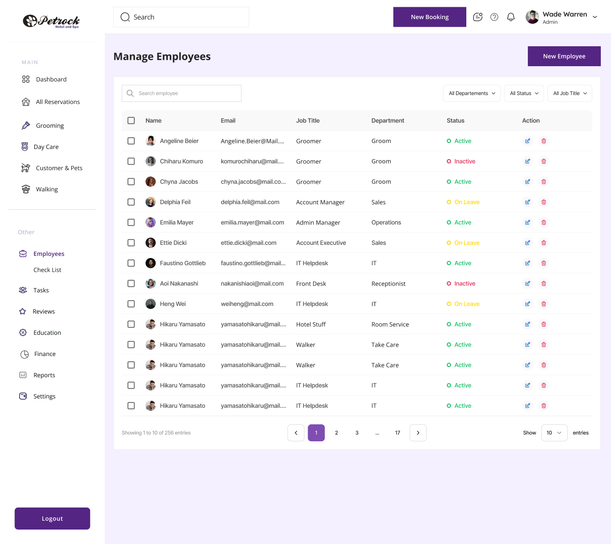
- **Description:** Paginated staff directory table with search, three filter dropdowns and a 'New Employee' CTA. Each row shows avatar+name, email, job title, department, colored status and edit/delete icon actions, with a select-all checkbox column. Footer shows entry count, page numbers and a page-size selector.
- **Layout:** Sidebar (Employees active, Check List sub-item) | Top bar | Main: title 'Manage Employees' + New Employee button | Card: search + filters row; table; footer pagination
- **Fields:**
  - Search employee (placeholder)
  - Filter: All Departements
  - Filter: All Status
  - Filter: All Job Title
  - Columns: checkbox, Name, Email, Job Title, Department, Status, Action
  - Rows e.g. Angeline Beier / Angeline.Beier@Mail.... / Groomer / Groom / Active
  - Chiharu Komuro / Groomer / Groom / Inactive
  - Chyna Jacobs / Groomer / Groom / Active
  - Delphia Feil / delphia.feil@mail.com / Account Manager / Sales / On Leave
  - Emilia Mayer / Admin Manager / Operations / Active
  - Ettie Dicki / Account Executive / Sales / On Leave
  - Faustino Gottlieb / IT Helpdesk / IT / Active
  - Aoi Nakanashi / Front Desk / Receptionist / Inactive
  - Heng Wei / IT Helpdesk / IT / On Leave
  - Hikaru Yamasato / Hotel Stuff / Room Service / Active
  - Hikaru Yamasato / Walker / Take Care / Active
  - Showing 1 to 10 of 256 entries
  - Show 10 entries
- **Actions:**
  - New Employee
  - Search employee
  - All Departements dropdown
  - All Status dropdown
  - All Job Title dropdown
  - Select all checkbox / row checkboxes
  - Edit (pencil icon) per row
  - Delete (trash icon) per row
  - Pagination: prev, 1, 2, 3, ..., 17, next
  - Show N entries select
  - New Booking
  - Logout
- **Components:** data table; avatar; status pill (green Active / red Inactive / amber On Leave); filter dropdown; search input; pagination; page-size select; icon buttons; sidebar nav; top app bar
- **States:** Filled list, page 1 of 17, default filters
- **Rules / notes:** Employee statuses: Active, Inactive, On Leave. Job titles seen: Groomer, Account Manager, Admin Manager, Account Executive, IT Helpdesk, Front Desk, Hotel Stuff [sic], Walker. Departments seen: Groom, Sales, Operations, IT, Receptionist, Room Service, Take Care. 14 rows shown though footer says 1 to 10. UI-kit sample data.

#### 3.4.3 Employee Details (General tab)

- **File:** [`employees-2.jpg`](exports/petrock-main/employees-2.jpg) (jpg, 1440x1282px)

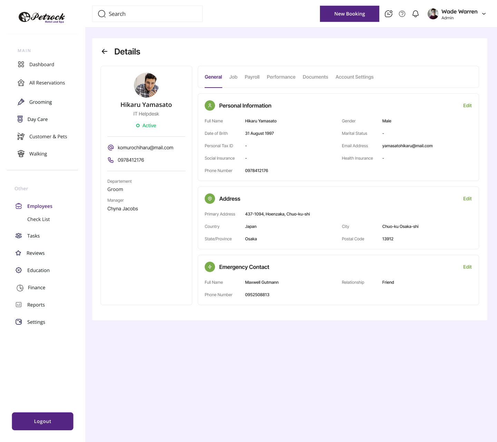
- **Description:** Employee profile page with a back arrow and 'Details' title. Left card shows avatar, name, job title, status pill, email, phone, department and manager. Right panel has tabs (General, Job, Payroll, Performance, Documents, Account Settings) and, on General, three editable sections: Personal Information, Address, Emergency Contact, each with an 'Edit' link.
- **Layout:** Sidebar (Employees active, Check List sub-item) | Top bar | Main: back arrow + 'Details' | Left profile card | Right: tab bar; Personal Information card (2-col key/value); Address card; Emergency Contact card
- **Fields:**
  - Name: Hikaru Yamasato
  - Job Title: IT Helpdesk
  - Status: Active
  - Email (card): komurochiharu@mail.com
  - Phone (card): 0978412176
  - Departement: Groom
  - Manager: Chyna Jacobs
  - Full Name: Hikaru Yamasato
  - Gender: Male
  - Date of Brith [sic]: 31 August 1997
  - Marital Status: -
  - Personal Tax ID: -
  - Email Address: yamasatohikaru@mail.com
  - Social Insurance: -
  - Health Insurance: -
  - Phone Number: 0978412176
  - Primary Address: 437-1094, Hoenzaka, Chuo-ku-shi
  - Country: Japan
  - City: Chuo-ku Osaka-shi
  - State/Province: Osaka
  - Postal Code: 13912
  - Emergency Contact Full Name: Maxwell Gutmann
  - Relationship: Friend
  - Emergency Contact Phone Number: 0952508813
- **Actions:**
  - Back arrow
  - Tabs: General, Job, Payroll, Performance, Documents, Account Settings
  - Edit (Personal Information)
  - Edit (Address)
  - Edit (Emergency Contact)
  - New Booking
  - Logout
- **Components:** profile card; status pill; tab bar; key-value detail card with section icon and Edit link; sidebar nav; top app bar
- **States:** General tab active, filled with data; several fields showing '-' (empty)
- **Rules / notes:** Data inconsistency: card email komurochiharu@ vs personal-info email yamasatohikaru@; job title IT Helpdesk but department Groom. Typo 'Date of Brith'. Tabs Job/Payroll/Performance/Documents/Account Settings not designed in this drop. Compare the Control Panel employee modal (15.pdf) which carries calendar colour, working hours and commissions instead.

### 3.5 Reviews

#### 3.5.1 Reviews moderation list

- **File:** [`reviews.jpg`](exports/petrock-main/reviews.jpg) (jpg, 1440x1282px)

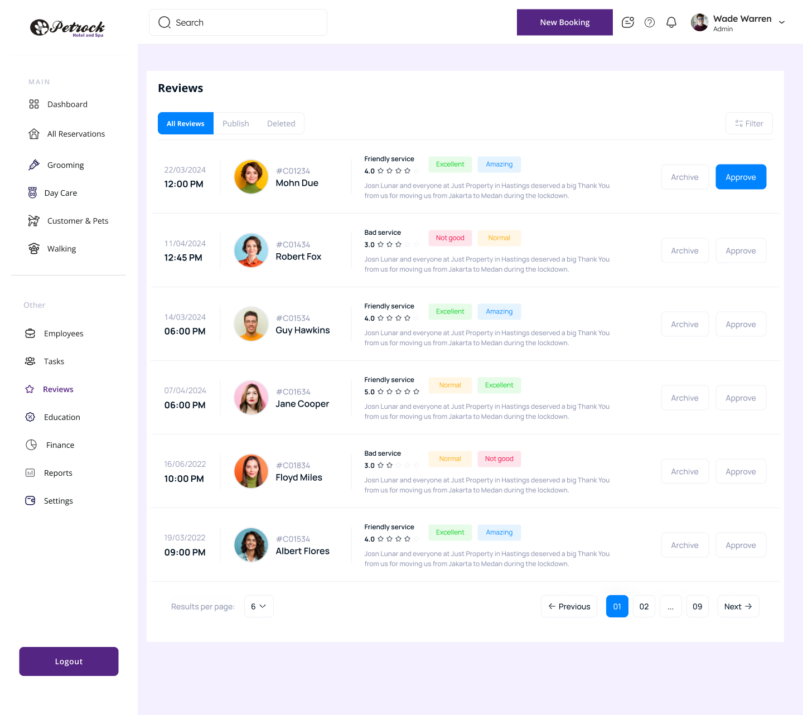
- **Description:** Moderation queue of customer reviews. Segmented tabs All Reviews / Publish / Deleted plus a Filter button. Each row shows date and time, customer avatar, customer ID and name, review title, numeric star rating, two sentiment/tag chips, review text, and Archive / Approve buttons. Footer has results-per-page and pagination.
- **Layout:** Sidebar (Reviews active) | Top bar | Card: title 'Reviews'; tab segment + Filter; review rows (date/time | avatar + ID/name | title, rating, tags, body | Archive / Approve); footer results per page + pagination
- **Fields:**
  - Tabs: All Reviews, Publish, Deleted
  - Row: 22/03/2024 12:00 PM, #C01234 Mohn Due, 'Friendly service', 4.0 stars, tags Excellent / Amazing
  - 11/04/2024 12:45 PM, #C01434 Robert Fox, 'Bad service', 3.0, tags Not good / Normal
  - 14/03/2024 06:00 PM, #C01534 Guy Hawkins, 'Friendly service', 4.0, Excellent / Amazing
  - 07/04/2024 06:00 PM, #C01634 Jane Cooper, 'Friendly service', 5.0, Normal / Excellent
  - 16/06/2022 10:00 PM, #C01834 Floyd Miles, 'Bad service', 3.0, Normal / Not good
  - 19/03/2022 09:00 PM, #C01534 Albert Flores, 'Friendly service', 4.0, Excellent / Amazing
  - Body text (placeholder): 'Josn Lunar and everyone at Just Property in Hastings deserved a big Thank You from us for moving us from Jakarta to Medan during the lockdown.'
  - Results per page: 6
- **Actions:**
  - All Reviews / Publish / Deleted tabs
  - Filter
  - Archive (per review)
  - Approve (per review; first row shown as primary/active)
  - Previous / Next
  - Pages 01, 02, ..., 09
  - Results per page select
  - New Booking
  - Logout
- **Components:** segmented tab control; filter button; review card row; avatar; star rating; tag chip (green Excellent, blue Amazing, amber Normal, red Not good); outline button; primary button; pagination; sidebar nav; top app bar
- **States:** All Reviews tab active; first row Approve button in hover/active state; others default
- **Rules / notes:** Review lifecycle implied: pending -> Approve (Publish) or Archive (Deleted). Star icons appear unfilled despite numeric rating. Body copy is lorem-like placeholder referencing property moving, not a pet service. Customer IDs use #C0xxxx format; #C01534 repeated for two different customers. Blue accent used here instead of brand purple.

### 3.6 Empty shells / navigation

#### 3.6.1 Empty app shell (Day Care / Education / Tasks / Walking / Reports / Settings / Check List active)

- **File:** [`day care.jpg`](exports/petrock-main/day%20care.jpg) (jpg, 1440x1282px)
- **Also exported as:** [`employees-1.jpg`](exports/petrock-main/employees-1.jpg) (jpg, 1440x1282px) - Employees > Check List - empty shell; [`education.jpg`](exports/petrock-main/education.jpg) (jpg, 1440x1282px) - Education - empty shell; [`education-1.jpg`](exports/petrock-main/education-1.jpg) (jpg, 1440x1282px) - Tasks - empty shell; [`employees-3.jpg`](exports/petrock-main/employees-3.jpg) (jpg, 1440x1282px) - Walking - empty shell; [`report.jpg`](exports/petrock-main/report.jpg) (jpg, 1440x1282px) - Reports - empty shell; [`settings.jpg`](exports/petrock-main/settings.jpg) (jpg, 1440x1282px) - Settings - empty shell

- **Description:** Application shell with one nav item highlighted and an entirely empty lavender content area. Serves only to document the sidebar (v1: All Reservations, purple Logout button) and top bar with that item selected. Files: day care.jpg (Day Care), education.jpg (Education), education-1.jpg (Tasks; misnamed), employees-3.jpg (Walking; misnamed), report.jpg (Reports), settings.jpg (Settings), employees-1.jpg (Employees > Check List).
- **Layout:** Left sidebar (logo; MAIN: Dashboard, All Reservations, Grooming, Day Care, Customer & Pets, Walking; Other: Employees, Tasks, Reviews, Education, Finance, Reports, Settings; Logout) | Top bar (Search, New Booking, profile-switch icon, help, bell, Wade Warren Admin) | Empty main area
- **Fields:**
  - Search (placeholder)
- **Actions:**
  - New Booking
  - Logout
  - all sidebar nav items
  - help icon
  - notification bell
  - user menu chevron
- **Components:** sidebar nav; top app bar; avatar menu
- **States:** Empty content (placeholder shell)
- **Rules / notes:** No Check List sub-item under Employees in most shell variants. These modules (Day Care, Education, Tasks, Walking, Reports, Settings sub-page, Check List) have no designed content in this drop; per D-005 they are 'Extras' (Reports in scope, designed fresh). Settings content actually appears in front desk-6/-7 and the Control Panel PDFs.
- **Variants among the duplicates:**
  - `employees-1.jpg` - Employees > Check List - empty shell: Empty shell with Employees expanded and its 'Check List' sub-item highlighted. Indicates a planned employee checklist screen with no content designed yet. Fields: Search (placeholder) State: Empty content (placeholder shell), nested nav expanded Note: Employees has a child route 'Check List'.
  - `education.jpg` - Education - empty shell: Empty shell with Education highlighted. State: Empty
  - `education-1.jpg` - Tasks - empty shell: Empty shell with Tasks highlighted (file misnamed 'education-1'). State: Empty Note: File name does not match highlighted nav item (Tasks).
  - `employees-3.jpg` - Walking - empty shell: Empty shell with Walking highlighted (file misnamed 'employees-3'). State: Empty Note: File name does not match highlighted nav item (Walking).
  - `report.jpg` - Reports - empty shell: Empty shell with Reports highlighted. State: Empty Note: Reports designed fresh (D-005).
  - `settings.jpg` - Settings - empty shell: Empty shell with Settings highlighted. Actual settings content appears in front desk-6 and front desk-7 and the Control Panel PDFs. State: Empty

#### 3.6.2 All Booking (Tasks) - empty shell, variant sidebar

- **File:** [`front desk-2.jpg`](exports/petrock-main/front%20desk-2.jpg) (jpg, 1440x1621px)

- **Description:** Alternate shell variant: sidebar reads 'All Booking' (instead of All Reservations) with sub-items Groom, Broad, Day Care, and both All Booking and Tasks appear highlighted. The main area is empty except a '+ Hotel Reservation' button top-right; Logout is a text link with icon rather than a filled button.
- **Layout:** Sidebar (All Booking active with sub-items Groom / Broad / Day Care; Tasks also highlighted; Log Out link at bottom) | Top bar | Main: '+ Hotel Reservation' button top right; empty area
- **Fields:**
  - Search (placeholder)
- **Actions:**
  - + Hotel Reservation
  - New Booking
  - Log Out
  - sub-nav Groom / Broad / Day Care
  - sidebar nav items
- **Components:** sidebar nav with nested sub-items; top app bar; primary button
- **States:** Empty content; two nav items highlighted simultaneously (likely design error)
- **Rules / notes:** 'Broad' sub-item is probably 'Board' (boarding). Naming inconsistency All Booking vs All Reservations across shells. Taller canvas (1620px).

### 3.7 Section overviews

#### 3.7.1 Figma canvas 'Section 4': timeline views, PIN modal and booking/customer/pet forms (9 frames)

- **File:** [`Section 4.png`](exports/petrock-main/Section%204.png) (png, 12759x7661px)
- **Description:** A Figma canvas export (12759x7661) containing 9 frames in three rows. Row 1: 'Grooming Timeline View' day view (same as Grooming.png with column context menu). Row 2: four frames of the multi-week 'Grooming Timeline View' (plain; with booking hover card; with booking right-click menu and Set Status To submenu; dimmed with the PIN Verification modal - a dim overlay state, not a dark-mode variant). Row 3: four modal forms - 'Groom Bookings', 'Board Bookings', 'Customer Details' and 'Pet Details' - identical to the Add forms group. Every frame is catalogued individually elsewhere; this file is the overview.
- **Layout:** Canvas grid: row 1 (1 frame), row 2 (4 frames), row 3 (4 frames). Each frame: top bar | sidebar | main content.
- **Fields:**
  - See Grooming.png, all reservation grooming.pdf / -2.jpg / -3.jpg / -2.pdf, Groom Booking .pdf, Board Booking.pdf, Customer Details.pdf, Pet Details .pdf
- **Actions:**
  - Union of the referenced screens' actions
- **Components:** timeline/resource calendar (day view by employee; week view by room); booking chip with status colour and icons; context menu with submenu and colour swatches; hover/popover detail card; dim overlay modal (PIN entry); form modal; inline editable table with add/remove row; dropdown with inline '+' add; date picker; attachment dropzone; read-only input; character-counted textarea
- **States:** Multiple states side by side (menus open, popover, PIN modal, empty forms).
- **Rules / notes:** Useful as a map of how the Section 4 frames relate; text is legible only when zoomed. Sample glitches repeated from the individual screens ('Sprayed', 'Shepperd', wrong placeholders, Total 45725 vs Sub Total 1454).

## 4. Shared & reference

### 4.1 Brand assets

#### 4.1.1 Petrock Hotel and Spa primary logo

- **File:** [`logo.png`](exports/petrock-main/logo.png) (png, 580x176px)
- **Also exported as:** [`sidebar/logo.png`](exports/petrock-main/sidebar/logo.png) (png, 145x44px) - Petrock logo, sidebar size

- **Description:** Full horizontal wordmark logo (580x176, transparent background). A black vinyl-record-style disc on the left containing a white paw print with grey pad accents, followed by the script word 'Petrock' in black and the tagline 'Hotel and Spa' in purple sans-serif beneath the wordmark's right half. sidebar/logo.png is a 145x44 downscaled export for the web sidebar header.
- **Layout:** Record-disc paw mark left; 'Petrock' script; 'Hotel and Spa' tagline under the right half.
- **Fields:**
  - Wordmark: 'Petrock'
  - Tagline: 'Hotel and Spa'
- **Actions:**
  - (none)
- **Components:** logo / brand mark; sidebar header (sidebar/logo.png)
- **States:** Full-size light-background variant; small sidebar variant
- **Rules / notes:** Brand palette implied: black wordmark, purple (~#552583) tagline. Paw-in-record disc is the icon mark and can stand alone. Tagline is barely readable at sidebar size; consider dropping it or using the paw mark alone for collapsed sidebars (D-014).
- **Variants among the duplicates:**
  - `sidebar/logo.png` - Petrock logo, sidebar size: 145x44 downscaled export of the same logo for the sidebar header of the web app. State: Small sidebar variant

#### 4.1.2 Storefront photo (Petrock physical location)

- **File:** [`Mask group.png`](exports/petrock-main/Mask%20group.png) (png, 370x240px)

- **Description:** A 370x240 street-view style photograph of the physical business: a small white single-storey storefront with a red awning reading '...CARE' and 'PET SPA', a tree in front, a white SUV parked at the kerb, and utility poles. Masked/cropped as a rounded image, so it is likely used as a hero or location card image in the customer app (e.g. About Us, Contact, Location).
- **Fields:**
  - Awning text: '...CARE' / 'PET SPA'
- **Actions:**
  - (none)
- **Components:** image card / hero photo
- **States:** Static photo
- **Rules / notes:** Image quality is low (street-view capture); designer should confirm a licensed/owned photo will replace it.

### 4.2 Iconography

#### 4.2.1 Diamond tier icon

- **File:** [`Group 1171275501.png`](exports/petrock-main/Group%201171275501.png) (png, 65x57px)

- **Description:** A tiny 65x57 icon of a light-blue faceted diamond gem on a light grey rounded background. Most likely the badge used for the 'Diamond Groom' spa package tier (see Spa 12.7 2.png and the settings package icons) or a premium/VIP marker.
- **Fields:**
  - (none)
- **Actions:**
  - (none)
- **Components:** tier badge icon
- **States:** Single static icon
- **Rules / notes:** Pairs with Gold (orange paw badge) and Platinum (grey paw badge) tier badges seen in the spa pricing image and settings tables.

#### 4.2.2 Icon set (29 svg)

- **File:** [`Iconly/Two-tone/Category.svg`](exports/petrock-main/Iconly/Two-tone/Category.svg) (svg, 20x20px)
- **Also exported as:** [`Arrow-Right.svg`](exports/petrock-main/Arrow-Right.svg) (svg, 18x18px) - Icon: Arrow Right; [`Calendar.svg`](exports/petrock-main/Calendar.svg) (svg, 16x16px) - Icon: Calendar; [`Info-Circle.svg`](exports/petrock-main/Info-Circle.svg) (svg, 20x20px) - Icon: Info Circle; [`Lock.svg`](exports/petrock-main/Lock.svg) (svg, 20x20px) - Icon: Lock; [`Logout.svg`](exports/petrock-main/Logout.svg) (svg, 20x20px) - Icon: Logout; [`Message.svg`](exports/petrock-main/Message.svg) (svg, 16x16px) - Icon: Message; [`Moon.svg`](exports/petrock-main/Moon.svg) (svg, 20x20px) - Icon: Moon; [`Setting.svg`](exports/petrock-main/Setting.svg) (svg, 20x20px) - Icon: Settings; [`Shield-Done.svg`](exports/petrock-main/Shield-Done.svg) (svg, 20x20px) - Icon: Shield Done; [`Trash Bin.svg`](exports/petrock-main/Trash%20Bin.svg) (svg, 20x20px) - Icon: Trash Bin; [`User.svg`](exports/petrock-main/User.svg) (svg, 16x16px) - Icon: User; [`Users.svg`](exports/petrock-main/Users.svg) (svg, 20x20px) - Icon: Users; [`Iconly/Two-tone/Category-1.svg`](exports/petrock-main/Iconly/Two-tone/Category-1.svg) (svg, 20x20px) - Icon: Category variant; [`Iconly/Two-tone/Category-2.svg`](exports/petrock-main/Iconly/Two-tone/Category-2.svg) (svg, 20x20px) - Icon: Category variant; [`Iconly/Two-tone/Category-3.svg`](exports/petrock-main/Iconly/Two-tone/Category-3.svg) (svg, 20x20px) - Icon: Category variant; [`Lable.svg`](exports/petrock-main/Lable.svg) (svg, 20x20px) - Icon: Label (not viewed); [`Qustion-Circle.svg`](exports/petrock-main/Qustion-Circle.svg) (svg, 20x20px) - Icon: Question Circle (not viewed); [`User-1.svg`](exports/petrock-main/User-1.svg) (svg, 20x20px) - Icon: User variant (not viewed); [`User-2.svg`](exports/petrock-main/User-2.svg) (svg, 16x16px) - Icon: User variant (not viewed); [`image 28.svg`](exports/petrock-main/image%2028.svg) (svg, 35x31px) - Vector image 28 (not viewed); [`animal-rescue_1796941.svg`](exports/petrock-main/animal-rescue_1796941.svg) (svg, 20x20px) - Flaticon: animal rescue (daycare / service tile icon) (not viewed); [`animal-rescue_1796941-1.svg`](exports/petrock-main/animal-rescue_1796941-1.svg) (svg, 28x28px) - Flaticon: animal rescue variant (not viewed); [`animal-rescue_1796941-2.svg`](exports/petrock-main/animal-rescue_1796941-2.svg) (svg, 20x20px) - Flaticon: animal rescue variant (not viewed); [`animal-rescue_1796941-3.svg`](exports/petrock-main/animal-rescue_1796941-3.svg) (svg, 28x28px) - Flaticon: animal rescue variant (not viewed); [`hair-clipper_6644387 1.svg`](exports/petrock-main/hair-clipper_6644387%201.svg) (svg, 28x28px) - Flaticon: hair clipper (grooming icon) (not viewed); [`hair-clipper_6644387 1-1.svg`](exports/petrock-main/hair-clipper_6644387%201-1.svg) (svg, 28x28px) - Flaticon: hair clipper variant (not viewed); [`medal_1380490 1.svg`](exports/petrock-main/medal_1380490%201.svg) (svg, 28x28px) - Flaticon: medal (tier badge) (not viewed); [`medal_1380490 1-1.svg`](exports/petrock-main/medal_1380490%201-1.svg) (svg, 28x28px) - Flaticon: medal variant (not viewed)
- **Description:** Iconly-style icons exported as svg. Catalogued individually: Category (2x2 grid, stroke #552583, 20x20; Category-1/-2/-3 are variants), Arrow-Right (chevron, fill #C0C2D4, 18x18), Calendar (fill #9D67EF, 16x16), Info-Circle (fill #9D67EF, 20x20), Lock (fill #FD866E, 20x20), Logout (fill #FD866E), Message (envelope, fill #999999, 16x16), Moon (fill #552583), Setting (gear, fill #9D67EF), Shield-Done (fill #9D67EF), Trash Bin (fill #FD866E), User (fill #999999, 16x16), Users (fill #FD866E). Not viewed by the readers (present in the export): Lable.svg, Qustion-Circle.svg, User-1.svg, User-2.svg, image 28.svg, animal-rescue_1796941 (+-1/-2/-3).svg, hair-clipper_6644387 1 (+1-1).svg, medal_1380490 1 (+1-1).svg - by name these are the help icon, user avatar placeholders and the Flaticon service icons (daycare person-with-dogs, grooming clipper, medal/tier badge).
- **Fields:**
  - Category: Dashboard / Categories nav icon
  - Arrow-Right: list-row disclosure / navigation
  - Calendar: dates / bookings / schedule
  - Info-Circle: info tooltips / help hints
  - Lock: password / security / change-password
  - Logout: sign out
  - Message: email field / messaging
  - Moon: dark-mode toggle
  - Setting: Settings nav
  - Shield-Done: verified / vaccination status / privacy
  - Trash Bin: delete / delete account
  - User: profile / name field
  - Users: customers / staff list
- **Actions:**
  - (none)
- **Components:** icon
- **States:** Static; brand purple #552583, secondary purple #9D67EF, coral #FD866E, greys #999999 / #C0C2D4
- **Rules / notes:** Icon library: Iconly (two-tone/light variants) plus Flaticon service icons. Coral #FD866E is used for account/security/destructive settings icons. The Moon icon confirms a dark-mode toggle (D-007). Feeds docs/design/tokens-draft.md.
- **Variants among the duplicates:**
  - `Iconly/Two-tone/Category-1.svg` - Icon: Category variant: Variant of Category.svg (not viewed). Note: Not viewed by the readers; second pass.
  - `Iconly/Two-tone/Category-2.svg` - Icon: Category variant: Variant of Category.svg (not viewed). Note: Not viewed by the readers; second pass.
  - `Iconly/Two-tone/Category-3.svg` - Icon: Category variant: Variant of Category.svg (not viewed). Note: Not viewed by the readers; second pass.
  - `Lable.svg` - Icon: Label (not viewed): By name a label/tag icon. Not viewed by the readers. Note: Second pass.
  - `Qustion-Circle.svg` - Icon: Question Circle (not viewed): By name the help '?' icon used in the top bar. Not viewed by the readers. Note: Second pass.
  - `User-1.svg` - Icon: User variant (not viewed): Variant of User.svg. Not viewed. Note: Second pass.
  - `User-2.svg` - Icon: User variant (not viewed): Variant of User.svg. Not viewed. Note: Second pass.
  - `image 28.svg` - Vector image 28 (not viewed): Unnamed vector export. Not viewed. Note: Second pass.
  - `animal-rescue_1796941.svg` - Flaticon: animal rescue (daycare / service tile icon) (not viewed): Flaticon asset by name (person with dogs), used on service tiles. Variants -1/-2/-3. Not viewed. Note: Second pass.
  - `animal-rescue_1796941-1.svg` - Flaticon: animal rescue variant (not viewed): Variant. Note: Second pass.
  - `animal-rescue_1796941-2.svg` - Flaticon: animal rescue variant (not viewed): Variant. Note: Second pass.
  - `animal-rescue_1796941-3.svg` - Flaticon: animal rescue variant (not viewed): Variant. Note: Second pass.
  - `hair-clipper_6644387 1.svg` - Flaticon: hair clipper (grooming icon) (not viewed): Flaticon asset by name, grooming service icon. Variant 1-1. Not viewed. Note: Second pass.
  - `hair-clipper_6644387 1-1.svg` - Flaticon: hair clipper variant (not viewed): Variant. Note: Second pass.
  - `medal_1380490 1.svg` - Flaticon: medal (tier badge) (not viewed): Flaticon asset by name, probably the Gold/Platinum package badge. Variant 1-1. Not viewed. Note: Second pass.
  - `medal_1380490 1-1.svg` - Flaticon: medal variant (not viewed): Variant. Note: Second pass.

### 4.3 Spa pricing reference

#### 4.3.1 Spa grooming package pricing (Gold / Platinum / Diamond)

- **File:** [`Spa 12.7 2.png`](exports/petrock-main/Spa%2012.7%202.png) (png, 530x574px)

- **Description:** Marketing/price-list graphic listing grooming packages. 'Gold Groom' (orange paw badge) and 'Platinum Groom' (grey paw badge) each show an inclusions line and a five-column size price table (S, M, L, XL, Giant), plus add-on footnotes. 'Diamond Groom' heading is visible at the bottom but its content is cropped off. Right edge of the image is cropped, truncating the inclusions line and the sanitary-trim price.
- **Layout:** Stacked package blocks: badge + title, inclusions line, 5-column price table; footnotes.
- **Fields:**
  - Package: Gold Groom - inclusions: Bath, Blow-Dry, Brush Teeth, Four Paw Massage and Scented Sp[ray] (truncated)
  - Gold prices: S 50, M 65, L 80, XL 95, Giant 135
  - Package: Platinum Groom - inclusions: Gold Package + Nail Trim, Ear Cleanse and Gland Expression.
  - Platinum prices: S 65, M 80, L 95, XL 115, Giant 150
  - Package: Diamond Groom - content cropped
  - Footnote: *Sanitary Trim (add on): Trim under paws, private areas, between eyes $[amount cropped]
  - Footnote: *additional charge for dematting depending on coat condition
- **Actions:**
  - (none)
- **Components:** tier badge icon; price table by size; footnote
- **States:** Static price list, cropped on right and bottom
- **Rules / notes:** Pricing is by pet size (S/M/L/XL/Giant) and tier. Platinum = Gold + $15 for S-L, +$20 XL, +$15 Giant. This is the only source giving Platinum prices different from Gold (the settings tables repeat $50-$135 for all tiers). Sanitary Trim is an add-on with a price (cropped; $10-20 per settings notes). Dematting incurs a variable surcharge. Diamond tier prices unknown.

### 4.4 Legacy reference (PetLinx)

#### 4.4.1 Legacy PetLinx Cloud boarding calendar (day view)

- **File:** [`cloud1-Ericom-AccessNow-Client-Good-Quality-16-bit-color- (8).png`](exports/petrock-main/cloud1-Ericom-AccessNow-Client-Good-Quality-16-bit-color-%20%288%29.png) (png, 1782x885px)

- **Description:** Screenshot of the incumbent system 'PetLinx Cloud v7.70 - Petrock Hotel and Spa' showing the Calendar - Boarding day view for Sunday, May 19, 2024. A ribbon toolbar sits on top, a left navigation with a searchable customer/pet list and module links, a mini month calendar, and a large data grid of bookings grouped into Arriving (4), Departing (3) and Staying (10). Footer totals show 21 bookings, Total Charge $8,891.80, Deposits $197.43, Balance $8,694.37. Reference for what the new front-desk web app must replace.
- **Layout:** Ribbon toolbar; left accordion nav (Common / Setup / Editors) with searchable tree list; tab bar; mini month calendar; grouped data grid; totals footer; status bar.
- **Fields:**
  - Window title: PetLinx Cloud v7.70 - Petrock Hotel and Spa
  - Search box: 'Enter text to search...'
  - List filter dropdown: Pets; checkbox Show Non-Active
  - Tabs: Calendar - Grooming, Calendar - Boarding (active), Hotel Rooms [VIEW], Boarding Rates [VIEW], Service [VIEW], Product [VIEW], Data List [VIEW], Business Contact [VIEW]
  - Mini calendar: May 2024, 19 selected, Today button
  - View Options help text: Click the view's cog symbol in the top left corner to add a column. Click and drag a column header to change its position.
  - Day's Notes (empty text area)
  - Pets Checked In: 46
  - Reports dropdown: Booking Card (for selected booking)
  - Date header: Sunday, May 19, 2024
  - Grid columns: Status, VIP, Warn, Inv, Vacc, Id, Hotel Room, Date In, Time In, Date Out, Time Out, Nbr Days, Customer, Pet(s), Pet Count, Home, Work, Mobile, Email, Total Charge, Deposits, Balance, Booking Notes
  - Group headers: Arriving (4), Departing (3), Staying (10)
  - Example row: Future | 40029 | Suite B3 | 5/19/2024 12:00 PM | 5/25/2024 12:00 PM | 7.00 | 1 pet | $532.00 | $0.00 | $532.00 | 'FM 4/28/24, will need bordetella updated bef...'
  - Example row: Checked In | 40073 | PH(B) Regg | 5/18/2024 9:00 AM | 5/19/2024 2:00 PM | 1.25 | $193.75 | $197.43 | ($3.68) | 'math done-rt, add $3.67 for fee i forgot to ac...'
  - Example row: Checked In | 39424 | PH(B) Coun | 5/17/2024 9:30 AM | 5/27/2024 2:00 PM | 10.00 | $1,173.40 | $0.00 | $1,173.40 | 'Math done, 6% off non holiday days PREPAY'
  - Example row: Checked Out &... | 41144 | Suite A7 | 5/16/2024 7:30 AM | 5/20/2024 5:00 PM | 4.00 | $408.50 | '(Pre pay, first time) math done-rt'
  - Example row: Checked In | 40141 | PH(B) Petr | 5/15/2024 8:00 AM | 5/21/2024 5:45 PM | 6.50 | 3 pets | $741.00
  - Room codes seen: Suite B3, C1, C4, A3, C2, A1, A5, A7; PH(B) Regg, EDM, Mari, Coun, Petr; PH(T) Keit, Clas, Disc
  - Footer totals: 21 | $8,891.80 | $197.43 | $8,694.37
  - Status bar: 5/19/2024 Celia General User
- **Actions:**
  - New
  - Open
  - View/Edit
  - Delete
  - Rebook
  - Status
  - Add Deposit
  - Create Invoice
  - Uncompleted Bookings
  - Day is Holiday
  - Boarding Closed
  - Refresh
  - Time Scales
  - Backward
  - Forward
  - Go to Today
  - Go to Date...
  - Day View
  - Timeline View
  - Help
  - Update Credit Card
  - About PetLinx
  - Log Off
  - Exit
  - Legend
  - Online Bookings (disabled)
  - Hotel Room Availability
  - Reset View Layout
  - Nav: Customers and Pets (Legacy), Grooming Calendar, Boarding Calendar, Reporting Center, Messaging Center
  - Setup: System Options, Hotel Rooms, Boarding Rates, Services, Products, Data Lists, Contacts
  - Editors: Email Template Editor, SMS Template Editor
- **Components:** ribbon toolbar; collapsible left nav accordion; searchable tree list; tab bar; mini month calendar; grouped data grid with status colour chips; flag icon columns (VIP, Warn, Inv, Vacc); totals footer; status bar
- **States:** Populated day view, 'Calendar - Boarding' tab active, Day View selected, Online Bookings disabled
- **Rules / notes:** Status values: Future (green), Checked In (blue/lavender), Checked Out & ... (yellow). Bookings grouped by Arriving / Departing / Staying relative to selected date. Nbr Days is fractional (1.25, 6.50) i.e. computed from date+time in/out. Balance = Total Charge - Deposits; can be negative shown in parentheses. Notes reveal practices: '6% off non holiday days PREPAY', 'Pre pay, first time', 'math done-rt' (manual price verification), vaccine reminders, behaviour flags. Room types: 'Suite' rooms (A/B/C + number) and 'PH(B)' / 'PH(T)' penthouse bottom/top rooms with names. Pets Checked In today: 46. Contains real customer PII (names, phones, emails) - internal reference only, must not be shipped in designs or sample data.

#### 4.4.2 Legacy PetLinx 'Pet [NEW]' form

- **File:** [`image 114.png`](exports/petrock-main/image%20114.png) (png, 874x1364px)

- **Description:** Screenshot of the legacy PetLinx modal 'Pet [NEW]' for customer 'Pets of Abdallah, Eman'. Top shows the customer's existing pets grid (7568 Farah, 7569 Louie, both Dog / German Shepherd, Black and tan, Active). Below is the Pet detail form being filled (Name 'prada', Type Dog), then collapsible Notes, Photos and Vaccinations sections, and a footer button bar. Reference for the pet entity fields the new app must support (redesigned as Pet Details .pdf).
- **Layout:** Modal: header 'Pets of Abdallah, Eman'; existing pets grid; Pet detail form (two columns); collapsible Notes, Photos, Vaccinations; footer buttons.
- **Fields:**
  - Checkbox: Show Non-Active (disabled)
  - Existing pets grid columns: Id, Name, Type, Breed, Color, Status
  - Name: 'prada' (text, focused/yellow)
  - Type: Dog (dropdown)
  - Id: 0 (read-only)
  - Status: Active (dropdown)
  - Breed: (dropdown + add-new icon)
  - Mixed Breed (checkbox)
  - Size: (dropdown)
  - Sex: (dropdown)
  - Weight: 0
  - Color: (dropdown + add-new icon)
  - Temper: (dropdown)
  - Date of Birth: (date picker)
  - Approximate Age (checkbox)
  - Vet: (dropdown + add-new icon)
  - Attributes (multi-select checklist): Aggressive, Have dad put one of our r..., Muzzle, Nasim only (+ add-new icon)
  - Registration #: (text)
  - Microchip #: (text)
  - Notes: (large text area)
  - Photos: (empty gallery)
  - Vaccinations grid columns: Select, Type, Vaccinated, Expires, Reference, Certificate (rows: Bordetella, Canine Influenza, DHPP - all shown in red = missing)
- **Actions:**
  - Add (photo)
  - Certificate upload (+) per vaccine row
  - Help
  - New (disabled)
  - Save
  - Save then New
  - OK
  - Cancel
  - Close (X)
  - Collapse section chevrons
- **Components:** modal dialog; data grid; form with labelled inputs; dropdown with inline add-new; checkbox; checklist multi-select; date picker; collapsible section; photo gallery; button bar
- **States:** New pet form, partially filled (name only), vaccinations all missing (red)
- **Rules / notes:** Legacy vaccines tracked per pet: Bordetella, Canine Influenza, DHPP (each with vaccinated date, expiry, reference, certificate file). Vaccine rows render red when not on file. Pet attributes are free-form flags including staff-specific instructions ('Nasim only', 'Muzzle', 'Aggressive'). Breed, Color and Vet are lookup lists that can be extended inline. Contains real customer PII.

#### 4.4.3 Legacy PetLinx 'Customer [NEW]' form

- **File:** [`image 115.png`](exports/petrock-main/image%20115.png) (png, 477x745px)

- **Description:** Screenshot of the legacy PetLinx 'Customer [NEW]' modal with four collapsible sections: Name and Contact Details, Info, Notes and Documents. Fields are empty apart from defaults (Status Active, Preferred Contact Method Phone, Customer Since 3/3/2025, Send Reminders checked). Reference for the customer entity fields (redesigned as Customer Details.pdf).
- **Layout:** Modal with collapsible sections; footer OK / Cancel.
- **Fields:**
  - Title (dropdown)
  - Initials
  - Status: Active (dropdown)
  - First Name
  - Last Name
  - Address (2 lines)
  - Town/City (dropdown + add-new icon)
  - State (dropdown)
  - Zip
  - Mobile
  - Email
  - Home Phone
  - Work Phone
  - Ext.
  - Alternate Phone
  - Alternate Contact
  - Referred By (dropdown + add-new icon)
  - Attributes checklist: Newsletter (+ add-new icon)
  - Preferred Contact Method: Phone (dropdown)
  - Customer Since: 3/3/2025 (date picker)
  - Reference
  - Send Reminders & Marketing Messages (checkbox, checked)
  - Notes (text area)
  - Documents grid columns: Title, Type, Email Me, Delete
- **Actions:**
  - Add (document)
  - Help
  - OK
  - Cancel
  - Close (X)
  - Collapse section chevrons
- **Components:** modal dialog; form with labelled inputs; dropdown with inline add-new; date picker; checklist; text area; documents table; button bar
- **States:** Empty new-customer form with defaults
- **Rules / notes:** Defaults: Status Active, Preferred Contact Method Phone, Customer Since = today, marketing opt-in checked by default. Customer can have attached documents with an 'Email Me' flag. Referred By is tracked (referral source). Fields dropped in the redesign: Initials, Referred By, Newsletter, Customer Since, Send Reminders & Marketing, Documents table.

#### 4.4.4 Legacy PetLinx 'Boarding Booking' form

- **File:** [`image 165.png`](exports/petrock-main/image%20165.png) (png, 631x795px)

- **Description:** Screenshot of the legacy PetLinx 'Boarding Booking' modal for booking 647 (customer Kovich, Anastasia, pet HIT). Shows dates/times in and out, chargeable days, reminder and pickup/delivery flags, the pets grid, a Runs (room) assignment grid, Discounts and Surcharges, Additional Services (feeding, medication, activities), a Charge summary and Notes. Reference for the boarding booking entity and pricing math (redesigned as Board Booking.pdf).
- **Layout:** Modal: header fields; Customer/Handler; Pets grid; Runs grid + filter + Book Out Whole Run; Boarding Total; Discounts and Surcharges grid; Additional Services grid; Charge block; Notes; audit line; footer.
- **Fields:**
  - Booking Id: 647
  - Chargeable Days: 10.00
  - First Day Charge: 1.00 (spinner)
  - Last Day Charge: 1.00 (spinner)
  - Date In: 2/20/2025
  - Time In: 8:00 PM
  - Reminder (checkbox, checked)
  - Pickup Required at (checkbox + time)
  - Date Out: 3/1/2025
  - Time Out: 10:00 AM
  - Delivery Required at (checkbox + time)
  - Customer: Kovich, Anastasia (dropdown)
  - Handler: (All) (dropdown)
  - Pets grid columns: Id, Name, Type, Breed, Size, Vaccinations, Attributes, Status (row: 967 HIT Dog Mini American Bul... Medium OK Active)
  - Runs grid columns: Date In, Date Out, Run, Rate (row: 2/20/2025 3/1/2025 PHB Kaws S $131.00)
  - Runs Type filter: (All)
  - Book Out Whole Run (checkbox)
  - Boarding Total: $1,310.00
  - Discounts and Surcharges grid columns: Used, Name, Type, +/-
  - Additional Services grid columns: Type, Service, Applies To, Rate, Total, Occurs, M, A, E (rows: Boarding Services | Veterinary Travel | HIT | $50.00 | $50.00 | Once on 2/20/2025; Boarding Services | Vaccination Fee | HIT | $40.00 | $40.00 | Once on 2/20/2025)
  - Discount: 655.00 $ (amount + unit dropdown)
  - SUB TOTAL: $745.00
  - TOTAL: $745.00
  - Deposits: $0.00
  - BALANCE: $745.00
  - Notes (text area)
  - Include Notes on Invoice (checkbox, checked)
  - Audit line: Added 2/19/2025 3:11:53 PM by Doris, Last Edited 3/1/2025 2:29:13 PM by Doris
- **Actions:**
  - Choose Run
  - Calc. (discounts)
  - Add/edit pet icons
  - Add/remove service icons (+, X, edit)
  - Help
  - OK
  - Cancel
  - Close (X)
- **Components:** modal dialog; date picker; time picker; numeric spinner; checkbox; data grid; summary totals block; text area; audit footer
- **States:** Existing booking, populated, one run assigned, two add-on services
- **Rules / notes:** Boarding Total = run rate x chargeable days ($131 x 10 = $1,310). First/Last Day Charge multipliers (1.00) control partial-day billing. Add-on services (Veterinary Travel $50, Vaccination Fee $40) recur 'Once' on a date with M/A/E (morning/afternoon/evening) flags. Discount applied as flat $ or %; Sub Total $745 after $655 discount. Balance = Total - Deposits. Booking stores handler, pickup/delivery times, reminder flag, and audit (added/edited by staff user). Run names like 'PHB Kaws S' = penthouse-bottom room. Contains real customer PII.

#### 4.4.5 Legacy PetLinx 'Groom Booking [NEW]' form

- **File:** [`image 169.png`](exports/petrock-main/image%20169.png) (png, 621x599px)

- **Description:** Screenshot of the legacy PetLinx 'Groom Booking [NEW]' modal for customer Adair, Matthew and pet Wolfy (Chihuahua). Shows booking date/time, groomer, duration, reminder, the pets grid with a Groom Style column, pickup/delivery flags, a Recurrence block, a Services grid with one service (Brush Out Medium $25.00), a Charge summary and Notes. Reference for the grooming appointment entity (redesigned as Groom Booking .pdf).
- **Layout:** Modal: header fields; Customer; Pets grid; Pickup/Delivery; Recurrence block; Services grid; Charge block; Notes; footer.
- **Fields:**
  - Booking Id: 0
  - Groomer: Jad (dropdown)
  - Date: 3/3/2025
  - Time: 1:00 PM
  - Duration: 1.00 (spinner)
  - Reminder (checkbox, checked)
  - Customer: Adair, Matthew (dropdown)
  - Pets grid columns: Id, Name, Groom Style, Type, Breed, Vaccinations, Attributes, Status (row: 888 Wolfy | Select | Dog | Chihuahua (Lon... | OK | Active)
  - Pickup Required at (checkbox + time)
  - Delivery Required at (checkbox + time)
  - Recurrence: Recurs (checkbox); Every [0] Week(s); The [ordinal] [weekday] of every [1] month(s)
  - Services grid columns: Service, Applies To, Rate, Duration, Time Taken, Total (row: Brush Out Medium | (All Pets) | $25.00 | 1.00 | 0 | $25.00)
  - Invoice #: (read-only)
  - Discount: 0.00 % (amount + unit dropdown)
  - SUB TOTAL: $25.00
  - TOTAL: $25.00
  - Notes (text area)
  - Include Notes on Invoice (checkbox, checked)
- **Actions:**
  - Add pet / edit pet icons
  - Remove service (X)
  - Help
  - OK
  - Cancel
  - Close (X)
- **Components:** modal dialog; date picker; time picker; numeric spinner; checkbox; radio group (recurrence); data grid; summary totals block; text area
- **States:** New groom booking, one pet, one service
- **Rules / notes:** Grooming appointments are assigned to a named groomer with a duration in hours; services have Rate, Duration and Time Taken. Grooming can recur weekly or on the Nth weekday of every N months. Vaccinations status 'OK' shown per pet at booking time (gating rule). Discount defaults to % for grooming vs $ for boarding.

### 4.5 Control Panel (owner settings, draft)

#### 4.5.1 Control Panel (Draft) header strip

- **File:** [`Frame 1171276472.png`](exports/petrock-main/Frame%201171276472.png) (png, 17079x453px)
- **Description:** An extremely wide (17079x453) export whose only content is in the leftmost ~1500px: a solid purple banner with the white bold heading 'Control Panel (Draft)'. The remaining ~15,500px are a single flat colour (empty). It is a page header/title bar for the admin Control Panel, exported from an over-wide Figma frame.
- **Layout:** Purple banner with heading, then empty.
- **Fields:**
  - Heading: Control Panel (Draft)
- **Actions:**
  - (none)
- **Components:** page header banner
- **States:** Draft header only, rest of frame empty
- **Rules / notes:** 'Draft' label indicates the admin control panel (PDFs 1-15) is unfinished. Frame width is almost certainly an export mistake. Resolves the 'unknown' file in INVENTORY.md.

## 5. Screens for the second Figma pass

Flagged `legible: false` by the readers. Re-read these after the Figma API quota resets (~2026-09-22, D-012) or from the `.fig`, and map every file in this catalog to its Figma node id at the same time.

- `Frame 1171276424.png` (Customer mobile app, Home): Home tab (placeholder/data-bound template), design vs build
- `Form fields.pdf` (Front desk web, Add forms (customer, pet, boarding, grooming)): Form fields overview board (all four add forms)
- `front desk-3.jpg` (Owner/admin web, Dashboard): PIN Verification modal over Dashboard

Duplicate files not viewed individually (assumed identical to their canonical entry): `Iconly/Two-tone/Category-1.svg`, `Iconly/Two-tone/Category-2.svg`, `Iconly/Two-tone/Category-3.svg`, `Lable.svg`, `Qustion-Circle.svg`, `User-1.svg`, `User-2.svg`, `image 28.svg`, `animal-rescue_1796941.svg`, `animal-rescue_1796941-1.svg`, `animal-rescue_1796941-2.svg`, `animal-rescue_1796941-3.svg`, `hair-clipper_6644387 1.svg`, `hair-clipper_6644387 1-1.svg`, `medal_1380490 1.svg`, `medal_1380490 1-1.svg`.

Also confirm on the second pass: the two-up `Frame 11712764xx` composites (which side is the approved layout), the unlabeled numbered PDFs 1-15 (mapped here to the Control Panel by content), and the 1x front-desk tables whose small text was read at 1x.

## 6. File index

Every file in the export, its platform, the catalog entry it belongs to, and whether it is the canonical export or a duplicate.

| File | Platform | Flow | Catalog entry | Role |
|---|---|---|---|---|
| `1.pdf` | Owner/admin web | Control Panel (owner settings, draft) | Control Panel - Settings, Basic Details tab (overview) | canonical |
| `10.pdf` | Owner/admin web | Control Panel (owner settings, draft) | Control Panel - General User Security Setting modal (permissions) | canonical |
| `11.pdf` | Owner/admin web | Control Panel (owner settings, draft) | Control Panel - Tax settings modal | canonical |
| `12.pdf` | Owner/admin web | Settings (front desk shell) | Settings - Grooming Appointment Types and Add-Ons | duplicate/variant of `front desk-6.jpg` |
| `13.pdf` | Owner/admin web | Settings (front desk shell) | Settings - Locations, Room Types, Capacity, Day Care Pricing, Discounts, Card Fees | duplicate/variant of `front desk-7.jpg` |
| `14.pdf` | Owner/admin web | Control Panel (owner settings, draft) | Control Panel - Employee Setup tab (employee list) | canonical |
| `15.pdf` | Owner/admin web | Control Panel (owner settings, draft) | Control Panel - Employee details modal | canonical |
| `2.pdf` | Owner/admin web | Control Panel (owner settings, draft) | Control Panel - Company: Name and Contact Details modal | canonical |
| `3.pdf` | Owner/admin web | Control Panel (owner settings, draft) | Control Panel - Store / Location details modal | canonical |
| `4.pdf` | Owner/admin web | Control Panel (owner settings, draft) | Control Panel - Boarding settings modal | canonical |
| `5.pdf` | Owner/admin web | Control Panel (owner settings, draft) | Control Panel - Email and SMS settings modal | canonical |
| `6.pdf` | Owner/admin web | Control Panel (owner settings, draft) | Control Panel - Form Settings modal | canonical |
| `7.pdf` | Owner/admin web | Control Panel (owner settings, draft) | Control Panel - General settings modal | canonical |
| `8.pdf` | Owner/admin web | Control Panel (owner settings, draft) | Control Panel - Grooming settings modal | canonical |
| `9.pdf` | Owner/admin web | Control Panel (owner settings, draft) | Control Panel - Invoice settings modal | canonical |
| `add employees.jpg` | Owner/admin web | Employees | Add New Employee modal (over Manage Employees) | canonical |
| `all reservation grooming-1.jpg` | Front desk web | Timeline / calendar views | Grooming / Boarding Timeline View (default) | duplicate/variant of `all reservation grooming.pdf` |
| `all reservation grooming-1.pdf` | Front desk web | Timeline / calendar views | Timeline - booking hover/detail popover | duplicate/variant of `all reservation grooming-2.jpg` |
| `all reservation grooming-2.jpg` | Front desk web | Timeline / calendar views | Timeline - booking hover/detail popover | canonical |
| `all reservation grooming-2.pdf` | Front desk web | Timeline / calendar views | Timeline - PIN Verification modal for status change | canonical |
| `all reservation grooming-3.jpg` | Front desk web | Timeline / calendar views | Timeline - booking context menu with Set Status submenu | canonical |
| `all reservation grooming-4.jpg` | Front desk web | Timeline / calendar views | Timeline - PIN Verification modal for status change | duplicate/variant of `all reservation grooming-2.pdf` |
| `all reservation grooming-5.jpg` | Front desk web | Timeline / calendar views | Timeline - booking context menu with Set Status submenu | duplicate/variant of `all reservation grooming-3.jpg` |
| `all reservation grooming-6.jpg` | Front desk web | Timeline / calendar views | Grooming / Boarding Timeline View (default) | duplicate/variant of `all reservation grooming.pdf` |
| `all reservation grooming-7.jpg` | Front desk web | Timeline / calendar views | Timeline - booking hover/detail popover | duplicate/variant of `all reservation grooming-2.jpg` |
| `all reservation grooming-8.jpg` | Front desk web | Timeline / calendar views | Timeline - booking context menu with Set Status submenu | duplicate/variant of `all reservation grooming-3.jpg` |
| `all reservation grooming-9.jpg` | Front desk web | Timeline / calendar views | Timeline - PIN Verification modal for status change | duplicate/variant of `all reservation grooming-2.pdf` |
| `all reservation grooming.jpg` | Front desk web | Timeline / calendar views | All Bookings Timeline (early variant with Today marker) | canonical |
| `all reservation grooming.pdf` | Front desk web | Timeline / calendar views | Grooming / Boarding Timeline View (default) | canonical |
| `Amenities-1.png` | Front desk web | Add forms (customer, pet, boarding, grooming) | Add Pet form (with legacy reference) | duplicate/variant of `Pet Details .pdf` |
| `Amenities-2.png` | Front desk web | Add forms (customer, pet, boarding, grooming) | Add Pet form (with legacy reference) | duplicate/variant of `Pet Details .pdf` |
| `Amenities-3.png` | Front desk web | Add forms (customer, pet, boarding, grooming) | Add Customer form (with legacy reference) | duplicate/variant of `Customer Details.pdf` |
| `Amenities-4.png` | Front desk web | Add forms (customer, pet, boarding, grooming) | Add Pet form (with legacy reference) | duplicate/variant of `Pet Details .pdf` |
| `Amenities-5.png` | Front desk web | Add forms (customer, pet, boarding, grooming) | Add Customer form (with legacy reference) | duplicate/variant of `Customer Details.pdf` |
| `Amenities.png` | Front desk web | Add forms (customer, pet, boarding, grooming) | Add Customer form (with legacy reference) | duplicate/variant of `Customer Details.pdf` |
| `animal-rescue_1796941-1.svg` | Shared & reference | Iconography | Icon set (29 svg) | duplicate/variant of `Iconly/Two-tone/Category.svg` |
| `animal-rescue_1796941-2.svg` | Shared & reference | Iconography | Icon set (29 svg) | duplicate/variant of `Iconly/Two-tone/Category.svg` |
| `animal-rescue_1796941-3.svg` | Shared & reference | Iconography | Icon set (29 svg) | duplicate/variant of `Iconly/Two-tone/Category.svg` |
| `animal-rescue_1796941.svg` | Shared & reference | Iconography | Icon set (29 svg) | duplicate/variant of `Iconly/Two-tone/Category.svg` |
| `Arrow-Right.svg` | Shared & reference | Iconography | Icon set (29 svg) | duplicate/variant of `Iconly/Two-tone/Category.svg` |
| `Board Booking.pdf` | Front desk web | Add forms (customer, pet, boarding, grooming) | New Board Booking form (with legacy reference) | canonical |
| `Booking Detail-1.jpg` | Customer mobile app | Hotel booking | Estimate (booking summary & payment choice) | duplicate/variant of `Booking Detail.jpg` |
| `Booking Detail-2.jpg` | Customer mobile app | Hotel booking | Estimate (booking summary & payment choice) | duplicate/variant of `Booking Detail.jpg` |
| `Booking Detail-3.jpg` | Customer mobile app | Hotel booking | Estimate (variant with credit-card fee note, no Payment Details) | canonical |
| `Booking Detail.jpg` | Customer mobile app | Hotel booking | Estimate (booking summary & payment choice) | canonical |
| `Booking details -1.png` | Front desk web | Add forms (customer, pet, boarding, grooming) | New Board Booking form (with legacy reference) | duplicate/variant of `Board Booking.pdf` |
| `Booking details -2.png` | Front desk web | Add forms (customer, pet, boarding, grooming) | New Board Booking form (with legacy reference) | duplicate/variant of `Board Booking.pdf` |
| `Booking details -3.png` | Front desk web | Add forms (customer, pet, boarding, grooming) | New Groom Booking form (with legacy reference) | duplicate/variant of `Groom Booking .pdf` |
| `Booking details -4.png` | Front desk web | Add forms (customer, pet, boarding, grooming) | New Groom Booking form (with legacy reference) | duplicate/variant of `Groom Booking .pdf` |
| `Booking details -5.png` | Front desk web | Add forms (customer, pet, boarding, grooming) | New Board Booking form (with legacy reference) | duplicate/variant of `Board Booking.pdf` |
| `Booking details .png` | Front desk web | Add forms (customer, pet, boarding, grooming) | New Groom Booking form (with legacy reference) | duplicate/variant of `Groom Booking .pdf` |
| `Booking Details Add Pets-1.png` | Customer mobile app | Hotel booking | Add Pet Details (medication & flea questionnaire) | duplicate/variant of `Booking Details Add Pets.png` |
| `Booking Details Add Pets-2.png` | Customer mobile app | Hotel booking | Add Pet Details (medication & flea questionnaire) | duplicate/variant of `Booking Details Add Pets.png` |
| `Booking Details Add Pets-3.png` | Customer mobile app | Hotel booking | Add Pet Details (medication & flea questionnaire) | duplicate/variant of `Booking Details Add Pets.png` |
| `Booking Details Add Pets-4.png` | Customer mobile app | Hotel booking | Additional Pet Details with Select Pet list | canonical |
| `Booking Details Add Pets.png` | Customer mobile app | Hotel booking | Add Pet Details (medication & flea questionnaire) | canonical |
| `Booking Details Final Customer Details-1.png` | Customer mobile app | Hotel booking | Customer Details form | duplicate/variant of `Booking Details Final Customer Details.png` |
| `Booking Details Final Customer Details-2.png` | Customer mobile app | Hotel booking | Billing Details form | canonical |
| `Booking Details Final Customer Details-3.png` | Customer mobile app | Hotel booking | Billing Details form | duplicate/variant of `Booking Details Final Customer Details-2.png` |
| `Booking Details Final Customer Details.png` | Customer mobile app | Hotel booking | Customer Details form | canonical |
| `Calendar.svg` | Shared & reference | Iconography | Icon set (29 svg) | duplicate/variant of `Iconly/Two-tone/Category.svg` |
| `Choose Pets-1.png` | Customer mobile app | Hotel booking | Choose Pets (pet selection, room-share, grooming, dates) | duplicate/variant of `Choose Pets.png` |
| `Choose Pets-2.png` | Customer mobile app | Hotel booking | Choose Pets (pet selection, room-share, grooming, dates) | duplicate/variant of `Choose Pets.png` |
| `Choose Pets-3.png` | Customer mobile app | Hotel booking | Choose Pets (dropdown room-share, calendar above dates) | canonical |
| `Choose Pets.png` | Customer mobile app | Hotel booking | Choose Pets (pet selection, room-share, grooming, dates) | canonical |
| `Choose Vaccine.png` | Customer mobile app | Vaccines | Choose Vaccine (multi-pet vaccine upload) | canonical |
| `Choose Your Room-1.png` | Customer mobile app | Hotel booking | Choose Your Room Type | duplicate/variant of `Choose Your Room.png` |
| `Choose Your Room-2.png` | Customer mobile app | Hotel booking | Choose Your Room Type | duplicate/variant of `Choose Your Room.png` |
| `Choose Your Room.png` | Customer mobile app | Hotel booking | Choose Your Room Type | canonical |
| `cloud1-Ericom-AccessNow-Client-Good-Quality-16-bit-color- (8).png` | Shared & reference | Legacy reference (PetLinx) | Legacy PetLinx Cloud boarding calendar (day view) | canonical |
| `Customer Details.pdf` | Front desk web | Add forms (customer, pet, boarding, grooming) | Add Customer form (with legacy reference) | canonical |
| `Day care-1.png` | Customer mobile app | Home | In Home - Coming Soon | canonical |
| `day care.jpg` | Owner/admin web | Empty shells / navigation | Empty app shell (Day Care / Education / Tasks / Walking / Reports / Settings / Check List active) | canonical |
| `Day care.png` | Customer mobile app | Home | Daycare - Coming Soon | canonical |
| `DayCare-1.png` | Customer mobile app | Daycare booking | Daycare Reservation - Pet, pricing, day & time | canonical |
| `DayCare-2.png` | Customer mobile app | Daycare booking | Daycare - Additional Pet Details | canonical |
| `DayCare-3.png` | Customer mobile app | Daycare booking | Daycare - Checkout (empty) | canonical |
| `DayCare.png` | Customer mobile app | Daycare booking | Daycare Reservation - Pet, pricing, day & time | duplicate/variant of `DayCare-1.png` |
| `edit profile-1.jpg` | Customer mobile app | Add pet & pet management | Pet Profile (edit) | duplicate/variant of `edit profile.jpg` |
| `edit profile.jpg` | Customer mobile app | Add pet & pet management | Pet Profile (edit) | canonical |
| `education-1.jpg` | Owner/admin web | Empty shells / navigation | Empty app shell (Day Care / Education / Tasks / Walking / Reports / Settings / Check List active) | duplicate/variant of `day care.jpg` |
| `education.jpg` | Owner/admin web | Empty shells / navigation | Empty app shell (Day Care / Education / Tasks / Walking / Reports / Settings / Check List active) | duplicate/variant of `day care.jpg` |
| `employees-1.jpg` | Owner/admin web | Empty shells / navigation | Empty app shell (Day Care / Education / Tasks / Walking / Reports / Settings / Check List active) | duplicate/variant of `day care.jpg` |
| `employees-2.jpg` | Owner/admin web | Employees | Employee Details (General tab) | canonical |
| `employees-3.jpg` | Owner/admin web | Empty shells / navigation | Empty app shell (Day Care / Education / Tasks / Walking / Reports / Settings / Check List active) | duplicate/variant of `day care.jpg` |
| `employees.jpg` | Owner/admin web | Employees | Manage Employees list | canonical |
| `Form fields.pdf` | Front desk web | Add forms (customer, pet, boarding, grooming) | Form fields overview board (all four add forms) | canonical |
| `Frame 1171276264-1.png` | Front desk web | Hotel reservations table | Hotel Reservations table (v1, component only) | duplicate/variant of `Frame 1171276264.png` |
| `Frame 1171276264-10.png` | Front desk web | Hotel reservations table | Hotel Reservations table (v2, Today, full columns) | canonical |
| `Frame 1171276264-11.png` | Front desk web | Grooming agenda list | Agenda List card (component crop) | canonical |
| `Frame 1171276264-12.png` | Front desk web | Grooming agenda list | Agenda List card (component crop) | duplicate/variant of `Frame 1171276264-11.png` |
| `Frame 1171276264-13.png` | Front desk web | Grooming agenda list | Agenda List card (component crop) | duplicate/variant of `Frame 1171276264-11.png` |
| `Frame 1171276264-2.png` | Front desk web | Hotel reservations table | Hotel Reservations table (v2, Today, full columns) | duplicate/variant of `Frame 1171276264-10.png` |
| `Frame 1171276264-3.png` | Front desk web | Hotel reservations table | Hotel Reservations table (v2, Today, full columns) | duplicate/variant of `Frame 1171276264-10.png` |
| `Frame 1171276264-4.png` | Front desk web | Hotel reservations table | Hotel Reservations table (v2, Today, full columns) | duplicate/variant of `Frame 1171276264-10.png` |
| `Frame 1171276264-5.png` | Front desk web | Grooming agenda list | Agenda List card (component crop) | duplicate/variant of `Frame 1171276264-11.png` |
| `Frame 1171276264-6.png` | Front desk web | Grooming agenda list | Agenda List card (component crop) | duplicate/variant of `Frame 1171276264-11.png` |
| `Frame 1171276264-7.png` | Front desk web | Grooming agenda list | Agenda List card (component crop) | duplicate/variant of `Frame 1171276264-11.png` |
| `Frame 1171276264-8.png` | Front desk web | Hotel reservations table | Hotel Reservations table (v2, Today, full columns) | duplicate/variant of `Frame 1171276264-10.png` |
| `Frame 1171276264-9.png` | Front desk web | Hotel reservations table | Hotel Reservations table (v2, Today, full columns) | duplicate/variant of `Frame 1171276264-10.png` |
| `Frame 1171276264.png` | Front desk web | Hotel reservations table | Hotel Reservations table (v1, component only) | canonical |
| `Frame 1171276342-1.png` | Front desk web | Add forms (customer, pet, boarding, grooming) | New Board Booking form (with legacy reference) | duplicate/variant of `Board Booking.pdf` |
| `Frame 1171276342-2.png` | Front desk web | Add forms (customer, pet, boarding, grooming) | New Board Booking form (with legacy reference) | duplicate/variant of `Board Booking.pdf` |
| `Frame 1171276342.png` | Front desk web | Add forms (customer, pet, boarding, grooming) | New Board Booking form (with legacy reference) | duplicate/variant of `Board Booking.pdf` |
| `Frame 1171276417.png` | Customer mobile app | Add pet & pet management | Add Pet step 1 (empty vs filled, design vs build) | canonical |
| `Frame 1171276418.png` | Customer mobile app | Add pet & pet management | Add Pet step 2 - Pet Details (behaviour & feeding), design vs build | canonical |
| `Frame 1171276419.png` | Customer mobile app | Vaccines | Vaccine upload (required three), design vs build | canonical |
| `Frame 1171276420.png` | Customer mobile app | Onboarding & auth | Onboarding entry - Create Account / Sign in (two-up) | canonical |
| `Frame 1171276421.png` | Customer mobile app | Onboarding & auth | Sign Up (Create Account) - two-up | canonical |
| `Frame 1171276422.png` | Customer mobile app | Onboarding & auth | Sign In - two-up | canonical |
| `Frame 1171276423.png` | Customer mobile app | Onboarding & auth | Forgot Password - two-up | canonical |
| `Frame 1171276424.png` | Customer mobile app | Home | Home tab (placeholder/data-bound template), design vs build | canonical |
| `Frame 1171276425.png` | Customer mobile app | Hotel booking | Hotel Booking - Pet selection & dates - two-up (build) | canonical |
| `Frame 1171276426.png` | Customer mobile app | Hotel booking | Hotel Booking - Medication & medical details - two-up (build) | canonical |
| `Frame 1171276427.png` | Customer mobile app | Hotel booking | Hotel Booking - Summary & Payment (no grooming) - two-up (build) | canonical |
| `Frame 1171276428.png` | Customer mobile app | Grooming booking | Grooming - Choose Pet & Package - two-up | canonical |
| `Frame 1171276429.png` | Customer mobile app | Grooming booking | Grooming - Add-ons list - two-up | canonical |
| `Frame 1171276430.png` | Customer mobile app | Hotel booking | Hotel Booking - Summary & Payment (with grooming) - two-up (build) | canonical |
| `Frame 1171276431.png` | Customer mobile app | Account & settings | Personal Details form - two-up (build) | canonical |
| `Frame 1171276432.png` | Customer mobile app | Account & settings | Settings (settings_mobile) - two-up (build) | canonical |
| `Frame 1171276433.png` | Customer mobile app | Account & settings | Edit Account (owner) - form with bottom tab bar | duplicate/variant of `image 175.png` |
| `Frame 1171276434.png` | Customer mobile app | Grooming booking | Your Past Spa/Grooming - two-up | canonical |
| `Frame 1171276435.png` | Customer mobile app | Grooming booking | Grooming checkout - Payment & booking summary (two-up) | canonical |
| `Frame 1171276472.png` | Shared & reference | Control Panel (owner settings, draft) | Control Panel (Draft) header strip | canonical |
| `Frame-1.png` | Front desk web | Add forms (customer, pet, boarding, grooming) | Add Pet form (with legacy reference) | duplicate/variant of `Pet Details .pdf` |
| `Frame-2.png` | Front desk web | Add forms (customer, pet, boarding, grooming) | Add Pet form (with legacy reference) | duplicate/variant of `Pet Details .pdf` |
| `Frame-3.png` | Front desk web | Add forms (customer, pet, boarding, grooming) | Add Customer form (with legacy reference) | duplicate/variant of `Customer Details.pdf` |
| `Frame-4.png` | Front desk web | Add forms (customer, pet, boarding, grooming) | Add Pet form (with legacy reference) | duplicate/variant of `Pet Details .pdf` |
| `Frame-5.png` | Front desk web | Add forms (customer, pet, boarding, grooming) | Add Customer form (with legacy reference) | duplicate/variant of `Customer Details.pdf` |
| `Frame.png` | Front desk web | Add forms (customer, pet, boarding, grooming) | Add Customer form (with legacy reference) | duplicate/variant of `Customer Details.pdf` |
| `front desk-1.jpg` | Front desk web | Hotel reservations table | Hotel Reservations page (v1 table in app shell, sidebar v1) | duplicate/variant of `front desk.jpg` |
| `front desk-10.jpg` | Front desk web | Hotel reservations table | Hotel Reservations page (v2 table, Feb 22, 2024) | canonical |
| `front desk-11.jpg` | Front desk web | Hotel reservations table | Hotel Reservations page (v2 table, Feb 22, 2024) | duplicate/variant of `front desk-10.jpg` |
| `front desk-12.jpg` | Front desk web | Grooming agenda list | Front desk - Agenda List page | canonical |
| `front desk-13.jpg` | Front desk web | Grooming agenda list | Front desk - Agenda List page | duplicate/variant of `front desk-12.jpg` |
| `front desk-14.jpg` | Front desk web | Grooming agenda list | Front desk - Agenda List page | duplicate/variant of `front desk-12.jpg` |
| `front desk-15.jpg` | Front desk web | Hotel reservations table | Hotel Reservations page (v2 table, Feb 22, 2024) | duplicate/variant of `front desk-10.jpg` |
| `front desk-16.jpg` | Front desk web | Hotel reservations table | Hotel Reservations page (v2 table, Feb 22, 2024) | duplicate/variant of `front desk-10.jpg` |
| `front desk-17.jpg` | Front desk web | Hotel reservations table | Hotel Reservations page (v2 table, Feb 22, 2024) | duplicate/variant of `front desk-10.jpg` |
| `front desk-18.jpg` | Front desk web | Grooming agenda list | Front desk - Agenda List page | duplicate/variant of `front desk-12.jpg` |
| `front desk-19.jpg` | Front desk web | Grooming agenda list | Front desk - Agenda List page | duplicate/variant of `front desk-12.jpg` |
| `front desk-2.jpg` | Owner/admin web | Empty shells / navigation | All Booking (Tasks) - empty shell, variant sidebar | canonical |
| `front desk-20.jpg` | Front desk web | Grooming agenda list | Front desk - Agenda List page | duplicate/variant of `front desk-12.jpg` |
| `front desk-3.jpg` | Owner/admin web | Dashboard | PIN Verification modal over Dashboard | canonical |
| `front desk-4.jpg` | Owner/admin web | Dashboard | Dashboard (Hotel) | canonical |
| `front desk-5.jpg` | Front desk web | Booking detail & invoice line items | Booking detail (single service) | canonical |
| `front desk-6.jpg` | Owner/admin web | Settings (front desk shell) | Settings - Grooming Appointment Types and Add-Ons | canonical |
| `front desk-7.jpg` | Owner/admin web | Settings (front desk shell) | Settings - Locations, Room Types, Capacity, Day Care Pricing, Discounts, Card Fees | canonical |
| `front desk-8.jpg` | Front desk web | Booking detail & invoice line items | Booking detail (single service) | duplicate/variant of `front desk-5.jpg` |
| `front desk-9.jpg` | Front desk web | Hotel reservations table | Hotel Reservations page (v2 table, Feb 22, 2024) | duplicate/variant of `front desk-10.jpg` |
| `front desk.jpg` | Front desk web | Hotel reservations table | Hotel Reservations page (v1 table in app shell, sidebar v1) | canonical |
| `Groom Booking .pdf` | Front desk web | Add forms (customer, pet, boarding, grooming) | New Groom Booking form (with legacy reference) | canonical |
| `Grooming-1.pdf` | Front desk web | Grooming day view | Grooming Day View - column context menu with Change Color submenu | duplicate/variant of `Grooming.png` |
| `Grooming-1.png` | Front desk web | Grooming day view | Grooming Day View - column context menu with Change Color submenu | duplicate/variant of `Grooming.png` |
| `Grooming.pdf` | Front desk web | Grooming day view | Grooming Day View - column context menu with Change Color submenu | duplicate/variant of `Grooming.png` |
| `Grooming.png` | Front desk web | Grooming day view | Grooming Day View - column context menu with Change Color submenu | canonical |
| `Group 1171275501.png` | Shared & reference | Iconography | Diamond tier icon | canonical |
| `hair-clipper_6644387 1-1.svg` | Shared & reference | Iconography | Icon set (29 svg) | duplicate/variant of `Iconly/Two-tone/Category.svg` |
| `hair-clipper_6644387 1.svg` | Shared & reference | Iconography | Icon set (29 svg) | duplicate/variant of `Iconly/Two-tone/Category.svg` |
| `Home Page-1.png` | Customer mobile app | Home | Home - pets + upcoming Hotel Suite and Spa Grooming bookings | canonical |
| `Home Page-2.png` | Customer mobile app | Home | Home - empty state (no pets, no bookings section) | canonical |
| `Home Page-3.png` | Customer mobile app | Home | Home - empty state (no pets, no bookings section) | duplicate/variant of `Home Page-2.png` |
| `Home Page-4.png` | Customer mobile app | Home | Home - 'Add a pet first' modal | canonical |
| `Home Page-5.png` | Customer mobile app | Home | Home - 'In Home services via chat' modal | canonical |
| `Home Page-6.png` | Customer mobile app | Home | Home - pets + upcoming Hotel Suite and Spa Grooming bookings | duplicate/variant of `Home Page-1.png` |
| `Home Page.png` | Customer mobile app | Home | Home - pets + upcoming Hotel Suite and Spa Grooming bookings | duplicate/variant of `Home Page-1.png` |
| `Hotel Reservation.png` | Customer mobile app | Hotel booking | Choose Pets (pet selection, room-share, grooming, dates) | duplicate/variant of `Choose Pets.png` |
| `Iconly/Two-tone/Category-1.svg` | Shared & reference | Iconography | Icon set (29 svg) | duplicate/variant of `Iconly/Two-tone/Category.svg` |
| `Iconly/Two-tone/Category-2.svg` | Shared & reference | Iconography | Icon set (29 svg) | duplicate/variant of `Iconly/Two-tone/Category.svg` |
| `Iconly/Two-tone/Category-3.svg` | Shared & reference | Iconography | Icon set (29 svg) | duplicate/variant of `Iconly/Two-tone/Category.svg` |
| `Iconly/Two-tone/Category.svg` | Shared & reference | Iconography | Icon set (29 svg) | canonical |
| `image 114.png` | Shared & reference | Legacy reference (PetLinx) | Legacy PetLinx 'Pet [NEW]' form | canonical |
| `image 115.png` | Shared & reference | Legacy reference (PetLinx) | Legacy PetLinx 'Customer [NEW]' form | canonical |
| `image 165.png` | Shared & reference | Legacy reference (PetLinx) | Legacy PetLinx 'Boarding Booking' form | canonical |
| `image 169.png` | Shared & reference | Legacy reference (PetLinx) | Legacy PetLinx 'Groom Booking [NEW]' form | canonical |
| `image 175.png` | Customer mobile app | Account & settings | Edit Account (owner) - form with bottom tab bar | canonical |
| `image 177.png` | Customer mobile app | Account & settings | Edit Account (owner) - form with bottom tab bar | duplicate/variant of `image 175.png` |
| `image 28.svg` | Shared & reference | Iconography | Icon set (29 svg) | duplicate/variant of `Iconly/Two-tone/Category.svg` |
| `Info-Circle.svg` | Shared & reference | Iconography | Icon set (29 svg) | duplicate/variant of `Iconly/Two-tone/Category.svg` |
| `Lable.svg` | Shared & reference | Iconography | Icon set (29 svg) | duplicate/variant of `Iconly/Two-tone/Category.svg` |
| `language-1.jpg` | Customer mobile app | Account & settings | Language preference | duplicate/variant of `language.jpg` |
| `language.jpg` | Customer mobile app | Account & settings | Language preference | canonical |
| `Lock.svg` | Shared & reference | Iconography | Icon set (29 svg) | duplicate/variant of `Iconly/Two-tone/Category.svg` |
| `logo.png` | Shared & reference | Brand assets | Petrock Hotel and Spa primary logo | canonical |
| `Logout.svg` | Shared & reference | Iconography | Icon set (29 svg) | duplicate/variant of `Iconly/Two-tone/Category.svg` |
| `Mask group.png` | Shared & reference | Brand assets | Storefront photo (Petrock physical location) | canonical |
| `medal_1380490 1-1.svg` | Shared & reference | Iconography | Icon set (29 svg) | duplicate/variant of `Iconly/Two-tone/Category.svg` |
| `medal_1380490 1.svg` | Shared & reference | Iconography | Icon set (29 svg) | duplicate/variant of `Iconly/Two-tone/Category.svg` |
| `Message Support-1.png` | Customer mobile app | Notifications & chat | Front Desk chat - conversation | duplicate/variant of `Message Support.png` |
| `Message Support-2.png` | Customer mobile app | Notifications & chat | Front Desk chat - conversation | duplicate/variant of `Message Support.png` |
| `Message Support.png` | Customer mobile app | Notifications & chat | Front Desk chat - conversation | canonical |
| `message-1.jpg` | Front desk web | Messaging | Front desk - Message inbox with open conversation | canonical |
| `message.jpg` | Front desk web | Messaging | Front desk - Message inbox with open conversation | duplicate/variant of `message-1.jpg` |
| `Message.svg` | Shared & reference | Iconography | Icon set (29 svg) | duplicate/variant of `Iconly/Two-tone/Category.svg` |
| `Moon.svg` | Shared & reference | Iconography | Icon set (29 svg) | duplicate/variant of `Iconly/Two-tone/Category.svg` |
| `My pets (more than one pet)-1.jpg` | Customer mobile app | Add pet & pet management | My Pets grid (6 pets) | canonical |
| `My pets (more than one pet).jpg` | Customer mobile app | Add pet & pet management | My Pets grid (6 pets) | duplicate/variant of `My pets (more than one pet)-1.jpg` |
| `notification-1.png` | Customer mobile app | Notifications & chat | Inbox (chat threads list) | canonical |
| `notification-2.png` | Customer mobile app | Notifications & chat | Notification list | duplicate/variant of `notification.png` |
| `notification.png` | Customer mobile app | Notifications & chat | Notification list | canonical |
| `Payment-1.png` | Customer mobile app | Payment | Choose Payment Method | canonical |
| `Payment-2.png` | Customer mobile app | Payment | Choose Payment Method | duplicate/variant of `Payment-1.png` |
| `Payment-3.png` | Customer mobile app | Payment | Choose Payment Method | duplicate/variant of `Payment-1.png` |
| `Payment-4.png` | Customer mobile app | Payment | Choose Payment Method | duplicate/variant of `Payment-1.png` |
| `Payment.png` | Customer mobile app | Payment | Choose Payment Method | duplicate/variant of `Payment-1.png` |
| `Pet Details .pdf` | Front desk web | Add forms (customer, pet, boarding, grooming) | Add Pet form (with legacy reference) | canonical |
| `Pet Edit 3.png` | Customer mobile app | Add pet & pet management | Pet Details step 2 (behaviour & feeding) | canonical |
| `Pet Edit 5.png` | Customer mobile app | Vaccines | Medical Details step 2 (conditions, allergies, vet, vaccines) - empty | canonical |
| `Pet Edit 6.png` | Customer mobile app | Vaccines | Medical Details step 2 (conditions, allergies, vet, vaccines) - empty | duplicate/variant of `Pet Edit 5.png` |
| `Pet Edit 7.png` | Customer mobile app | Vaccines | Medical Details step 2 - uploads in progress + pending warning | canonical |
| `Pet Edit-1.png` | Customer mobile app | Add pet & pet management | Add Pet step 1 - extended (basics + socialisation + personality + treats) | canonical |
| `Pet Edit.png` | Customer mobile app | Add pet & pet management | Add Pet step 1 - basics (filled) | canonical |
| `Pet Profile (Single Pet)-1.jpg` | Customer mobile app | Add pet & pet management | Pet Profile (Brownie) | canonical |
| `Pet Profile (Single Pet).jpg` | Customer mobile app | Add pet & pet management | Pet Profile (Brownie) | duplicate/variant of `Pet Profile (Single Pet)-1.jpg` |
| `Products.png` | Front desk web | Booking detail & invoice line items | Grooming service line item | canonical |
| `profile-1.jpg` | Customer mobile app | Account & settings | Settings / Account menu | duplicate/variant of `profile.jpg` |
| `profile.jpg` | Customer mobile app | Account & settings | Settings / Account menu | canonical |
| `Qustion-Circle.svg` | Shared & reference | Iconography | Icon set (29 svg) | duplicate/variant of `Iconly/Two-tone/Category.svg` |
| `report.jpg` | Owner/admin web | Empty shells / navigation | Empty app shell (Day Care / Education / Tasks / Walking / Reports / Settings / Check List active) | duplicate/variant of `day care.jpg` |
| `reviews.jpg` | Owner/admin web | Reviews | Reviews moderation list | canonical |
| `Section 10.png` | Front desk web | Grooming day view | Grooming Day View - column context menu with Change Color submenu | duplicate/variant of `Grooming.png` |
| `Section 4.png` | Owner/admin web | Section overviews | Figma canvas 'Section 4': timeline views, PIN modal and booking/customer/pet forms (9 frames) | canonical |
| `Services-1.png` | Customer mobile app | Home | Services tile row component | duplicate/variant of `Services.png` |
| `Services-2.png` | Customer mobile app | Home | Services tile row component | duplicate/variant of `Services.png` |
| `Services-3.png` | Customer mobile app | Home | Services tile row component | duplicate/variant of `Services.png` |
| `Services.png` | Customer mobile app | Home | Services tile row component | canonical |
| `setting-1.jpg` | Customer mobile app | Account & settings | App settings (sub-page) | duplicate/variant of `setting.jpg` |
| `setting.jpg` | Customer mobile app | Account & settings | App settings (sub-page) | canonical |
| `Setting.svg` | Shared & reference | Iconography | Icon set (29 svg) | duplicate/variant of `Iconly/Two-tone/Category.svg` |
| `settings.jpg` | Owner/admin web | Empty shells / navigation | Empty app shell (Day Care / Education / Tasks / Walking / Reports / Settings / Check List active) | duplicate/variant of `day care.jpg` |
| `Shield-Done.svg` | Shared & reference | Iconography | Icon set (29 svg) | duplicate/variant of `Iconly/Two-tone/Category.svg` |
| `sidebar/logo.png` | Shared & reference | Brand assets | Petrock Hotel and Spa primary logo | duplicate/variant of `logo.png` |
| `Spa 12.7 2.png` | Shared & reference | Spa pricing reference | Spa grooming package pricing (Gold / Platinum / Diamond) | canonical |
| `Trash Bin.svg` | Shared & reference | Iconography | Icon set (29 svg) | duplicate/variant of `Iconly/Two-tone/Category.svg` |
| `User-1.svg` | Shared & reference | Iconography | Icon set (29 svg) | duplicate/variant of `Iconly/Two-tone/Category.svg` |
| `User-2.svg` | Shared & reference | Iconography | Icon set (29 svg) | duplicate/variant of `Iconly/Two-tone/Category.svg` |
| `User.svg` | Shared & reference | Iconography | Icon set (29 svg) | duplicate/variant of `Iconly/Two-tone/Category.svg` |
| `Users.svg` | Shared & reference | Iconography | Icon set (29 svg) | duplicate/variant of `Iconly/Two-tone/Category.svg` |