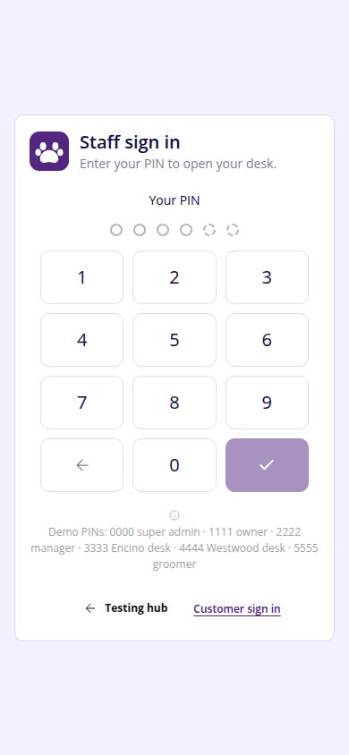
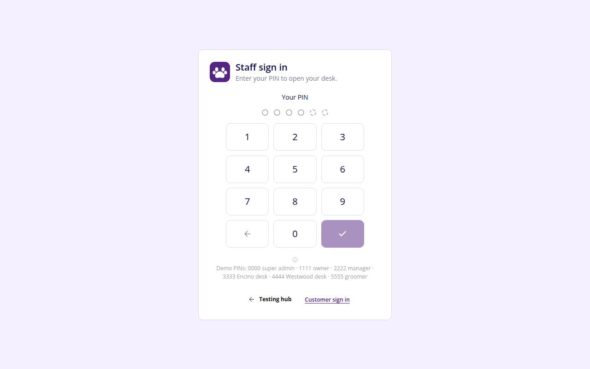

# A-00 · Staff PIN login

## Purpose

Staff sign in with a 4-6 digit PIN. On success the session switches to that employee's user and lands on the role home; location-scoped roles are pinned by the LocationProvider.

## Screenshots

| 390 | 1280 |
| --- | --- |
|  |  |

Dark: `../screenshots/A-00/390-dark.jpg`, `../screenshots/A-00/1280-dark.jpg`.

## Sections (layout order)

1. Brand + title
2. PinPad (masked dots, keypad, keyboard)
3. Demo PIN hint
4. Links: hub, customer sign in

## Data

| Table | Read / write | Notes |
| --- | --- | --- |
| `employees` | read | pin_hash (FNV-1a mock hash), status active |
| `users` | read | role of the employee |
| `locations` | read | toast shows the pinned store |

## Rules

- R-P02 - staff log in with a PIN; PINs are stored hashed

## Logic

- findByPin(pin, holders) merges employees rows with demo holders
- Wrong PIN clears the pad and shows an error

## Components

Card, PinPad, Button, Toast, Icon

## Real vs mock

Hashing is a mock (FNV-1a); the real check moves server-side (Company-OS). Demo PINs: 0000, 1111, 2222, 3333, 4444, 5555, 6666 (Jessica, Westwood groomer, no login user).

## Responsive check (D-016)

Checked at 360, 390, 768, 1280, 1920 on 2026-09-18 (Playwright): no horizontal scroll; DesktopShell sidebar becomes an overlay drawer under 900 px; DataTable rows become cards under 768 px.

## Changelog

- `docs/changelog/0007-foundation.md`
- 0019 - QA fixes: An active employee whose PIN exists but who has no login sees "<name> has no login yet - ask a manager to create one in Employees (A-30)".
