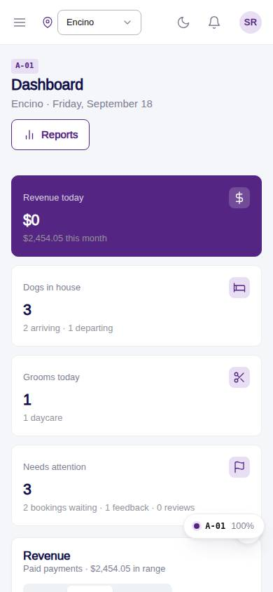
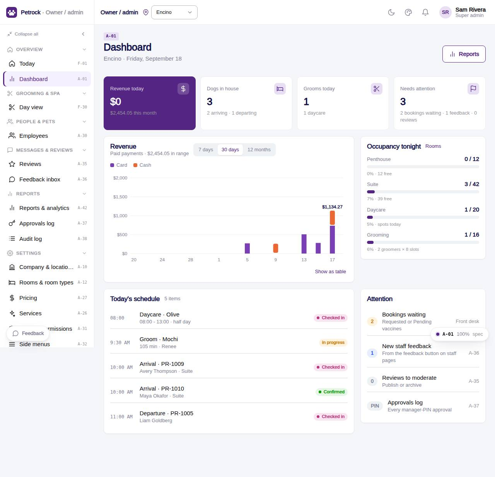

# A-01 · Owner dashboard

## Purpose

The owner's morning view: revenue today and this month, dogs in house, grooms and daycare today, occupancy per room type, a revenue chart over 7 / 30 days or 12 months, today's schedule and an attention list (bookings waiting, feedback, reviews).

## Screenshots

| 390 | 1280 |
| --- | --- |
|  |  |

Dark: `../screenshots/A-01/390-dark.jpg`, `../screenshots/A-01/1280-dark.jpg`.

## Sections (layout order)

1. PageHeader (location, date, Reports link)
2. KPI tiles (revenue, in house, grooms, attention)
3. Revenue chart (stacked card / cash, range switch)
4. Occupancy meters (room types, daycare, grooming)
5. Today's schedule (arrivals, departures, grooms, daycare)
6. Attention list

## Data

| Table | Read / write | Notes |
| --- | --- | --- |
| `bookings` | read |  |
| `appointments` | read |  |
| `daycare_bookings` | read |  |
| `payments` | read |  |
| `rooms` | read |  |
| `room_types` | read |  |
| `capacities` | read |  |
| `feedback` | read |  |
| `reviews` | read |  |
| `vaccine_records` | read |  |
| `customers` | read |  |
| `pets` | read |  |
| `employees` | read |  |

## Rules

- `R-K01` - Two locations: Encino and Westwood
- `R-X45` - Reports and exports respect the location scope
- `R-E10` - Grooming capacity: 2 simultaneous appointments per location
- `R-E11` - Penthouse capacity per location (Encino 12, Westwood 20)

## Logic

- Revenue = paid payments by paid_at day / month, split by method.
- In house = bookings.status checked_in; arriving / departing via dayBucket(today).
- Occupancy tonight = bookings that staysOn(today) per room_type vs active rooms.
- Location scope from useLocation().scope; owner may pick All locations (R-X45).

## Components

PageHeader, StatTile, Card, SegmentedControl, AdminBarChart, AdminMeter, StatusBadge, Badge, Button, EmptyState (all in `/#/dev/components`).

## Real vs mock

Data is real against the mock DataProvider (localStorage) and moves to Company-OS unchanged through the same interface. Deletes and PIN changes write approvals through PinApprovalModal; audit rows are written by useAdminCrud().

## States

- one location
- all locations
- empty schedule
- 7d / 30d / 12m

## Responsive check (D-016)

Checked at 360, 390, 768, 1280, 1920 on 2026-09-18 (Playwright against `vite preview`): no console errors, no horizontal scroll, no content overflow. DesktopShell sidebar becomes an overlay drawer under 900 px; DataTable rows become cards under 768 px (900 px on wide tables); grids collapse to one column under 600 px.

## Changelog

- `docs/changelog/_pending/admin-control-panel.md`
