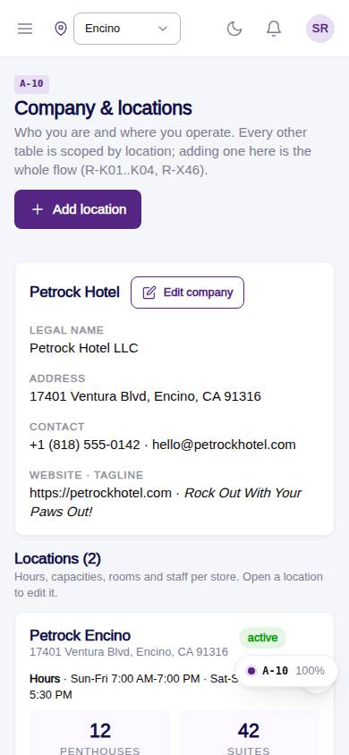
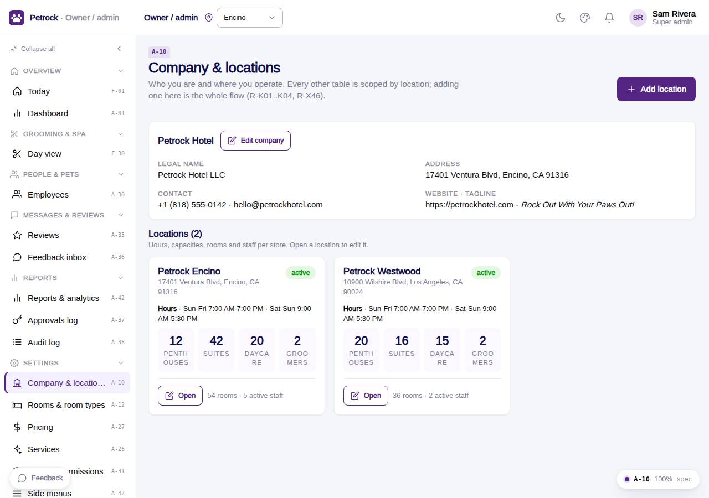

# A-10 · Company & locations

## Purpose

Company profile (name, legal name, address, contact, tagline) and the list of locations with hours, capacities, room and staff counts; entry to the add-location flow.

## Screenshots

| 390 | 1280 |
| --- | --- |
|  |  |

Dark: `../screenshots/A-10/390-dark.jpg`, `../screenshots/A-10/1280-dark.jpg`.

## Sections (layout order)

1. PageHeader (Add location)
2. Company card (edit drawer)
3. Locations grid (cards with hours summary + capacities)

## Data

| Table | Read / write | Notes |
| --- | --- | --- |
| `settings` | read / write |  |
| `locations` | read / write |  |
| `capacities` | read / write |  |
| `rooms` | read / write |  |
| `employees` | read / write |  |

## Rules

- `R-K01` - Two locations: Encino and Westwood
- `R-K02` - Business hours Mon-Fri 7am-7pm, Sat-Sun 9am-5:30pm
- `R-K03` - Company profile with one legal address
- `R-K04` - Per-location working hours by weekday
- `R-X46` - Adding a location is a settings flow, never code
- `R-X41` - Every Control Panel change is written to the audit log

## Logic

- Company profile lives in settings.key = company; defaults from src/tenant/locations company constant.
- summarizeHours() compresses the weekly hours into ranges.
- useAdminCrud(): insert / update / remove write an audit_log row with the diff (R-X41).

## Components

PageHeader, Card, Button, Badge, Section, EmptyState, AdminRecordDrawer, AdminHoursGrid (all in `/#/dev/components`).

## Real vs mock

Data is real against the mock DataProvider (localStorage) and moves to Company-OS unchanged through the same interface. Deletes and PIN changes write approvals through PinApprovalModal; audit rows are written by useAdminCrud().

## States

- locations
- no locations
- editing company

## Responsive check (D-016)

Checked at 360, 390, 768, 1280, 1920 on 2026-09-18 (Playwright against `vite preview`): no console errors, no horizontal scroll, no content overflow. DesktopShell sidebar becomes an overlay drawer under 900 px; DataTable rows become cards under 768 px (900 px on wide tables); grids collapse to one column under 600 px.

## Changelog

- `docs/changelog/_pending/admin-control-panel.md`
