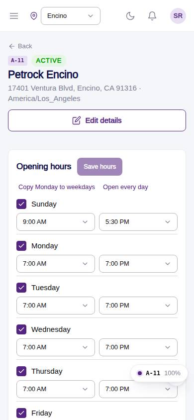
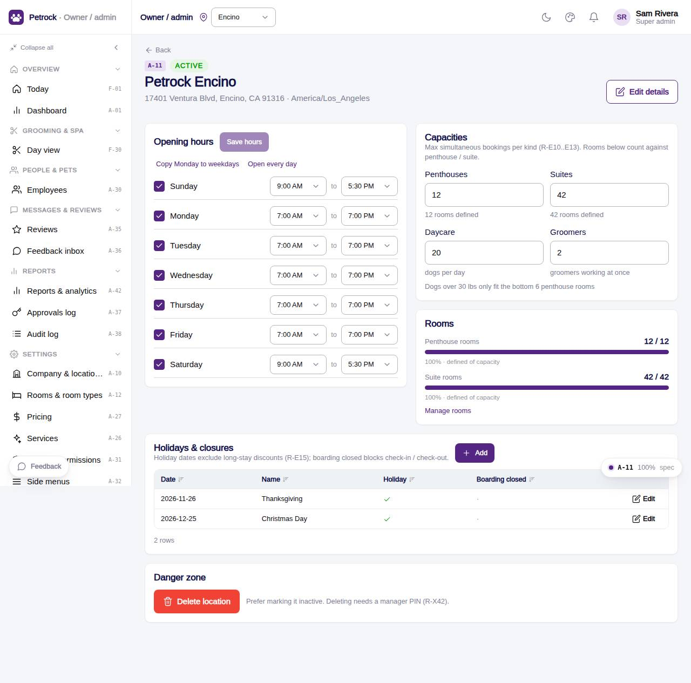

# A-11 · Location detail

## Purpose

Edit one location: identity, weekly opening hours, capacities per kind, holidays and closures, danger zone (PIN-gated delete).

## Screenshots

| 390 | 1280 |
| --- | --- |
|  |  |

Dark variant: not captured for this page (key pages only).

## Sections (layout order)

1. PageHeader (back, status, Edit details)
2. Opening hours (AdminHoursGrid + Save)
3. Capacities (4 inputs) + Rooms meters
4. Holidays & closures (CrudTable)
5. Danger zone

## Data

| Table | Read / write | Notes |
| --- | --- | --- |
| `locations` | read / write |  |
| `capacities` | read / write |  |
| `rooms` | read / write |  |
| `holidays` | read / write |  |
| `approvals` | read / write | written by PinApprovalModal |
| `audit_log` | read / write | every change lands here (R-X41) |

## Rules

- `R-K04` - Per-location working hours by weekday
- `R-E10` - Grooming capacity: 2 simultaneous appointments per location
- `R-E11` - Penthouse capacity per location (Encino 12, Westwood 20)
- `R-E12` - Suite capacity per location (Encino 42, Westwood 16)
- `R-E13` - Daycare capacity per location (Encino 20, Westwood 15)
- `R-E15` - Holidays excluded from long-stay discounts
- `R-X41` - Every Control Panel change is written to the audit log
- `R-X42` - Deleting a settings or staff record needs a manager PIN

## Logic

- Hours save as locations.hours { weekday: { open, close } | null }.
- Capacity edits update or insert capacities rows per kind.
- Holiday dates exclude long-stay discounts (R-E15).
- useAdminCrud(): insert / update / remove write an audit_log row with the diff (R-X41).
- Delete opens PinApprovalModal; the approvals row is written before the remove (R-X42).
- Rows are read with useTable(); the drawer validates required fields and JSON.

## Components

PageHeader, Card, Button, Badge, Input, AdminHoursGrid, AdminMeter, DataTable, AdminRecordDrawer, PinApprovalModal, EmptyState (all in `/#/dev/components`).

## Real vs mock

Data is real against the mock DataProvider (localStorage) and moves to Company-OS unchanged through the same interface. Deletes and PIN changes write approvals through PinApprovalModal; audit rows are written by useAdminCrud().

## States

- viewing
- hours dirty
- editing details
- delete approval
- not found

## Responsive check (D-016)

Checked at 360, 390, 768, 1280, 1920 on 2026-09-18 (Playwright against `vite preview`): no console errors, no horizontal scroll, no content overflow. DesktopShell sidebar becomes an overlay drawer under 900 px; DataTable rows become cards under 768 px (900 px on wide tables); grids collapse to one column under 600 px.

## Changelog

- `docs/changelog/_pending/admin-control-panel.md`
