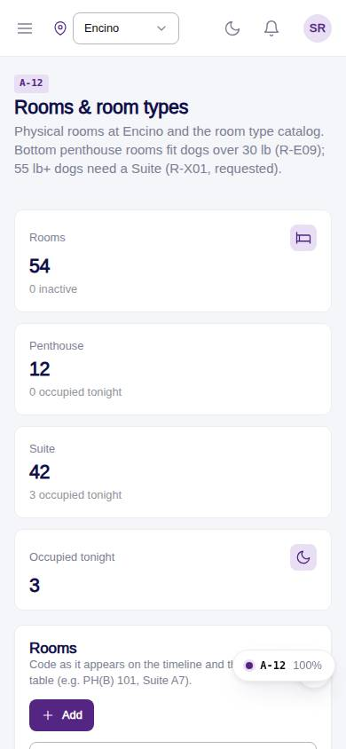
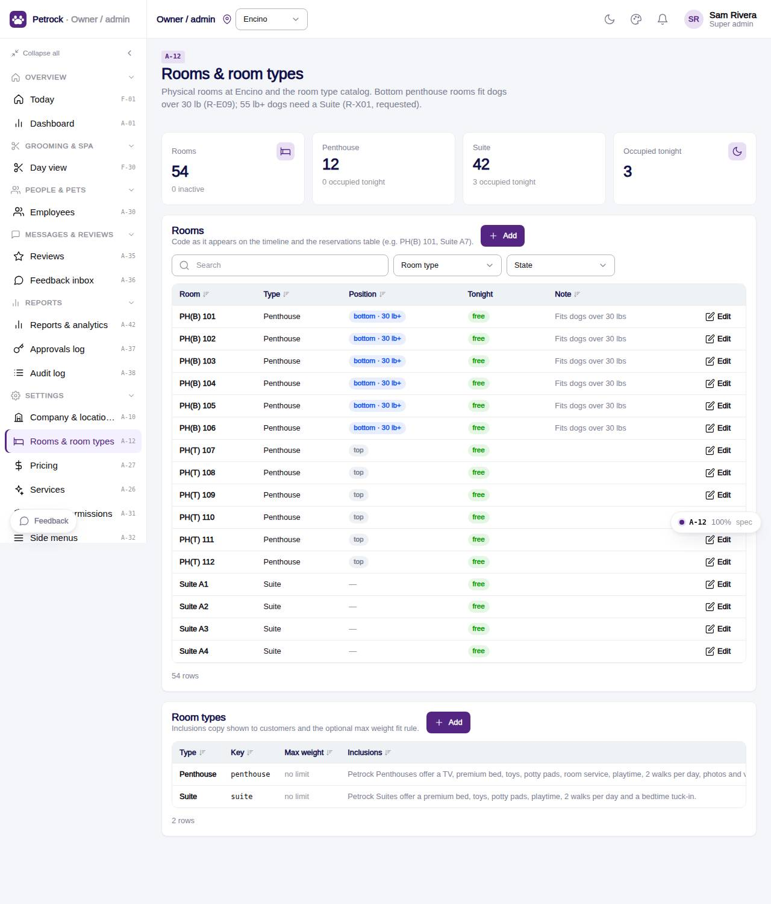

# A-12 · Rooms & room types

## Purpose

Inventory of physical rooms at the current location (code, type, bottom / top position, active) with tonight's occupancy, plus the room type catalog with inclusions and max-weight fit rule.

## Screenshots

| 390 | 1280 |
| --- | --- |
|  |  |

Dark variant: not captured for this page (key pages only).

## Sections (layout order)

1. PageHeader
2. KPI tiles (rooms, per type, occupied tonight)
3. Rooms CrudTable (filters: type, state)
4. Room types CrudTable

## Data

| Table | Read / write | Notes |
| --- | --- | --- |
| `rooms` | read / write |  |
| `room_types` | read / write |  |
| `bookings` | read |  |
| `locations` | read / write |  |
| `approvals` | read / write | written by PinApprovalModal |
| `audit_log` | read / write | every change lands here (R-X41) |

## Rules

- `R-K07` - see docs/rules/business-rules-from-designs.md
- `R-E09` - Dogs over 30 lbs only fit the bottom 6 penthouse rooms
- `R-X01` - Dog 55 lb or greater must be a Suite
- `R-D01` - Room types are Penthouse and Suite
- `R-X41` - Every Control Panel change is written to the audit log
- `R-X42` - Deleting a settings or staff record needs a manager PIN

## Logic

- Occupied tonight = bookings.room_id of stays that staysOn(today).
- Position applies to penthouses only; bottom rooms fit dogs over 30 lb (R-E09).
- useAdminCrud(): insert / update / remove write an audit_log row with the diff (R-X41).
- Delete opens PinApprovalModal; the approvals row is written before the remove (R-X42).
- Rows are read with useTable(); the drawer validates required fields and JSON.

## Components

PageHeader, StatTile, Card, DataTable, Button, Badge, AdminRecordDrawer, Input, Select, Toggle, Textarea, PinApprovalModal, Toast (all in `/#/dev/components`).

## Real vs mock

Data is real against the mock DataProvider (localStorage) and moves to Company-OS unchanged through the same interface. Deletes and PIN changes write approvals through PinApprovalModal; audit rows are written by useAdminCrud().

## States

- one location
- all locations (location column + field)
- editing
- delete approval

## Responsive check (D-016)

Checked at 360, 390, 768, 1280, 1920 on 2026-09-18 (Playwright against `vite preview`): no console errors, no horizontal scroll, no content overflow. DesktopShell sidebar becomes an overlay drawer under 900 px; DataTable rows become cards under 768 px (900 px on wide tables); grids collapse to one column under 600 px.

## Changelog

- `docs/changelog/_pending/admin-control-panel.md`
