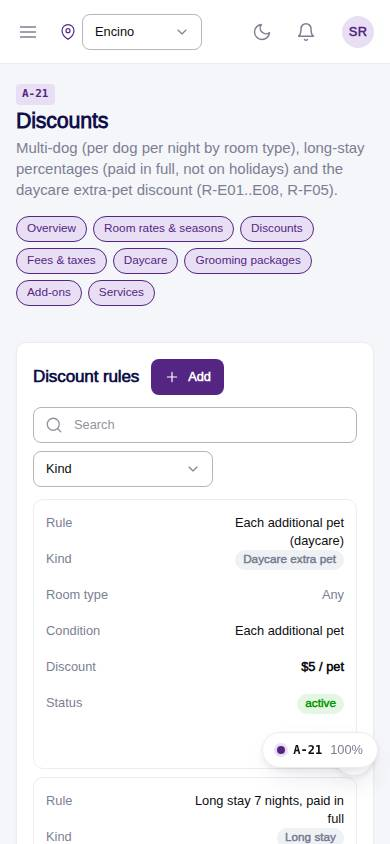
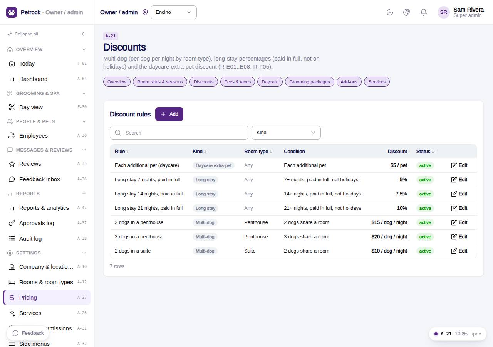

# A-21 · Discounts

## Purpose

Multi-dog (per dog per night by room type), long-stay percentages (paid in full, not on holidays), prepay and the daycare extra-pet discount.

## Screenshots

| 390 | 1280 |
| --- | --- |
|  |  |

Dark variant: not captured for this page (key pages only).

## Sections (layout order)

1. PageHeader + pricing nav
2. Discount rules CrudTable (kind filter)

## Data

| Table | Read / write | Notes |
| --- | --- | --- |
| `discounts` | read / write |  |
| `room_types` | read / write |  |
| `audit_log` | read / write | every change lands here (R-X41) |
| `approvals` | read / write | written by PinApprovalModal |

## Rules

- `R-E01` - Two dogs in a penthouse: $15 off each dog per night
- `R-E02` - Three dogs in a penthouse: $20 off each dog per night
- `R-E03` - Two dogs in a suite: $10 off each dog per night
- `R-E04` - Long stay 7 nights, paid in full, not holiday: 5% off
- `R-E05` - Long stay 14 nights, paid in full, not holiday: 7.5% off
- `R-E06` - Long stay 21 nights, paid in full, not holiday: 10% off
- `R-E08` - Paying in full upfront earns the discount
- `R-F05` - Each additional daycare pet $5 off
- `R-X44` - Pricing pages never hardcode a price
- `R-X41` - Every Control Panel change is written to the audit log

## Logic

- Fields show / hide by kind (dog_count for multi_dog, min_nights + percent for long_stay).
- Engine applies multi-dog per dog per night and long-stay % on the room subtotal when paid in full and no holiday night.
- useAdminCrud(): insert / update / remove write an audit_log row with the diff (R-X41).
- Delete opens PinApprovalModal; the approvals row is written before the remove (R-X42).
- Rows are read with useTable(); the drawer validates required fields and JSON.

## Components

PageHeader, Card, DataTable, Button, Badge, AdminRecordDrawer, Input, Select, Toggle, Textarea, PinApprovalModal, Toast, Chip (all in `/#/dev/components`).

## Real vs mock

Data is real against the mock DataProvider (localStorage) and moves to Company-OS unchanged through the same interface. Deletes and PIN changes write approvals through PinApprovalModal; audit rows are written by useAdminCrud().

## States

- list
- filtered by kind
- editing

## Responsive check (D-016)

Checked at 360, 390, 768, 1280, 1920 on 2026-09-18 (Playwright against `vite preview`): no console errors, no horizontal scroll, no content overflow. DesktopShell sidebar becomes an overlay drawer under 900 px; DataTable rows become cards under 768 px (900 px on wide tables); grids collapse to one column under 600 px.

## Changelog

- `docs/changelog/_pending/admin-control-panel.md`
