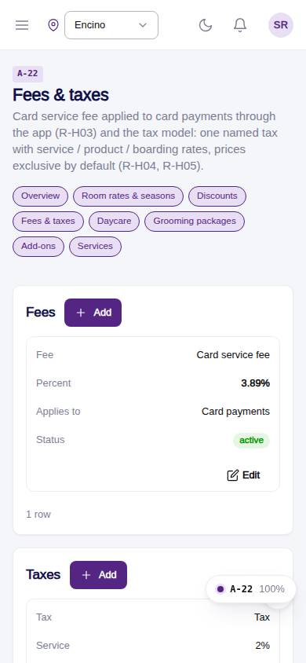
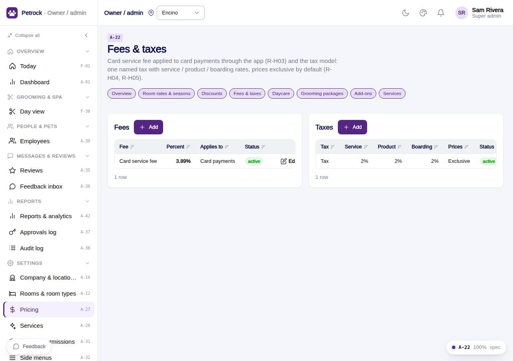

# A-22 · Fees & taxes

## Purpose

Card service fee (3.89 % on card payments through the app) and the tax model: one named tax with service / product / boarding rates, prices exclusive by default.

## Screenshots

| 390 | 1280 |
| --- | --- |
|  |  |

Dark variant: not captured for this page (key pages only).

## Sections (layout order)

1. PageHeader + pricing nav
2. Fees CrudTable
3. Taxes CrudTable

## Data

| Table | Read / write | Notes |
| --- | --- | --- |
| `fees` | read / write |  |
| `taxes` | read / write |  |
| `audit_log` | read / write | every change lands here (R-X41) |
| `approvals` | read / write | written by PinApprovalModal |

## Rules

- `R-H03` - Card (non-cash) fee 3.89% when paying by card through the app
- `R-H04` - Tax 2% shown to customers
- `R-H05` - Prices are exclusive of tax by default
- `R-X44` - Pricing pages never hardcode a price
- `R-X41` - Every Control Panel change is written to the audit log

## Logic

- Engine adds active fees with applies_to card_payments only when paying by card.
- Boarding tax rate applies to room lines, service rate to grooming / daycare.
- useAdminCrud(): insert / update / remove write an audit_log row with the diff (R-X41).
- Delete opens PinApprovalModal; the approvals row is written before the remove (R-X42).
- Rows are read with useTable(); the drawer validates required fields and JSON.

## Components

PageHeader, Card, DataTable, Button, Badge, AdminRecordDrawer, Input, Select, Toggle, Textarea, PinApprovalModal, Toast (all in `/#/dev/components`).

## Real vs mock

Data is real against the mock DataProvider (localStorage) and moves to Company-OS unchanged through the same interface. Deletes and PIN changes write approvals through PinApprovalModal; audit rows are written by useAdminCrud().

## States

- list
- editing

## Responsive check (D-016)

Checked at 360, 390, 768, 1280, 1920 on 2026-09-18 (Playwright against `vite preview`): no console errors, no horizontal scroll, no content overflow. DesktopShell sidebar becomes an overlay drawer under 900 px; DataTable rows become cards under 768 px (900 px on wide tables); grids collapse to one column under 600 px.

## Changelog

- `docs/changelog/_pending/admin-control-panel.md`
