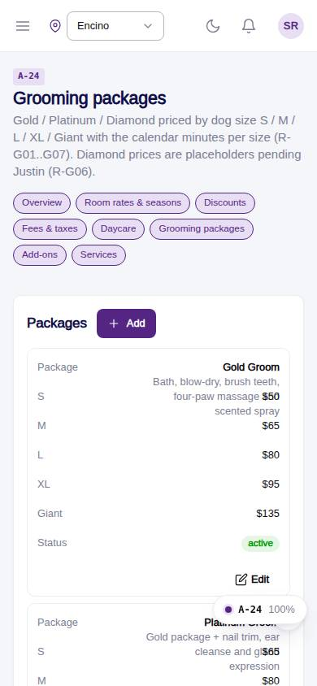
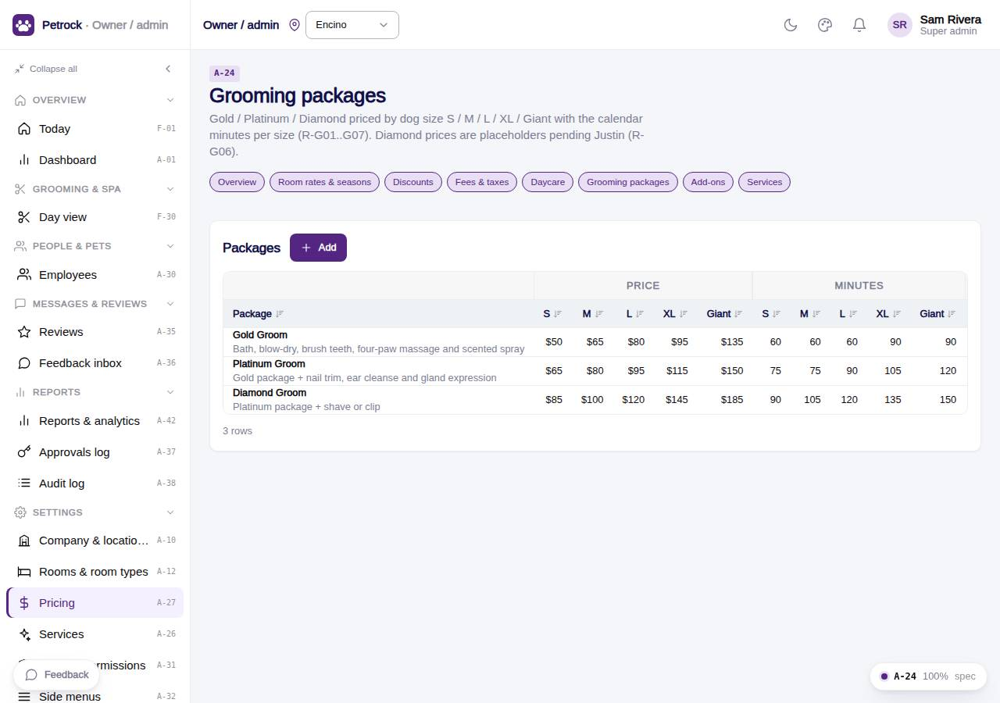

# A-24 · Grooming packages

## Purpose

Gold / Platinum / Diamond priced by dog size S / M / L / XL / Giant with calendar minutes per size and inclusions copy.

## Screenshots

| 390 | 1280 |
| --- | --- |
|  |  |

Dark variant: not captured for this page (key pages only).

## Sections (layout order)

1. PageHeader + pricing nav
2. Packages CrudTable (price + minutes column groups)

## Data

| Table | Read / write | Notes |
| --- | --- | --- |
| `packages` | read / write |  |
| `audit_log` | read / write | every change lands here (R-X41) |
| `approvals` | read / write | written by PinApprovalModal |

## Rules

- `R-G01` - Grooming packages Gold / Platinum / Diamond priced by size S/M/L/XL/Giant
- `R-G02` - Gold Groom prices S $50, M $65, L $80, XL $95, Giant $135
- `R-G04` - Platinum Groom prices S $65, M $80, L $95, XL $115, Giant $150
- `R-G06` - Diamond Groom prices
- `R-X44` - Pricing pages never hardcode a price
- `R-X41` - Every Control Panel change is written to the audit log

## Logic

- packagePrice(pkg, size) and packageMinutes(pkg, size) read price_<size> / minutes_<size>.
- Diamond prices are placeholders (R-G06 requested).
- useAdminCrud(): insert / update / remove write an audit_log row with the diff (R-X41).
- Delete opens PinApprovalModal; the approvals row is written before the remove (R-X42).
- Rows are read with useTable(); the drawer validates required fields and JSON.

## Components

PageHeader, Card, DataTable, Button, Badge, AdminRecordDrawer, Input, Select, Toggle, Textarea, PinApprovalModal, Toast (all in `/#/dev/components`).

## Real vs mock

Data is real against the mock DataProvider (localStorage) and moves to Company-OS unchanged through the same interface. Deletes and PIN changes write approvals through PinApprovalModal; audit rows are written by useAdminCrud().

## States

- list
- editing

## Responsive check (D-016)

Checked at 360, 390, 768, 1280, 1920 on 2026-09-18 (Playwright against `vite preview`): no console errors, no horizontal scroll, no content overflow. DesktopShell sidebar becomes an overlay drawer under 900 px; DataTable rows become cards under 768 px (900 px on wide tables); grids collapse to one column under 600 px.

## Changelog

- `docs/changelog/_pending/admin-control-panel.md`
