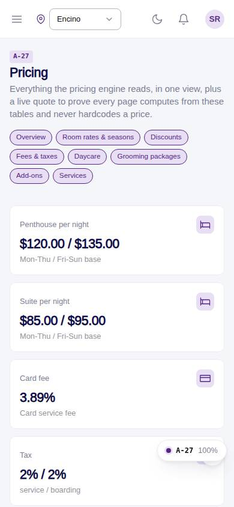
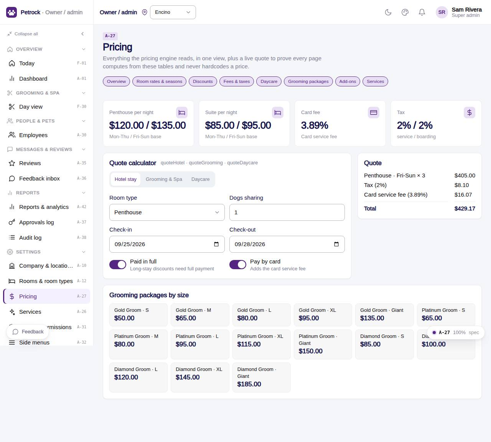

# A-27 · Pricing overview

## Purpose

Everything the pricing engine reads at a glance and a live quote calculator (hotel, grooming, daycare) that proves pages compute from tables and never hardcode a price.

## Screenshots

| 390 | 1280 |
| --- | --- |
|  |  |

Dark: `../screenshots/A-27/390-dark.jpg`, `../screenshots/A-27/1280-dark.jpg`.

## Sections (layout order)

1. PageHeader + pricing nav
2. KPI tiles (base rates, card fee, tax)
3. Quote calculator (tabs) + Quote lines
4. Packages by size grid

## Data

| Table | Read / write | Notes |
| --- | --- | --- |
| `room_types` | read |  |
| `seasons` | read |  |
| `rates` | read |  |
| `discounts` | read |  |
| `fees` | read |  |
| `taxes` | read |  |
| `packages` | read |  |
| `addons` | read |  |
| `daycare_pricing` | read |  |

## Rules

- `R-X44` - Pricing pages never hardcode a price
- `R-D05` - Room rates per night by day kind and season
- `R-E01` - Two dogs in a penthouse: $15 off each dog per night
- `R-F01` - Daycare full day $45 (6 hours or more)
- `R-G01` - Grooming packages Gold / Platinum / Diamond priced by size S/M/L/XL/Giant
- `R-H03` - Card (non-cash) fee 3.89% when paying by card through the app
- `R-H04` - Tax 2% shown to customers

## Logic

- quoteHotel / quoteGrooming / quoteDaycare from src/pricing/engine.ts with the live table rows.
- Read-only page; edits happen on A-20..A-26.

## Components

PageHeader, StatTile, Card, Tabs, Select, Input, Toggle, Checkbox, Chip (all in `/#/dev/components`).

## Real vs mock

Data is real against the mock DataProvider (localStorage) and moves to Company-OS unchanged through the same interface. Deletes and PIN changes write approvals through PinApprovalModal; audit rows are written by useAdminCrud().

## States

- hotel
- grooming
- daycare

## Responsive check (D-016)

Checked at 360, 390, 768, 1280, 1920 on 2026-09-18 (Playwright against `vite preview`): no console errors, no horizontal scroll, no content overflow. DesktopShell sidebar becomes an overlay drawer under 900 px; DataTable rows become cards under 768 px (900 px on wide tables); grids collapse to one column under 600 px.

## Changelog

- `docs/changelog/_pending/admin-control-panel.md`
