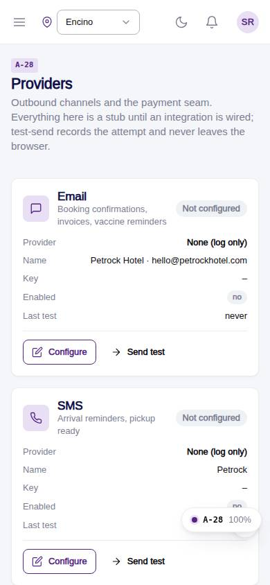
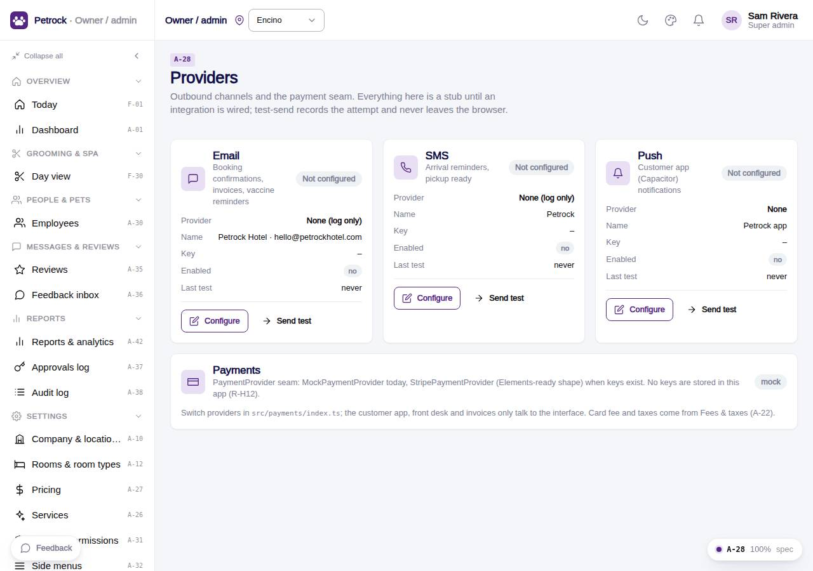

# A-28 · Providers

## Purpose

Email / SMS / push channel configuration (stubs with test-send) and the payment provider seam; no secrets are stored.

## Screenshots

| 390 | 1280 |
| --- | --- |
|  |  |

Dark variant: not captured for this page (key pages only).

## Sections (layout order)

1. PageHeader
2. Provider cards (email, sms, push) with Configure + Send test
3. Payments card

## Data

| Table | Read / write | Notes |
| --- | --- | --- |
| `providers` | read / write |  |
| `audit_log` | read / write | every change lands here (R-X41) |

## Rules

- `R-M13` - Email / SMS / push providers with test-send
- `R-H12` - Payment processing provider is configurable
- `R-X41` - Every Control Panel change is written to the audit log

## Logic

- Send test waits 700 ms and records last_test_at / result; status test_ok only when a provider is chosen and enabled.
- secret_masked keeps at most the last 4 characters.
- Payment provider name from src/payments defaultPaymentProvider.

## Components

PageHeader, Card, Button, Badge, Icon, AdminRecordDrawer, Toast (all in `/#/dev/components`).

## Real vs mock

Data is real against the mock DataProvider (localStorage) and moves to Company-OS unchanged through the same interface. Providers and test-send are stubs; nothing leaves the browser and secrets keep only their last 4 characters.

## States

- not configured
- configured
- test ok
- error

## Responsive check (D-016)

Checked at 360, 390, 768, 1280, 1920 on 2026-09-18 (Playwright against `vite preview`): no console errors, no horizontal scroll, no content overflow. DesktopShell sidebar becomes an overlay drawer under 900 px; DataTable rows become cards under 768 px (900 px on wide tables); grids collapse to one column under 600 px.

## Changelog

- `docs/changelog/_pending/admin-control-panel.md`
