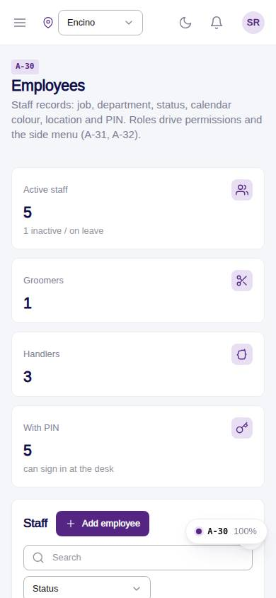
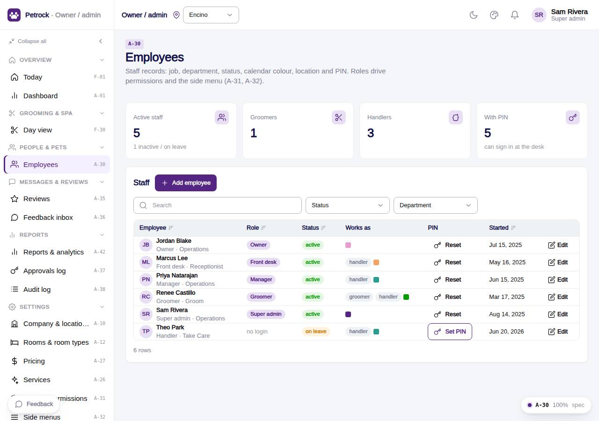

# A-30 · Employees

## Purpose

Staff records at the current location: add / edit (job, department, login user, role, location, status, colour, groomer / handler flags), set or reset a PIN with manager approval.

## Screenshots

| 390 | 1280 |
| --- | --- |
|  |  |

Dark: `../screenshots/A-30/390-dark.jpg`, `../screenshots/A-30/1280-dark.jpg`.

## Sections (layout order)

1. PageHeader
2. KPI tiles (active, groomers, handlers, with PIN)
3. Staff CrudTable (status / department filters, PIN column)
4. Set PIN modal
5. PinApprovalModal

## Data

| Table | Read / write | Notes |
| --- | --- | --- |
| `employees` | read / write |  |
| `users` | read / write |  |
| `locations` | read / write |  |
| `approvals` | read / write | written by PinApprovalModal |
| `audit_log` | read / write | every change lands here (R-X41) |

## Rules

- `R-L01` - Employee statuses Active / Inactive / On leave
- `R-L02` - Employees have a calendar colour, display name and working hours
- `R-L05` - Permission set per role
- `R-X43` - Setting or resetting a staff PIN needs a manager PIN
- `R-X41` - Every Control Panel change is written to the audit log
- `R-X42` - Deleting a settings or staff record needs a manager PIN
- `R-P02` - Staff log in with a 4-6 digit PIN

## Logic

- Role shown from the linked users row; saving with a login updates users.role / location_id.
- New PIN must be 4-6 digits; stored as hashPin(); a manager / owner PIN approves the change and an audit row pin.reset is written (R-X43).
- useAdminCrud(): insert / update / remove write an audit_log row with the diff (R-X41).
- Delete opens PinApprovalModal; the approvals row is written before the remove (R-X42).
- Rows are read with useTable(); the drawer validates required fields and JSON.

## Components

PageHeader, StatTile, Avatar, Modal, Card, DataTable, Button, Badge, AdminRecordDrawer, Input, Select, Toggle, Textarea, PinApprovalModal, Toast (all in `/#/dev/components`).

## Real vs mock

Data is real against the mock DataProvider (localStorage) and moves to Company-OS unchanged through the same interface. PIN hashing is the mock FNV-1a from src/auth/pin.ts; the real check moves server-side.

## States

- list
- editing
- set PIN
- PIN approval
- all locations

## Responsive check (D-016)

Checked at 360, 390, 768, 1280, 1920 on 2026-09-18 (Playwright against `vite preview`): no console errors, no horizontal scroll, no content overflow. DesktopShell sidebar becomes an overlay drawer under 900 px; DataTable rows become cards under 768 px (900 px on wide tables); grids collapse to one column under 600 px.

## Changelog

- `docs/changelog/_pending/admin-control-panel.md`
