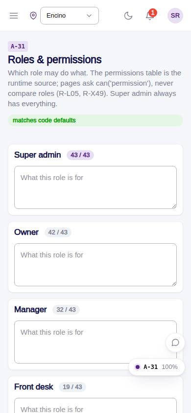
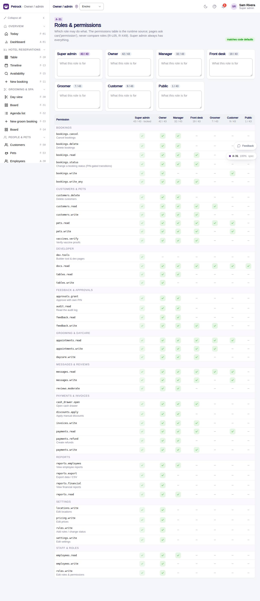

# A-31 · Roles & permissions

## Purpose

Matrix of roles x permission strings backed by the permissions table; role descriptions; reset to code defaults.

## Screenshots

| 390 | 1280 |
| --- | --- |
|  |  |

Dark: `../screenshots/A-31/390-dark.jpg`, `../screenshots/A-31/1280-dark.jpg`.

## Sections (layout order)

1. PageHeader (drift badge)
2. Role cards (count, description)
3. AdminPermissionMatrix
4. Reset to defaults

## Data

| Table | Read / write | Notes |
| --- | --- | --- |
| `permissions` | read / write |  |
| `roles` | read / write |  |
| `audit_log` | read / write | every change lands here (R-X41) |

## Rules

- `R-L05` - Permission set per role
- `R-X49` - Role permissions are editable in a matrix, super admin always keeps everything
- `R-X41` - Every Control Panel change is written to the audit log

## Logic

- granted(perm, role) = super_admin or a permissions row with granted = true.
- Toggle updates / inserts the permissions row (audited).
- Owner cannot drop settings.write; super_admin column is locked.
- Drift = differences vs src/auth/permissions.ts ROLE_PERMISSIONS.

## Components

PageHeader, Card, Badge, Button, Textarea, AdminPermissionMatrix, Toast (all in `/#/dev/components`).

## Real vs mock

Data is real against the mock DataProvider (localStorage) and moves to Company-OS unchanged through the same interface. The permissions table is edited here; SessionProvider still reads the code defaults until the foundation wires the table (R-X49 in_dev).

## States

- matches defaults
- drift
- read-only (no roles.write)

## Responsive check (D-016)

Checked at 360, 390, 768, 1280, 1920 on 2026-09-18 (Playwright against `vite preview`): no console errors, no horizontal scroll, no content overflow. DesktopShell sidebar becomes an overlay drawer under 900 px; DataTable rows become cards under 768 px (900 px on wide tables); grids collapse to one column under 600 px.

## Changelog

- `docs/changelog/_pending/admin-control-panel.md`
- 0019 - QA fixes: Permission descriptions render at 12 px; `bookings.status` is now granted to the front desk (status menu) and shown as such.
