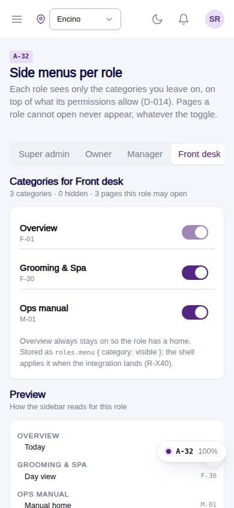
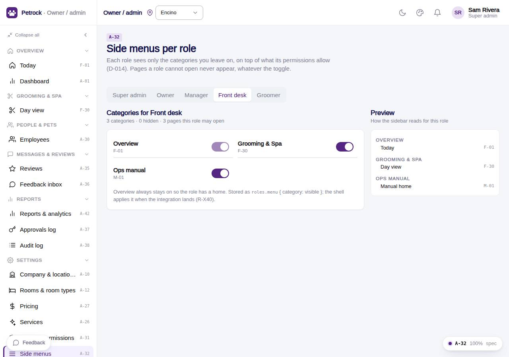

# A-32 · Side menus per role

## Purpose

Owner decides which menu categories each role sees (D-014); stored in roles.menu as category -> visible, with a live preview of that role's sidebar.

## Screenshots

| 390 | 1280 |
| --- | --- |
|  |  |

Dark variant: not captured for this page (key pages only).

## Sections (layout order)

1. PageHeader (reset)
2. Role SegmentedControl
3. Category toggles (with page codes)
4. Sidebar preview

## Data

| Table | Read / write | Notes |
| --- | --- | --- |
| `roles` | read / write |  |
| `audit_log` | read / write | every change lands here (R-X41) |

## Rules

- `R-X40` - Per-role side menu is owner-configurable
- `R-X41` - Every Control Panel change is written to the audit log

## Logic

- Routes with nav and the role in roles[] are grouped by navGroup; Overview is always on.
- Preview greys hidden categories; DesktopShell applies roles.menu once wired (R-X40 in_dev).

## Components

PageHeader, SegmentedControl, Section, Card, Toggle, Button, Toast (all in `/#/dev/components`).

## Real vs mock

Data is real against the mock DataProvider (localStorage) and moves to Company-OS unchanged through the same interface. roles.menu is stored and previewed; DesktopShell applies it once the shared shell reads it (R-X40 in_dev).

## States

- per role
- customised
- default

## Responsive check (D-016)

Checked at 360, 390, 768, 1280, 1920 on 2026-09-18 (Playwright against `vite preview`): no console errors, no horizontal scroll, no content overflow. DesktopShell sidebar becomes an overlay drawer under 900 px; DataTable rows become cards under 768 px (900 px on wide tables); grids collapse to one column under 600 px.

## Changelog

- `docs/changelog/_pending/admin-control-panel.md`
