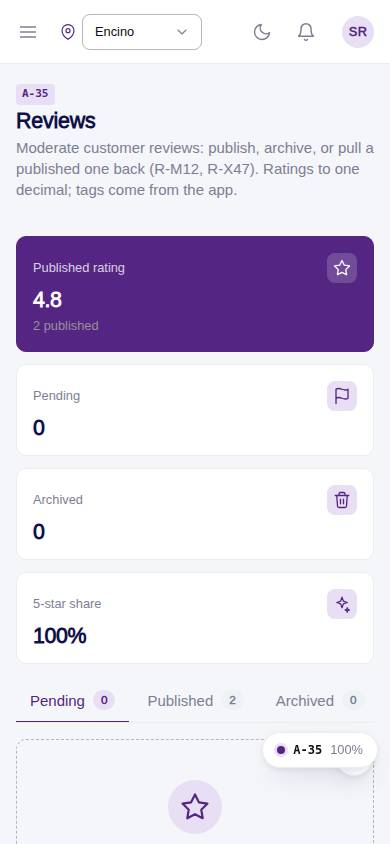
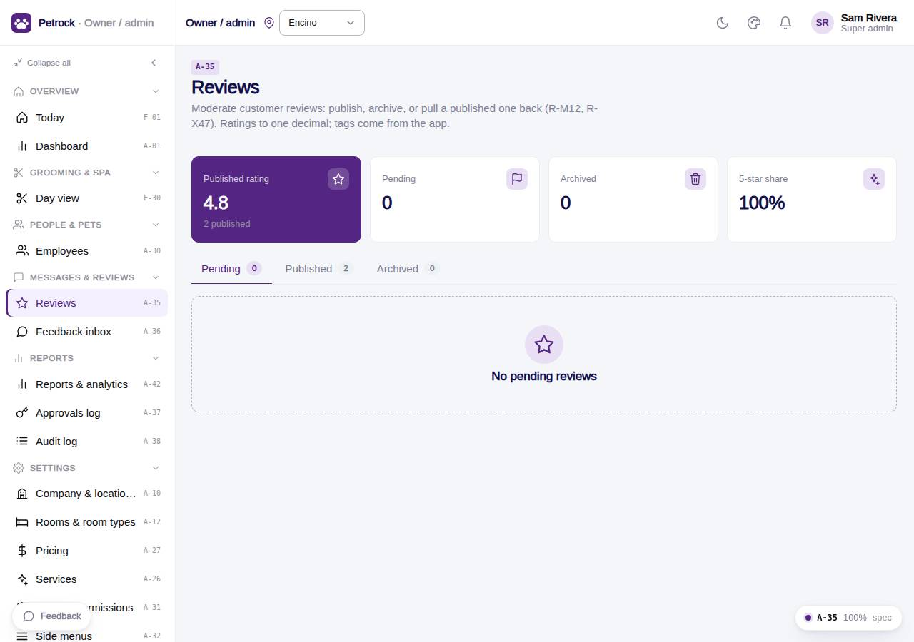

# A-35 · Reviews

## Purpose

Moderate customer reviews at the current location: publish, archive, back to pending; average published rating.

## Screenshots

| 390 | 1280 |
| --- | --- |
|  |  |

Dark variant: not captured for this page (key pages only).

## Sections (layout order)

1. PageHeader
2. KPI tiles
3. Status tabs
4. Review cards (customer, stars, tags, actions)

## Data

| Table | Read / write | Notes |
| --- | --- | --- |
| `reviews` | read / write |  |
| `customers` | read |  |
| `audit_log` | read / write | every change lands here (R-X41) |

## Rules

- `R-M12` - Reviews are moderated: publish or archive
- `R-X47` - Published reviews can be unpublished
- `R-X41` - Every Control Panel change is written to the audit log

## Logic

- Status changes need reviews.moderate and are audited.
- Published can return to pending or be archived (R-X47).

## Components

PageHeader, StatTile, Tabs, Card, Avatar, Badge, Button, EmptyState (all in `/#/dev/components`).

## Real vs mock

Data is real against the mock DataProvider (localStorage) and moves to Company-OS unchanged through the same interface. Deletes and PIN changes write approvals through PinApprovalModal; audit rows are written by useAdminCrud().

## States

- pending
- published
- archived
- empty

## Responsive check (D-016)

Checked at 360, 390, 768, 1280, 1920 on 2026-09-18 (Playwright against `vite preview`): no console errors, no horizontal scroll, no content overflow. DesktopShell sidebar becomes an overlay drawer under 900 px; DataTable rows become cards under 768 px (900 px on wide tables); grids collapse to one column under 600 px.

## Changelog

- `docs/changelog/_pending/admin-control-panel.md`
