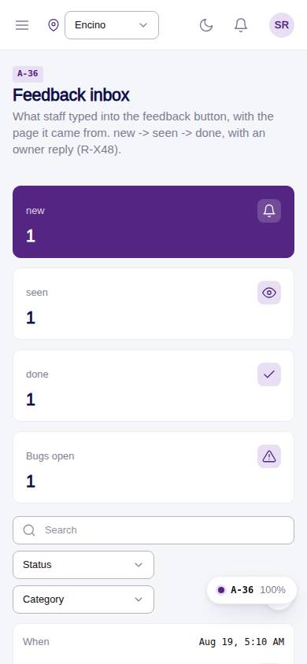
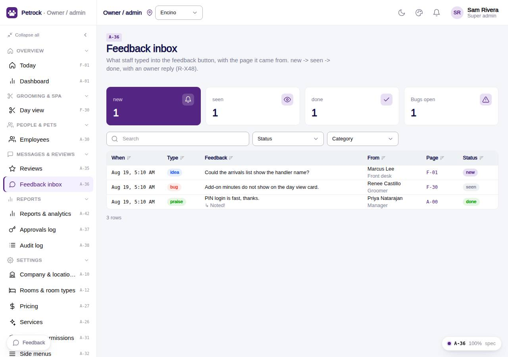

# A-36 · Feedback inbox

## Purpose

Every note staff left through the FeedbackButton, with page code and route; opening marks it seen; the owner replies and closes it.

## Screenshots

| 390 | 1280 |
| --- | --- |
|  |  |

Dark variant: not captured for this page (key pages only).

## Sections (layout order)

1. PageHeader
2. KPI tiles (new / seen / done / bugs)
3. Feedback DataTable (status, category filters)
4. Detail Drawer (reply)

## Data

| Table | Read / write | Notes |
| --- | --- | --- |
| `feedback` | read / write |  |
| `audit_log` | read / write | every change lands here (R-X41) |

## Rules

- `R-X48` - Feedback has a lifecycle new -> seen -> done with an owner reply
- `R-X41` - Every Control Panel change is written to the audit log

## Logic

- Open -> status seen when new.
- Save reply keeps status; Mark done -> done.
- Page code links to the route from the registry.

## Components

PageHeader, StatTile, DataTable, Badge, Drawer, Textarea, Button (all in `/#/dev/components`).

## Real vs mock

Data is real against the mock DataProvider (localStorage) and moves to Company-OS unchanged through the same interface. Deletes and PIN changes write approvals through PinApprovalModal; audit rows are written by useAdminCrud().

## States

- new
- seen
- done
- detail open

## Responsive check (D-016)

Checked at 360, 390, 768, 1280, 1920 on 2026-09-18 (Playwright against `vite preview`): no console errors, no horizontal scroll, no content overflow. DesktopShell sidebar becomes an overlay drawer under 900 px; DataTable rows become cards under 768 px (900 px on wide tables); grids collapse to one column under 600 px.

## Changelog

- `docs/changelog/_pending/admin-control-panel.md`
