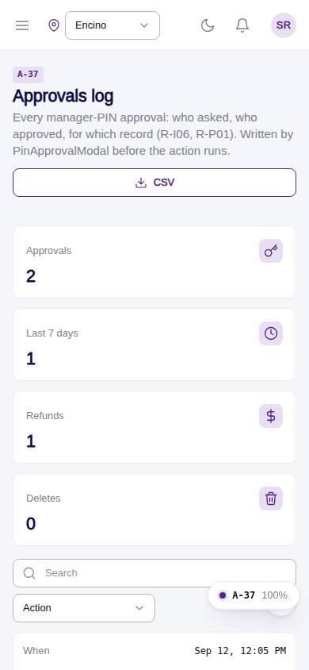
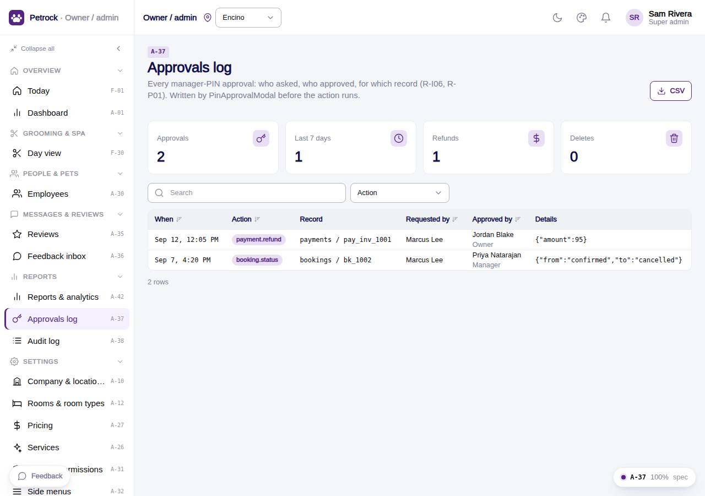

# A-37 · Approvals log

## Purpose

Every manager-PIN approval (who asked, who approved, action, record, details) for the current location, exportable as CSV.

## Screenshots

| 390 | 1280 |
| --- | --- |
|  |  |

Dark variant: not captured for this page (key pages only).

## Sections (layout order)

1. PageHeader (CSV)
2. KPI tiles
3. Approvals DataTable (action filter)

## Data

| Table | Read / write | Notes |
| --- | --- | --- |
| `approvals` | read | written by PinApprovalModal |
| `locations` | read |  |

## Rules

- `R-I06` - Changing a booking status needs a manager PIN
- `R-P01` - Refunds, discounts and deleting records need a manager PIN
- `R-X45` - Reports and exports respect the location scope

## Logic

- Rows are written by PinApprovalModal before the gated action runs.
- CSV export needs reports.export and contains the visible rows (R-X45).

## Components

PageHeader, StatTile, DataTable, Badge, Button (all in `/#/dev/components`).

## Real vs mock

Data is real against the mock DataProvider (localStorage) and moves to Company-OS unchanged through the same interface. Deletes and PIN changes write approvals through PinApprovalModal; audit rows are written by useAdminCrud().

## States

- list
- filtered
- empty

## Responsive check (D-016)

Checked at 360, 390, 768, 1280, 1920 on 2026-09-18 (Playwright against `vite preview`): no console errors, no horizontal scroll, no content overflow. DesktopShell sidebar becomes an overlay drawer under 900 px; DataTable rows become cards under 768 px (900 px on wide tables); grids collapse to one column under 600 px.

## Changelog

- `docs/changelog/_pending/admin-control-panel.md`
