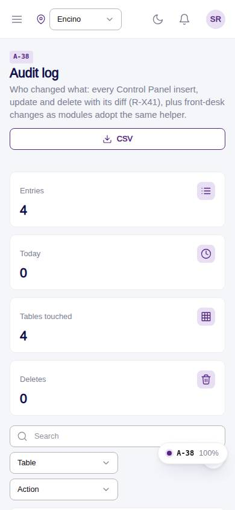
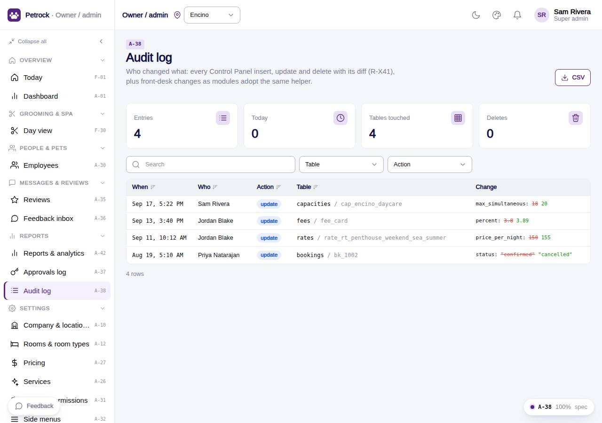

# A-38 · Audit log

## Purpose

Who changed what: every audited insert / update / delete with a before -> after diff, filterable by table and action, exportable as CSV.

## Screenshots

| 390 | 1280 |
| --- | --- |
|  |  |

Dark variant: not captured for this page (key pages only).

## Sections (layout order)

1. PageHeader (CSV)
2. KPI tiles
3. Audit DataTable (table / action filters, diff column)

## Data

| Table | Read / write | Notes |
| --- | --- | --- |
| `audit_log` | read | every change lands here (R-X41) |
| `locations` | read |  |

## Rules

- `R-X41` - Every Control Panel change is written to the audit log
- `R-J08` - see docs/rules/business-rules-from-designs.md
- `R-X45` - Reports and exports respect the location scope

## Logic

- Location-scoped rows plus global (location_id null) rows when one location is selected.
- Diff renders key: old -> new for up to 6 keys.

## Components

PageHeader, StatTile, DataTable, Badge, Button (all in `/#/dev/components`).

## Real vs mock

Data is real against the mock DataProvider (localStorage) and moves to Company-OS unchanged through the same interface. Deletes and PIN changes write approvals through PinApprovalModal; audit rows are written by useAdminCrud().

## States

- list
- filtered
- empty

## Responsive check (D-016)

Checked at 360, 390, 768, 1280, 1920 on 2026-09-18 (Playwright against `vite preview`): no console errors, no horizontal scroll, no content overflow. DesktopShell sidebar becomes an overlay drawer under 900 px; DataTable rows become cards under 768 px (900 px on wide tables); grids collapse to one column under 600 px.

## Changelog

- `docs/changelog/_pending/admin-control-panel.md`
