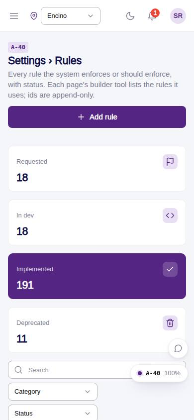
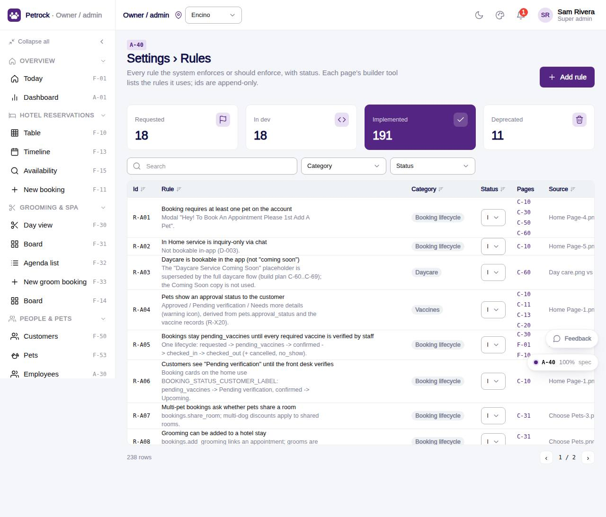

# A-40 · Settings › Rules

## Purpose

The rules registry (D-05) in the owner's Settings menu, with the owner permissions (add rules, change status).

## Screenshots

| 390 | 1280 |
| --- | --- |
|  |  |

## Sections (layout order)

1. Same as D-05

## Data

| Table | Read / write | Notes |
| --- | --- | --- |
| `rules` | read/write |  |

## Rules

- none

## Logic

- Same page component as D-05 with code A-40

## Components

See D-05

## Real vs mock

Real.

## Responsive check (D-016)

Checked at 360, 390, 768, 1280, 1920 on 2026-09-18 (Playwright): no horizontal scroll; DesktopShell sidebar becomes an overlay drawer under 900 px; DataTable rows become cards under 768 px.

## Changelog

- `docs/changelog/0007-foundation.md`
- 0019 - QA fixes: Spec cites R-X80 / R-X41 and the `rules` / `audit_log` tables; 25 catalog rows added to the registry.
