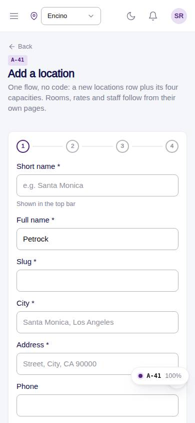
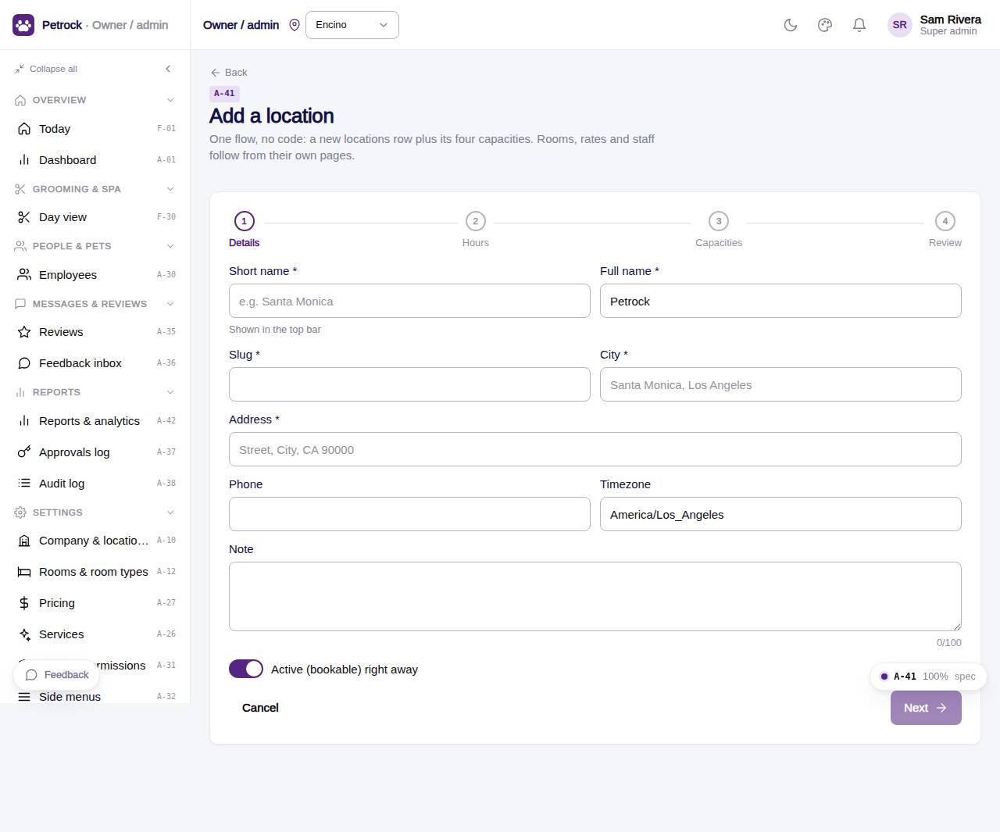

# A-41 · Add location

## Purpose

Four-step flow that creates a location: details, opening hours, capacities, review. Inserts one locations row and four capacities rows; nothing else is needed for the new store to appear everywhere.

## Screenshots

| 390 | 1280 |
| --- | --- |
|  |  |

Dark variant: not captured for this page (key pages only).

## Sections (layout order)

1. PageHeader (back)
2. Stepper
3. Step 1 details
4. Step 2 hours
5. Step 3 capacities
6. Step 4 review
7. Back / Next / Create

## Data

| Table | Read / write | Notes |
| --- | --- | --- |
| `locations` | read / write |  |
| `capacities` | read / write |  |
| `audit_log` | read / write | every change lands here (R-X41) |

## Rules

- `R-K01` - Two locations: Encino and Westwood
- `R-K04` - Per-location working hours by weekday
- `R-X46` - Adding a location is a settings flow, never code
- `R-X41` - Every Control Panel change is written to the audit log

## Logic

- Slug auto-derived from the short name; must be unique and [a-z0-9-].
- Default hours match Encino / Westwood (R-K02).
- Create = insert locations + 4 capacities, audited, then navigate to A-11.

## Components

PageHeader, Card, Stepper, Input, Textarea, Toggle, Button, AdminHoursGrid (all in `/#/dev/components`).

## Real vs mock

Data is real against the mock DataProvider (localStorage) and moves to Company-OS unchanged through the same interface. Deletes and PIN changes write approvals through PinApprovalModal; audit rows are written by useAdminCrud().

## States

- step 1-4
- invalid slug
- creating

## Responsive check (D-016)

Checked at 360, 390, 768, 1280, 1920 on 2026-09-18 (Playwright against `vite preview`): no console errors, no horizontal scroll, no content overflow. DesktopShell sidebar becomes an overlay drawer under 900 px; DataTable rows become cards under 768 px (900 px on wide tables); grids collapse to one column under 600 px.

## Changelog

- `docs/changelog/_pending/admin-control-panel.md`
