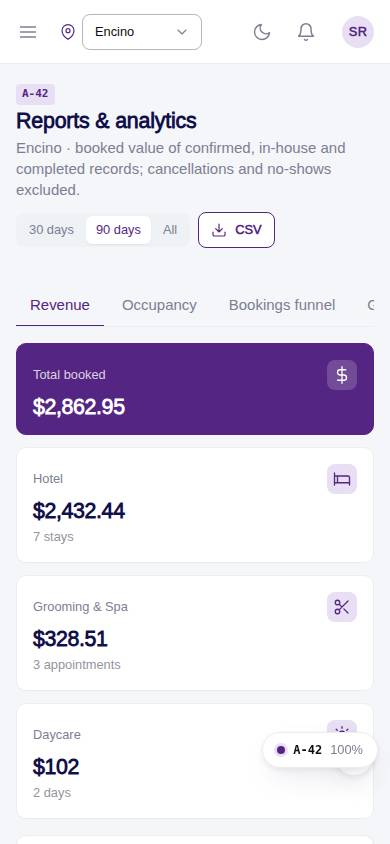
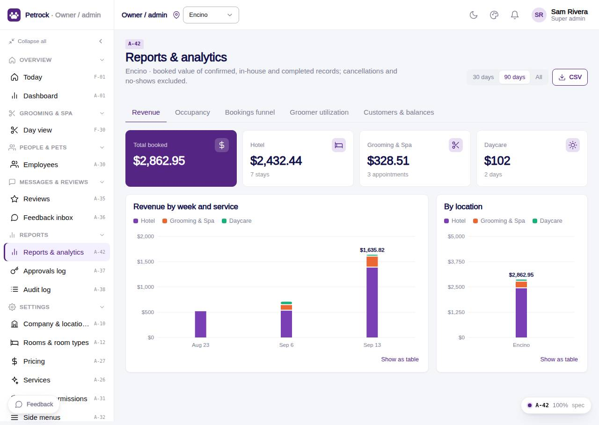

# A-42 · Reports & analytics

## Purpose

Revenue by week / service / location, occupancy per night with RevPAR, bookings funnel by status and source, groomer utilization and package mix, customers with lifetime value and balances; CSV export per tab.

## Screenshots

| 390 | 1280 |
| --- | --- |
|  |  |

Dark: `../screenshots/A-42/390-dark.jpg`, `../screenshots/A-42/1280-dark.jpg`.

## Sections (layout order)

1. PageHeader (range, CSV)
2. Tabs
3. Revenue: KPIs + stacked charts
4. Occupancy: KPIs + line chart + meters
5. Funnel: KPIs + status bars + source chart
6. Groomers: KPIs + utilization meters + package mix
7. Customers: KPIs + table

## Data

| Table | Read / write | Notes |
| --- | --- | --- |
| `bookings` | read |  |
| `appointments` | read |  |
| `daycare_bookings` | read |  |
| `rooms` | read |  |
| `employees` | read |  |
| `locations` | read |  |
| `customers` | read |  |
| `packages` | read |  |

## Rules

- `R-X45` - Reports and exports respect the location scope
- `R-H11` - Customers can carry an outstanding balance
- `R-K01` - Two locations: Encino and Westwood
- `R-E10` - Grooming capacity: 2 simultaneous appointments per location

## Logic

- Revenue = totals of confirmed / checked_in / checked_out (done for grooming) records whose date falls in the range; cancelled and no_show excluded.
- Occupancy % = stays that staysOn(day) / active rooms; RevPAR = room subtotal / (rooms x days).
- Groomer utilization = booked minutes / (working days x 8 h).
- CSV contains exactly the rows behind the active tab (R-X45).

## Components

PageHeader, Tabs, SegmentedControl, StatTile, Card, Button, Badge, DataTable, AdminBarChart, AdminLineChart, AdminMeter (all in `/#/dev/components`).

## Real vs mock

Data is real against the mock DataProvider (localStorage) and moves to Company-OS unchanged through the same interface. Deletes and PIN changes write approvals through PinApprovalModal; audit rows are written by useAdminCrud().

## States

- revenue
- occupancy
- funnel
- groomers
- customers
- 30d / 90d / all

## Responsive check (D-016)

Checked at 360, 390, 768, 1280, 1920 on 2026-09-18 (Playwright against `vite preview`): no console errors, no horizontal scroll, no content overflow. DesktopShell sidebar becomes an overlay drawer under 900 px; DataTable rows become cards under 768 px (900 px on wide tables); grids collapse to one column under 600 px.

## Changelog

- `docs/changelog/_pending/admin-control-panel.md`
