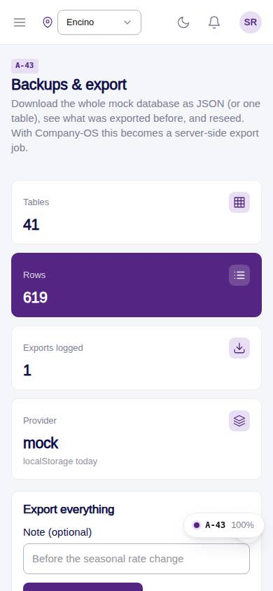
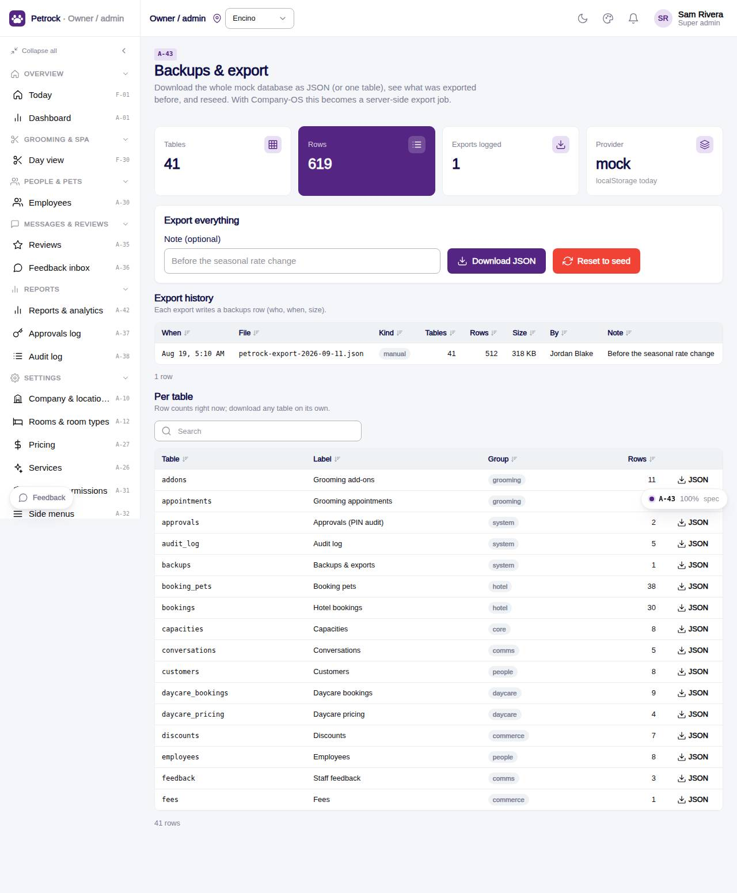

# A-43 · Backups & export

## Purpose

Download the whole mock database (or a single table) as JSON, keep an export log, reseed with manager approval.

## Screenshots

| 390 | 1280 |
| --- | --- |
|  |  |

Dark variant: not captured for this page (key pages only).

## Sections (layout order)

1. PageHeader
2. KPI tiles (tables, rows, exports, provider)
3. Export everything (note, download, reset)
4. Export history DataTable
5. Per table DataTable (JSON per row)

## Data

| Table | Read / write | Notes |
| --- | --- | --- |
| `backups` | read / write |  |
| `approvals` | read / write | written by PinApprovalModal |

## Rules

- `R-X45` - Reports and exports respect the location scope
- `R-P01` - Refunds, discounts and deleting records need a manager PIN

## Logic

- Snapshot = data.list() of every TableDef; file petrock-export-<date>.json; a backups row logs it.
- Reset to seed opens PinApprovalModal then data.reset().

## Components

PageHeader, StatTile, Card, Input, Button, Badge, Section, DataTable, PinApprovalModal (all in `/#/dev/components`).

## Real vs mock

Data is real against the mock DataProvider (localStorage) and moves to Company-OS unchanged through the same interface. The JSON export is a real download of the browser database; scheduled backups arrive with the server.

## States

- idle
- exporting
- reseed approval

## Responsive check (D-016)

Checked at 360, 390, 768, 1280, 1920 on 2026-09-18 (Playwright against `vite preview`): no console errors, no horizontal scroll, no content overflow. DesktopShell sidebar becomes an overlay drawer under 900 px; DataTable rows become cards under 768 px (900 px on wide tables); grids collapse to one column under 600 px.

## Changelog

- `docs/changelog/_pending/admin-control-panel.md`
