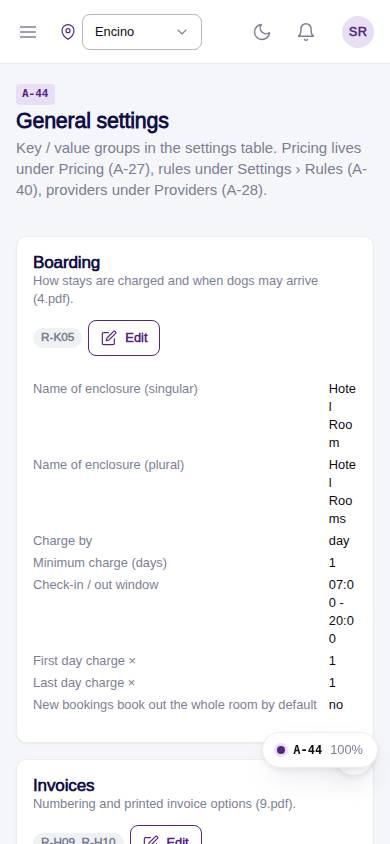
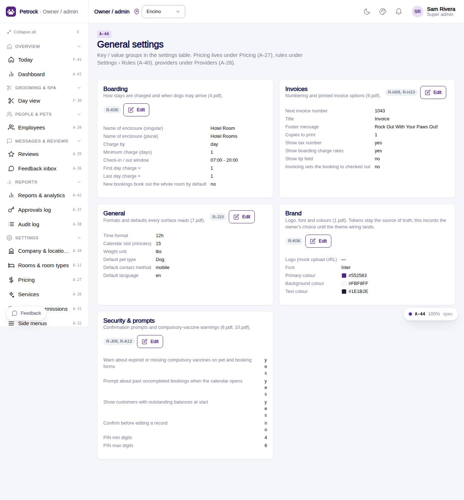

# A-44 · General settings

## Purpose

Key / value setting groups: boarding (enclosure names, charge by, windows), invoices (numbering, footer), general (time format, slot, weight unit, defaults), brand (logo, font, colours), security & prompts.

## Screenshots

| 390 | 1280 |
| --- | --- |
|  |  |

Dark variant: not captured for this page (key pages only).

## Sections (layout order)

1. PageHeader
2. Setting group cards (definition lists + Edit)
3. AdminRecordDrawer per group

## Data

| Table | Read / write | Notes |
| --- | --- | --- |
| `settings` | read / write |  |
| `audit_log` | read / write | every change lands here (R-X41) |

## Rules

- `R-K05` - Enclosure naming configurable ("Hotel Room(s)")
- `R-K06` - Brand setup: logo, font, colours
- `R-H09` - Invoice numbering continues from a configurable next number
- `R-H10` - Invoice footer "Rock Out With Your Paws Out!"
- `R-J09` - see docs/rules/business-rules-from-designs.md
- `R-J10` - General settings: time format, slot interval, weight unit, defaults
- `R-A12` - Prompt about expired or missing compulsory vaccinations on pet and booking forms
- `R-X41` - Every Control Panel change is written to the audit log

## Logic

- Each group is one settings row (key) whose value merges defaults with stored values.
- Save merges the form into the row value and audits it.

## Components

PageHeader, Card, Badge, Button, AdminRecordDrawer (all in `/#/dev/components`).

## Real vs mock

Data is real against the mock DataProvider (localStorage) and moves to Company-OS unchanged through the same interface. Deletes and PIN changes write approvals through PinApprovalModal; audit rows are written by useAdminCrud().

## States

- viewing
- editing group

## Responsive check (D-016)

Checked at 360, 390, 768, 1280, 1920 on 2026-09-18 (Playwright against `vite preview`): no console errors, no horizontal scroll, no content overflow. DesktopShell sidebar becomes an overlay drawer under 900 px; DataTable rows become cards under 768 px (900 px on wide tables); grids collapse to one column under 600 px.

## Changelog

- `docs/changelog/_pending/admin-control-panel.md`
