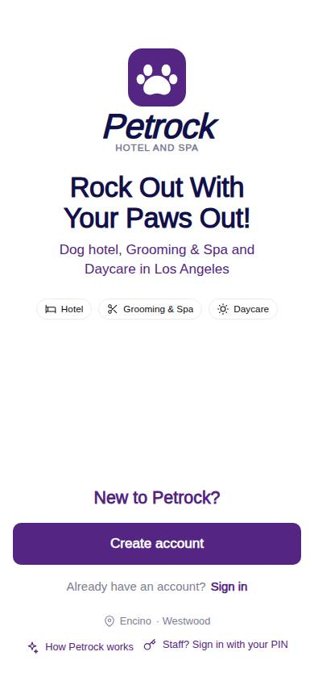
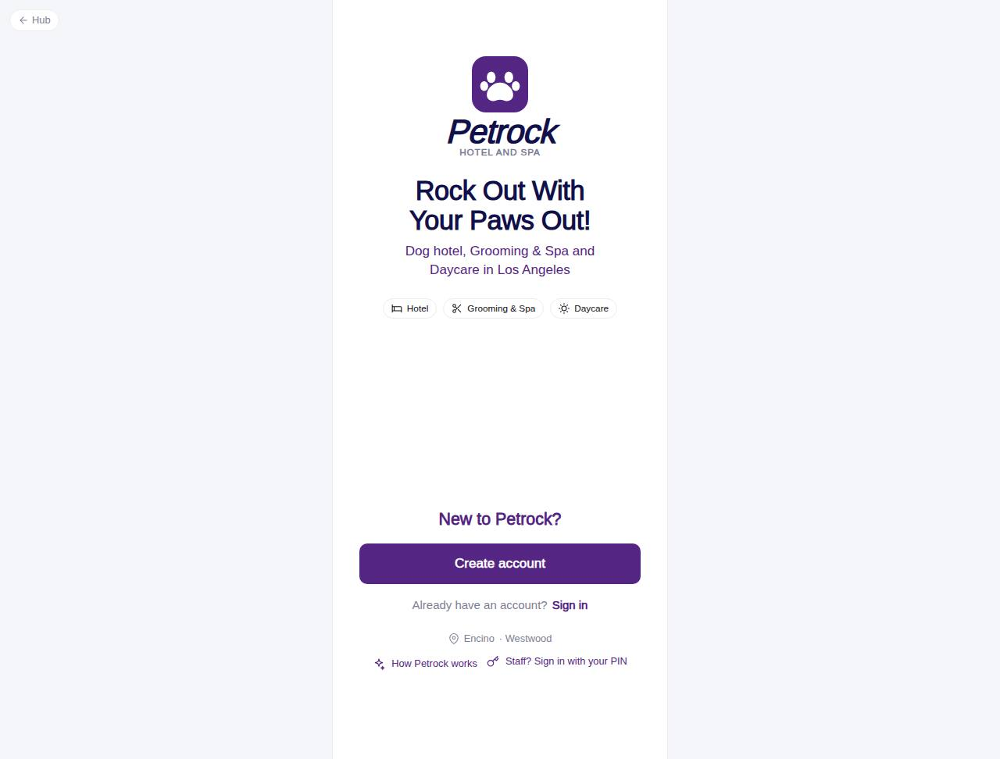

# C-01 · Welcome

## Purpose

First screen of the customer app. A new pet parent sees the brand, the promise and the three services, then taps Create account; a returning one taps Sign in (or Continue as {name} when a session is still alive). The first visit opens the three-slide "How Petrock works" intro.

## Screenshots

| 390 | 1280 |
| --- | --- |
|  |  |

Dark: `../screenshots/C-01/390-dark.jpg`, `../screenshots/C-01/1280-dark.jpg`. Also `../screenshots/C-01/390-intro.jpg` (first-visit intro).

## Sections (layout order)

1. AuthBrandHeader (hero): mark, wordmark, tagline, one-line service list
2. Service chips: Hotel, Grooming & Spa, Daycare
3. CTA block: "New to Petrock?" + Create account, or Continue as {name} when signed in
4. Already have an account? Sign in
5. Locations line from the locations table (Encino · Westwood)
6. How Petrock works (reopens the intro) and Staff? Sign in with your PIN (A-00)
7. OnboardingIntroModal: shown once per browser 700 ms after load

## Data

| Table | Read / write | Notes |
| --- | --- | --- |
| `locations` | read | active locations for the footer line |

## Rules

- R-M14 - example copy from the design, improved per D-018

## Logic

- Signed-in check = hasRole(ALL_SIGNED_IN) and not the public visitor -> Continue button and Sign out link.
- Intro seen flag in localStorage petrock.auth.introSeen; the last slide's button goes to C-03.

## Components

AuthBrandHeader, Button, Chip, Icon, OnboardingIntroModal

## Real vs mock

Everything is real UI; no writes. The intro slides are static copy.

## Responsive check (D-016)

Checked at 360, 390, 768, 1280, 1920 on 2026-09-18 (Playwright, Chromium): no horizontal scroll, no console errors. The PhoneShell keeps a 430 px column on wide screens; two-column name fields collapse under 360 px; the OTP boxes shrink at 360 px; modals become bottom sheets under 600 px.

## Changelog

- `docs/changelog/_pending/customer-auth.md`
