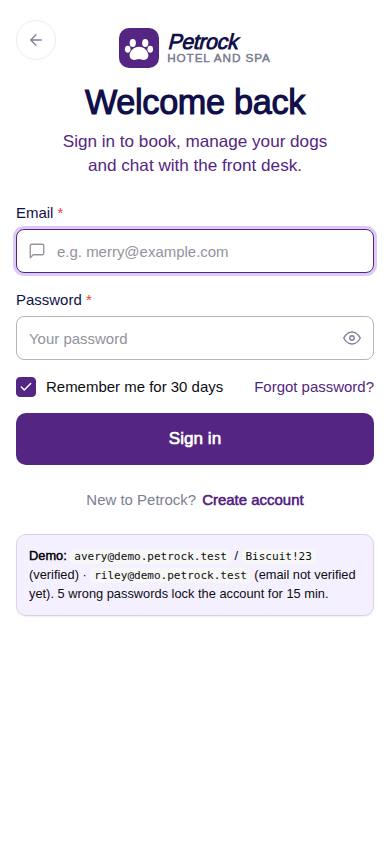
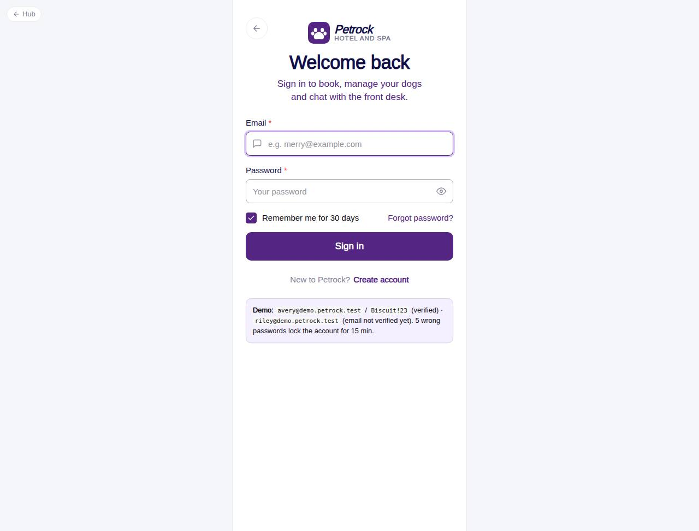

# C-02 · Sign in

## Purpose

A customer signs in with email and password. Friendly errors never say which half was wrong; five failures lock the account for fifteen minutes (C-07); an account whose email is not verified yet gets the OtpVerifyModal and can still skip for now. Replaces the foundation stub at the same path.

## Screenshots

| 390 | 1280 |
| --- | --- |
|  |  |

Dark: `../screenshots/C-02/390-dark.jpg`, `../screenshots/C-02/1280-dark.jpg`. Also `../screenshots/C-02/390-verify-modal.jpg` (unverified email).

## Sections (layout order)

1. AuthBrandHeader (compact, back to C-01) "Welcome back"
2. FormAlert with the error and a Forgot password? action
3. Email (type email, autocomplete email)
4. PasswordField (show / hide)
5. Remember me for 30 days + Forgot password? link
6. Sign in (loading state)
7. New to Petrock? Create account
8. Demo credentials card (mock provider only)
9. OtpVerifyModal when email_verified = false (Skip for now signs in anyway)
10. Already signed in: Continue as {name} / Use another account

## Data

| Table | Read / write | Notes |
| --- | --- | --- |
| `auth_credentials` | read / write | password hash compare, failed_attempts, locked_until, last_sign_in_at, remember_me |
| `auth_codes` | write | verify_email code when the email is unverified |
| `auth_events` | write | sign_in, sign_in_failed, locked, otp_sent, email_verified |
| `settings` | read | auth.policy thresholds |
| `users` | read | session switches to the credential user_id |

## Rules

- R-X31 - lockout after policy.maxFailedAttempts for policy.lockMinutes
- R-X33 - unverified email opens the verify modal; browsing allowed
- R-X34 - same message for unknown email and wrong password
- R-X35 - remember me stored (enforcement pending)
- R-X37 - every outcome logged
- R-M14 - placeholder copy

## Logic

- authService.signIn(data, email, password, rememberMe): normalise email, find credential, check lock, compare mock hash, count / reset failures.
- Locked -> navigate /auth/locked?email=; invalid -> FormAlert; unverified -> issueCode + modal; success -> switchUser + toast + ROLE_HOME.customer (/app).

## Components

AuthBrandHeader, Input, PasswordField, Checkbox, Button, Card, FormAlert, OtpVerifyModal, Toast

## Real vs mock

Password hashing is FNV-1a (mock); code delivery is mocked (demo hint shows the code); the real provider does both server-side behind the same authService functions. Demo: avery@demo.petrock.test / Biscuit!23; riley@demo.petrock.test is unverified.

## Responsive check (D-016)

Checked at 360, 390, 768, 1280, 1920 on 2026-09-18 (Playwright, Chromium): no horizontal scroll, no console errors. The PhoneShell keeps a 430 px column on wide screens; two-column name fields collapse under 360 px; the OTP boxes shrink at 360 px; modals become bottom sheets under 600 px.

## Changelog

- `docs/changelog/_pending/customer-auth.md`
