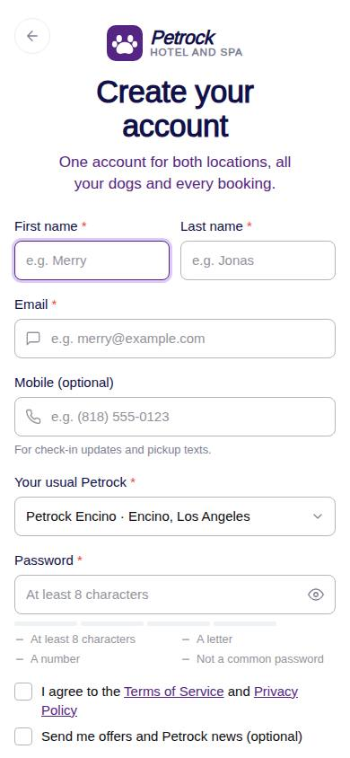
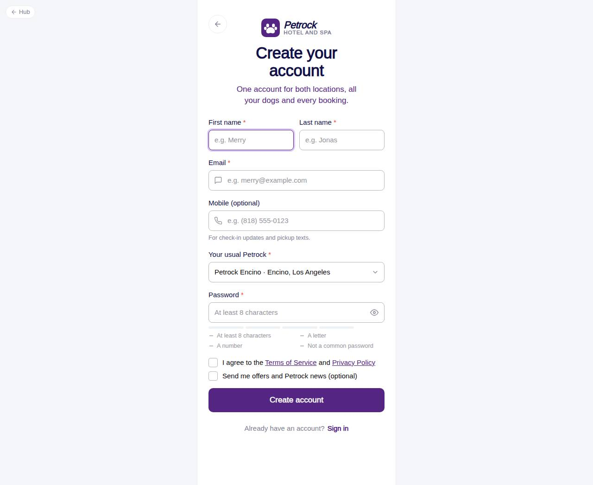

# C-03 · Create account

## Purpose

A new pet parent creates an account: names, email, optional mobile, the Petrock they visit most, a password with a live strength meter, terms acceptance and an optional marketing opt-in. On success a verification code is sent and the flow continues to C-04.

## Screenshots

| 390 | 1280 |
| --- | --- |
|  |  |

Dark: `../screenshots/C-03/390-dark.jpg`, `../screenshots/C-03/1280-dark.jpg`.

## Sections (layout order)

1. AuthBrandHeader (compact, back) "Create your account"
2. FormAlert (duplicate email with a Sign in action)
3. First name + Last name (two columns, one under 360 px)
4. Email
5. Mobile (optional) with hint
6. Your usual Petrock (Select from locations)
7. PasswordField with strength meter and checklist
8. Terms checkbox (required) + marketing checkbox
9. Create account (loading)
10. Already have an account? Sign in

## Data

| Table | Read / write | Notes |
| --- | --- | --- |
| `users` | write | role customer, active |
| `customers` | write | first / last name, email, mobile, home_location_id, marketing_opt_in |
| `auth_credentials` | read / write | duplicate check; new row with email_verified false and terms_accepted_at |
| `auth_codes` | write | verify_email code |
| `auth_events` | write | sign_up, otp_sent |
| `locations` | read | Select options |
| `settings` | read | auth.policy.passwordMinLength |

## Rules

- R-X30 - password policy and meter
- R-X36 - users + customers + credentials created together; duplicate email refused
- R-X38 - terms required, marketing optional
- R-X37 - events
- R-M14 - example placeholders

## Logic

- Validation runs on blur (touched fields) and on submit: names, email shape, optional US phone shape, password policy, terms.
- authService.signUp returns email_taken when auth_credentials or users already has the email.
- Navigate to /auth/verify?email=&next=/auth/welcome.

## Components

AuthBrandHeader, Input, Select, PasswordField, Checkbox, Button, FormAlert

## Real vs mock

Rows are written to the mock DB (visible in /dev/tables). Terms / Privacy links point to the public site until the settings module ships legal pages (C-7x).

## Responsive check (D-016)

Checked at 360, 390, 768, 1280, 1920 on 2026-09-18 (Playwright, Chromium): no horizontal scroll, no console errors. The PhoneShell keeps a 430 px column on wide screens; two-column name fields collapse under 360 px; the OTP boxes shrink at 360 px; modals become bottom sheets under 600 px.

## Changelog

- `docs/changelog/_pending/customer-auth.md`
