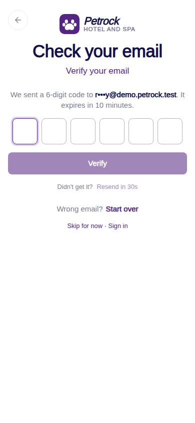
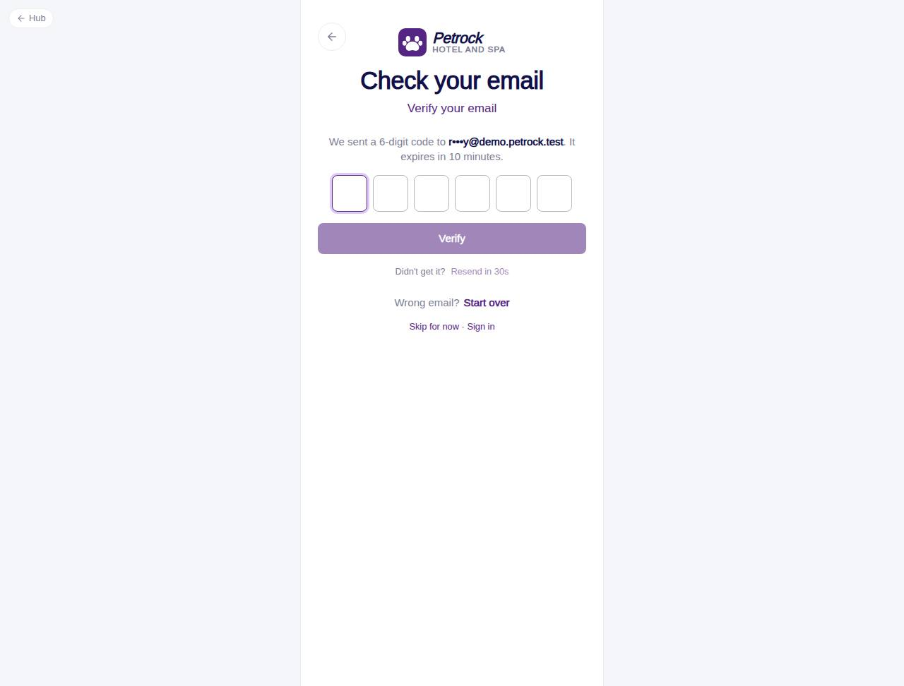

# C-04 · Verify code

## Purpose

The customer types the six-digit code emailed after sign-up (or from a deep link). The code verifies as soon as the last digit lands; resend has a cooldown; on success the session switches to the new account and continues to C-08.

## Screenshots

| 390 | 1280 |
| --- | --- |
|  |  |

Dark: `../screenshots/C-04/390-dark.jpg`, `../screenshots/C-04/1280-dark.jpg`.

## Sections (layout order)

1. AuthBrandHeader (compact, back) "Check your email"
2. OtpVerifyPanel: sent-to line (masked email), OtpCodeInput, Verify, Resend in {n}s
3. Demo code hint (mock only, reads the live code row)
4. Wrong email? Start over · Skip for now · Sign in
5. No-email state: FormAlert pointing to Create account

## Data

| Table | Read / write | Notes |
| --- | --- | --- |
| `auth_codes` | read / write | latest live code for email + purpose; attempts, consumed_at |
| `auth_credentials` | read / write | email_verified, email_verified_at |
| `auth_events` | write | otp_sent, otp_failed, email_verified |
| `settings` | read | codeLength, resendSeconds, codeTtlMinutes, maxCodeAttempts |

## Rules

- R-X32 - code rules
- R-X33 - verification before the first booking
- R-X37 - events

## Logic

- Query params: email (required), purpose (verify_email | sign_in), next (default /auth/welcome).
- authService.verifyCode: no live code -> "Request a new one"; expired -> consumed + error; attempts >= max -> consumed + error; wrong -> attempts + 1; right -> consumed + credential verified.
- onVerified: switchUser(credential.user_id) then navigate(next) after 500 ms.

## Components

AuthBrandHeader, OtpVerifyPanel, OtpCodeInput, FormAlert, Button

## Real vs mock

Codes are stored in plain text in the mock so the demo hint can show them; production hashes them and sends email / SMS through Company-OS.

## Responsive check (D-016)

Checked at 360, 390, 768, 1280, 1920 on 2026-09-18 (Playwright, Chromium): no horizontal scroll, no console errors. The PhoneShell keeps a 430 px column on wide screens; two-column name fields collapse under 360 px; the OTP boxes shrink at 360 px; modals become bottom sheets under 600 px.

## Changelog

- `docs/changelog/_pending/customer-auth.md`
