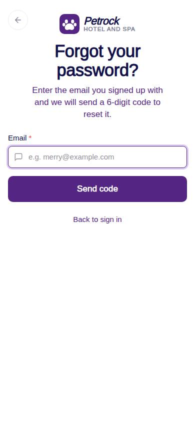
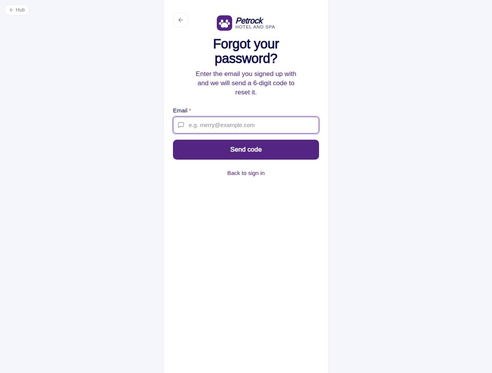

# C-05 · Forgot password

## Purpose

A customer who forgot the password enters the email; a reset code is sent when the account exists, and the screen shows the same confirmation either way. Continues to C-06.

## Screenshots

| 390 | 1280 |
| --- | --- |
|  |  |

Dark variants: not a key page (theme tokens apply; checked in the browser).

## Sections (layout order)

1. AuthBrandHeader (compact, back to C-02) "Forgot your password?" with corrected helper copy
2. Email (prefilled from ?email=)
3. Send code
4. Sent state: FormAlert (success) + demo hint + Enter the code / Use a different email
5. Back to sign in

## Data

| Table | Read / write | Notes |
| --- | --- | --- |
| `auth_credentials` | read | does the email exist |
| `auth_codes` | write | reset_password code (known emails only) |
| `auth_events` | write | password_reset_requested {known}, otp_sent |
| `settings` | read | codeLength, codeTtlMinutes for the copy |

## Rules

- R-M15 - copy fixed
- R-X32 - code rules
- R-X34 - no account enumeration
- R-X37 - events

## Logic

- authService.requestPasswordReset logs the request, issues a code only for known emails, resolves identically otherwise.
- The mock shows whether a code was issued in a demo hint; production shows only the generic line.

## Components

AuthBrandHeader, Input, Button, FormAlert

## Real vs mock

Delivery is mocked. The right-hand Figma variant (centered card, text Back link) inspired the layout; the sign-up header was dropped.

## Responsive check (D-016)

Checked at 360, 390, 768, 1280, 1920 on 2026-09-18 (Playwright, Chromium): no horizontal scroll, no console errors. The PhoneShell keeps a 430 px column on wide screens; two-column name fields collapse under 360 px; the OTP boxes shrink at 360 px; modals become bottom sheets under 600 px.

## Changelog

- `docs/changelog/_pending/customer-auth.md`
