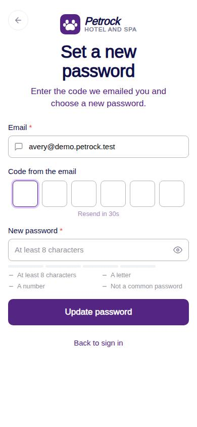
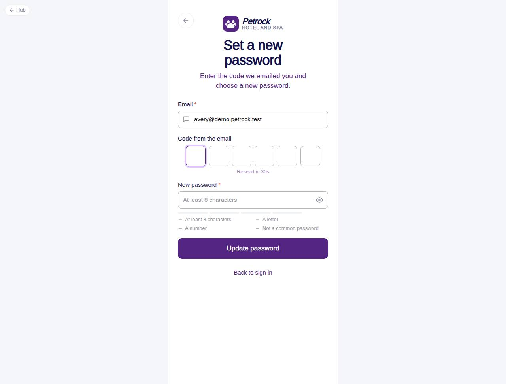

# C-06 · Reset password

## Purpose

The customer enters the emailed code and a new password. A successful reset clears any lockout, marks the email verified and returns to sign in.

## Screenshots

| 390 | 1280 |
| --- | --- |
|  |  |

Dark variants: not a key page (theme tokens apply; checked in the browser).

## Sections (layout order)

1. AuthBrandHeader (compact, back to C-05) "Set a new password"
2. Email (prefilled, editable)
3. Code from the email: OtpCodeInput + Resend in {n}s
4. Demo code hint (mock only)
5. PasswordField (new password, strength meter)
6. Update password
7. Back to sign in

## Data

| Table | Read / write | Notes |
| --- | --- | --- |
| `auth_credentials` | write | password_hash, password_changed_at, failed_attempts 0, locked_until null, email_verified true |
| `auth_codes` | read / write | verify + consume the reset_password code |
| `auth_events` | write | password_reset, otp_failed |
| `settings` | read | policy |

## Rules

- R-X30 - policy on the new password
- R-X31 - reset clears the lock
- R-X32 - code rules
- R-M15 - copy
- R-X37 - events

## Logic

- Submit validates email shape, code length and password policy first, then authService.resetPassword = verifyCode + update.
- Code errors clear the boxes (OtpCodeInput); success toasts and navigates to /auth/sign-in.

## Components

AuthBrandHeader, Input, OtpCodeInput, PasswordField, Button, FormAlert, Toast

## Real vs mock

Mock hash and mock delivery; same seam as C-02.

## Responsive check (D-016)

Checked at 360, 390, 768, 1280, 1920 on 2026-09-18 (Playwright, Chromium): no horizontal scroll, no console errors. The PhoneShell keeps a 430 px column on wide screens; two-column name fields collapse under 360 px; the OTP boxes shrink at 360 px; modals become bottom sheets under 600 px.

## Changelog

- `docs/changelog/_pending/customer-auth.md`
