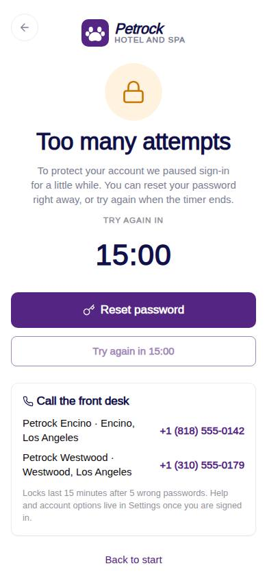
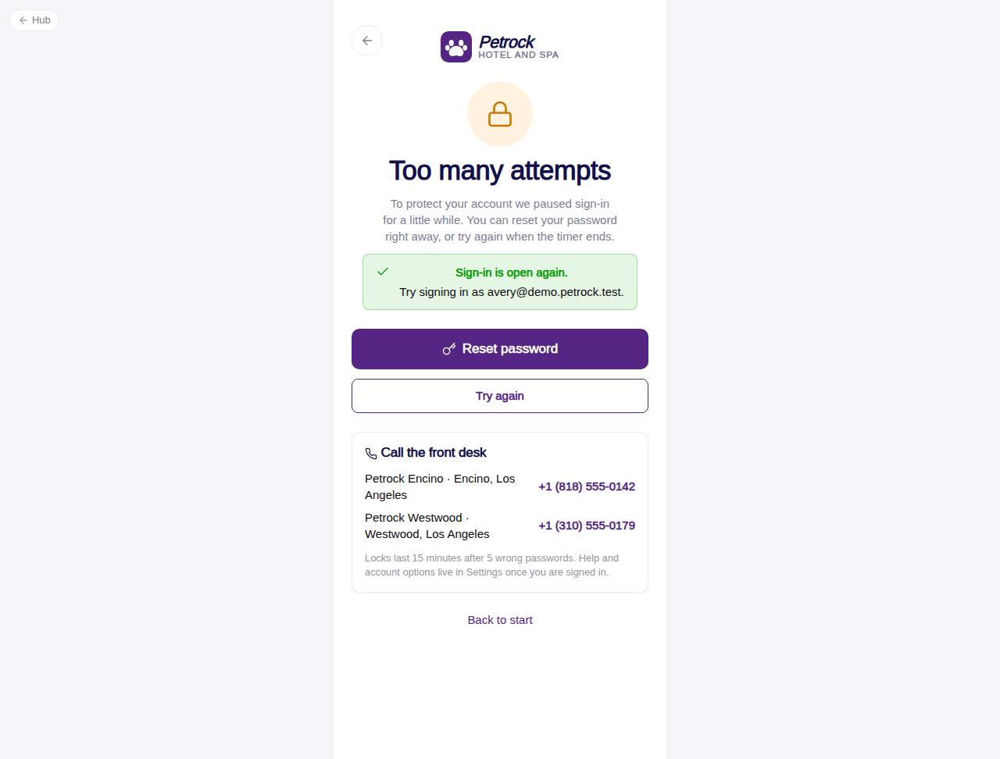

# C-07 · Account locked

## Purpose

After too many failed sign-ins the customer lands here: a calm explanation, a countdown to when sign-in reopens, a one-tap password reset (which clears the lock) and the front-desk phone numbers.

## Screenshots

| 390 | 1280 |
| --- | --- |
|  |  |

Dark variants: not a key page (theme tokens apply; checked in the browser).

## Sections (layout order)

1. AuthBrandHeader (compact, back)
2. Lock mark + "Too many attempts" + body
3. Countdown mm:ss (or a success FormAlert once unlocked)
4. Reset password (C-05 with email) + Try again (enabled at 0)
5. Card: Call the front desk with each location's phone (tel: links)
6. Policy line + Back to start

## Data

| Table | Read / write | Notes |
| --- | --- | --- |
| `auth_credentials` | read | locked_until for ?email= |
| `locations` | read | names and phones |
| `settings` | read | lockMinutes, maxFailedAttempts for the copy |

## Rules

- R-X31 - lockout
- R-X39 - help / account options live in Settings (requested, C-70..C-79)

## Logic

- useCountdown(locked_until) ticks every 500 ms; at 0 the page flips to the unlocked state.

## Components

AuthBrandHeader, Card, Button, FormAlert, Icon

## Real vs mock

Real against the mock DB (the lock is written by C-02). Contact link goes to the front desk phones; the in-app help page belongs to the settings module.

## Responsive check (D-016)

Checked at 360, 390, 768, 1280, 1920 on 2026-09-18 (Playwright, Chromium): no horizontal scroll, no console errors. The PhoneShell keeps a 430 px column on wide screens; two-column name fields collapse under 360 px; the OTP boxes shrink at 360 px; modals become bottom sheets under 600 px.

## Changelog

- `docs/changelog/_pending/customer-auth.md`
