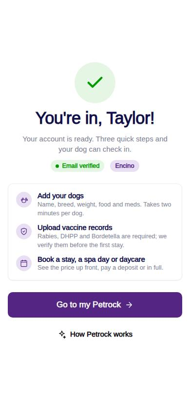
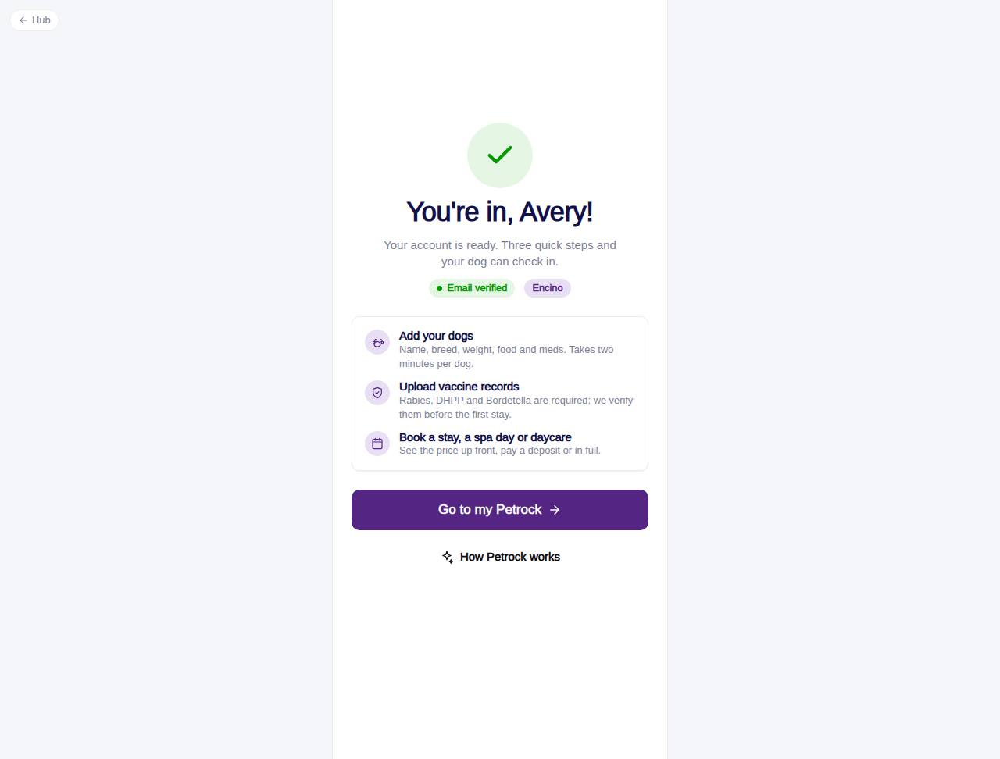

# C-08 · Account created

## Purpose

Success screen after email verification: greets the new customer by first name, shows verification and home-location badges, lists the three next steps and opens the app. The intro carousel is available again here.

## Screenshots

| 390 | 1280 |
| --- | --- |
|  |  |

Dark: `../screenshots/C-08/390-dark.jpg`, `../screenshots/C-08/1280-dark.jpg`.

## Sections (layout order)

1. Success mark + "You're in, {name}!"
2. Badges: Email verified / not verified, home location
3. Card with three steps: add dogs, upload vaccine records, book
4. Go to my Petrock (/app, C-10) + How Petrock works (OnboardingIntroModal)
5. Not signed in: FormAlert back to C-01

## Data

| Table | Read / write | Notes |
| --- | --- | --- |
| `customers` | read | first_name, home_location_id for the session user |
| `auth_credentials` | read | email_verified badge |
| `users` | read | session user (SessionProvider) |
| `locations` | read | home location short name |

## Rules

- R-X36 - the account the sign-up created

## Logic

- Reads the session user set by C-04; falls back to the user name when no customers row exists yet.

## Components

Card, Button, Badge, Icon, OnboardingIntroModal, FormAlert

## Real vs mock

Links to /app (C-10, customer-home-pets module) rather than to a specific Add pet route, which that module owns (C-11).

## Responsive check (D-016)

Checked at 360, 390, 768, 1280, 1920 on 2026-09-18 (Playwright, Chromium): no horizontal scroll, no console errors. The PhoneShell keeps a 430 px column on wide screens; two-column name fields collapse under 360 px; the OTP boxes shrink at 360 px; modals become bottom sheets under 600 px.

## Changelog

- `docs/changelog/_pending/customer-auth.md`
