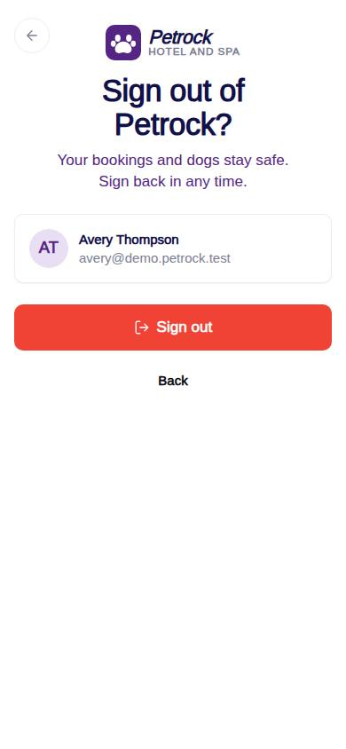
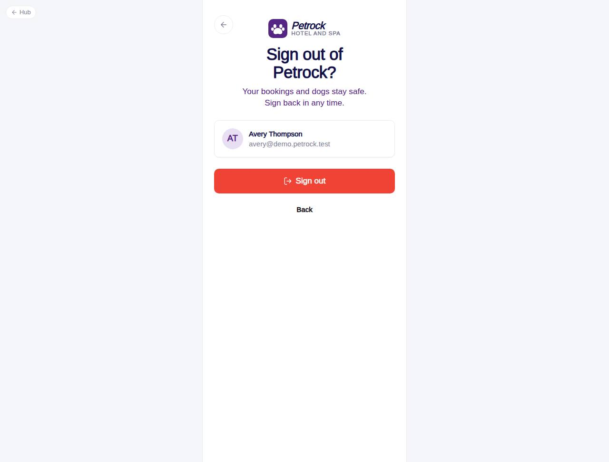

# C-09 · Sign out

## Purpose

Confirms signing out, logs the event, resets the session to the public visitor and offers sign-in again. The settings hub (C-70) links here.

## Screenshots

| 390 | 1280 |
| --- | --- |
|  |  |

Dark variants: not a key page (theme tokens apply; checked in the browser).

## Sections (layout order)

1. AuthBrandHeader "Sign out of Petrock?"
2. Card with Avatar, name and email
3. Sign out (danger) + Back
4. Signed-out state: success mark, Sign in, Create account, Testing hub link

## Data

| Table | Read / write | Notes |
| --- | --- | --- |
| `auth_events` | write | sign_out |

## Rules

- R-X35 - clears the remember-me marker
- R-X37 - event

## Logic

- authService.signOutEvent then SessionProvider.signOut() (usr_public) and remove localStorage petrock.auth.remember.
- Already public -> signed-out state directly.

## Components

AuthBrandHeader, Card, Avatar, Button, Icon

## Real vs mock

Real. Works for any signed-in role (staff included) since the session is shared.

## Responsive check (D-016)

Checked at 360, 390, 768, 1280, 1920 on 2026-09-18 (Playwright, Chromium): no horizontal scroll, no console errors. The PhoneShell keeps a 430 px column on wide screens; two-column name fields collapse under 360 px; the OTP boxes shrink at 360 px; modals become bottom sheets under 600 px.

## Changelog

- `docs/changelog/_pending/customer-auth.md`
