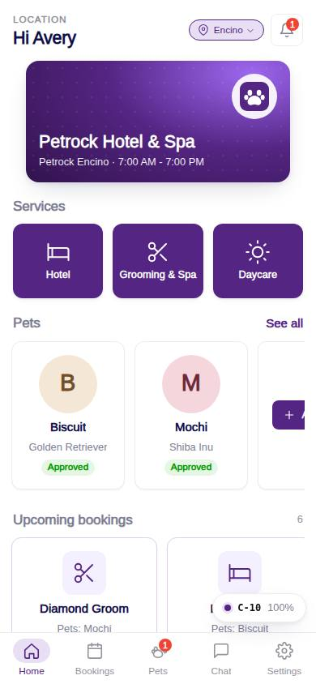
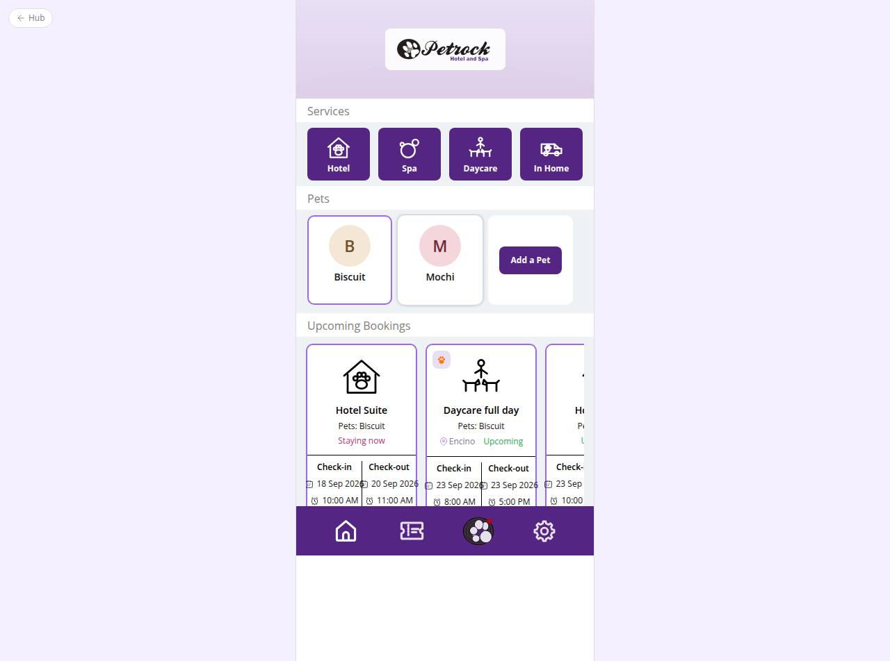

# C-10 · Customer home

## Purpose

The pet parent's landing screen. It greets them, shows which Petrock they are booking at (Encino or Westwood, changeable), offers the three bookable services (Hotel, Grooming & Spa, Daycare), lists their pets with approval / vaccine status, shows upcoming bookings across all three services and links to past bookings. Booking a service is gated on having at least one pet (R-A01).

## Screenshots

| 390 | 1280 |
| --- | --- |
|  |  |

Dark: `../screenshots/C-10/390-dark.jpg`, `../screenshots/C-10/1280-dark.jpg`. Empty state with the "Add a pet first" modal: `../screenshots/C-10/390-empty-gate.jpg`.

## Sections (layout order)

1. HomeHeader - "Hi {first name}", location chip (opens the picker), notifications bell with the unread count
2. HeroBanner - brand gradient with the Petrock mark, location name and today's hours (no licensed photo yet)
3. ServicesRow - HomeServiceTile x3: Hotel, Grooming & Spa, Daycare
4. VaccineBanner - only when a pet has missing / expired required vaccines; links to C-20
5. PetsStrip - PetAvatarCard per active pet with approval badge / vaccine chip, plus an "Add a pet" card; EmptyState when there are no pets
6. UpcomingBookings - CustomerBookingCard per unfinished booking (hotel stays, grooming appointments, daycare days) sorted by start
7. PastBookingsLink - "View past bookings" (hotel module route)
8. AddPetFirstModal - Modal with Back / Add a pet
9. LocationPickerModal - RadioGroup cards with address and today's hours

## Data

| Table | Read / write | Notes |
| --- | --- | --- |
| `customers` | read / write | the signed-in parent; `home_location_id` updated by the picker |
| `pets` | read | active pets of the household |
| `vaccine_records`, `vaccine_types` | read | pet status via `petVaccineSummary()` |
| `bookings`, `booking_pets`, `room_types` | read | hotel stays and their pets |
| `appointments`, `packages` | read | Grooming & Spa appointments |
| `daycare_bookings` | read | daycare days |
| `locations` | read | picker and chip |
| `notifications` | read | unread badge |

## Rules

- `R-A01` - service tiles open the "Add a pet first" modal when the household has no active pet
- `R-A02` - no In Home tile; inquiry goes through chat (D-003)
- `R-A04`, `R-X20` - pet cards show Approved / Pending verification / Needs more details / Vaccine expired from `petApproval()`
- `R-A06`, `R-I01` - booking cards use the one lifecycle with customer labels (Pending verification, Upcoming)
- `R-B11` - expired required vaccines flag the pet card and raise the banner
- `R-M08` - relative times in notifications
- `R-X23` - location picker sets the LocationProvider location and the customer's home location

## Logic

- `useCurrentCustomer()`: `customers.user_id = session user`; staff and super admin previewing the customer surface fall back to the demo pet parent.
- Upcoming = bookings + appointments + daycare days that are not finished and whose end is in the future; appointment statuses `done` / `in_progress` map onto `checked_out` / `checked_in` for the badge.
- Service tiles navigate to `/app/hotel`, `/app/grooming`, `/app/daycare` with `?location=` when the route exists in the registry; otherwise a "coming soon" toast (other modules ship those flows).

## Components

HomeServiceTile, PetAvatarCard, CustomerBookingCard, VaccineStatusChip, Badge, StatusBadge, IconButton, Chip, Button, Card, Modal, RadioGroup, EmptyState, Toast, Avatar

## Real vs mock

All data flows through the DataProvider (mock localStorage today). The hero is a CSS gradient until a licensed photo exists (open question 116). Booking detail routes belong to the hotel / grooming / daycare modules.

## Responsive check (D-016)

Checked at 360, 390, 768, 1280, 1920 on 2026-09-18 (Playwright, `scratchpad/qa.mjs`): no horizontal scroll, no console errors. Pets and bookings scroll horizontally inside their strips; the phone column centres at >= 600 px.

## Changelog

- `docs/changelog/_pending/customer-home-pets.md`
- 0019 - QA fixes: Grooming cards link to `/app/grooming/orders/<order>`, daycare cards to `/app/daycare/bookings/<id>`.
