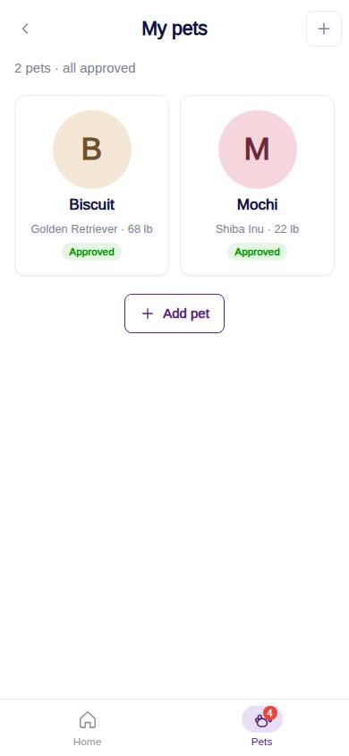
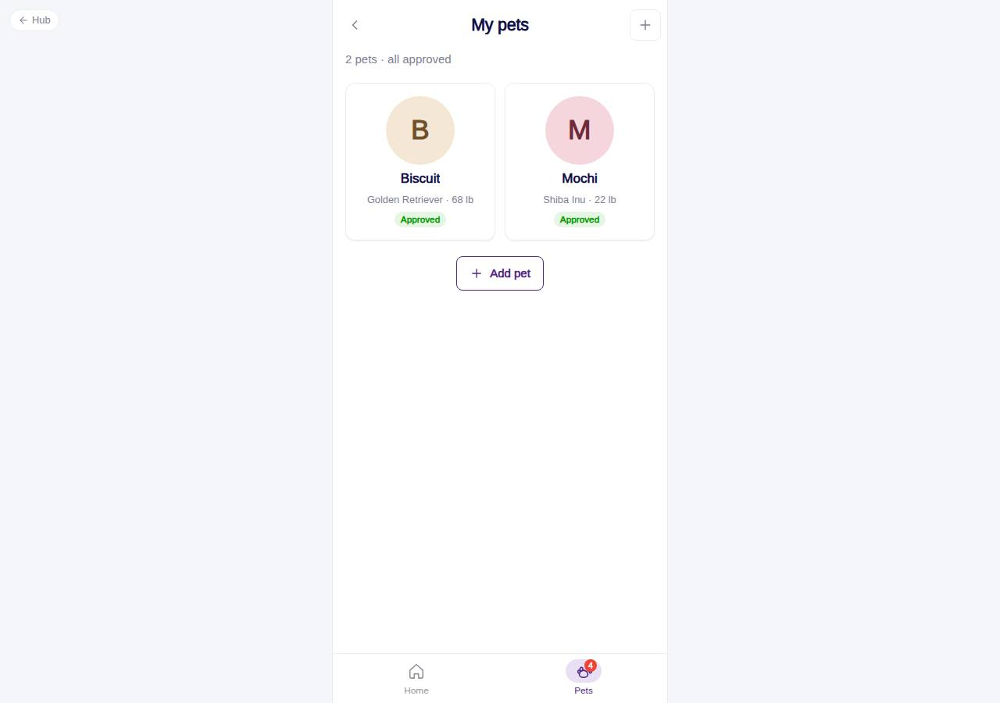

# C-11 · My pets

## Purpose

Every active pet of the household in a grid: photo, breed and weight, approval / vaccine status. Entry point to add a pet or open a profile. Bottom tab "Pets".

## Screenshots

| 390 | 1280 |
| --- | --- |
|  |  |

## Sections (layout order)

1. PhonePageHeader - back to Home, title, "Add pet" icon button
2. SummaryLine - "2 pets · 1 needs attention" / "all approved"
3. PetGrid - PetAvatarCard (size lg) per pet; 2 columns on phones, auto-fill 150 px from 400 px
4. EmptyState - no pets yet, with an Add pet button

## Data

| Table | Read / write | Notes |
| --- | --- | --- |
| `customers` | read | current household |
| `pets` | read | `status != inactive`, ordered by `created_at` |
| `vaccine_records`, `vaccine_types` | read | status chip |

## Rules

- `R-A04`, `R-X20` - status per pet from `petApproval()`

## Logic

- Tapping a card opens `/app/pets/:petId`.

## Components

PhonePageHeader, PetAvatarCard, VaccineStatusChip, Badge, Button, EmptyState, IconButton

## Real vs mock

Mock data provider; photos are data URLs saved by the wizard.

## Responsive check (D-016)

Checked at 360, 390, 768, 1280, 1920 on 2026-09-18: no horizontal scroll, no console errors.

## Changelog

- `docs/changelog/_pending/customer-home-pets.md`
