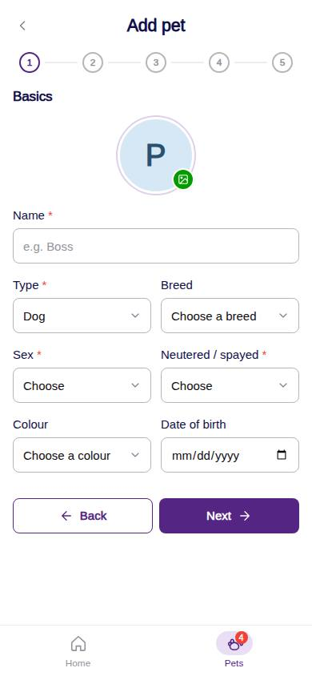
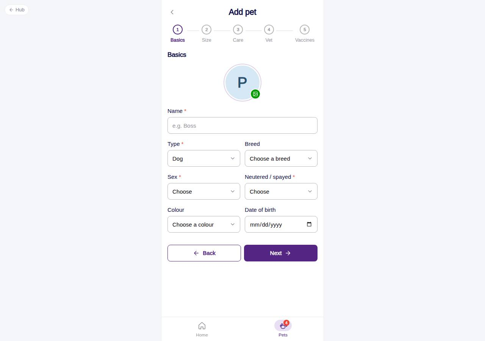

# C-12 · Add pet wizard

## Purpose

Add a dog in five clean steps. The Figma export had a 2-step stepper with at least three screens and duplicated questions (socialisation / personality / treats on both step 1 and step 2); this wizard resolves that into: Basics, Size, Care, Vet & emergency, Vaccines.

## Screenshots

| 390 | 1280 |
| --- | --- |
|  |  |

Dark: `../screenshots/C-12/390-dark.jpg`, `../screenshots/C-12/1280-dark.jpg`.

## Sections (layout order)

1. PhonePageHeader - back, "Add pet"
2. Stepper - Basics · Size · Care · Vet · Vaccines (labels collapse to dots on phones)
3. Step 1 Basics - PetPhotoPicker, Name*, Type* (Dog default), Breed (+ add), Sex*, Neutered / spayed*, Colour (+ add), Date of birth
4. Step 2 Size & weight - weight in lbs with a live size band card (S / M / L / XL / Giant)
5. Step 3 Personality & feeding - socialised with (Humans / Dogs), personality (Shy / Calm / Hyper / Aggressive), own food toggle, meals per day (AM, PM, AM & PM, AM / Mid Day / PM, Free feeding), feeding instructions per slot, treats toggle
6. Step 4 Vet & emergency - medical conditions, allergies, vet (list + "Add a vet"), emergency contact (name, phone, relationship)
7. Step 5 Vaccines - VaccineRecordRow per required / recommended vaccine with Upload / Update opening VaccineRecordForm; pending warning while a required vaccine is missing
8. WizardFooter - Back / Next; on the last step Submit and (when required vaccines are missing) "Skip for now"

## Data

| Table | Read / write | Notes |
| --- | --- | --- |
| `pets` | write | insert; `size` recomputed from weight; approval `pending`, or `needs_details` when vaccines are skipped |
| `pet_lookups` | read / write | breeds and colours; "+ Add another" inserts |
| `vets` | read / write | "+ Add a vet" inserts |
| `emergency_contacts` | write | one per pet when a name / phone is given |
| `vaccine_types`, `vaccine_records` | read / write | drafted records inserted as `submitted` after the pet exists |
| `notifications` | write | `pet_added` to the customer; `vaccine_submitted` to the front desk of the home location |
| `users`, `customers` | read | recipient lookup, owner |

## Rules

- `R-C01` required basics block Next with inline errors
- `R-C02`, `R-X21` weight in lbs, size band = `sizeFromWeightLbs()`
- `R-C03` socialisation multi-select, personality single-select
- `R-C04`, `R-C05` slot-based meals with per-slot instructions, own food, treats
- `R-B01`, `R-B02` required vs recommended lists; `R-B06`, `R-B09` upload formats and feedback; `R-B07`, `R-A05`, `R-X25` skip allowed with the pending warning
- `R-B08` vet from the list or added inline; `R-X22` emergency contact

## Logic

- Validation per step; Submit jumps to the first invalid step.
- Drafted vaccine records live in wizard state until the pet row exists, then `submitVaccineRecord()` inserts them.
- Photo is downscaled to a 160 px JPEG data URL (mock storage).

## Components

PhonePageHeader, Stepper, PetPhotoPicker, Input, Select, Checkbox, RadioGroup, Textarea, Toggle, Card, Badge, VaccineRecordRow, VaccineRecordForm, PetDocumentUpload, Button, Modal, Toast

## Real vs mock

Uploads are mocked (`mock://uploads/<name>`, simulated progress); photos are data URLs. Company-OS storage replaces both behind the same components.

## Responsive check (D-016)

Checked at 360, 390, 768, 1280, 1920 on 2026-09-18: no horizontal scroll, no console errors; two-column field rows collapse to one under 380 px. Functional Playwright run adds a pet with one vaccine and lands on its profile.

## Changelog

- `docs/changelog/_pending/customer-home-pets.md`
