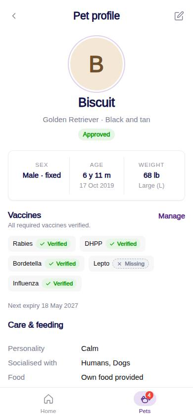
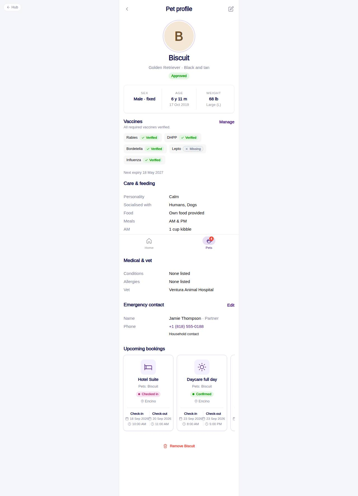

# C-13 · Pet profile

## Purpose

Everything about one pet in one scroll: photo, name and breed, approval status, stats (sex, age, weight and size band), vaccine summary with a link to the records, care and feeding, medical and vet, emergency contact, upcoming bookings, and the actions edit / remove.

## Screenshots

| 390 | 1280 |
| --- | --- |
|  |  |

Dark: `../screenshots/C-13/390-dark.jpg`, `../screenshots/C-13/1280-dark.jpg`.

## Sections (layout order)

1. PhonePageHeader - back to My pets, "Pet profile", edit icon
2. ProfileHero - Avatar 112 px, name, breed · colour, approval Badge / VaccineStatusChip
3. StatsRow - Sex (· fixed), Age (with birthday), Weight (with size band)
4. Vaccines - chip per vaccine type, next expiry, pending banner when required vaccines are not verified; "Manage" -> C-21
5. Care & feeding - personality, socialised with, food, meals, per-slot instructions, treats
6. Medical & vet - conditions, allergies, vet
7. Emergency contact - the pet's contact or the household contact
8. Upcoming bookings - CustomerBookingCard strip filtered to this pet
9. DangerZone - "Remove {pet}" with a confirmation Modal

## Data

| Table | Read / write | Notes |
| --- | --- | --- |
| `pets` | read / write | `status -> inactive` on remove |
| `vets`, `emergency_contacts` | read | |
| `vaccine_records`, `vaccine_types` | read | summary |
| `bookings`, `booking_pets`, `appointments`, `daycare_bookings`, `packages`, `room_types`, `locations` | read | upcoming bookings of this pet |

## Rules

- `R-A04`, `R-X20` approval and vaccine chips
- `R-C02` weight in lbs with the size band; `R-C05` care fields
- `R-X22` emergency contact fallback to the household contact
- `R-X24` remove is a soft delete and is blocked while the pet has upcoming bookings

## Logic

- A customer opening another household's pet is redirected to My pets; staff previews are allowed.

## Components

PhonePageHeader, Avatar, Badge, VaccineStatusChip, Card, Section, CustomerBookingCard, Button, IconButton, Modal, EmptyState, Toast

## Real vs mock

Mock provider. The UI-kit Reminder / Notes concept (open question 26) is not built; care notes come from the pet record.

## Responsive check (D-016)

Checked at 360, 390, 768, 1280, 1920 on 2026-09-18: no horizontal scroll, no console errors.

## Changelog

- `docs/changelog/_pending/customer-home-pets.md`
