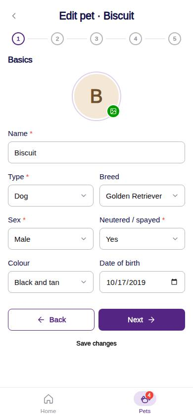
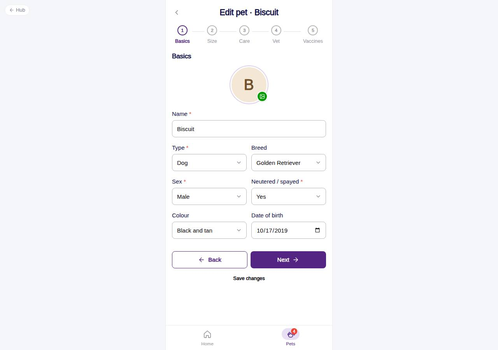

# C-14 · Edit pet

## Purpose

The same five-step wizard as C-12, prefilled with the pet, its emergency contact and current vaccine records. Every step is reachable from the stepper and offers "Save changes"; the last step saves and returns to the profile.

## Screenshots

| 390 | 1280 |
| --- | --- |
|  |  |

## Sections (layout order)

1. PhonePageHeader - back to the profile, "Edit pet · {name}"
2. Stepper - all steps clickable
3. Steps 1-5 - as C-12
4. WizardFooter - Back / Next / Save changes

## Data

| Table | Read / write | Notes |
| --- | --- | --- |
| `pets` | read / write | update; size recomputed; approval untouched (staff approve) |
| `pet_lookups`, `vets` | read / write | inline adds |
| `emergency_contacts` | read / write | upsert, removed when cleared |
| `vaccine_types`, `vaccine_records` | read / write | updating a verified record inserts a new `submitted` one |
| `notifications`, `users`, `customers` | read / write | front desk notified of new proofs |

## Rules

- `R-C01`..`R-C05`, `R-B06`, `R-B08`, `R-B09`, `R-X21`, `R-X22` as C-12

## Logic

- The Figma "Pet Profile (edit)" mixed owner e-mail / phone into a pet form; here the form is pet-only (open question 27).

## Components

PhonePageHeader, Stepper, PetPhotoPicker, Input, Select, Checkbox, RadioGroup, Textarea, Toggle, Card, Badge, VaccineRecordRow, VaccineRecordForm, PetDocumentUpload, Button, Modal, Toast

## Real vs mock

As C-12.

## Responsive check (D-016)

Checked at 360, 390, 768, 1280, 1920 on 2026-09-18: no horizontal scroll, no console errors.

## Changelog

- `docs/changelog/_pending/customer-home-pets.md`
