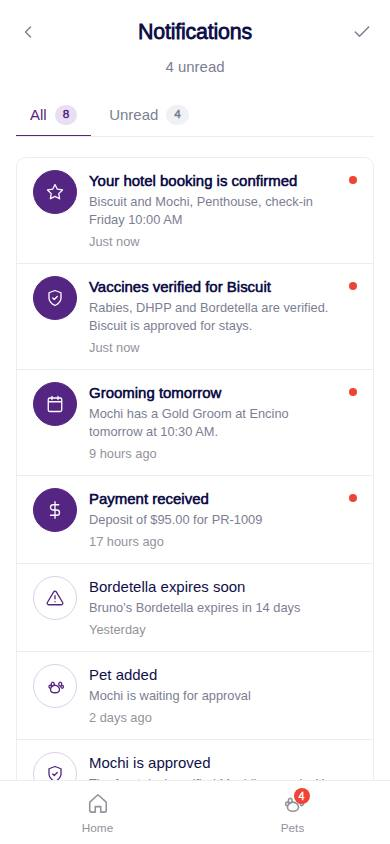
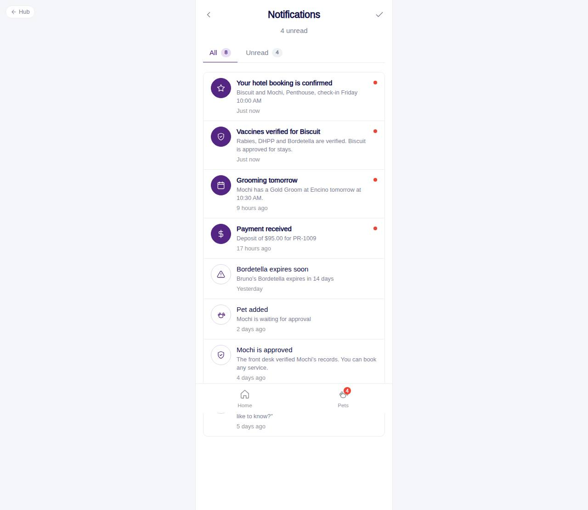

# C-15 · Notifications

## Purpose

The customer's in-app notifications: booking confirmations, payments, vaccine reminders and verifications, pet approvals, messages. Unread rows are emphasised; All / Unread tabs; mark all read; tapping a row marks it read and follows its link.

## Screenshots

| 390 | 1280 |
| --- | --- |
|  |  |

## Sections (layout order)

1. PhonePageHeader - back, "Notifications", unread count, mark-all-read and chat icons
2. Tabs - All (n) / Unread (n)
3. NotificationList - AppNotificationRow per notification, newest first
4. EmptyState - all caught up

## Data

| Table | Read / write | Notes |
| --- | --- | --- |
| `notifications` | read / write | `user_id = session user`; `read` flipped on open / mark all |

## Rules

- `R-M07` kinds -> icons (`NOTIFICATION_KIND_ICON`); UI-kit "order" kinds dropped
- `R-M08` relative timestamps with correct grammar

## Logic

- Links are followed only when the route exists in the registry (other modules may not have shipped); otherwise the row is just marked read.

## Components

PhonePageHeader, Tabs, AppNotificationRow, EmptyState, Button, IconButton

## Real vs mock

In-app only; push notifications come with the Capacitor wrap.

## Responsive check (D-016)

Checked at 360, 390, 768, 1280, 1920 on 2026-09-18: no horizontal scroll, no console errors.

## Changelog

- `docs/changelog/_pending/customer-home-pets.md`
