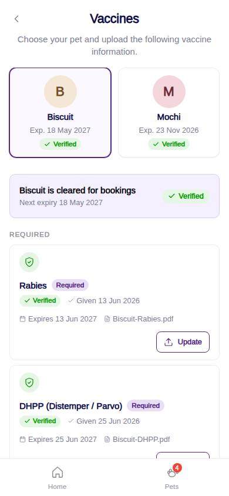
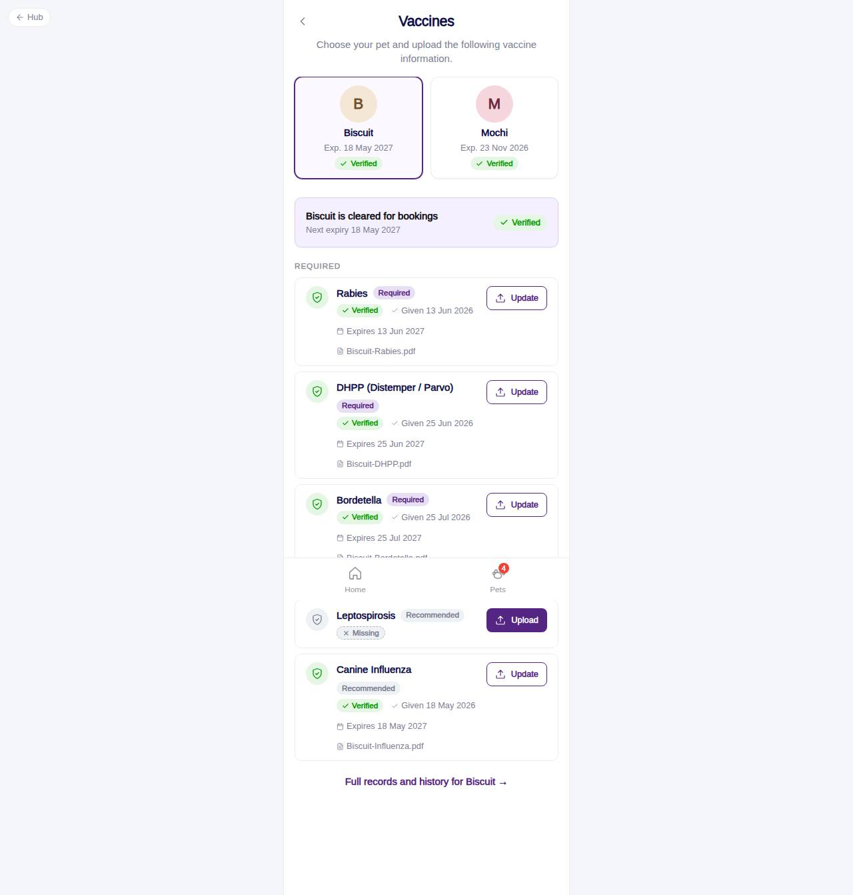

# C-20 · Vaccines

## Purpose

The customer side of the vaccine flow that gates bookings. Choose a pet, see each vaccine's state (verified / pending / expired / missing / rejected), upload or update proofs. Bookings stay `pending_vaccines` until the front desk verifies every required record.

## Screenshots

| 390 | 1280 |
| --- | --- |
|  |  |

Dark: `../screenshots/C-20/390-dark.jpg`, `../screenshots/C-20/1280-dark.jpg`.

## Sections (layout order)

1. PhonePageHeader - back, "Vaccines", intro copy
2. PetSelector - PetAvatarCard (sm) per pet with the earliest upcoming expiry and the worst required status
3. StatusCard - "cleared for bookings" / "x of 3 required verified", next expiry, overall chip
4. GateBanner - shown until all required vaccines are verified
5. RequiredList - VaccineRecordRow x3 with Upload / Update
6. RecommendedList - VaccineRecordRow x2
7. VaccineRecordForm - modal: date given, expiry, proof upload
8. Link to the pet's full records (C-21)

## Data

| Table | Read / write | Notes |
| --- | --- | --- |
| `customers`, `pets` | read | household pets |
| `vaccine_types` | read | required / recommended |
| `vaccine_records` | read / write | insert `submitted` or update a non-verified record |
| `notifications`, `users` | read / write | `vaccine_submitted` to the front desk of the home location |

## Rules

- `R-B01`, `R-B02` lists; `R-B03` record fields; `R-B05` / `R-B06` accepted formats (.jpg .png .pdf; .gif pending); `R-B09` upload feedback
- `R-A05`, `R-X25` booking gate and pending state
- `R-X20` status derivation, worst status on the pet card

## Logic

- Default selection = the pet with the worst required status.
- A verified record is never overwritten: updating it inserts a new submitted record and the verified one stays in history.

## Components

PhonePageHeader, PetAvatarCard, VaccineStatusChip, VaccineRecordRow, VaccineRecordForm, PetDocumentUpload, Button, Card, EmptyState, Toast

## Real vs mock

Uploads mocked; verification happens on the front desk queue (F-5x). The pet-card date from the Figma export is read as the earliest upcoming expiry (open question 35).

## Responsive check (D-016)

Checked at 360, 390, 768, 1280, 1920 on 2026-09-18: no horizontal scroll, no console errors; the row action wraps under the row below 420 px.

## Changelog

- `docs/changelog/_pending/customer-home-pets.md`
