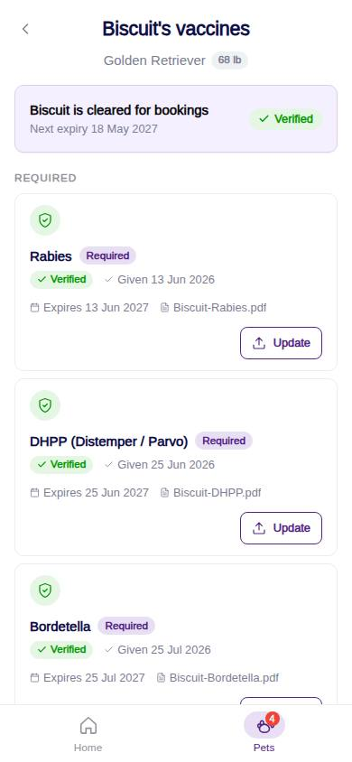
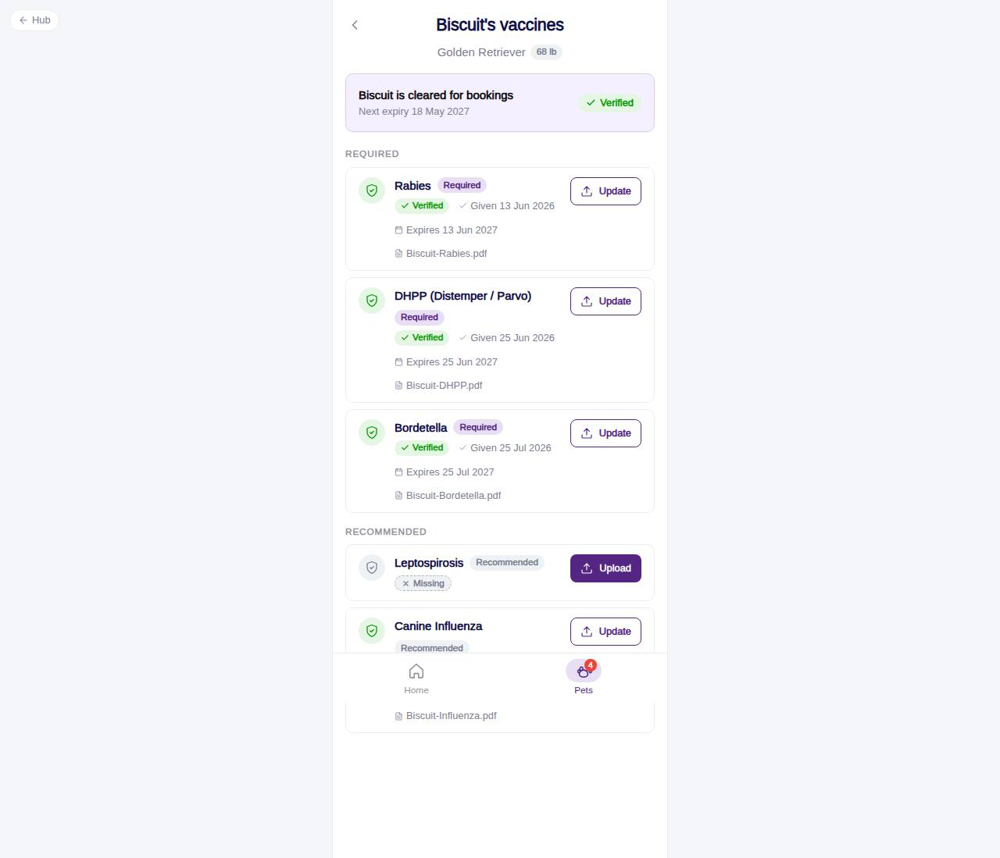

# C-21 · Pet vaccine records

## Purpose

All vaccine records of one pet with verification state, dates and proofs, the same upload / update actions as C-20, plus the history of earlier records (boosters, replaced proofs).

## Screenshots

| 390 | 1280 |
| --- | --- |
|  |  |

## Sections (layout order)

1. PhonePageHeader - back to the profile, "{pet}'s vaccines", breed and weight
2. StatusCard - verified count and next expiry
3. RequiredList / RecommendedList - VaccineRecordRow per type
4. History - earlier records per vaccine with their state
5. VaccineRecordForm - modal

## Data

| Table | Read / write | Notes |
| --- | --- | --- |
| `pets` | read | owner check |
| `vaccine_types`, `vaccine_records` | read / write | current = latest `vaccinated_on` per type |
| `notifications`, `users`, `customers` | read / write | front desk notification |

## Rules

- `R-B01`, `R-B02`, `R-B03`, `R-B06`, `R-B09`, `R-X20`

## Logic

- Current record per type = latest `vaccinated_on`; older rows render under History with their own derived state.

## Components

PhonePageHeader, VaccineStatusChip, VaccineRecordRow, VaccineRecordForm, PetDocumentUpload, Card, Button, Badge, EmptyState, Toast

## Real vs mock

As C-20.

## Responsive check (D-016)

Checked at 360, 390, 768, 1280, 1920 on 2026-09-18: no horizontal scroll, no console errors.

## Changelog

- `docs/changelog/_pending/customer-home-pets.md`
