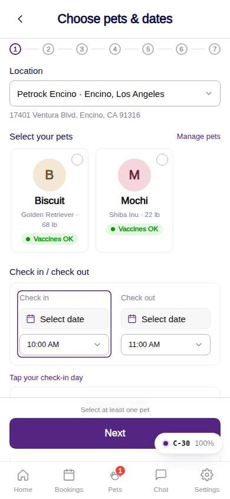
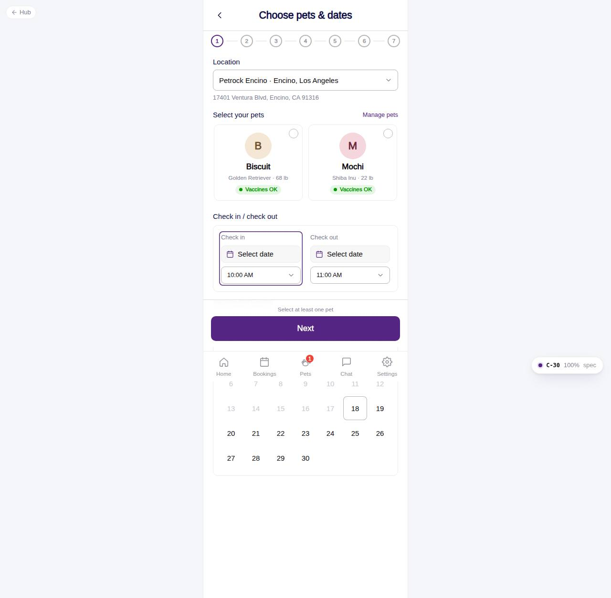

# C-30 · Hotel: choose pets & dates

## Purpose

First step of booking a hotel stay. The pet parent picks the location, the pets that are coming (with approval and vaccine chips), whether they share a room, and the check-in / check-out days and times on a range calendar bounded by the location opening hours.

## Screenshots

| 390 | 1280 |
| --- | --- |
|  |  |

Dark: `../screenshots/C-30/390-dark.jpg`, `../screenshots/C-30/1280-dark.jpg`.

## Sections (layout order)

1. HotelBookingFrame header (back to home, title, Stepper 1/7)
2. Location Select (locations table; defaults to the customer home location)
3. Pet cards (BookingPetCard, multi-select; chips: Pending / Needs details approval, Vaccines OK / pending / missing / expired)
4. Share-a-room Select (only with 2+ pets; forced to separate rooms above settings.max_pets_per_room)
5. StayDatesCard: check-in / check-out date + time columns and the inline range calendar (closed days disabled)
6. Sticky footer: Next (pets, nights, location summary)

## Data

| Table | Read / write | Notes |
| --- | --- | --- |
| `customers` | read | customer behind the session (demo pet parent when staff preview) |
| `pets` | read | active pets of the customer |
| `vaccine_records / vaccine_types` | read | required vaccines -> chip state (R-A05) |
| `locations` | read | name, address, opening hours per weekday |
| `settings` | read | hotel_booking: default times, min nights, max pets per room |

## Rules

- R-A01 - no pets -> EmptyState "add a pet first"
- R-A04 - approval chips on the pet cards
- R-A05 - vaccine state chip; stays with unverified vaccines will be pending_vaccines
- R-A07 - share-a-room question for multi-pet stays
- R-K02 - times bounded by the location hours
- R-X53 - sharing vs separate rooms drives the quote
- R-X54 - validateStay(): check-out after check-in, min nights, hours, closed days

## Logic

- Draft persisted in localStorage (petrock.hotelDraft.v1); every later step redirects here when the draft is incomplete (draftStage).
- Calendar fills check-in then check-out; tapping a date column switches which end is being picked.
- Next is disabled until at least one pet and a valid range are chosen.

## Components

HotelBookingFrame, Stepper, Select, BookingPetCard, StayDatesCard, DatePicker, TimePicker, EmptyState, Badge, Button

## Real vs mock

All data is the mock DB. Pet photos are null in the seed (initials avatar). With Company-OS the same tables are read through the DataProvider.

## Responsive check (D-016)

Checked at 360, 390, 768, 1280, 1920 on 2026-09-18 (Playwright against `vite preview`): no horizontal overflow, no console errors. The customer surface renders in the PhoneShell column (full-bleed under 600 px, centered 430 px column above); footer CTAs stack under 420 px.

## Changelog

- `docs/changelog/_pending/customer-hotel.md` (to be merged into the next numbered entry)
