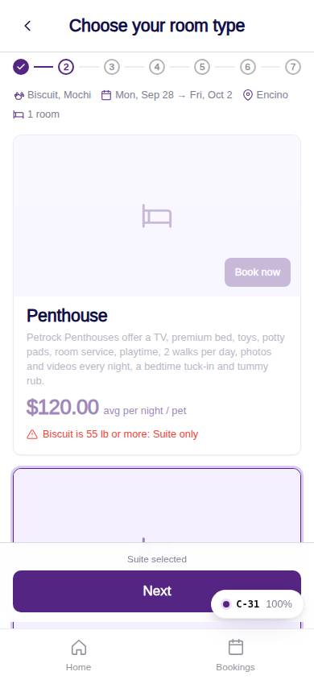
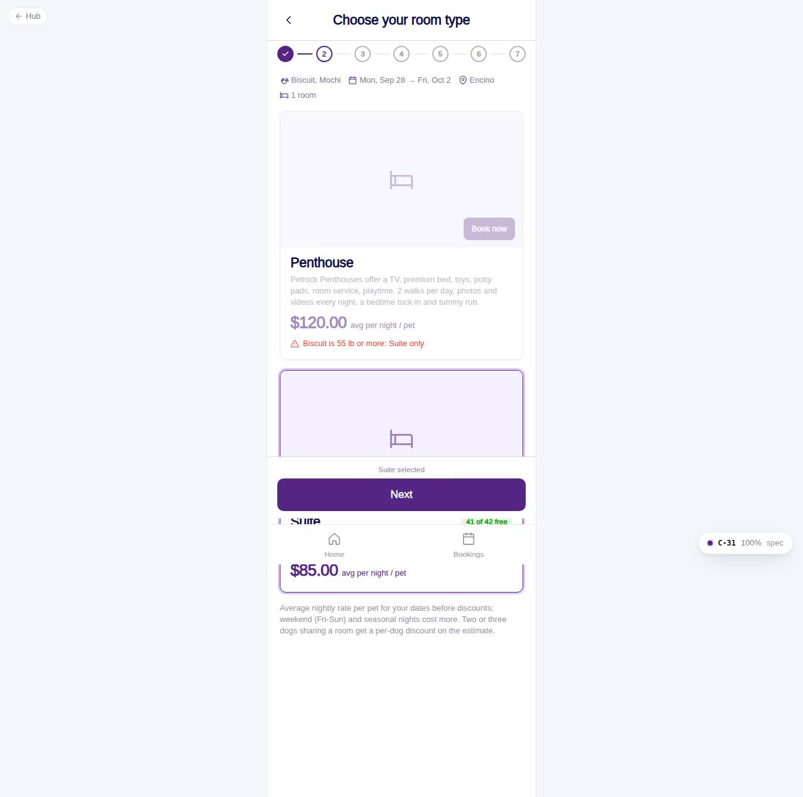

# C-31 · Hotel: choose room type

## Purpose

Pick Penthouse or Suite for the selected pets and dates. Each card shows the inclusions copy, the average nightly rate per pet computed from the rates and seasons for those dates, rooms left, and is disabled by the fit rules or when the location is full.

## Screenshots

| 390 | 1280 |
| --- | --- |
|  |  |

Dark: `../screenshots/C-31/390-dark.jpg`, `../screenshots/C-31/1280-dark.jpg`.

## Sections (layout order)

1. HotelBookingFrame (Stepper 2/7, clickable done steps)
2. Stay summary line (pets, dates, location, rooms needed)
3. HotelRoomTypeCard per room type (photo placeholder, BOOK NOW, description, avg price, chips)
4. Explanatory footnote (weekend / seasonal rates, multi-dog discount)
5. Sticky footer: Next

## Data

| Table | Read / write | Notes |
| --- | --- | --- |
| `room_types` | read | name, description, max weight |
| `rates / seasons` | read | avg nightly rate for the dates (R-X39) |
| `rooms` | read | bottom penthouse rooms per location |
| `capacities` | read | max simultaneous per room type per location |
| `bookings / booking_pets / pets` | read | overlapping active stays and heavy pets for availability |

## Rules

- R-X01 - any pet >= 55 lb blocks the Penthouse (Suite only)
- R-E09 / R-X37 - pets >= 30 lb need a bottom penthouse room; blocked when none is free
- R-X36 / R-E11 / R-E12 - capacity minus overlapping stays; rooms needed = 1 when sharing else pets count
- R-D01, R-D05, R-D06 - room types and rate kinds behind the average price
- R-X39 - average nightly rate per pet for the chosen dates

## Logic

- avgNightly(): quoteHotel for 1 dog / nights.
- availability(): overlapping = same location + room type, status in requested / pending_vaccines / confirmed / checked_in, check_in < checkOut and check_out > checkIn.
- Selecting a card stores roomTypeId and moves to C-32.

## Components

HotelBookingFrame, HotelRoomTypeCard, Badge, Button, Icon

## Real vs mock

Room photos come from room_types.photo_url (null in the seed, placeholder icon). Availability is computed client-side from the mock tables; the API will expose an availability endpoint later.

## Responsive check (D-016)

Checked at 360, 390, 768, 1280, 1920 on 2026-09-18 (Playwright against `vite preview`): no horizontal overflow, no console errors. The customer surface renders in the PhoneShell column (full-bleed under 600 px, centered 430 px column above); footer CTAs stack under 420 px.

## Changelog

- `docs/changelog/_pending/customer-hotel.md` (to be merged into the next numbered entry)
