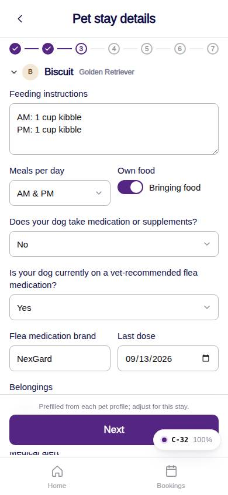
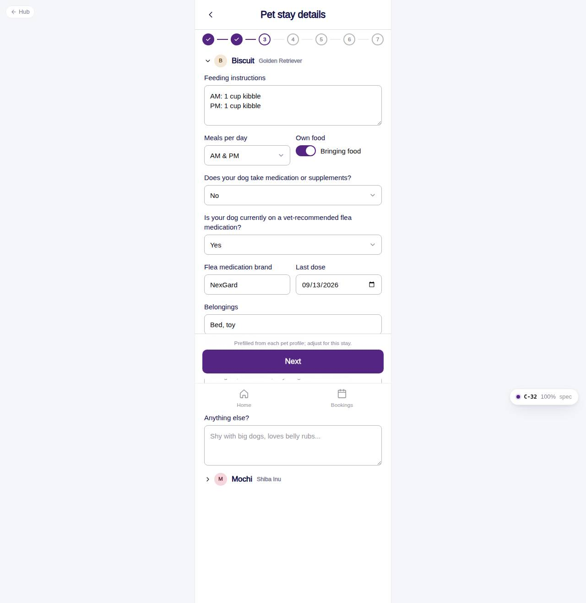

# C-32 · Hotel: pet stay details

## Purpose

For every pet on the stay: feeding plan and own food, medication and dosing, vet-recommended flea medication with brand and last dose, belongings, medical alert and free notes. Prefilled from the pet profile so returning customers only confirm.

## Screenshots

| 390 | 1280 |
| --- | --- |
|  |  |

Dark: not captured (not a key page).

## Sections (layout order)

1. HotelBookingFrame (Stepper 3/7)
2. One collapsible Section per pet (first open) with avatar header
3. Feeding Textarea, meals per day Select, own food Toggle
4. Medication Select -> count, dosing, name (conditional)
5. Flea medication Select -> brand, last dose date (conditional)
6. Belongings, medical alert, notes
7. Sticky footer: Next

## Data

| Table | Read / write | Notes |
| --- | --- | --- |
| `pets` | read | feeding_am / feeding_pm / own_food / meals_per_day / medical_conditions as defaults |
| `booking_pets` | write (at C-36) | takes_medication, medication, dosing, flea_medication, medical_alert |
| `booking_pet_care` | write (at C-36) | feeding, meals, own food, belongings, flea brand / last dose, notes |

## Rules

- R-A10 - medical questionnaire per boarded pet
- R-A13 - notes become staff instructions on the run card

## Logic

- Details are kept in the draft per pet id; pets without edits get the profile defaults when Next is pressed.
- Sub-fields only render when the Yes option is chosen.

## Components

HotelBookingFrame, Section, Avatar, Select, Input, Textarea, Toggle, Button

## Real vs mock

Nothing external. The unlabeled Figma date is interpreted as the last flea dose (D-CH-05).

## Responsive check (D-016)

Checked at 360, 390, 768, 1280, 1920 on 2026-09-18 (Playwright against `vite preview`): no horizontal overflow, no console errors. The customer surface renders in the PhoneShell column (full-bleed under 600 px, centered 430 px column above); footer CTAs stack under 420 px.

## Changelog

- `docs/changelog/_pending/customer-hotel.md` (to be merged into the next numbered entry)
