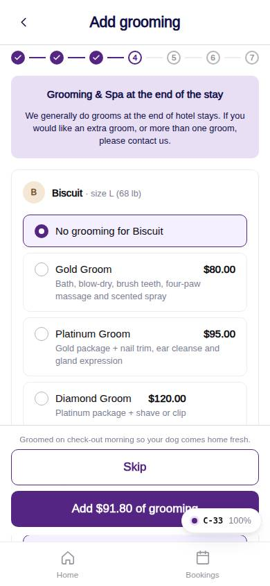
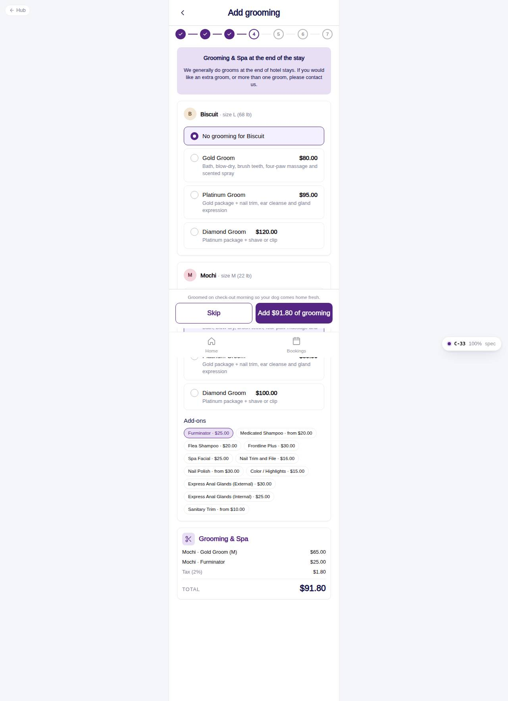

# C-33 · Hotel: add grooming during the stay

## Purpose

Optional Grooming & Spa at the end of the stay: one package per pet (Gold / Platinum / Diamond priced by the pet size) plus add-ons, with a running total. Skippable in one tap.

## Screenshots

| 390 | 1280 |
| --- | --- |
|  |  |

Dark: not captured (not a key page).

## Sections (layout order)

1. HotelBookingFrame (Stepper 4/7)
2. Info band with the Figma copy (grooms at the end of stays)
3. Per pet Card: package RadioGroup cards (price for the pet size) + add-on Chips
4. Running total (HotelEstimateCard compact)
5. Sticky footer: Skip / Add $X of grooming

## Data

| Table | Read / write | Notes |
| --- | --- | --- |
| `packages` | read | price_<size>, inclusions |
| `addons` | read | price, starting_at |
| `pets` | read | size for the price |
| `taxes / fees` | read | service tax in the quote |
| `appointments` | write (at C-36) | one per pet with booking_id, 09:00 on check-out day |

## Rules

- R-A08 - grooming can be added to a stay
- R-A09 / R-X35 - grooms happen at the end of the stay; extra grooms via the desk
- R-G01, R-G02 - packages by size
- R-G10, R-G11 - add-ons with starting-at prices

## Logic

- buildGroomingQuotes(): quoteGrooming per pet with the pet size.
- Skip clears grooming and marks the step decided; Continue keeps the selection.

## Components

HotelBookingFrame, Card, Avatar, RadioGroup, Chip, HotelEstimateCard, Button

## Real vs mock

Diamond prices are placeholders pending confirmation (R-G06); the groomer is assigned by the desk.

## Responsive check (D-016)

Checked at 360, 390, 768, 1280, 1920 on 2026-09-18 (Playwright against `vite preview`): no horizontal overflow, no console errors. The customer surface renders in the PhoneShell column (full-bleed under 600 px, centered 430 px column above); footer CTAs stack under 420 px.

## Changelog

- `docs/changelog/_pending/customer-hotel.md` (to be merged into the next numbered entry)
