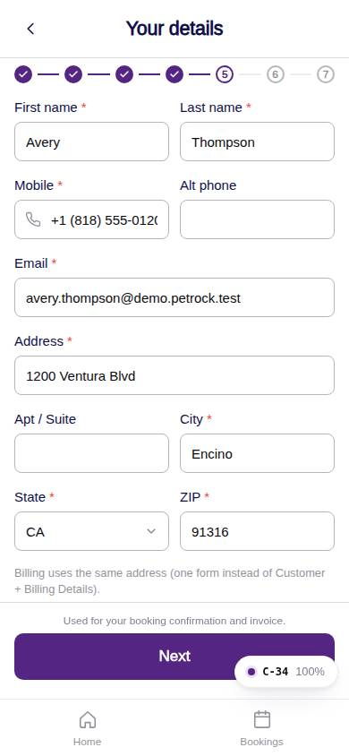
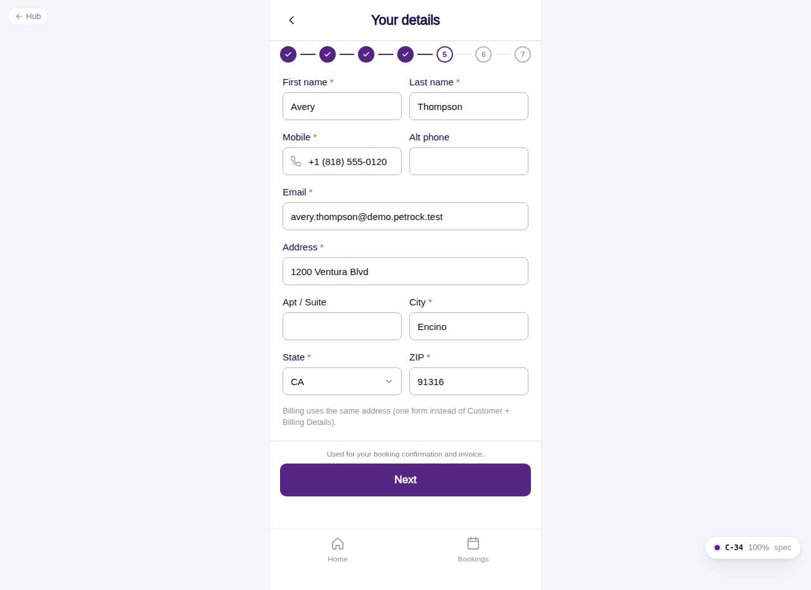

# C-34 · Hotel: customer details

## Purpose

Confirm who is booking: names, mobile and alternate phone, email and US address. Prefilled from the customer record and written back at payment; one form serves contact and billing.

## Screenshots

| 390 | 1280 |
| --- | --- |
|  |  |

Dark: not captured (not a key page).

## Sections (layout order)

1. HotelBookingFrame (Stepper 5/7)
2. Two-column rows (first / last name, mobile / alt phone)
3. Email
4. Address, apt / suite, city
5. State Select / ZIP
6. Sticky footer: Next

## Data

| Table | Read / write | Notes |
| --- | --- | --- |
| `customers` | read / write (at C-36) | prefill and update |

## Rules

- R-L01 - customer record fields

## Logic

- Validation on Next: required fields, 10-digit phone, email and 5-digit ZIP formats; errors shown per field.

## Components

HotelBookingFrame, Input, Select, Button

## Real vs mock

Nothing external.

## Responsive check (D-016)

Checked at 360, 390, 768, 1280, 1920 on 2026-09-18 (Playwright against `vite preview`): no horizontal overflow, no console errors. The customer surface renders in the PhoneShell column (full-bleed under 600 px, centered 430 px column above); footer CTAs stack under 420 px.

## Changelog

- `docs/changelog/_pending/customer-hotel.md` (to be merged into the next numbered entry)
