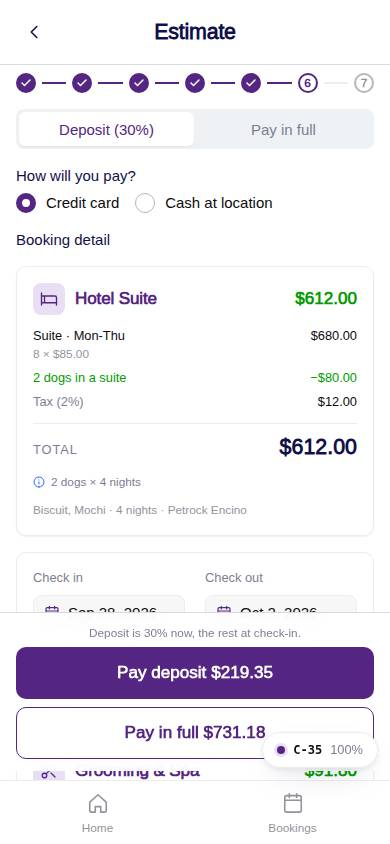
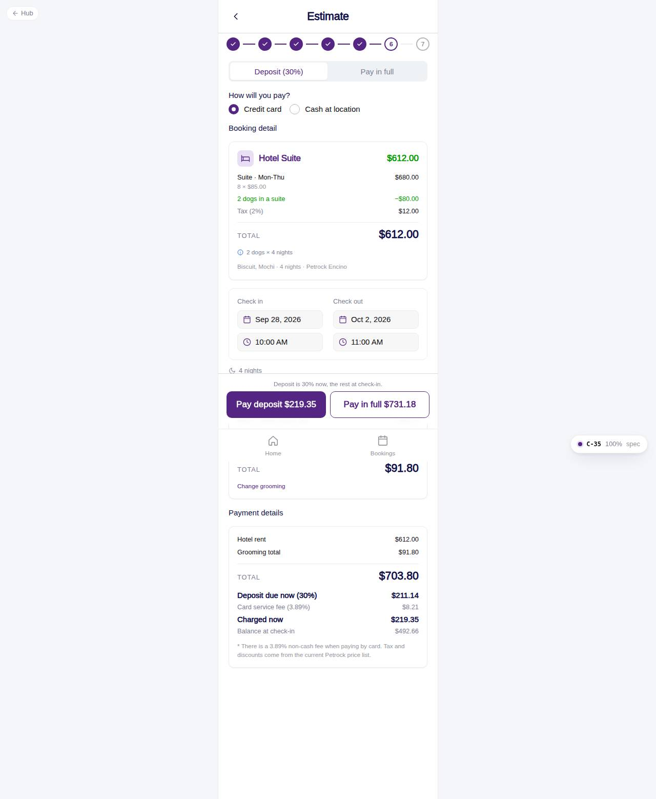

# C-35 · Hotel: estimate

## Purpose

The pre-payment estimate: room lines by night kind and season, multi-dog and long-stay discounts, tax, grooming, then the payment plan (deposit or full) and method (card or cash) with the card fee on the amount charged now.

## Screenshots

| 390 | 1280 |
| --- | --- |
|  |  |

Dark: `../screenshots/C-35/390-dark.jpg`, `../screenshots/C-35/1280-dark.jpg`.

## Sections (layout order)

1. HotelBookingFrame (Stepper 6/7)
2. Pay plan SegmentedControl (Deposit 30 % / Pay in full)
3. Payment method RadioGroup (card / cash)
4. Booking detail: HotelEstimateCard (room lines, discounts, tax, TOTAL, engine notes)
5. StayDatesCard read-only
6. Grooming HotelEstimateCard or the Add grooming band
7. Payment details card: hotel, grooming, total, due now, card fee, charged now, balance at check-in
8. Sticky footer: Pay deposit $X / Pay in full $Y (stacked under 420 px)

## Data

| Table | Read / write | Notes |
| --- | --- | --- |
| `rates / seasons / discounts / fees / taxes` | read | pricing engine inputs |
| `packages / addons` | read | grooming quote |
| `room_types` | read | room name |
| `settings` | read | hotel_booking.deposit_percent |

## Rules

- R-D05, R-D06 - weekday / weekend / seasonal nightly rates
- R-E01..E03 - multi-dog discount when sharing
- R-E04..E06, R-E08, R-E15 - long-stay % only when paid in full and no holiday nights (note explains)
- R-H02 - deposit or full
- R-H03 / R-X38 - card fee on the charged amount
- R-H04 - tax (boarding rate)
- R-X30 - deposit percent from settings
- R-X33 - one room with N dogs or one per pet
- R-A08 / R-A09 - grooming band

## Logic

- useEstimate(): buildHotelQuote + buildGroomingQuotes + depositFor + chargeFor from the draft.
- Switching the plan re-quotes (the long-stay discount depends on paid-in-full).

## Components

HotelBookingFrame, SegmentedControl, RadioGroup, HotelEstimateCard, StayDatesCard, Button

## Real vs mock

All numbers come from the seed pricing tables; nothing is hardcoded.

## Responsive check (D-016)

Checked at 360, 390, 768, 1280, 1920 on 2026-09-18 (Playwright against `vite preview`): no horizontal overflow, no console errors. The customer surface renders in the PhoneShell column (full-bleed under 600 px, centered 430 px column above); footer CTAs stack under 420 px.

## Changelog

- `docs/changelog/_pending/customer-hotel.md` (to be merged into the next numbered entry)
