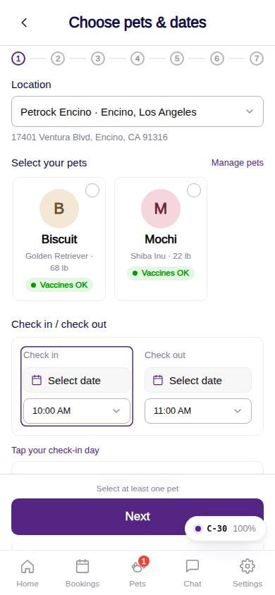
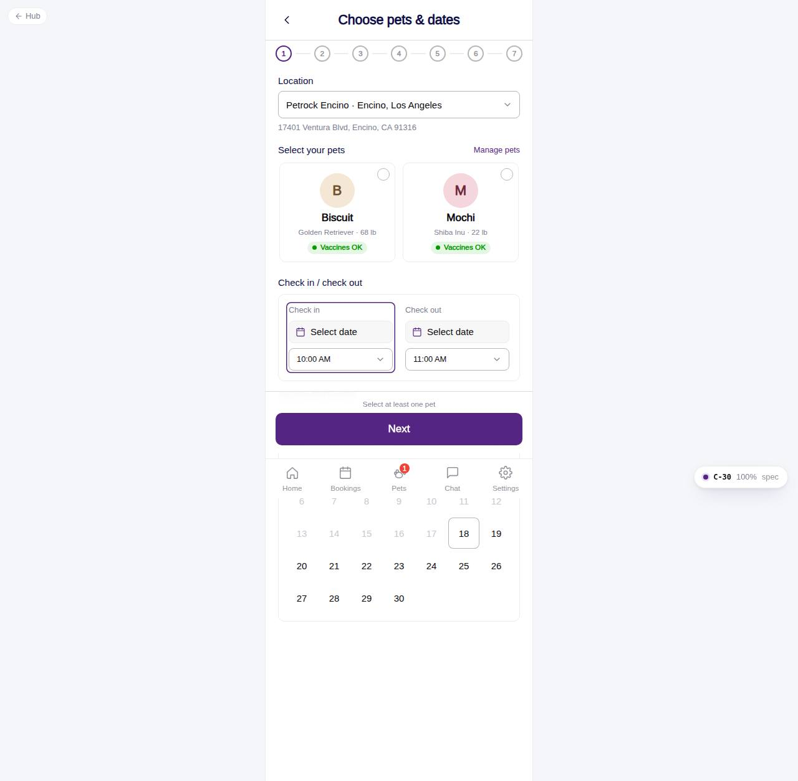

# C-36 · Hotel: payment

## Purpose

Charge the deposit or the full amount with a Stripe-shaped card form through the PaymentProvider, or record cash at location. On success the booking and every satellite row are created and the draft is cleared.

## Screenshots

| 390 | 1280 |
| --- | --- |
|  |  |

Dark: not captured (not a key page).

## Sections (layout order)

1. HotelBookingFrame (Stepper 7/7)
2. Amount card (due now, fee, charged now, balance)
3. Payment method RadioGroup cards
4. HotelCardPaymentForm (card) or the cash notice
5. Error line (declined card)
6. Terms line
7. Sticky footer: Pay $X / Confirm booking

## Data

| Table | Read / write | Notes |
| --- | --- | --- |
| `bookings` | write | status from initialStatusFor, totals, quote json, source app |
| `booking_pets / booking_pet_care` | write | per pet |
| `appointments` | write | grooming with booking_id |
| `invoices / payments` | write | invoice + card payment |
| `notifications` | write | to the customer |
| `customers` | write | details from C-34 |
| `vaccine_records / vaccine_types` | read | initial status |
| `fees / settings` | read | card fee, invoice numbering and footer |

## Rules

- R-H01 - card or cash
- R-H02 / R-X50 - deposit or full
- R-H03 / R-X58 - card fee
- R-H09 - invoice numbering
- R-X51 - requested vs pending_vaccines
- R-X55 - grooming appointments on check-out morning

## Logic

- validateCard() before createPaymentIntent(); the mock declines last4 0002 and the error is shown, keeping the draft.
- payment_status: card + full -> paid, card + deposit -> authorized, cash -> pending; invoice balance = total - charged.
- Navigation to C-37 happens before the draft reset so the stage guard does not redirect.

## Components

HotelBookingFrame, RadioGroup, HotelCardPaymentForm, HotelEstimateCard, Card, Toast, Button

## Real vs mock

MockPaymentProvider (300 ms delay). StripePaymentProvider + PaymentElement replace the card form when wired (no keys in the repo). Refunds are not executed here.

## Responsive check (D-016)

Checked at 360, 390, 768, 1280, 1920 on 2026-09-18 (Playwright against `vite preview`): no horizontal overflow, no console errors. The customer surface renders in the PhoneShell column (full-bleed under 600 px, centered 430 px column above); footer CTAs stack under 420 px.

## Changelog

- `docs/changelog/_pending/customer-hotel.md` (to be merged into the next numbered entry)
