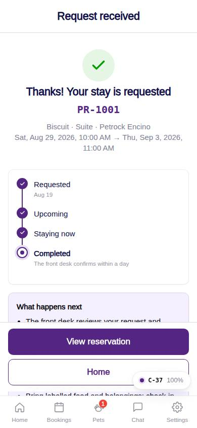
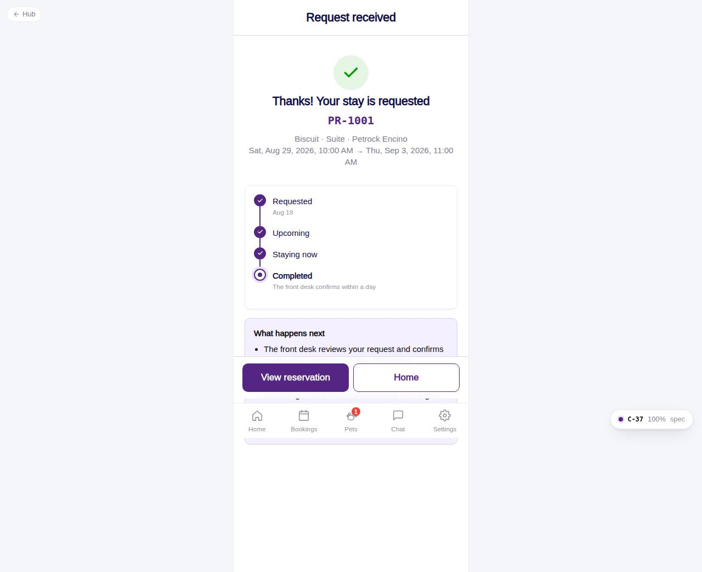

# C-37 · Hotel: confirmation

## Purpose

After payment: the booking code, the lifecycle timeline at its current status, what happens next (vaccine proofs, desk confirmation, balance) and links to the reservation and home.

## Screenshots

| 390 | 1280 |
| --- | --- |
|  |  |

Dark: not captured (not a key page).

## Sections (layout order)

1. Success header (icon, code, pets, room, dates)
2. BookingStatusTimeline in a Card
3. What happens next Card (tinted)
4. Footer: View reservation / Home

## Data

| Table | Read / write | Notes |
| --- | --- | --- |
| `bookings` | read | by :id |
| `booking_pets / pets` | read | pet names |
| `room_types / locations` | read | labels |

## Rules

- R-A05 / R-X51 - pending vaccines call-out
- R-I04 - customer wording (Pending verification / Upcoming)

## Logic

- Not-found state when the id is unknown.

## Components

HotelBookingFrame, BookingStatusTimeline, Card, Icon, EmptyState, Button

## Real vs mock

Nothing external.

## Responsive check (D-016)

Checked at 360, 390, 768, 1280, 1920 on 2026-09-18 (Playwright against `vite preview`): no horizontal overflow, no console errors. The customer surface renders in the PhoneShell column (full-bleed under 600 px, centered 430 px column above); footer CTAs stack under 420 px.

## Changelog

- `docs/changelog/_pending/customer-hotel.md` (to be merged into the next numbered entry)
