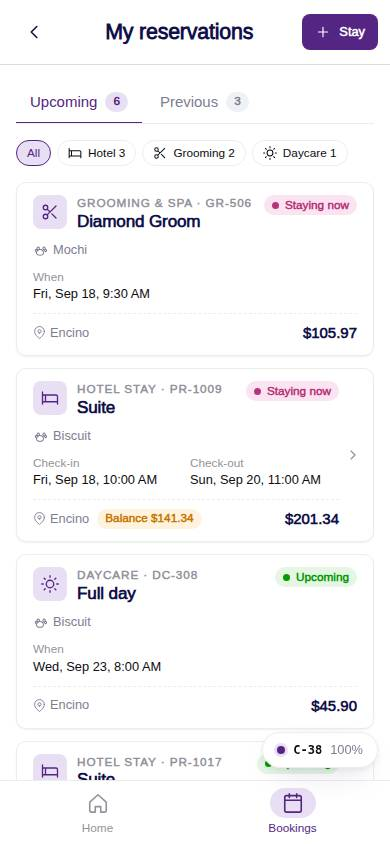
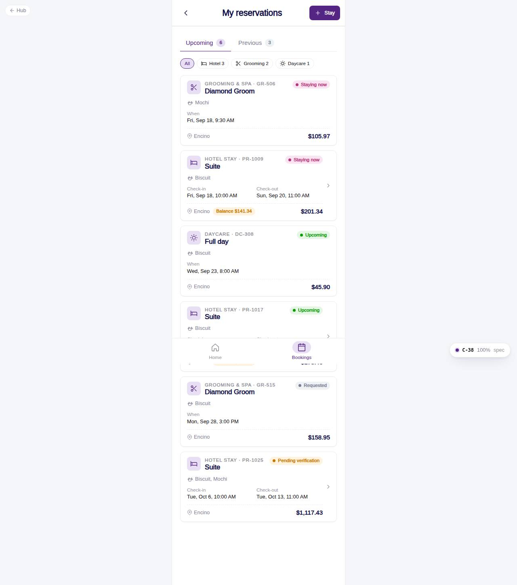

# C-38 · My reservations

## Purpose

Every reservation of the pet parent in one list: hotel stays, Grooming & Spa appointments and daycare days, split into Upcoming and Previous with a kind filter. Bottom-nav tab "Bookings".

## Screenshots

| 390 | 1280 |
| --- | --- |
|  |  |

Dark: `../screenshots/C-38/390-dark.jpg`, `../screenshots/C-38/1280-dark.jpg`.

## Sections (layout order)

1. HotelBookingFrame (title, + Stay button)
2. Tabs Upcoming / Previous with counts
3. Kind filter Chips (All / Hotel / Grooming / Daycare with counts)
4. CustomerReservationCard list (stays link to C-39)
5. EmptyState with Book a stay

## Data

| Table | Read / write | Notes |
| --- | --- | --- |
| `bookings / booking_pets` | read | stays of the customer |
| `appointments` | read | grooming |
| `daycare_bookings` | read | daycare days |
| `pets / room_types / packages / locations` | read | labels |
| `invoices` | read | balance chip |

## Rules

- R-I04 - customer status labels
- R-A06 - pending verification shown until the desk verifies

## Logic

- Upcoming = not checked_out / cancelled / no_show and end in the future; Previous otherwise. Appointment statuses done / in_progress map to checked_out / checked_in for the shared chip.

## Components

HotelBookingFrame, Tabs, Chip, CustomerReservationCard, EmptyState, Button

## Real vs mock

Grooming and daycare cards have no detail link until their modules register routes.

## Responsive check (D-016)

Checked at 360, 390, 768, 1280, 1920 on 2026-09-18 (Playwright against `vite preview`): no horizontal overflow, no console errors. The customer surface renders in the PhoneShell column (full-bleed under 600 px, centered 430 px column above); footer CTAs stack under 420 px.

## Changelog

- `docs/changelog/_pending/customer-hotel.md` (to be merged into the next numbered entry)
